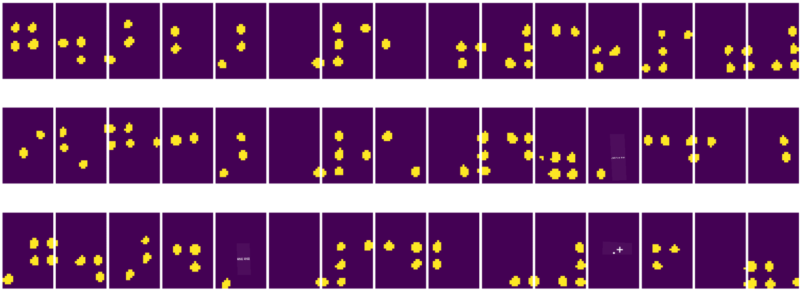

<!--
CO_OP_TRANSLATOR_METADATA:
{
  "original_hash": "feeca98225cb420afc89415f24f63d92",
  "translation_date": "2025-09-23T07:05:04+00:00",
  "source_file": "lessons/4-ComputerVision/06-IntroCV/README.md",
  "language_code": "mr"
}
-->
# संगणक दृष्टिकोनाची ओळख

[संगणक दृष्टिकोन](https://wikipedia.org/wiki/Computer_vision) ही एक शाखा आहे ज्याचा उद्देश संगणकांना डिजिटल प्रतिमांचे उच्च-स्तरीय आकलन मिळवून देणे आहे. ही व्याख्या खूप व्यापक आहे कारण *आकलन* याचा अर्थ अनेक गोष्टी असू शकतो, जसे की प्रतिमेत एखादी वस्तू शोधणे (**वस्तू शोध**), काय चालले आहे हे समजून घेणे (**घटना शोध**), प्रतिमेचे वर्णन मजकुरात करणे, किंवा दृश्य 3D मध्ये पुन्हा तयार करणे. मानवी प्रतिमांशी संबंधित काही विशेष कार्ये देखील आहेत: वय आणि भावना अंदाज, चेहरा शोध आणि ओळख, आणि 3D पोझ अंदाज, इत्यादी.

## [पूर्व-व्याख्यान प्रश्नमंजुषा](https://ff-quizzes.netlify.app/en/ai/quiz/11)

संगणक दृष्टिकोनाचे सर्वात सोपे कार्य म्हणजे **प्रतिमा वर्गीकरण**.

संगणक दृष्टिकोनाला अनेकदा AI ची शाखा मानले जाते. सध्याच्या काळात, संगणक दृष्टिकोनातील बहुतेक कार्ये न्यूरल नेटवर्क्स वापरून सोडवली जातात. आम्ही संगणक दृष्टिकोनासाठी वापरल्या जाणाऱ्या विशेष प्रकारच्या न्यूरल नेटवर्क्सबद्दल, [कन्व्होल्यूशनल न्यूरल नेटवर्क्स](../07-ConvNets/README.md), या विभागात अधिक जाणून घेणार आहोत.

तथापि, प्रतिमा न्यूरल नेटवर्कला देण्यापूर्वी, अनेक वेळा प्रतिमेला सुधारण्यासाठी काही अल्गोरिदमिक तंत्र वापरणे उपयुक्त ठरते.

प्रतिमा प्रक्रिया करण्यासाठी अनेक Python लायब्ररी उपलब्ध आहेत:

* **[imageio](https://imageio.readthedocs.io/en/stable/)** विविध प्रतिमा स्वरूप वाचण्यासाठी/लिहिण्यासाठी वापरता येते. हे ffmpeg ला देखील समर्थन देते, जे व्हिडिओ फ्रेम्स प्रतिमांमध्ये रूपांतरित करण्यासाठी उपयुक्त साधन आहे.
* **[Pillow](https://pillow.readthedocs.io/en/stable/index.html)** (PIL म्हणूनही ओळखले जाते) अधिक शक्तिशाली आहे आणि प्रतिमा रूपांतर, पॅलेट समायोजन, आणि इतर काही प्रतिमा हेरफेर समर्थन देते.
* **[OpenCV](https://opencv.org/)** ही C++ मध्ये लिहिलेली एक शक्तिशाली प्रतिमा प्रक्रिया लायब्ररी आहे, जी प्रतिमा प्रक्रियेसाठी *de facto* मानक बनली आहे. याला Python इंटरफेस आहे.
* **[dlib](http://dlib.net/)** ही C++ लायब्ररी आहे जी अनेक मशीन लर्निंग अल्गोरिदम्स अंमलात आणते, ज्यामध्ये काही संगणक दृष्टिकोन अल्गोरिदम्स समाविष्ट आहेत. याला Python इंटरफेस आहे आणि चेहरा व चेहऱ्याचे लँडमार्क शोध यासारख्या आव्हानात्मक कार्यांसाठी वापरता येते.

## OpenCV

[OpenCV](https://opencv.org/) प्रतिमा प्रक्रियेसाठी *de facto* मानक मानले जाते. यात C++ मध्ये अंमलात आणलेले अनेक उपयुक्त अल्गोरिदम्स आहेत. तुम्ही OpenCV ला Python मधून देखील कॉल करू शकता.

OpenCV शिकण्यासाठी एक चांगले ठिकाण म्हणजे [Learn OpenCV कोर्स](https://learnopencv.com/getting-started-with-opencv/). आमच्या अभ्यासक्रमात, आमचे उद्दिष्ट OpenCV शिकणे नाही, तर तुम्हाला काही उदाहरणे दाखवणे आहे की ते कधी वापरले जाऊ शकते आणि कसे.

### प्रतिमा लोड करणे

Python मध्ये प्रतिमा सोयीस्करपणे NumPy arrays द्वारे दर्शवता येतात. उदाहरणार्थ, 320x200 पिक्सल आकाराच्या ग्रेस्केल प्रतिमा 200x320 array मध्ये संग्रहित केल्या जातील, आणि त्याच परिमाणाच्या रंगीत प्रतिमांचे आकार 200x320x3 असेल (3 रंग चॅनेलसाठी). प्रतिमा लोड करण्यासाठी, तुम्ही खालील कोड वापरू शकता:

```python
import cv2
import matplotlib.pyplot as plt

im = cv2.imread('image.jpeg')
plt.imshow(im)
```

पारंपरिकपणे, OpenCV रंगीत प्रतिमांसाठी BGR (ब्लू-ग्रीन-रेड) एन्कोडिंग वापरते, तर Python मधील इतर साधने अधिक पारंपरिक RGB (रेड-ग्रीन-ब्लू) वापरतात. प्रतिमा योग्य दिसण्यासाठी, तुम्हाला ती RGB रंग जागेत रूपांतरित करणे आवश्यक आहे, NumPy array मध्ये परिमाणे बदलून किंवा OpenCV फंक्शन कॉल करून:

```python
im = cv2.cvtColor(im,cv2.COLOR_BGR2RGB)
```

त्याच `cvtColor` फंक्शनचा वापर इतर रंग जागा रूपांतरणांसाठी केला जाऊ शकतो, जसे की प्रतिमेला ग्रेस्केल किंवा HSV (ह्यू-सॅच्युरेशन-वॅल्यू) रंग जागेत रूपांतरित करणे.

तुम्ही OpenCV चा वापर करून व्हिडिओ फ्रेम-बाय-फ्रेम देखील लोड करू शकता - याचे उदाहरण [OpenCV Notebook](OpenCV.ipynb) मध्ये दिले आहे.

### प्रतिमा प्रक्रिया

प्रतिमा न्यूरल नेटवर्कला देण्यापूर्वी, तुम्हाला अनेक पूर्व-प्रक्रिया पायऱ्या लागू करायच्या असतील. OpenCV अनेक गोष्टी करू शकते, जसे की:

* `im = cv2.resize(im, (320,200),interpolation=cv2.INTER_LANCZOS)` वापरून प्रतिमा **रिसाइज** करणे
* `im = cv2.medianBlur(im,3)` किंवा `im = cv2.GaussianBlur(im, (3,3), 0)` वापरून प्रतिमा **ब्लर** करणे
* प्रतिमेची **ब्राइटनेस आणि कॉन्ट्रास्ट** बदलणे NumPy array हेरफेर करून करता येते, जसे [या Stackoverflow नोटमध्ये](https://stackoverflow.com/questions/39308030/how-do-i-increase-the-contrast-of-an-image-in-python-opencv) वर्णन केले आहे.
* [थ्रेशोल्डिंग](https://docs.opencv.org/4.x/d7/d4d/tutorial_py_thresholding.html) वापरून `cv2.threshold`/`cv2.adaptiveThreshold` फंक्शन्स कॉल करणे, जे ब्राइटनेस किंवा कॉन्ट्रास्ट समायोजन करण्यापेक्षा अनेकदा अधिक उपयुक्त असते.
* प्रतिमेवर विविध [रूपांतरणे](https://docs.opencv.org/4.5.5/da/d6e/tutorial_py_geometric_transformations.html) लागू करणे:
    - **[अफाइन रूपांतरण](https://docs.opencv.org/4.5.5/d4/d61/tutorial_warp_affine.html)** उपयुक्त ठरू शकते जर तुम्हाला प्रतिमेतील तीन बिंदूंचे स्रोत आणि गंतव्य स्थान माहित असेल आणि तुम्हाला रोटेशन, रिसाइजिंग आणि स्क्यूइंग एकत्र करायचे असेल. अफाइन रूपांतरण समांतर रेषा समांतर ठेवते.
    - **[परिप्रेक्ष्य रूपांतरण](https://medium.com/analytics-vidhya/opencv-perspective-transformation-9edffefb2143)** उपयुक्त ठरू शकते जेव्हा तुम्हाला प्रतिमेतील 4 बिंदूंचे स्रोत आणि गंतव्य स्थान माहित असते. उदाहरणार्थ, जर तुम्ही स्मार्टफोन कॅमेराद्वारे कोणत्याही कोनातून आयताकृती दस्तऐवजाचे चित्र घेतले, आणि तुम्हाला दस्तऐवजाचे आयताकृती प्रतिमाच बनवायचे असेल.
* **[ऑप्टिकल फ्लो](https://docs.opencv.org/4.5.5/d4/dee/tutorial_optical_flow.html)** वापरून प्रतिमेमध्ये हालचाल समजून घेणे.

## संगणक दृष्टिकोन वापरण्याची उदाहरणे

आमच्या [OpenCV Notebook](OpenCV.ipynb) मध्ये, आम्ही संगणक दृष्टिकोन विशिष्ट कार्ये करण्यासाठी कसे वापरले जाऊ शकते याची काही उदाहरणे दिली आहेत:

* **ब्रेल पुस्तकाच्या छायाचित्राची पूर्व-प्रक्रिया**. आम्ही थ्रेशोल्डिंग, वैशिष्ट्य शोध, परिप्रेक्ष्य रूपांतरण आणि NumPy हेरफेर कसे वापरून ब्रेल चिन्हे वेगळी करू शकतो यावर लक्ष केंद्रित करतो, जेणेकरून न्यूरल नेटवर्कद्वारे पुढील वर्गीकरण करता येईल.

 |  | 
----|-----|-----

> प्रतिमा [OpenCV.ipynb](OpenCV.ipynb) मधून

* **फ्रेम फरक वापरून व्हिडिओमध्ये हालचाल शोधणे**. जर कॅमेरा स्थिर असेल, तर कॅमेरा फीडमधील फ्रेम्स एकमेकांशी खूप समान असाव्यात. फ्रेम्स arrays म्हणून दर्शविल्या जात असल्याने, दोन अनुक्रमिक फ्रेम्ससाठी त्या arrays वजा करून आम्हाला पिक्सेल फरक मिळेल, जो स्थिर फ्रेम्ससाठी कमी असावा, आणि प्रतिमेमध्ये लक्षणीय हालचाल झाल्यावर जास्त होईल.


> प्रतिमा [OpenCV.ipynb](OpenCV.ipynb) मधून

* **ऑप्टिकल फ्लो वापरून हालचाल शोधणे**. [ऑप्टिकल फ्लो](https://docs.opencv.org/3.4/d4/dee/tutorial_optical_flow.html) आम्हाला व्हिडिओ फ्रेम्सवरील वैयक्तिक पिक्सेल कसे हलतात हे समजून घेण्यास अनुमती देते. ऑप्टिकल फ्लोचे दोन प्रकार आहेत:

   - **घन ऑप्टिकल फ्लो** प्रत्येक पिक्सेलसाठी तो कुठे हलतो हे दर्शविणारा वेक्टर फील्ड गणना करतो.
   - **दुर्मिळ ऑप्टिकल फ्लो** प्रतिमेतील काही वेगळ्या वैशिष्ट्यांवर आधारित असतो (उदा. कडा), आणि फ्रेम ते फ्रेम त्यांचा मार्ग तयार करतो.


> प्रतिमा [OpenCV.ipynb](OpenCV.ipynb) मधून

## ✍️ उदाहरण नोटबुक्स: OpenCV [OpenCV in Action वापरून पहा](OpenCV.ipynb)

चला [OpenCV Notebook](OpenCV.ipynb) एक्सप्लोर करून OpenCV सह काही प्रयोग करूया.

## निष्कर्ष

कधीकधी, हालचाल शोधणे किंवा बोटांच्या टोकांचा शोध घेणे यासारखी तुलनेने जटिल कार्ये केवळ संगणक दृष्टिकोनाने सोडवता येतात. त्यामुळे, संगणक दृष्टिकोनाच्या मूलभूत तंत्रांची माहिती असणे आणि OpenCV सारख्या लायब्ररी काय करू शकतात हे जाणून घेणे खूप उपयुक्त आहे.

## 🚀 आव्हान

AI शोमधील [हा व्हिडिओ](https://docs.microsoft.com/shows/ai-show/ai-show--2021-opencv-ai-competition--grand-prize-winners--cortic-tigers--episode-32?WT.mc_id=academic-77998-cacaste) पाहा ज्यामध्ये Cortic Tigers प्रकल्पाबद्दल माहिती दिली आहे आणि त्यांनी संगणक दृष्टिकोन कार्ये लोकशाहीकरण करण्यासाठी रोबोटद्वारे ब्लॉक-आधारित उपाय कसा तयार केला. अशा इतर प्रकल्पांवर संशोधन करा जे नवीन शिकणाऱ्यांना या क्षेत्रात सामील होण्यास मदत करतात.

## [व्याख्यानानंतर प्रश्नमंजुषा](https://ff-quizzes.netlify.app/en/ai/quiz/12)

## पुनरावलोकन आणि स्व-अभ्यास

ऑप्टिकल फ्लोबद्दल अधिक वाचा [या उत्कृष्ट ट्यूटोरियलमध्ये](https://learnopencv.com/optical-flow-in-opencv/).

## [असाइनमेंट](lab/README.md)

या प्रयोगशाळेत, तुम्ही साध्या हालचालींसह व्हिडिओ घेणार आहात, आणि तुमचे उद्दिष्ट ऑप्टिकल फ्लो वापरून वर/खाली/डाव्या/उजव्या हालचाली काढणे आहे.


---

