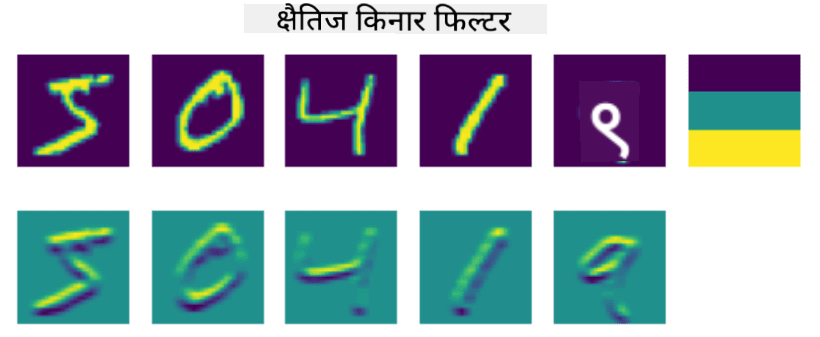
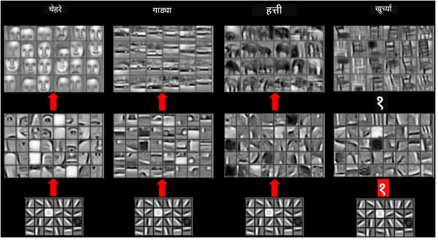

<!--
CO_OP_TRANSLATOR_METADATA:
{
  "original_hash": "a560d5b845962cf33dc102266e409568",
  "translation_date": "2025-09-23T07:04:02+00:00",
  "source_file": "lessons/4-ComputerVision/07-ConvNets/README.md",
  "language_code": "mr"
}
-->
# कॉनव्होल्यूशनल न्यूरल नेटवर्क्स

आपण यापूर्वी पाहिले आहे की न्यूरल नेटवर्क्स प्रतिमांसाठी खूप चांगले काम करतात, आणि अगदी एक-लेयर परसेप्ट्रॉन देखील MNIST डेटासेटमधील हस्तलिखित अंक ओळखण्यास योग्य अचूकतेसह सक्षम आहे. मात्र, MNIST डेटासेट खूप खास आहे, आणि सर्व अंक प्रतिमेच्या मध्यभागी असतात, ज्यामुळे कार्य सोपे होते.

## [पूर्व-व्याख्यान प्रश्नमंजुषा](https://ff-quizzes.netlify.app/en/ai/quiz/13)

वास्तविक जीवनात, आपल्याला प्रतिमेतील वस्तू त्यांच्या अचूक स्थानाची पर्वा न करता ओळखता यायला हवे. संगणक दृष्टी सामान्य वर्गीकरणापेक्षा वेगळी आहे, कारण जेव्हा आपण प्रतिमेत विशिष्ट वस्तू शोधण्याचा प्रयत्न करतो, तेव्हा आपण विशिष्ट **पॅटर्न्स** आणि त्यांच्या संयोजनांचा शोध घेत प्रतिमा स्कॅन करतो. उदाहरणार्थ, मांजरीचा शोध घेताना, आपण प्रथम आडव्या रेषा शोधू शकतो, ज्या मिशा तयार करू शकतात, आणि नंतर मिशांच्या विशिष्ट संयोजनामुळे आपल्याला कळते की ती प्रतिमा मांजरीची आहे. विशिष्ट पॅटर्न्सची सापेक्ष स्थिती आणि उपस्थिती महत्त्वाची आहे, आणि त्यांचे अचूक स्थान महत्त्वाचे नाही.

पॅटर्न्स काढण्यासाठी, आपण **कॉनव्होल्यूशनल फिल्टर्स** चा उपयोग करू. तुम्हाला माहीत आहेच की, प्रतिमा 2D-मॅट्रिक्स किंवा रंग खोलीसह 3D-टेंसरद्वारे दर्शवली जाते. फिल्टर लागू करणे म्हणजे आपण तुलनेने लहान **फिल्टर कर्नल** मॅट्रिक्स घेतो, आणि मूळ प्रतिमेतील प्रत्येक पिक्सेलसाठी शेजारील बिंदूंसह भारित सरासरीची गणना करतो. आपण याला असे पाहू शकतो की एक छोटी विंडो संपूर्ण प्रतिमेवर सरकत आहे, आणि फिल्टर कर्नल मॅट्रिक्समधील वजनांनुसार सर्व पिक्सेल्स सरासरी करत आहे.

 | 
----|----

> प्रतिमा: दिमित्री सोश्निकोव्ह

उदाहरणार्थ, जर आपण MNIST अंकांवर 3x3 आडव्या कडांचा आणि उभ्या कडांचा फिल्टर लागू केला, तर आपल्याला मूळ प्रतिमेत जिथे आडव्या आणि उभ्या कड्या आहेत तिथे हायलाइट्स (उदा. उच्च मूल्ये) मिळू शकतात. त्यामुळे हे दोन फिल्टर्स "कड्या शोधण्यासाठी" वापरले जाऊ शकतात. त्याचप्रमाणे, इतर कमी-स्तरीय पॅटर्न्स शोधण्यासाठी वेगवेगळे फिल्टर्स डिझाइन करता येतात:

> प्रतिमा: [लुंग-मालिक फिल्टर बँक](https://www.robots.ox.ac.uk/~vgg/research/texclass/filters.html)

मात्र, जरी आपण काही पॅटर्न्स काढण्यासाठी फिल्टर्स मॅन्युअली डिझाइन करू शकतो, तरी आपण नेटवर्क अशा प्रकारे डिझाइन करू शकतो की ते पॅटर्न्स आपोआप शिकेल. हीच मुख्य कल्पना CNN च्या मागे आहे.

## CNN च्या मुख्य कल्पना

CNN कसे कार्य करते यामागील महत्त्वाच्या कल्पना खालीलप्रमाणे आहेत:

* कॉनव्होल्यूशनल फिल्टर्स पॅटर्न्स काढू शकतात
* आपण नेटवर्क अशा प्रकारे डिझाइन करू शकतो की फिल्टर्स आपोआप प्रशिक्षित होतील
* आपण मूळ प्रतिमेतील पॅटर्न्स शोधण्यासाठीच नव्हे तर उच्च-स्तरीय वैशिष्ट्यांमध्ये पॅटर्न्स शोधण्यासाठीही याच पद्धतीचा उपयोग करू शकतो. त्यामुळे CNN वैशिष्ट्य काढणे वैशिष्ट्यांच्या श्रेणीवर कार्य करते, कमी-स्तरीय पिक्सेल संयोजनांपासून ते प्रतिमेच्या भागांच्या उच्च-स्तरीय संयोजनांपर्यंत.

> प्रतिमा: [हिस्लॉप-लिंच यांच्या पेपरमधून](https://www.semanticscholar.org/paper/Computer-vision-based-pedestrian-trajectory-Hislop-Lynch/26e6f74853fc9bbb7487b06dc2cf095d36c9021d), त्यांच्या [संशोधनावर आधारित](https://dl.acm.org/doi/abs/10.1145/1553374.1553453)

## ✍️ सराव: कॉनव्होल्यूशनल न्यूरल नेटवर्क्स

चला कॉनव्होल्यूशनल न्यूरल नेटवर्क्स कसे कार्य करतात आणि प्रशिक्षित होणारे फिल्टर्स कसे साध्य करता येतात हे शोधणे सुरू ठेवूया, संबंधित नोटबुक्सद्वारे काम करून:

* [कॉनव्होल्यूशनल न्यूरल नेटवर्क्स - PyTorch](ConvNetsPyTorch.ipynb)
* [कॉनव्होल्यूशनल न्यूरल नेटवर्क्स - TensorFlow](ConvNetsTF.ipynb)

## पिरॅमिड आर्किटेक्चर

प्रतिमा प्रक्रिया करण्यासाठी वापरले जाणारे बहुतेक CNNs तथाकथित पिरॅमिड आर्किटेक्चरचे अनुसरण करतात. मूळ प्रतिमांवर लागू केलेल्या पहिल्या कॉनव्होल्यूशनल लेयरमध्ये सामान्यतः तुलनेने कमी फिल्टर्स असतात (8-16), जे वेगवेगळ्या पिक्सेल संयोजनांशी संबंधित असतात, जसे की आडव्या/उभ्या रेषा किंवा स्ट्रोक्स. पुढील स्तरावर, आपण नेटवर्कचा स्थानिक परिमाण कमी करतो आणि फिल्टर्सची संख्या वाढवतो, जे साध्या वैशिष्ट्यांच्या अधिक संभाव्य संयोजनांशी संबंधित असते. प्रत्येक स्तरासह, अंतिम वर्गीकरणाकडे जाताना प्रतिमेचे स्थानिक परिमाण कमी होते, आणि फिल्टर्सची संख्या वाढते.

उदाहरण म्हणून, VGG-16 च्या आर्किटेक्चरकडे पाहूया, ज्याने 2014 मध्ये ImageNet च्या टॉप-5 वर्गीकरणात 92.7% अचूकता मिळवली:

> प्रतिमा: [रिसर्चगेट](https://www.researchgate.net/figure/Vgg16-model-structure-To-get-the-VGG-NIN-model-we-replace-the-2-nd-4-th-6-th-7-th_fig2_335194493)

## सर्वात प्रसिद्ध CNN आर्किटेक्चर्स

[सर्वात प्रसिद्ध CNN आर्किटेक्चर्सबद्दल तुमचा अभ्यास सुरू ठेवा](CNN_Architectures.md)

---

