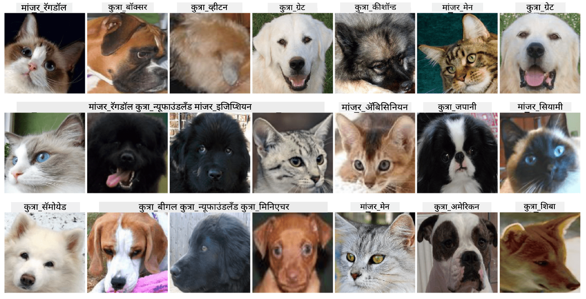

<!--
CO_OP_TRANSLATOR_METADATA:
{
  "original_hash": "f3d2cee9cb3c52160419e560c57a690e",
  "translation_date": "2025-08-26T09:34:06+00:00",
  "source_file": "lessons/4-ComputerVision/07-ConvNets/lab/README.md",
  "language_code": "mr"
}
-->
# पाळीव प्राण्यांच्या चेहऱ्यांचे वर्गीकरण

[AI for Beginners Curriculum](https://github.com/microsoft/ai-for-beginners) मधील प्रयोगशाळा असाइनमेंट.

## कार्य

कल्पना करा की तुम्हाला पाळीव प्राण्यांच्या नर्सरीसाठी एक अॅप्लिकेशन विकसित करायचे आहे, जे सर्व पाळीव प्राण्यांची नोंद ठेवेल. अशा अॅप्लिकेशनची एक उत्तम वैशिष्ट्य म्हणजे छायाचित्रावरून प्राण्याच्या जातीचा आपोआप शोध लावणे. हे कार्य न्यूरल नेटवर्क्सचा वापर करून यशस्वीरीत्या करता येते.

तुम्हाला **Pet Faces** डेटासेटचा वापर करून विविध जातींच्या मांजरी आणि कुत्र्यांचे वर्गीकरण करण्यासाठी एक कन्व्होल्यूशनल न्यूरल नेटवर्क प्रशिक्षण द्यायचे आहे.

## डेटासेट

आपण **Pet Faces** डेटासेट वापरणार आहोत, जो [Oxford-IIIT](https://www.robots.ox.ac.uk/~vgg/data/pets/) पाळीव प्राण्यांच्या डेटासेटवरून तयार केला आहे. यात 35 वेगवेगळ्या जातींच्या कुत्र्यांचा आणि मांजरींचा समावेश आहे.



डेटासेट डाउनलोड करण्यासाठी, खालील कोड स्निपेट वापरा:

```python
!wget https://thor.robots.ox.ac.uk/~vgg/data/pets/images.tar.gz
!tar xfz images.tar.gz
!rm images.tar.gz
```

## प्रारंभिक नोटबुक

प्रयोगशाळा सुरू करण्यासाठी [PetFaces.ipynb](../../../../../../lessons/4-ComputerVision/07-ConvNets/lab/PetFaces.ipynb) उघडा.

## मुख्य मुद्दा

तुम्ही प्रतिमांचे वर्गीकरण करण्याचा तुलनेने जटिल प्रश्न सुरुवातीपासून सोडवला आहे! येथे बऱ्याच वर्गांचा समावेश होता, तरीही तुम्ही समाधानकारक अचूकता मिळवली! तसेच, टॉप-k अचूकता मोजणे महत्त्वाचे आहे, कारण काही वर्गांमध्ये गोंधळ होणे सोपे आहे, विशेषतः जेव्हा ते वर्ग माणसांसाठीही स्पष्टपणे वेगळे दिसत नाहीत.

**अस्वीकरण**:  
हा दस्तऐवज AI भाषांतर सेवा [Co-op Translator](https://github.com/Azure/co-op-translator) चा वापर करून भाषांतरित करण्यात आला आहे. आम्ही अचूकतेसाठी प्रयत्नशील असलो तरी, कृपया लक्षात घ्या की स्वयंचलित भाषांतरांमध्ये त्रुटी किंवा अचूकतेचा अभाव असू शकतो. मूळ भाषेतील मूळ दस्तऐवज हा अधिकृत स्रोत मानला जावा. महत्त्वाच्या माहितीसाठी, व्यावसायिक मानवी भाषांतराची शिफारस केली जाते. या भाषांतराचा वापर केल्यामुळे उद्भवणाऱ्या कोणत्याही गैरसमज किंवा चुकीच्या अर्थासाठी आम्ही जबाबदार राहणार नाही.