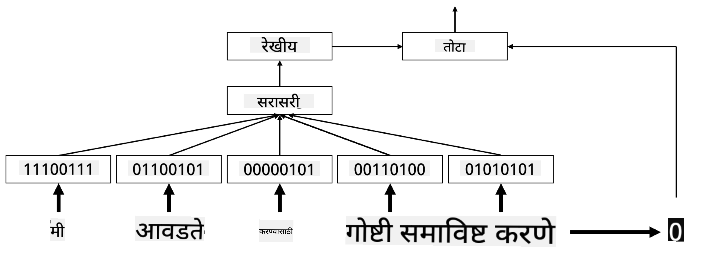

<!--
CO_OP_TRANSLATOR_METADATA:
{
  "original_hash": "b708c9b85b833864c73c6281f1e6b96e",
  "translation_date": "2025-09-23T07:13:20+00:00",
  "source_file": "lessons/5-NLP/14-Embeddings/README.md",
  "language_code": "mr"
}
-->
# एम्बेडिंग्स

## [पूर्व-व्याख्यान प्रश्नमंजूषा](https://ff-quizzes.netlify.app/en/ai/quiz/27)

BoW किंवा TF/IDF आधारित वर्गीकरण प्रशिक्षण करताना, आपण `vocab_size` लांबीच्या उच्च-आयामी बॅग-ऑफ-वर्ड्स व्हेक्टरवर कार्य केले आणि कमी-आयामी स्थानिक प्रतिनिधित्व व्हेक्टरला विरळ वन-हॉट प्रतिनिधित्वात स्पष्टपणे रूपांतरित केले. मात्र, हे वन-हॉट प्रतिनिधित्व मेमरीसाठी कार्यक्षम नाही. याशिवाय, प्रत्येक शब्द स्वतंत्रपणे हाताळला जातो, म्हणजेच वन-हॉट एन्कोडेड व्हेक्टर शब्दांमधील कोणतेही अर्थपूर्ण साम्य व्यक्त करत नाहीत.

**एम्बेडिंग** ही कल्पना म्हणजे शब्दांना कमी-आयामी घन व्हेक्टरद्वारे प्रतिनिधित्व करणे, जे काही प्रमाणात शब्दाचा अर्थपूर्ण अर्थ प्रतिबिंबित करतात. आपण नंतर अर्थपूर्ण शब्द एम्बेडिंग्स कसे तयार करायचे ते चर्चा करू, पण सध्या एम्बेडिंग्सला शब्द व्हेक्टरची आयाम कमी करण्याचा एक मार्ग म्हणून विचार करूया.

तर, एम्बेडिंग लेयर एक शब्द इनपुट म्हणून घेईल आणि निर्दिष्ट `embedding_size` चा आउटपुट व्हेक्टर तयार करेल. एका अर्थाने, हे `Linear` लेयरसारखेच आहे, पण वन-हॉट एन्कोडेड व्हेक्टर घेण्याऐवजी, ते इनपुट म्हणून शब्द क्रमांक घेऊ शकेल, ज्यामुळे मोठे वन-हॉट-एन्कोडेड व्हेक्टर तयार करण्याची गरज टाळता येईल.

आमच्या वर्गीकरण नेटवर्कमध्ये पहिल्या लेयर म्हणून एम्बेडिंग लेयर वापरून, आपण बॅग-ऑफ-वर्ड्स मॉडेलवरून **एम्बेडिंग बॅग** मॉडेलवर स्विच करू शकतो, जिथे आपण प्रथम आमच्या मजकुरातील प्रत्येक शब्द संबंधित एम्बेडिंगमध्ये रूपांतरित करतो आणि नंतर त्या सर्व एम्बेडिंग्सवर काही एकत्रित फंक्शन गणना करतो, जसे की `sum`, `average` किंवा `max`.  

> लेखकाने तयार केलेली प्रतिमा

## ✍️ सराव: एम्बेडिंग्स

खालील नोटबुक्समध्ये तुमचे शिक्षण सुरू ठेवा:
* [PyTorch सह एम्बेडिंग्स](EmbeddingsPyTorch.ipynb)
* [TensorFlow सह एम्बेडिंग्स](EmbeddingsTF.ipynb)

## अर्थपूर्ण एम्बेडिंग्स: Word2Vec

एम्बेडिंग लेयरने शब्दांना व्हेक्टर प्रतिनिधित्वात मॅप करणे शिकले असले तरी, हे प्रतिनिधित्व आवश्यकतेनुसार अर्थपूर्ण नसते. असे व्हेक्टर प्रतिनिधित्व शिकणे चांगले होईल की जिथे समान शब्द किंवा समानार्थी शब्द काही व्हेक्टर अंतराच्या (उदा. युक्लिडियन अंतर) बाबतीत एकमेकांच्या जवळ असतील.

हे साध्य करण्यासाठी, आपल्याला विशिष्ट पद्धतीने मोठ्या मजकूर संग्रहावर आमचे एम्बेडिंग मॉडेल पूर्व-प्रशिक्षित करणे आवश्यक आहे. अर्थपूर्ण एम्बेडिंग्स प्रशिक्षण देण्याचा एक मार्ग [Word2Vec](https://en.wikipedia.org/wiki/Word2vec) म्हणून ओळखला जातो. हे दोन मुख्य आर्किटेक्चरवर आधारित आहे जे शब्दांचे वितरित प्रतिनिधित्व तयार करण्यासाठी वापरले जातात:

 - **सतत बॅग-ऑफ-वर्ड्स** (CBoW) — या आर्किटेक्चरमध्ये, आपण सभोवतालच्या संदर्भातून शब्दाचा अंदाज लावण्यासाठी मॉडेल प्रशिक्षण देतो. दिलेल्या ngram $(W_{-2},W_{-1},W_0,W_1,W_2)$ साठी, मॉडेलचे उद्दिष्ट $(W_{-2},W_{-1},W_1,W_2)$ पासून $W_0$ अंदाज लावणे आहे.
 - **सतत स्किप-ग्राम** CBoW च्या विरुद्ध आहे. मॉडेल संदर्भ शब्दांच्या सभोवतालच्या विंडोचा वापर करून वर्तमान शब्दाचा अंदाज लावते.

CBoW जलद आहे, तर स्किप-ग्राम हळू आहे, पण दुर्मिळ शब्दांचे प्रतिनिधित्व चांगल्या प्रकारे करते.

> [या पेपरमधून](https://arxiv.org/pdf/1301.3781.pdf) घेतलेली प्रतिमा

Word2Vec पूर्व-प्रशिक्षित एम्बेडिंग्स (तसेच GloVe सारखे इतर समान मॉडेल्स) न्यूरल नेटवर्क्समध्ये एम्बेडिंग लेयरच्या जागी वापरले जाऊ शकतात. मात्र, आपल्याला शब्दसंग्रह हाताळावे लागेल, कारण Word2Vec/GloVe पूर्व-प्रशिक्षित करण्यासाठी वापरलेला शब्दसंग्रह आमच्या मजकूर संग्रहातील शब्दसंग्रहापेक्षा वेगळा असण्याची शक्यता आहे. वरील नोटबुक्समध्ये पाहा की हा प्रश्न कसा सोडवता येतो.

## संदर्भात्मक एम्बेडिंग्स

Word2Vec सारख्या पारंपरिक पूर्व-प्रशिक्षित एम्बेडिंग्सचे एक मुख्य मर्यादित वैशिष्ट्य म्हणजे शब्द अर्थ अस्पष्टता समस्या. पूर्व-प्रशिक्षित एम्बेडिंग्स शब्दांच्या संदर्भातील काही अर्थ कॅप्चर करू शकतात, परंतु शब्दाचा प्रत्येक संभाव्य अर्थ त्याच एम्बेडिंगमध्ये एन्कोड केला जातो. यामुळे डाउनस्ट्रीम मॉडेल्समध्ये समस्या निर्माण होऊ शकतात, कारण अनेक शब्द, जसे की 'play', त्यांच्या वापराच्या संदर्भानुसार वेगवेगळे अर्थ असतात.

उदाहरणार्थ, 'play' या शब्दाचा खालील दोन वाक्यांमध्ये खूप वेगळा अर्थ आहे:

- मी थिएटरमध्ये एक **play** पाहायला गेलो.
- जॉन त्याच्या मित्रांसोबत **play** करायचे इच्छितो.

वरील पूर्व-प्रशिक्षित एम्बेडिंग्स 'play' या शब्दाच्या दोन्ही अर्थांना त्याच एम्बेडिंगमध्ये प्रतिनिधित्व करतात. ही मर्यादा ओलांडण्यासाठी, आपल्याला **भाषा मॉडेल** आधारित एम्बेडिंग्स तयार करणे आवश्यक आहे, जे मोठ्या मजकूर संग्रहावर प्रशिक्षण दिले जाते आणि *जाणते* की शब्द वेगवेगळ्या संदर्भांमध्ये कसे एकत्र ठेवले जाऊ शकतात. संदर्भात्मक एम्बेडिंग्सवर चर्चा करणे या ट्यूटोरियलच्या कक्षेबाहेर आहे, पण आम्ही नंतर कोर्समध्ये भाषेच्या मॉडेल्सबद्दल बोलताना त्याकडे परत येऊ.

## निष्कर्ष

या धड्यात, तुम्ही TensorFlow आणि PyTorch मध्ये एम्बेडिंग लेयर तयार करणे आणि वापरणे शिकले, ज्यामुळे शब्दांच्या अर्थपूर्ण अर्थाचे चांगले प्रतिबिंब मिळते.

## 🚀 आव्हान

Word2Vec काही मनोरंजक अनुप्रयोगांसाठी वापरले गेले आहे, ज्यामध्ये गाण्याचे बोल आणि कविता तयार करणे समाविष्ट आहे. [या लेखाकडे](https://www.politetype.com/blog/word2vec-color-poems) पहा, ज्यामध्ये लेखकाने Word2Vec वापरून कविता कशी तयार केली याचे वर्णन केले आहे. [डॅन शिफमन यांचे हे व्हिडिओ](https://www.youtube.com/watch?v=LSS_bos_TPI&ab_channel=TheCodingTrain) देखील पहा, ज्यामध्ये या तंत्राची वेगळी व्याख्या दिली आहे. मग हे तंत्र कागलमधून मिळवलेल्या तुमच्या स्वतःच्या मजकूर संग्रहावर लागू करण्याचा प्रयत्न करा.

## [व्याख्यानानंतर प्रश्नमंजूषा](https://ff-quizzes.netlify.app/en/ai/quiz/28)

## पुनरावलोकन आणि स्व-अभ्यास

Word2Vec वर आधारित या पेपरमधून वाचा: [Efficient Estimation of Word Representations in Vector Space](https://arxiv.org/pdf/1301.3781.pdf)

## [असाइनमेंट: नोटबुक्स](assignment.md)

---

