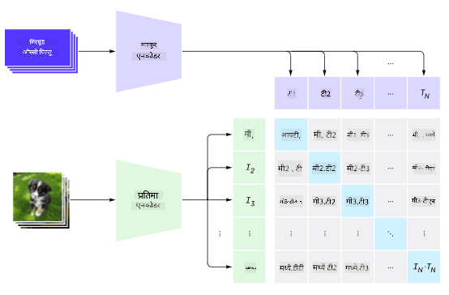
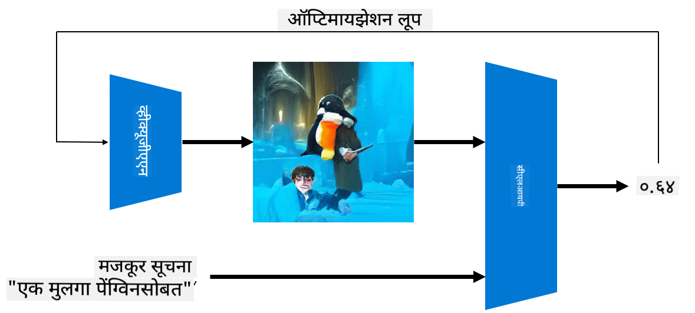

<!--
CO_OP_TRANSLATOR_METADATA:
{
  "original_hash": "9c592c26aca16ca085d268c732284187",
  "translation_date": "2025-08-26T10:19:31+00:00",
  "source_file": "lessons/X-Extras/X1-MultiModal/README.md",
  "language_code": "mr"
}
-->
# मल्टी-मोडल नेटवर्क्स

NLP कार्यांसाठी ट्रान्सफॉर्मर मॉडेल्सच्या यशानंतर, त्याच किंवा तत्सम आर्किटेक्चर संगणकीय दृष्टिकोन कार्यांसाठी लागू करण्यात आले. व्हिजन आणि नैसर्गिक भाषा क्षमता *एकत्र* करण्यासाठी मॉडेल्स तयार करण्याची वाढती आवड आहे. अशा प्रयत्नांपैकी एक OpenAI ने केला आहे, ज्याला CLIP आणि DALL.E म्हणतात.

## कॉन्ट्रास्टिव इमेज प्री-ट्रेनिंग (CLIP)

CLIP ची मुख्य कल्पना म्हणजे टेक्स्ट प्रॉम्प्ट्सची प्रतिमा सोबत तुलना करणे आणि प्रतिमा प्रॉम्प्टशी किती चांगली जुळते हे ठरवणे.

> *[या ब्लॉग पोस्ट](https://openai.com/blog/clip/) मधून चित्र*

मॉडेल इंटरनेटवरून मिळवलेल्या प्रतिमा आणि त्यांच्या कॅप्शनवर प्रशिक्षित केले जाते. प्रत्येक बॅचसाठी, आम्ही N जोड्या (प्रतिमा, टेक्स्ट) घेतो आणि त्यांना काही व्हेक्टर प्रतिनिधित्वांमध्ये रूपांतरित करतो.

त्या प्रतिनिधित्वांची एकमेकांशी जुळवाजुळव केली जाते. लॉस फंक्शनची व्याख्या एका जोडीत (उदा. I आणि T) संबंधित व्हेक्टरमधील कोसाइन समानता वाढवण्यासाठी आणि इतर सर्व जोड्यांमधील कोसाइन समानता कमी करण्यासाठी केली जाते. यामुळेच या दृष्टिकोनाला **कॉन्ट्रास्टिव** म्हणतात.

CLIP मॉडेल/लायब्ररी [OpenAI GitHub](https://github.com/openai/CLIP) वर उपलब्ध आहे. हा दृष्टिकोन [या ब्लॉग पोस्ट](https://openai.com/blog/clip/) मध्ये वर्णन केला आहे आणि अधिक तपशीलवार [या पेपर](https://arxiv.org/pdf/2103.00020.pdf) मध्ये दिला आहे.

एकदा हे मॉडेल प्री-ट्रेन झाले की, आपण त्याला प्रतिमांचा बॅच आणि टेक्स्ट प्रॉम्प्ट्सचा बॅच देऊ शकतो, आणि ते आपल्याला संभाव्यतेसह टेन्सर परत करेल. CLIP अनेक कार्यांसाठी वापरले जाऊ शकते:

**प्रतिमा वर्गीकरण**

समजा आपल्याला प्रतिमा वर्गीकृत करायच्या आहेत, जसे की मांजरी, कुत्रे आणि माणसे. अशा परिस्थितीत, आपण मॉडेलला एक प्रतिमा आणि टेक्स्ट प्रॉम्प्ट्सची मालिका देऊ शकतो: "*मांजरीचे चित्र*", "*कुत्र्याचे चित्र*", "*माणसाचे चित्र*". परिणामी 3 संभाव्यतेच्या व्हेक्टरमध्ये आपल्याला फक्त सर्वाधिक मूल्य असलेल्या निर्देशांक निवडायचा आहे.

> *[या ब्लॉग पोस्ट](https://openai.com/blog/clip/) मधून चित्र*

**टेक्स्ट-आधारित प्रतिमा शोध**

आपण उलटही करू शकतो. जर आपल्याकडे प्रतिमांचा संग्रह असेल, तर आपण हा संग्रह मॉडेलला देऊ शकतो आणि एक टेक्स्ट प्रॉम्प्ट - यामुळे आपल्याला दिलेल्या प्रॉम्प्टशी सर्वाधिक जुळणारी प्रतिमा मिळेल.

## ✍️ उदाहरण: [प्रतिमा वर्गीकरण आणि प्रतिमा शोधासाठी CLIP वापरणे](../../../../../lessons/X-Extras/X1-MultiModal/Clip.ipynb)

CLIP क्रियेत पाहण्यासाठी [Clip.ipynb](../../../../../lessons/X-Extras/X1-MultiModal/Clip.ipynb) नोटबुक उघडा.

## VQGAN+CLIP सह प्रतिमा निर्मिती

CLIP चा वापर टेक्स्ट प्रॉम्प्टवरून **प्रतिमा निर्मिती**साठी देखील केला जाऊ शकतो. हे करण्यासाठी, आपल्याला **जनरेटर मॉडेल** आवश्यक आहे जे काही व्हेक्टर इनपुटवर आधारित प्रतिमा तयार करू शकेल. अशा मॉडेल्सपैकी एक [VQGAN](https://compvis.github.io/taming-transformers/) (व्हेक्टर-क्वांटाइज्ड GAN) आहे.

VQGAN च्या मुख्य कल्पना, ज्यामुळे ते सामान्य [GAN](../../4-ComputerVision/10-GANs/README.md) पासून वेगळे होते, खालीलप्रमाणे आहेत:
* ऑटोरेग्रेसिव ट्रान्सफॉर्मर आर्किटेक्चर वापरून संदर्भ-समृद्ध दृश्य भागांची अनुक्रमणिका तयार करणे जे प्रतिमा तयार करतात. हे दृश्य भाग [CNN](../../4-ComputerVision/07-ConvNets/README.md) द्वारे शिकले जातात.
* उप-प्रतिमा डिस्क्रिमिनेटर वापरणे जो प्रतिमेचे भाग "खरे" किंवा "खोटे" आहेत हे शोधतो (पारंपरिक GAN मध्ये "सर्व-किंवा-काहीही नाही" दृष्टिकोनाच्या विपरीत).

VQGAN बद्दल अधिक जाणून घेण्यासाठी [Taming Transformers](https://compvis.github.io/taming-transformers/) वेबसाइटला भेट द्या.

VQGAN आणि पारंपरिक GAN मधील एक महत्त्वाचा फरक म्हणजे पारंपरिक GAN कोणत्याही इनपुट व्हेक्टरवरून चांगली प्रतिमा तयार करू शकते, तर VQGAN कदाचित सुसंगत प्रतिमा तयार करणार नाही. त्यामुळे, प्रतिमा निर्मिती प्रक्रियेला पुढे मार्गदर्शन करणे आवश्यक आहे, आणि ते CLIP वापरून केले जाऊ शकते.

टेक्स्ट प्रॉम्प्टशी संबंधित प्रतिमा तयार करण्यासाठी, आपण काही रँडम एन्कोडिंग व्हेक्टरसह सुरुवात करतो जो VQGAN द्वारे प्रतिमा तयार करण्यासाठी पास केला जातो. नंतर CLIP चा वापर लॉस फंक्शन तयार करण्यासाठी केला जातो जो प्रतिमा टेक्स्ट प्रॉम्प्टशी किती चांगली जुळते हे दर्शवतो. त्यानंतर उद्दिष्ट म्हणजे हा लॉस कमी करणे, बॅक प्रोपोगेशन वापरून इनपुट व्हेक्टर पॅरामीटर्स समायोजित करणे.

VQGAN+CLIP लागू करणारी एक उत्कृष्ट लायब्ररी [Pixray](http://github.com/pixray/pixray) आहे.

 |   | 
----|----|----
प्रॉम्प्ट *साहित्याच्या तरुण पुरुष शिक्षकाचा जलरंग पोर्ट्रेट जवळून* वरून तयार केलेले चित्र | प्रॉम्प्ट *संगणक विज्ञानाच्या तरुण महिला शिक्षकाचा तेल पोर्ट्रेट जवळून* वरून तयार केलेले चित्र | प्रॉम्प्ट *गणिताच्या वृद्ध पुरुष शिक्षकाचा तेल पोर्ट्रेट जवळून* वरून तयार केलेले चित्र

> **आर्टिफिशियल टीचर्स** संग्रहातील चित्रे [दिमित्री सॉश्निकोव्ह](http://soshnikov.com) यांच्याकडून

## DALL-E
### [DALL-E 1](https://openai.com/research/dall-e)
DALL-E हे GPT-3 चे एक संस्करण आहे जे प्रॉम्प्ट्सवरून प्रतिमा तयार करण्यासाठी प्रशिक्षित केले गेले आहे. हे 12-बिलियन पॅरामीटर्ससह प्रशिक्षित केले गेले आहे.

CLIP च्या विपरीत, DALL-E टेक्स्ट आणि प्रतिमा दोन्ही एकाच टोकन प्रवाहात प्राप्त करते. त्यामुळे, अनेक प्रॉम्प्ट्समधून, आपण टेक्स्टवर आधारित प्रतिमा तयार करू शकतो.

### [DALL-E 2](https://openai.com/dall-e-2)
DALL.E 1 आणि 2 मधील मुख्य फरक म्हणजे DALL-E 2 अधिक वास्तववादी प्रतिमा आणि कला तयार करते.

DALL-E सह प्रतिमा निर्मितीचे उदाहरण:
 |   | 
----|----|----
प्रॉम्प्ट *साहित्याच्या तरुण पुरुष शिक्षकाचा जलरंग पोर्ट्रेट जवळून* वरून तयार केलेले चित्र | प्रॉम्प्ट *संगणक विज्ञानाच्या तरुण महिला शिक्षकाचा तेल पोर्ट्रेट जवळून* वरून तयार केलेले चित्र | प्रॉम्प्ट *गणिताच्या वृद्ध पुरुष शिक्षकाचा तेल पोर्ट्रेट जवळून* वरून तयार केलेले चित्र

## संदर्भ

* VQGAN पेपर: [Taming Transformers for High-Resolution Image Synthesis](https://compvis.github.io/taming-transformers/paper/paper.pdf)
* CLIP पेपर: [Learning Transferable Visual Models From Natural Language Supervision](https://arxiv.org/pdf/2103.00020.pdf)

**अस्वीकरण**:  
हा दस्तऐवज AI भाषांतर सेवा [Co-op Translator](https://github.com/Azure/co-op-translator) वापरून भाषांतरित करण्यात आला आहे. आम्ही अचूकतेसाठी प्रयत्नशील असलो तरी कृपया लक्षात ठेवा की स्वयंचलित भाषांतरांमध्ये त्रुटी किंवा अचूकतेचा अभाव असू शकतो. मूळ भाषेतील दस्तऐवज हा अधिकृत स्रोत मानला जावा. महत्त्वाच्या माहितीसाठी व्यावसायिक मानवी भाषांतराची शिफारस केली जाते. या भाषांतराचा वापर करून उद्भवलेल्या कोणत्याही गैरसमज किंवा चुकीच्या अर्थासाठी आम्ही जबाबदार राहणार नाही.