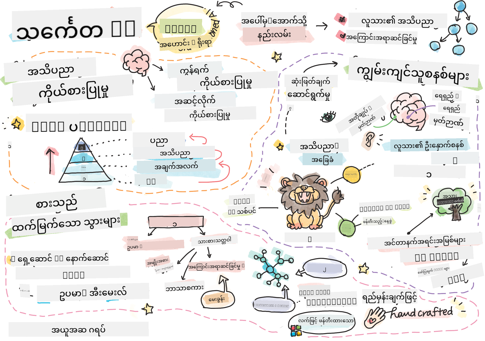
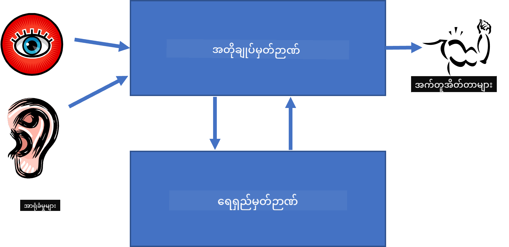

<!--
CO_OP_TRANSLATOR_METADATA:
{
  "original_hash": "98c5222ff9556b55223fed2337145e18",
  "translation_date": "2025-08-26T00:32:14+00:00",
  "source_file": "lessons/2-Symbolic/README.md",
  "language_code": "my"
}
-->
# အသိပညာကိုယ်စားပြုခြင်းနှင့် ကျွမ်းကျင်သူစနစ်များ



> Sketchnote by [Tomomi Imura](https://twitter.com/girlie_mac)

အတုယူစွမ်းရည် (AI) ကိုဖန်တီးရန် ကြိုးပမ်းမှုသည် လူသားများကဲ့သို့ ကမ္ဘာကြီးကို နားလည်နိုင်ရန် အသိပညာကို ရှာဖွေခြင်းအပေါ် အခြေခံထားသည်။ ဒါပေမယ့် ဒါကို ဘယ်လိုလုပ်ဆောင်ရမလဲ?

## [Pre-lecture quiz](https://red-field-0a6ddfd03.1.azurestaticapps.net/quiz/102)

AI ရဲ့အစောပိုင်းကာလတွေမှာ အထက်မှအောက်သို့ (top-down) လမ်းစဉ်ကို အသုံးပြုပြီး စက်ရုပ်စနစ်တွေကို ဖန်တီးခဲ့ပါတယ်။ ဒီနည်းလမ်းက လူတွေထံမှ အသိပညာကို စက်နားလည်နိုင်တဲ့ပုံစံတစ်ခုအဖြစ် ရယူပြီး ပြဿနာတွေကို အလိုအလျောက် ဖြေရှင်းနိုင်ဖို့ ရည်ရွယ်ထားတာပါ။ ဒီနည်းလမ်းမှာ အဓိကအယူအဆနှစ်ခုပါဝင်ပါတယ်။

* အသိပညာကိုယ်စားပြုခြင်း
* အကြောင်းပြချက်ရှာဖွေခြင်း

## အသိပညာကိုယ်စားပြုခြင်း

Symbolic AI ရဲ့ အရေးကြီးတဲ့အယူအဆတစ်ခုက **အသိပညာ** ဖြစ်ပါတယ်။ အသိပညာကို *သတင်းအချက်အလက်* သို့မဟုတ် *ဒေတာ* နဲ့ ခွဲခြားဖို့ အရေးကြီးပါတယ်။ ဥပမာအားဖြင့် စာအုပ်တွေမှာ အသိပညာပါဝင်တယ်လို့ ပြောနိုင်ပါတယ်၊ အကြောင်းက စာအုပ်တွေကို လေ့လာပြီး ကျွမ်းကျင်သူဖြစ်နိုင်လို့ပါ။ ဒါပေမယ့် စာအုပ်တွေမှာ ပါဝင်တာက *ဒေတာ* ဖြစ်ပြီး၊ စာအုပ်တွေကို ဖတ်ပြီး ဒေတာကို ကမ္ဘာကြီးအပေါ် မော်ဒယ်တစ်ခုအဖြစ် ပေါင်းစည်းတဲ့အခါမှာ ဒေတာကို အသိပညာအဖြစ် ပြောင်းလဲနိုင်ပါတယ်။

> ✅ **အသိပညာ** ဆိုတာ ကျွန်တော်တို့ရဲ့ ဦးနှောက်ထဲမှာ ပါဝင်ပြီး ကမ္ဘာကြီးကို နားလည်မှုကို ကိုယ်စားပြုပါတယ်။ ဒါကို **သင်ယူမှု** လုပ်ငန်းစဉ်တစ်ခုမှတစ်ဆင့် ရရှိပြီး၊ ကျွန်တော်တို့ရဲ့ ကမ္ဘာကြီးအပေါ် မော်ဒယ်တစ်ခုထဲမှာ သတင်းအချက်အလက်တွေကို ပေါင်းစည်းပါတယ်။

အများအားဖြင့် အသိပညာကို တိတိကျကျ သတ်မှတ်မထားပေမယ့် [DIKW Pyramid](https://en.wikipedia.org/wiki/DIKW_pyramid) နဲ့ ဆက်စပ်အယူအဆတွေနဲ့ ကိုက်ညီစေပါတယ်။ ဒီမှာ အောက်ပါအရာတွေ ပါဝင်ပါတယ်။

* **ဒေတာ** ဆိုတာ ရုပ်ပိုင်းဆိုင်ရာ မီဒီယာပေါ်မှာ ကိုယ်စားပြုထားတဲ့ အရာဖြစ်ပြီး၊ စာသားရေးသားခြင်း သို့မဟုတ် စကားပြောခြင်းတို့ဖြစ်နိုင်ပါတယ်။ ဒေတာက လူသားတွေမရှိဘဲ တည်ရှိနိုင်ပြီး လူတွေကြားမှာ ပေးပို့နိုင်ပါတယ်။
* **သတင်းအချက်အလက်** ဆိုတာ ကျွန်တော်တို့ရဲ့ ဦးနှောက်ထဲမှာ ဒေတာကို ဘယ်လို အဓိပ္ပာယ်ဖွင့်ဆိုတယ်ဆိုတာပါ။ ဥပမာအားဖြင့် *ကွန်ပျူတာ* ဆိုတဲ့ စကားလုံးကို ကြားတဲ့အခါ၊ ကျွန်တော်တို့မှာ အဲဒီအရာအကြောင်း နားလည်မှုတစ်ခု ရှိပါတယ်။
* **အသိပညာ** ဆိုတာ သတင်းအချက်အလက်ကို ကျွန်တော်တို့ရဲ့ ကမ္ဘာကြီးအပေါ် မော်ဒယ်ထဲမှာ ပေါင်းစည်းထားတာပါ။ ဥပမာအားဖြင့် ကွန်ပျူတာဆိုတာ ဘာလဲဆိုတာ သင်ယူပြီးတဲ့အခါ၊ အဲဒါ ဘယ်လိုအလုပ်လုပ်တယ်၊ ဘယ်လောက်ကုန်ကျတယ်၊ ဘာအတွက် အသုံးပြုနိုင်တယ်ဆိုတာ အကြောင်းအရာတွေကို နားလည်လာပါတယ်။ ဒီလို ဆက်စပ်နေတဲ့ အကြောင်းအရာတွေက ကျွန်တော်တို့ရဲ့ အသိပညာကို ဖွဲ့စည်းပါတယ်။
* **ပညာရှိမှု** ဆိုတာ ကမ္ဘာကြီးအပေါ် နားလည်မှုရဲ့ နောက်ထပ်အဆင့်တစ်ခုဖြစ်ပြီး၊ *meta-knowledge* ကို ကိုယ်စားပြုပါတယ်။ ဥပမာအားဖြင့် အသိပညာကို ဘယ်လို သုံးရမယ်၊ ဘယ်အချိန်မှာ သုံးရမယ်ဆိုတာပါ။

*Image [from Wikipedia](https://commons.wikimedia.org/w/index.php?curid=37705247), By Longlivetheux - Own work, CC BY-SA 4.0*

ဒါကြောင့် **အသိပညာကိုယ်စားပြုခြင်း** ဆိုတာက အသိပညာကို ကွန်ပျူတာထဲမှာ ဒေတာအဖြစ် ကိုယ်စားပြုဖို့ အကျိုးရှိတဲ့ နည်းလမ်းတစ်ခုကို ရှာဖွေဖို့ ပြဿနာတစ်ခုဖြစ်ပါတယ်။ ဒါကို အောက်ပါအတိုင်း အကွာအဝေးတစ်ခုအဖြစ် မြင်နိုင်ပါတယ်။


> Image by [Dmitry Soshnikov](http://soshnikov.com)

* ဘယ်ဘက်မှာတော့ ကွန်ပျူတာတွေက အလွယ်တကူ အသုံးပြုနိုင်တဲ့ အသိပညာကိုယ်စားပြုမှု အမျိုးအစားတွေ ရှိပါတယ်။ အလွယ်ဆုံးက algorithmic ဖြစ်ပြီး၊ အသိပညာကို ကွန်ပျူတာပရိုဂရမ်အဖြစ် ကိုယ်စားပြုထားတာပါ။ ဒါပေမယ့် ဒီနည်းလမ်းက အသိပညာကို ကိုယ်စားပြုဖို့ အကောင်းဆုံးမဟုတ်ပါဘူး၊ အကြောင်းက ကျွန်တော်တို့ရဲ့ ဦးနှောက်ထဲမှာ ရှိတဲ့ အသိပညာက algorithmic မဟုတ်လို့ပါ။
* ညာဘက်မှာတော့ သဘာဝစာသားလိုမျိုး ကိုယ်စားပြုမှုတွေ ရှိပါတယ်။ ဒါက အင်မတန် အားကောင်းပေမယ့် အလိုအလျောက် အကြောင်းပြချက်ရှာဖွေဖို့ အသုံးမပြုနိုင်ပါဘူး။

> ✅ သင့်ရဲ့ ဦးနှောက်ထဲမှာ အသိပညာကို ဘယ်လို ကိုယ်စားပြုပြီး မှတ်စုတွေကို ဘယ်လို ပြောင်းလဲတယ်ဆိုတာ တစ်မိနစ်လောက် စဉ်းစားကြည့်ပါ။ သင့်အတွက် မှတ်မိမှုကို ကူညီပေးနိုင်တဲ့ ပုံစံတစ်ခု ရှိပါသလား?

## ကွန်ပျူတာအသိပညာကိုယ်စားပြုမှုများကို ခွဲခြားခြင်း

ကွန်ပျူတာအသိပညာကိုယ်စားပြုမှု နည်းလမ်းတွေကို အောက်ပါအမျိုးအစားတွေ အဖြစ် ခွဲခြားနိုင်ပါတယ်။

* **ကွန်ယက်ကိုယ်စားပြုမှုများ** ဆိုတာ ကျွန်တော်တို့ရဲ့ ဦးနှောက်ထဲမှာ ဆက်စပ်နေတဲ့ အကြောင်းအရာတွေကို ကွန်ယက်တစ်ခုအဖြစ် ဖန်တီးထားတာကို အခြေခံထားပါတယ်။ ဒီလို ကွန်ယက်တွေကို ကွန်ပျူတာထဲမှာ **semantic network** အဖြစ် ဖန်တီးနိုင်ပါတယ်။

1. **Object-Attribute-Value triplets** သို့မဟုတ် **attribute-value pairs**။ ကွန်ယက်တစ်ခုကို ကွန်ပျူတာထဲမှာ node နဲ့ edge တွေစာရင်းအဖြစ် ကိုယ်စားပြုနိုင်တဲ့အတွက် semantic network ကို object, attribute, value တို့ပါဝင်တဲ့ triplets စာရင်းအဖြစ် ကိုယ်စားပြုနိုင်ပါတယ်။ ဥပမာအားဖြင့် programming languages အကြောင်း triplets တွေကို ဖန်တီးနိုင်ပါတယ်။

Object | Attribute | Value
-------|-----------|------
Python | is | Untyped-Language
Python | invented-by | Guido van Rossum
Python | block-syntax | indentation
Untyped-Language | doesn't have | type definitions

> ✅ Triplets တွေကို အသိပညာအမျိုးအစားအခြားများကို ကိုယ်စားပြုဖို့ ဘယ်လို အသုံးပြုနိုင်မလဲ စဉ်းစားကြည့်ပါ။

2. **အဆင့်လိုက်ကိုယ်စားပြုမှုများ** ဆိုတာ ကျွန်တော်တို့ရဲ့ ဦးနှောက်ထဲမှာ အရာဝတ္ထုတွေကို အဆင့်လိုက်ဖွဲ့စည်းထားတဲ့ အချက်ကို အလေးပေးထားပါတယ်။ ဥပမာအားဖြင့် ကျွန်တော်တို့သိတာက canary က ငှက်တစ်မျိုးဖြစ်ပြီး၊ ငှက်အားလုံးမှာ တောင်ပံရှိတယ်ဆိုတာပါ။ Canary ရဲ့ အရောင်၊ ပျံသန်းနိုင်မှုအမြန်နှုန်းတို့ကိုလည်း ကျွန်တော်တို့မှာ အကြမ်းဖျင်းအယူအဆရှိပါတယ်။

   - **Frame ကိုယ်စားပြုမှု** ဆိုတာ အရာဝတ္ထုတစ်ခု သို့မဟုတ် အရာဝတ္ထုအတန်းတစ်ခုကို **frame** အဖြစ် ကိုယ်စားပြုထားပြီး၊ **slots** တွေ ပါဝင်ပါတယ်။ Slots တွေမှာ ပုံမှန်တန်ဖိုးတွေ၊ တန်ဖိုးကန့်သတ်ချက်တွေ သို့မဟုတ် တန်ဖိုးကို ရယူဖို့ ဖုန်းခေါ်နိုင်တဲ့ လုပ်ငန်းစဉ်တွေ ပါဝင်နိုင်ပါတယ်။ Frame အားလုံးက object-oriented programming languages တွေမှာ object hierarchy လိုမျိုး အဆင့်လိုက်ဖွဲ့စည်းထားပါတယ်။
   - **Scenarios** ဆိုတာ အချိန်အလိုက် ဖွံ့ဖြိုးနိုင်တဲ့ အခြေအနေတွေကို ကိုယ်စားပြုတဲ့ frame အမျိုးအစားတစ်ခုဖြစ်ပါတယ်။

**Python**

Slot | Value | Default value | Interval |
-----|-------|---------------|----------|
Name | Python | | |
Is-A | Untyped-Language | | |
Variable Case | | CamelCase | |
Program Length | | | 5-5000 lines |
Block Syntax | Indent | | |

3. **Procedural ကိုယ်စားပြုမှုများ** ဆိုတာ အခြေအနေတစ်ခုဖြစ်ပေါ်တဲ့အခါ အကောင်အထည်ဖော်နိုင်တဲ့ လုပ်ဆောင်ချက်စာရင်းတစ်ခုအဖြစ် အသိပညာကို ကိုယ်စားပြုထားတာပါ။
   - Production rules ဆိုတာ if-then စကားပြောချက်တွေဖြစ်ပြီး၊ အကြောင်းပြချက်ရှာဖွေဖို့ ခွင့်ပြုပါတယ်။ ဥပမာအားဖြင့် ဆရာဝန်တစ်ဦးမှာ **IF** လူနာမှာ အဖျားကြီးတယ် **OR** သွေးစမ်းသပ်မှုမှာ C-reactive protein အဆင့်မြင့်တယ်ဆိုရင် **THEN** အရောင်ရောင်ခြင်းရှိတယ်ဆိုတဲ့ rule ရှိနိုင်ပါတယ်။ အခြေအနေတစ်ခုကို တွေ့တဲ့အခါမှာ အရောင်ရောင်ခြင်းအကြောင်းအရာကို သတ်မှတ်နိုင်ပြီး၊ နောက်ထပ် reasoning တွေမှာ အသုံးပြုနိုင်ပါတယ်။
   - Algorithms တွေကို procedural ကိုယ်စားပြုမှုတစ်မျိုးအဖြစ် သတ်မှတ်နိုင်ပေမယ့်၊ အသိပညာအခြေခံစနစ်တွေမှာ တိုက်ရိုက်အသုံးပြုတာ မရှိသလောက်ပါ။

4. **Logic** ကို Aristotle က လူသားအသိပညာကို ကိုယ်စားပြုဖို့ နည်းလမ်းတစ်ခုအဖြစ် မူလတည်ထောင်ခဲ့ပါတယ်။
   - Predicate Logic ကို သင်္ချာဆိုင်ရာ သီအိုရီအဖြစ် သတ်မှတ်ထားပေမယ့်၊ အလွန်ချမ်းသာလွန်းတဲ့အတွက် ကွန်ပျူတာနားလည်နိုင်ဖို့ မဖြစ်နိုင်ပါဘူး။ ဒါကြောင့် Prolog မှာ အသုံးပြုတဲ့ Horn clauses လိုမျိုး အပိုင်းအစတစ်ခုကိုသာ အသုံးပြုပါတယ်။
   - Descriptive Logic ဆိုတာ object hierarchy တွေကို ကိုယ်စားပြုပြီး reasoning လုပ်ဖို့ အသုံးပြုတဲ့ logic systems မျိုးစိတ်တစ်ခုဖြစ်ပြီး၊ *semantic web* လိုမျိုး distributed knowledge representations တွေမှာ အသုံးပြုပါတယ်။

## ကျွမ်းကျင်သူစနစ်များ

Symbolic AI ရဲ့ အစောပိုင်းအောင်မြင်မှုတွေထဲမှာ **ကျွမ်းကျင်သူစနစ်များ** ဆိုတဲ့ စနစ်တွေ ပါဝင်ပါတယ်။ ဒီစနစ်တွေက အကန့်အသတ်ရှိတဲ့ ပြဿနာနယ်ပယ်တစ်ခုမှာ ကျွမ်းကျင်သူတစ်ဦးအဖြစ် လုပ်ဆောင်ဖို့ ရည်ရွယ်ထားပါတယ်။ အဲဒီစနစ်တွေမှာ **knowledge base** တစ်ခု ပါဝင်ပြီး၊ လူသားကျွမ်းကျင်သူတစ်ဦး သို့မဟုတ် အများအပြားထံမှ ရယူထားတာဖြစ်ပါတယ်။ ထို့အပြင် **inference engine** တစ်ခုလည်း ပါဝင်ပြီး၊ အဲဒါက reasoning လုပ်ငန်းစဉ်ကို အကောင်အထည်ဖော်ပေးပါတယ်။

 | 
---------------------------------------------|------------------------------------------------
လူသားနာရောစနစ်ရဲ့ ရိုးရှင်းတဲ့ဖွဲ့စည်းမှု | အသိပညာအခြေခံစနစ်ရဲ့ ဖွဲ့စည်းမှု

ကျွမ်းကျင်သူစနစ်တွေကို လူသား reasoning စနစ်လိုမျိုး ဖွဲ့စည်းထားပါတယ်၊ အဲဒါမှာ **အတိုင်းအတာမှတ်ဉာဏ်** နဲ့ **ရှည်လျားမှတ်ဉာဏ်** ပါဝင်ပါတယ်။ အလားတူပဲ၊ အသိပညာအခြေခံစနစ်တွေမှာ အောက်ပါအစိတ်အပိုင်းတွေကို ခွဲခြားထားပါတယ်။

* **ပြဿနာမှတ်ဉာဏ်**: လက်ရှိဖြေရှင်းနေတဲ့ ပြဿနာအကြောင်း အသိပညာကို ထိန်းသိမ်းထားပါတယ်၊ ဥပမာအားဖြင့် လူနာရဲ့ အပူချိန် သို့မဟုတ် သွေးဖိအား၊ သူ့မှာ အရောင်ရောင်ခြင်းရှိမရှိ စသဖြင့်။ ဒီအသိပညာကို **static knowledge** လို့လည်း ခေါ်ပြီး၊ လက်ရှိပြဿနာအခြေအနေကို ကိုယ်စားပြုတဲ့ snapshot တစ်ခုအဖြစ် ပါဝင်ပါတယ်။
* **Knowledge base**: ပြဿနာနယ်ပယ်အကြောင်း ရေရှည်အသိပညာကို ကိုယ်စားပြုပါတယ်။ ဒါကို လူသားကျွမ်းကျင်သူတွေထံမှ လက်နက်ဖြင့် ရယူထားပြီး၊ တိုက်ဆိုင်မှုတိုင်းမှာ မပြောင်းလဲပါဘူး။ ဒါက ပြဿနာအခြေအနေတစ်ခုမှ နောက်တစ်ခုသို့ သွားနိုင်စေတဲ့အတွက် **dynamic knowledge** လို့လည်း ခေါ်ပါတယ်။
* **Inference engine**: ပြဿနာအခြေအနေအာကာသထဲမှာ ရှာဖွေမှုလုပ်ငန်းစဉ်ကို စီမံခန့်ခွဲပြီး၊ လိုအပ်တဲ့အခါ အသုံးပြုသူကို မေးခွန်းထုတ်ပါတယ်။ ဒါကလည်း အခြေအနေတိုင်းမှာ သက်ဆိုင်တဲ့ rule တွေကို ရှာဖွေဖို့ တာဝန်ယူပါတယ်။

ဥပမာအားဖြင့်၊ တိရစ္ဆာန်တစ်မျိုးကို physical characteristics အပေါ်အခြေခံပြီး သတ်မှတ်ဖို့ ကျွမ်းကျင်သူစနစ်တစ်ခုကို စဉ်းစားကြည့်ပါ။


> Image by [Dmitry Soshnikov](http://soshnikov.com)

ဒီဇယားကို **AND-OR tree** လို့ ခေါ်ပြီး၊ production rules တွေကို ကိုယ်စားပြုတဲ့ ဂရပ်ဖစ်ကိုယ်စားပြုမှုတစ်ခုဖြစ်ပါတယ်။ ကျွမ်းကျင်သူထံမှ အသိပညာကို ရယူတဲ့အစမှာ tree တစ်ခုဆွဲတာ အကျိုးရှိပါတယ်။ ဒါပေမယ့် ကွန်ပျူတာထဲမှာ အသိပညာကို ကိုယ်စားပြုဖို့ rule တွေကို အသုံးပြုရင် ပိုအဆင်ပြေပါတယ်။

```
IF the animal eats meat
OR (animal has sharp teeth
    AND animal has claws
    AND animal has forward-looking eyes
) 
THEN the animal is a carnivore
```

သင်တွေ့ရမယ့်အတိုင်း၊ rule ရဲ့ ဘယ်ဘက်ဖက် (LHS) မှာရှိတဲ့ အခြေအနေတစ်ခုစီနဲ့ လက်နက်ဖက် (RHS) မှာရှိတဲ့ လုပ်ဆောင်ချက်တွေဟာ
> **မှတ်ချက်**: ဤဥပမာသည် အလွန်ရိုးရှင်းပြီး ကျွမ်းကျင်သူစနစ်တစ်ခု၏ ပုံစံကိုသာ ဖော်ပြထားသည်။ သင်ဤမျိုးစနစ်တစ်ခုကို စတင်ဖန်တီးလိုက်သောအခါတွင်၊ စည်းမျဉ်းများ ၂၀၀ ကျော်ရောက်မှသာ *ထူးခြားသော* အပြုအမူများကို သတိပြုမိနိုင်မည်ဖြစ်သည်။ တစ်ချိန်ချိန်တွင် စည်းမျဉ်းများသည် အလွန်ရှုပ်ထွေးလာပြီး အားလုံးကို မှတ်ထားရန် ခက်ခဲလာမည်ဖြစ်သည်။ ဤအချိန်တွင် စနစ်တစ်ခုက အချို့သော ဆုံးဖြတ်ချက်များကို ဘာကြောင့်လုပ်ဆောင်သွားသည်ကို သင်အံ့ဩမိနိုင်သည်။ သို့သော်၊ အသိပညာအခြေပြုစနစ်များ၏ အရေးကြီးသော အင်္ဂါရပ်မှာ သင်သည် ဆုံးဖြတ်ချက်တစ်ခုချင်းစီကို ဘယ်လိုလုပ်ဆောင်ခဲ့သည်ကို အတိအကျ *ရှင်းပြနိုင်ခြင်း* ဖြစ်သည်။
## အွန်တောလော်ဂျီများနှင့် ဆီမန်တစ် ဝက်

20 ရာစုအဆုံးပိုင်းတွင် အင်တာနက်ရှိ အရင်းအမြစ်များကို သိမြင်မှုကိုယ်စားပြုမှုအသုံးပြု၍ အမှတ်အသားပြုနိုင်ရန် ကြိုးပမ်းမှုတစ်ရပ်စတင်ခဲ့သည်။ ဤကြိုးပမ်းမှုကို **ဆီမန်တစ် ဝက်** ဟုခေါ်ပြီး၊ အောက်ပါအယူအဆများအပေါ် အခြေခံထားသည်-

- **[description logics](https://en.wikipedia.org/wiki/Description_logic)** (DL) အပေါ် အခြေခံထားသည့် သိမြင်မှုကိုယ်စားပြုမှုအထူးတစ်ရပ်။ ၎င်းသည် frame knowledge representation နှင့် ဆင်တူသော်လည်း၊ တိကျသော သဘောတရားဆိုင်ရာ semantics နှင့် inference ပါရှိသည်။ DL မျိုးစိတ်တစ်ခုလုံးသည် အထောက်အထားဆိုင်ရာ algorithmic ရှုပ်ထွေးမှုနှင့် ဖော်ပြနိုင်မှုအကြား ကိုက်ညီမှုရှိစေရန် အလယ်အလတ်အဆင့်တွင် ရှိသည်။
- သိမြင်မှုကိုယ်စားပြုမှုကို ဖြန့်ဖြူးထားခြင်း၊ အရာဝတ္ထုများအားလုံးကို ကမ္ဘာလုံးဆိုင်ရာ URI အမှတ်အသားဖြင့် ကိုယ်စားပြုထားခြင်းဖြင့် အင်တာနက်တစ်လျှောက်ရှိ သိမြင်မှုအဆင့်ဆင့်များကို ဖန်တီးနိုင်စေသည်။
- သိမြင်မှုဖော်ပြရန် XML အခြေခံဘာသာစကားများ၏ မျိုးစိတ်တစ်ခု- RDF (Resource Description Framework), RDFS (RDF Schema), OWL (Ontology Web Language)။

ဆီမန်တစ် ဝက်၏ အဓိကအယူအဆမှာ **အွန်တောလော်ဂျီ** ဖြစ်သည်။ ၎င်းသည် တိကျသော သိမြင်မှုကိုယ်စားပြုမှုတစ်ရပ်ကို အသုံးပြု၍ ပြဿနာနယ်ပယ်တစ်ခုကို ဖော်ပြထားခြင်းကို ဆိုလိုသည်။ အလွယ်ဆုံးသော အွန်တောလော်ဂျီသည် ပြဿနာနယ်ပယ်ရှိ အရာဝတ္ထုများ၏ အဆင့်ဆင့်ဖြစ်နိုင်သော်လည်း၊ ပိုမိုရှုပ်ထွေးသော အွန်တောလော်ဂျီများတွင် inference အတွက် အသုံးပြုနိုင်သော စည်းမျဉ်းများပါဝင်နိုင်သည်။

ဆီမန်တစ် ဝက်တွင် အရာအားလုံးကို triplet များအပေါ် အခြေခံထားသည်။ အရာဝတ္ထုနှင့် ဆက်စပ်မှုတိုင်းကို URI ဖြင့် တစ်ခုတည်းသာ သတ်မှတ်ထားသည်။ ဥပမာအားဖြင့်၊ ဤ AI သင်ရိုးကို Dmitry Soshnikov မှ 2022 ခုနှစ် ဇန်နဝါရီလ ၁ ရက်နေ့တွင် ဖန်တီးခဲ့သည်ဆိုသော အချက်အလက်ကို ဖော်ပြလိုပါက၊ အောက်ပါ triplet များကို အသုံးပြုနိုင်သည်-


```
http://github.com/microsoft/ai-for-beginners http://www.example.com/terms/creation-date “Jan 13, 2007”
http://github.com/microsoft/ai-for-beginners http://purl.org/dc/elements/1.1/creator http://soshnikov.com
```

> ✅ ဤတွင် `http://www.example.com/terms/creation-date` နှင့် `http://purl.org/dc/elements/1.1/creator` သည် *ဖန်တီးသူ* နှင့် *ဖန်တီးသည့်ရက်စွဲ* အယူအဆများကို ဖော်ပြရန် အသုံးပြုသော ကမ္ဘာလုံးဆိုင်ရာ အသိအမှတ်ပြု URI များဖြစ်သည်။

ပိုမိုရှုပ်ထွေးသော အခြေအနေတွင် ဖန်တီးသူများစာရင်းကို သတ်မှတ်လိုပါက RDF တွင် သတ်မှတ်ထားသော ဒေတာဖွဲ့စည်းမှုများကို အသုံးပြုနိုင်သည်။


> အထက်ပါ ဒိုင်ယာဂရမ်များကို [Dmitry Soshnikov](http://soshnikov.com) မှ ဖန်တီးသည်။

ဆီမန်တစ် ဝက် ဖန်တီးရေးအတွက် ကြိုးပမ်းမှုသည် ရှာဖွေရေးအင်ဂျင်များနှင့် သဘာဝဘာသာစကားကို လေ့လာသည့်နည်းလမ်းများ၏ အောင်မြင်မှုကြောင့် တစ်ချိန်က နှေးကွေးသွားခဲ့သည်။ သို့သော်၊ အချို့သော နယ်ပယ်များတွင် အွန်တောလော်ဂျီများနှင့် သိမြင်မှုအခြေခံများကို ထိန်းသိမ်းရန် ကြိုးပမ်းမှုများ ရှိနေဆဲဖြစ်သည်။ အောက်ပါစီမံကိန်းများသည် သတိပြုရန်အထိုက်တန်သည်-

* [WikiData](https://wikidata.org/) သည် Wikipedia နှင့် ဆက်စပ်နေသော စက်ဖြင့်ဖတ်ရှုနိုင်သော သိမြင်မှုအခြေခံများ၏ စုစည်းမှုတစ်ခုဖြစ်သည်။ ဒေတာအများစုကို Wikipedia စာမျက်နှာများအတွင်းရှိ *InfoBoxes* များမှ ထုတ်ယူထားသည်။ သင်သည် [SPARQL](https://query.wikidata.org/) ဖြင့် WikiData ကို query လုပ်နိုင်သည်။ ဤသည်မှာ လူသားများအကြား အများဆုံးတွေ့ရသော မျက်လုံးအရောင်များကို ဖော်ပြသည့် query တစ်ခုဖြစ်သည်-

```sparql
#defaultView:BubbleChart
SELECT ?eyeColorLabel (COUNT(?human) AS ?count)
WHERE
{
  ?human wdt:P31 wd:Q5.       # human instance-of homo sapiens
  ?human wdt:P1340 ?eyeColor. # human eye-color ?eyeColor
  SERVICE wikibase:label { bd:serviceParam wikibase:language "en". }
}
GROUP BY ?eyeColorLabel
```

* [DBpedia](https://www.dbpedia.org/) သည် WikiData နှင့် ဆင်တူသော ကြိုးပမ်းမှုတစ်ခုဖြစ်သည်။

> ✅ သင်၏ ကိုယ်ပိုင် အွန်တောလော်ဂျီများကို ဖန်တီးရန် သို့မဟုတ် ရှိပြီးသား အွန်တောလော်ဂျီများကို ဖွင့်ရန် ကြိုးစားလိုပါက၊ [Protégé](https://protege.stanford.edu/) ဟုခေါ်သော အွန်တောလော်ဂျီ တည်းဖြတ်ရေးကိရိယာကို အသုံးပြုနိုင်သည်။ ဒေါင်းလုပ်လုပ်ပါ သို့မဟုတ် အွန်လိုင်းတွင် အသုံးပြုပါ။


*Web Protégé editor သည် Romanov Family အွန်တောလော်ဂျီဖြင့် ဖွင့်ထားသည်။ Screenshot by Dmitry Soshnikov*

## ✍️ လေ့ကျင့်မှု: မိသားစု အွန်တောလော်ဂျီ

[FamilyOntology.ipynb](https://github.com/Ezana135/AI-For-Beginners/blob/main/lessons/2-Symbolic/FamilyOntology.ipynb) တွင် မိသားစုဆက်ဆံရေးများအပေါ် ဆီမန်တစ် ဝက်နည်းလမ်းများကို အသုံးပြုသည့် ဥပမာတစ်ခုကို ကြည့်ပါ။ GEDCOM ဖော်မတ်ဖြင့် ကိုယ်စားပြုထားသော မိသားစုသစ်တစ်ခုနှင့် မိသားစုဆက်ဆံရေးအွန်တောလော်ဂျီတစ်ခုကို အသုံးပြု၍ သတ်မှတ်ထားသော လူပုဂ္ဂိုလ်များအတွက် မိသားစုဆက်ဆံရေးများ၏ ဂရပ်ဖ်တစ်ခုကို ဖန်တီးပါ။

## Microsoft Concept Graph

အွန်တောလော်ဂျီများကို အများအားဖြင့် လက်ဖြင့် သေချာစွာ ဖန်တီးရသည်။ သို့သော်၊ သဘာဝဘာသာစကားစာသားများကဲ့သို့သော မဖွဲ့စည်းထားသော ဒေတာများမှ အွန်တောလော်ဂျီများကို **ထုတ်ယူ** လုပ်ဆောင်နိုင်သည်။

Microsoft Research မှ ကြိုးပမ်းမှုတစ်ခုအဖြစ် [Microsoft Concept Graph](https://blogs.microsoft.com/ai/microsoft-researchers-release-graph-that-helps-machines-conceptualize/?WT.mc_id=academic-77998-cacaste) ကို ဖန်တီးခဲ့သည်။

၎င်းသည် `is-a` အဆင့်ဆင့်ဆက်နွယ်မှုကို အသုံးပြု၍ အဖွဲ့ဖွဲ့ထားသော entity များ၏ စုစည်းမှုကြီးတစ်ခုဖြစ်သည်။ ဤသည်က "Microsoft ဆိုတာဘာလဲ?" ကဲ့သို့သော မေးခွန်းများကို ဖြေဆိုနိုင်စေသည်- "ကုမ္ပဏီတစ်ခုဖြစ်ပြီး 0.87 ဖြစ်နိုင်ခြေရှိသည်၊ အမှတ်တံဆိပ်တစ်ခုဖြစ်ပြီး 0.75 ဖြစ်နိုင်ခြေရှိသည်" ဟုဖြေဆိုနိုင်သည်။

ဤ Graph ကို REST API အဖြစ် သို့မဟုတ် entity အစုံကို ဖော်ပြထားသော စာသားဖိုင်ကြီးအဖြစ် ရရှိနိုင်သည်။

## ✍️ လေ့ကျင့်မှု: Concept Graph

[MSConceptGraph.ipynb](https://github.com/microsoft/AI-For-Beginners/blob/main/lessons/2-Symbolic/MSConceptGraph.ipynb) notebook ကို စမ်းကြည့်ပြီး Microsoft Concept Graph ကို အသုံးပြု၍ သတင်းဆောင်းပါးများကို အမျိုးအစားအလိုက် အုပ်စုဖွဲ့နိုင်ပုံကို လေ့လာပါ။

## နိဂုံး

ယနေ့ခေတ်တွင် AI ကို *Machine Learning* သို့မဟုတ် *Neural Networks* နှင့် အညီအမျှ သတ်မှတ်ကြသည်။ သို့သော်၊ လူသားတစ်ဦးသည် တိကျသော အကြောင်းပြချက်များကိုလည်း ဖော်ပြနိုင်သည်၊ ၎င်းသည် ယနေ့ခေတ် neural networks များက ဆောင်ရွက်နိုင်ခြင်းမရှိသေးသော အရာတစ်ခုဖြစ်သည်။ အမှန်တစ်ရားတွင်၊ တိကျသော reasoning ကို အကြောင်းပြချက်များလိုအပ်သည့် အလုပ်များကို ဆောင်ရွက်ရန် သို့မဟုတ် စနစ်၏ အပြုအမူကို ထိန်းချုပ်နိုင်ရန် အသုံးပြုနေဆဲဖြစ်သည်။

## 🚀 စိန်ခေါ်မှု

ဤသင်ခန်းစာနှင့် ဆက်စပ်သော Family Ontology notebook တွင် မိသားစုဆက်ဆံရေးအခြေအနေများကို စမ်းသပ်နိုင်ရန် အခွင့်အလမ်းရှိသည်။ မိသားစုသစ်အတွင်း လူများအကြား ဆက်စပ်မှုအသစ်များကို ရှာဖွေကြည့်ပါ။

## [Post-lecture quiz](https://red-field-0a6ddfd03.1.azurestaticapps.net/quiz/202)

## ပြန်လည်သုံးသပ်ခြင်းနှင့် ကိုယ်တိုင်လေ့လာခြင်း

လူသားများသည် သိမြင်မှုကို တိုင်းတာရန်နှင့် စည်းမျဉ်းသတ်မှတ်ရန် ကြိုးပမ်းခဲ့သည့် နယ်ပယ်များကို အင်တာနက်တွင် သုတေသနလုပ်ပါ။ Bloom's Taxonomy ကိုကြည့်ပါ၊ လူသားများသည် ၎င်းတို့၏ ကမ္ဘာကို နားလည်ရန် ကြိုးပမ်းခဲ့သည့် သမိုင်းကြောင်းကို ပြန်လည်လေ့လာပါ။ Linnaeus ၏ အဖွဲ့ဖွဲ့စည်းမှုနှင့် Dmitri Mendeleev ၏ ဓာတုဒြပ်စင်များကို ဖော်ပြရန်နှင့် အုပ်စုဖွဲ့ရန် နည်းလမ်းများကို လေ့လာပါ။ သင်ရှာဖွေနိုင်သည့် အခြားစိတ်ဝင်စားဖွယ် ဥပမာများကို ရှာဖွေပါ။

**အိမ်စာ**: [အွန်တောလော်ဂျီတစ်ခု ဖန်တီးပါ](assignment.md)

**အကြောင်းကြားချက်**:  
ဤစာရွက်စာတမ်းကို AI ဘာသာပြန်ဝန်ဆောင်မှု [Co-op Translator](https://github.com/Azure/co-op-translator) ကို အသုံးပြု၍ ဘာသာပြန်ထားပါသည်။ ကျွန်ုပ်တို့သည် တိကျမှုအတွက် ကြိုးစားနေသော်လည်း၊ အလိုအလျောက် ဘာသာပြန်မှုများတွင် အမှားများ သို့မဟုတ် မတိကျမှုများ ပါဝင်နိုင်သည်ကို သတိပြုပါ။ မူရင်းစာရွက်စာတမ်းကို ၎င်း၏ မူရင်းဘာသာစကားတွင် အာဏာရှိသောအရင်းအမြစ်အဖြစ် သတ်မှတ်သင့်ပါသည်။ အရေးကြီးသော အချက်အလက်များအတွက် လူ့ဘာသာပြန်ပညာရှင်များမှ ပရော်ဖက်ရှင်နယ် ဘာသာပြန်မှုကို အကြံပြုပါသည်။ ဤဘာသာပြန်မှုကို အသုံးပြုခြင်းမှ ဖြစ်ပေါ်လာသော အလွဲအလွတ်များ သို့မဟုတ် အနားလွဲမှုများအတွက် ကျွန်ုပ်တို့သည် တာဝန်မယူပါ။