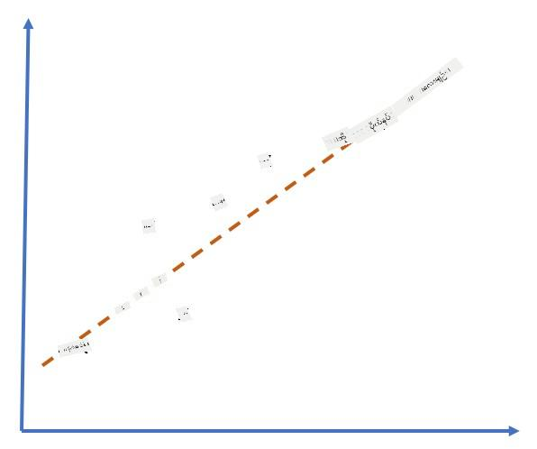

<!--
CO_OP_TRANSLATOR_METADATA:
{
  "original_hash": "ddd216f558a255260a9374008002c971",
  "translation_date": "2025-09-23T15:23:03+00:00",
  "source_file": "lessons/3-NeuralNetworks/05-Frameworks/README.md",
  "language_code": "my"
}
-->
# Neural Network Frameworks

ကျွန်ုပ်တို့သိရှိပြီးသားအတိုင်း၊ နယူးရယ်နက်ဝက်များကို ထိရောက်စွာလေ့ကျင့်နိုင်ရန်အတွက် အောက်ပါအရာနှစ်ခုကို လုပ်ဆောင်ရမည်ဖြစ်သည်-

* Tensor များပေါ်တွင် လုပ်ဆောင်ရန်၊ ဥပမာ- တိုးမြှင့်ခြင်း၊ ပေါင်းခြင်း၊ sigmoid သို့မဟုတ် softmax ကဲ့သို့သော function များကို တွက်ချက်ရန်
* Gradient descent optimization ကို လုပ်ဆောင်ရန်အတွက် expression အားလုံး၏ gradient များကို တွက်ချက်ရန်

## [Pre-lecture quiz](https://ff-quizzes.netlify.app/en/ai/quiz/9)

`numpy` library သည် ပထမအပိုင်းကို လုပ်ဆောင်နိုင်သော်လည်း gradient များကို တွက်ချက်ရန် mechanism တစ်ခုလိုအပ်သည်။ [ကျွန်ုပ်တို့၏ framework](../04-OwnFramework/OwnFramework.ipynb) တွင် ကျွန်ုပ်တို့သည် ယခင်အပိုင်းတွင် ဖွံ့ဖြိုးတိုးတက်စဉ် `backward` method အတွင်း derivative function အားလုံးကို လက်ဖြင့်ရေးသားရမည်ဖြစ်ပြီး backpropagation ကို လုပ်ဆောင်သည်။ အကောင်းဆုံး framework တစ်ခုသည် ကျွန်ုပ်တို့ဖော်ပြနိုင်သည့် *expression မည်သည့်အရာ* မဆို gradient များကို တွက်ချက်နိုင်ရန် အခွင့်အလမ်းပေးသင့်သည်။

နောက်ထပ်အရေးကြီးသောအရာမှာ GPU သို့မဟုတ် [TPU](https://en.wikipedia.org/wiki/Tensor_Processing_Unit) ကဲ့သို့သော အထူးပြု compute unit များပေါ်တွင် တွက်ချက်မှုများကို လုပ်ဆောင်နိုင်ရန်ဖြစ်သည်။ နက်ရှိုင်းသော နယူးရယ်နက်လေ့ကျင့်မှုသည် *အလွန်များသော* တွက်ချက်မှုများကို လိုအပ်ပြီး GPU များပေါ်တွင် ထိုတွက်ချက်မှုများကို parallelize လုပ်နိုင်ရန် အရေးကြီးသည်။

> ✅ 'parallelize' ဆိုသည်မှာ တွက်ချက်မှုများကို စက်များစွာပေါ်တွင် ဖြန့်ဝေခြင်းကို ဆိုလိုသည်။

လက်ရှိတွင် နယူးရယ် framework များအနက် အလွန်လူကြိုက်များသော framework နှစ်ခုမှာ [TensorFlow](http://TensorFlow.org) နှင့် [PyTorch](https://pytorch.org/) တို့ဖြစ်သည်။ နှစ်ခုစလုံးသည် CPU နှင့် GPU ပေါ်တွင် tensor များနှင့် လုပ်ဆောင်ရန် low-level API ကို ပေးသည်။ Low-level API အပေါ်တွင် [Keras](https://keras.io/) နှင့် [PyTorch Lightning](https://pytorchlightning.ai/) ဟုခေါ်သော high-level API ကိုလည်း ရှိသည်။

Low-Level API | [TensorFlow](http://TensorFlow.org) | [PyTorch](https://pytorch.org/)
--------------|-------------------------------------|--------------------------------
High-level API| [Keras](https://keras.io/) | [PyTorch Lightning](https://pytorchlightning.ai/)

**Low-level APIs** တွင် **computational graphs** ဟုခေါ်သောအရာကို တည်ဆောက်နိုင်သည်။ ဤ graph သည် input parameters များနှင့်အတူ output (အများအားဖြင့် loss function) ကို တွက်ချက်ရန်အတွက် အကွက်များကို သတ်မှတ်ပေးပြီး GPU ပေါ်တွင် တွက်ချက်မှုများကို push လုပ်နိုင်သည်။ ဤ computational graph ကို differentiate လုပ်ပြီး gradient များကို တွက်ချက်နိုင်သော function များရှိပြီး model parameters များကို optimize လုပ်ရန် အသုံးပြုနိုင်သည်။

**High-level APIs** တွင် နယူးရယ်နက်များကို **layer များ၏ အစဉ်အဆက်** အဖြစ် သတ်မှတ်ပြီး neural networks များကို တည်ဆောက်ရန် အလွန်လွယ်ကူစေသည်။ Model ကိုလေ့ကျင့်ရန်အတွက် အချက်အလက်များကို ပြင်ဆင်ပြီး `fit` function ကို ခေါ်ဆိုရုံဖြင့် အလုပ်ကို လုပ်ဆောင်နိုင်သည်။

High-level API သည် neural networks များကို အလွန်လျင်မြန်စွာ တည်ဆောက်နိုင်စေပြီး အသေးစိတ်များကို စိုးရိမ်စရာမလိုအပ်ပါ။ သို့သော် Low-level API သည် လေ့ကျင့်မှုလုပ်ငန်းစဉ်ကို ပိုမိုထိန်းချုပ်နိုင်စေပြီး သုတေသနတွင် အသုံးများသည်။ အထူးသဖြင့် နယူးရယ်နက် architecture အသစ်များနှင့် ရုန်းကန်နေစဉ်တွင် အသုံးပြုသည်။

Low-level API နှင့် High-level API နှစ်ခုကို အတူတူအသုံးပြုနိုင်သည်။ ဥပမာ- Low-level API ကို အသုံးပြု၍ network layer architecture ကို ဖွံ့ဖြိုးတိုးတက်စေပြီး High-level API ကို အသုံးပြု၍ အကြီးမားသော network ကို တည်ဆောက်ပြီး လေ့ကျင့်နိုင်သည်။ ဒါမှမဟုတ် High-level API ကို အသုံးပြု၍ layer များ၏ အစဉ်အဆက်အဖြစ် network ကို သတ်မှတ်ပြီး Low-level training loop ကို အသုံးပြု၍ optimization ကို လုပ်ဆောင်နိုင်သည်။ API နှစ်ခုစလုံးသည် အခြေခံ concepts တူညီပြီး အတူတူအလုပ်လုပ်ရန် ရည်ရွယ်ထားသည်။

## Learning

ဤသင်ခန်းစာတွင် PyTorch နှင့် TensorFlow အတွက် အကြောင်းအရာများကို ပေးထားသည်။ သင်နှစ်သက်သော framework ကို ရွေးချယ်ပြီး သက်ဆိုင်ရာ notebooks များကိုသာ လေ့လာနိုင်သည်။ Framework ရွေးချယ်ရန် မသေချာပါက **PyTorch vs. TensorFlow** အကြောင်းအရာများကို အင်တာနက်တွင် ဖတ်ရှုပါ။ Framework နှစ်ခုကို ကြည့်ရှု၍ ပိုမိုနားလည်နိုင်ပါသည်။

လွယ်ကူစေရန် High-Level APIs ကို အသုံးပြုမည်။ သို့သော် နယူးရယ်နက်များ၏ အခြေခံလုပ်ဆောင်ပုံကို နားလည်ရန် အရေးကြီးသည်ဟု ယုံကြည်သောကြောင့် Low-level API နှင့် tensors ကို အသုံးပြု၍ စတင်မည်။ သို့သော် အမြန်စတင်လိုပြီး အသေးစိတ်များကို မလေ့လာလိုပါက High-level API notebooks များကို တိုက်ရိုက်သွားနိုင်သည်။

## ✍️ Exercises: Frameworks

အောက်ပါ notebooks များတွင် သင့်လေ့လာမှုကို ဆက်လက်လုပ်ဆောင်ပါ-

Low-Level API | [TensorFlow+Keras Notebook](IntroKerasTF.ipynb) | [PyTorch](IntroPyTorch.ipynb)
--------------|-------------------------------------|--------------------------------
High-level API| [Keras](IntroKeras.ipynb) | *PyTorch Lightning*

Frameworks ကို ကျွမ်းကျင်ပြီးနောက် Overfitting အကြောင်းကို ပြန်လည်သုံးသပ်ပါ။

# Overfitting

Overfitting သည် machine learning တွင် အလွန်အရေးကြီးသော concept ဖြစ်ပြီး မှန်ကန်စွာနားလည်ရန် အရေးကြီးသည်။

အောက်ပါ 5 dots (graph ပေါ်တွင် `x` ဖြင့် ဖော်ပြထားသည်) ကို approximation လုပ်ရန် ပြဿနာကို စဉ်းစားပါ-

 | 
-------------------------|--------------------------
**Linear model, 2 parameters** | **Non-linear model, 7 parameters**
Training error = 5.3 | Training error = 0
Validation error = 5.1 | Validation error = 20

* ဘယ်ဘက်တွင် parameter အရေအတွက် သင့်တော်သောကြောင့် model သည် point distribution ၏ အဓိပ္ပာယ်ကို မှန်ကန်စွာနားလည်သည်။
* ညာဘက်တွင် model သည် အလွန်အစွမ်းထက်နေသည်။ 5 points သာရှိပြီး model တွင် 7 parameters ရှိသောကြောင့် training error ကို 0 ဖြစ်စေရန် point အားလုံးကို ဖြတ်သွားနိုင်သည်။ သို့သော် model သည် data ၏ pattern ကို မှန်ကန်စွာနားလည်ရန် မရနိုင်သောကြောင့် validation error သည် အလွန်မြင့်မားနေသည်။

Model ၏ richness (parameter အရေအတွက်) နှင့် training samples အရေအတွက်အကြား မှန်ကန်သောချိန်ကို ရှာဖွေရန် အရေးကြီးသည်။

## Why overfitting occurs

  * Training data မလုံလောက်ခြင်း
  * Model အလွန်အစွမ်းထက်ခြင်း
  * Input data တွင် noise အလွန်များခြင်း

## How to detect overfitting

အထက်ပါ graph မှာမြင်နိုင်သည့်အတိုင်း overfitting ကို training error အလွန်နည်းပြီး validation error အလွန်မြင့်ခြင်းဖြင့် ရှာဖွေနိုင်သည်။ Training အတွင်း training error နှင့် validation error နှစ်ခုစလုံး လျော့နည်းလာပြီး validation error သည် တစ်ချိန်တွင် လျော့နည်းမှုရပ်ပြီး မြင့်တက်လာနိုင်သည်။ ဤအချိန်သည် overfitting ဖြစ်နေသည်ဟု သက်သေပြသည်။ Training ကို ရပ်တန့်ရန် သို့မဟုတ် model ၏ snapshot ကို သိမ်းဆည်းရန် အချိန်ဖြစ်သည်။

## How to prevent overfitting

Overfitting ဖြစ်နေသည်ကို တွေ့ရှိပါက အောက်ပါအရာများကို လုပ်ဆောင်နိုင်သည်-

 * Training data အရေအတွက်ကို တိုးမြှင့်ပါ
 * Model ၏ complexity ကို လျော့ချပါ
 * [Dropout](../../4-ComputerVision/08-TransferLearning/TrainingTricks.md#Dropout) ကဲ့သို့သော [regularization technique](../../4-ComputerVision/08-TransferLearning/TrainingTricks.md) ကို အသုံးပြုပါ။

## Overfitting and Bias-Variance Tradeoff

Overfitting သည် [Bias-Variance Tradeoff](https://en.wikipedia.org/wiki/Bias%E2%80%93variance_tradeoff) ဟုခေါ်သော statistics တွင်ရှိသော ပိုမိုအထွေထွေပြဿနာတစ်ခု၏ အခြေအနေဖြစ်သည်။ Model ၏ error ရင်းမြစ်များကို စဉ်းစားပါက error အမျိုးအစားနှစ်မျိုးကို တွေ့နိုင်သည်-

* **Bias errors** သည် algorithm သည် training data ၏ ဆက်နွယ်မှုကို မှန်ကန်စွာဖမ်းယူနိုင်ခြင်းမရှိခြင်းကြောင့် ဖြစ်ပေါ်သည်။ Model သည် အစွမ်းမထက်လုံလောက်ခြင်း (**underfitting**) ကြောင့် ဖြစ်နိုင်သည်။
* **Variance errors** သည် model သည် input data တွင် noise ကို approximation လုပ်ခြင်းကြောင့် ဖြစ်ပေါ်သည် (**overfitting**)။

Training အတွင်း bias error သည် လျော့နည်းလာပြီး variance error သည် မြင့်တက်လာသည်။ Overfitting ကို ကာကွယ်ရန် training ကို ရပ်တန့်ရန် - manual (overfitting ကို တွေ့ရှိသောအခါ) သို့မဟုတ် automatic (regularization ကို ထည့်သွင်းခြင်းဖြင့်) - အရေးကြီးသည်။

## Conclusion

ဤသင်ခန်းစာတွင် AI framework နှစ်ခုဖြစ်သော TensorFlow နှင့် PyTorch ၏ API များအကြား ကွာခြားချက်များကို သင်လေ့လာခဲ့သည်။ ထို့အပြင် overfitting ဟုခေါ်သော အရေးကြီးသောအကြောင်းအရာကိုလည်း သင်လေ့လာခဲ့သည်။

## 🚀 Challenge

ထည့်သွင်းထားသော notebooks တွင် 'tasks' များကို အောက်ဆုံးတွင် တွေ့နိုင်ပါသည်။ Notebooks များကို လေ့လာပြီး tasks များကို ပြီးမြောက်စေပါ။

## [Post-lecture quiz](https://ff-quizzes.netlify.app/en/ai/quiz/10)

## Review & Self Study

အောက်ပါအကြောင်းအရာများကို သုတေသနလုပ်ပါ-

- TensorFlow
- PyTorch
- Overfitting

ကိုယ့်ကိုယ်ကို အောက်ပါမေးခွန်းများကို မေးပါ-

- TensorFlow နှင့် PyTorch ၏ ကွာခြားချက်က ဘာလဲ?
- Overfitting နှင့် Underfitting ၏ ကွာခြားချက်က ဘာလဲ?

## [Assignment](lab/README.md)

ဤ lab တွင် PyTorch သို့မဟုတ် TensorFlow ကို အသုံးပြု၍ single-layered နှင့် multi-layered fully-connected networks ကို အသုံးပြု၍ classification problems နှစ်ခုကို ဖြေရှင်းရန် တိုက်တွန်းထားသည်။

* [Instructions](lab/README.md)
* [Notebook](lab/LabFrameworks.ipynb)

---

