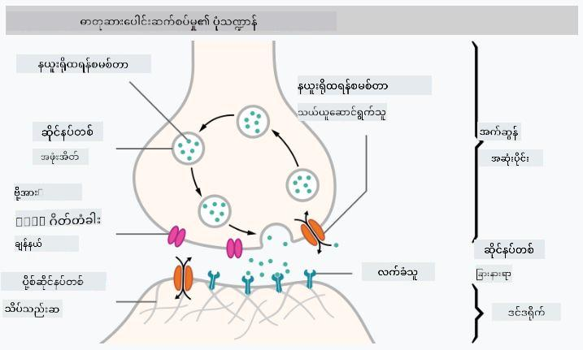

<!--
CO_OP_TRANSLATOR_METADATA:
{
  "original_hash": "5abc5f7978919be90cd313f0c20e8228",
  "translation_date": "2025-09-07T14:37:36+00:00",
  "source_file": "lessons/3-NeuralNetworks/README.md",
  "language_code": "my"
}
-->
# နာရုံကွန်ရက်များအကြောင်းမိတ်ဆက်

မိတ်ဆက်အပိုင်းတွင် ဆွေးနွေးခဲ့သလို၊ ဉာဏ်ရည်ရရှိရန်နည်းလမ်းတစ်ခုမှာ **ကွန်ပျူတာမော်ဒယ်** သို့မဟုတ် **အတုဉာဏ်ရည်** ကိုလေ့ကျင့်ခြင်းဖြစ်သည်။ ၂၀ ရာစုအလယ်ပိုင်းမှစ၍ သုတေသနများသည် သင်္ချာမော်ဒယ်အမျိုးမျိုးကို စမ်းသပ်ခဲ့ကြပြီး၊ မကြာသေးမီနှစ်များတွင် ဤလမ်းကြောင်းသည် အလွန်အောင်မြင်မှုရရှိခဲ့သည်။ ဉာဏ်ရည်၏ သင်္ချာမော်ဒယ်များကို **နာရုံကွန်ရက်များ** ဟုခေါ်သည်။

> တစ်ခါတစ်ရံ နာရုံကွန်ရက်များကို *Artificial Neural Networks* (ANNs) ဟုခေါ်ပြီး၊ ဤသည်မှာ အမှန်တကယ်သောနာရုံကွန်ရက်များမဟုတ်ပဲ မော်ဒယ်များအကြောင်းကို ပြောဆိုနေသည်ကို ဖော်ပြရန်ဖြစ်သည်။

## စက်လေ့ကျင့်မှု

နာရုံကွန်ရက်များသည် **စက်လေ့ကျင့်မှု** ဟုခေါ်သော အကြီးမားဆုံးဘာသာရပ်တစ်ခု၏ အစိတ်အပိုင်းတစ်ခုဖြစ်ပြီး၊ ၎င်း၏ရည်ရွယ်ချက်မှာ ဒေတာကို အသုံးပြု၍ ပြဿနာများကို ဖြေရှင်းနိုင်သော ကွန်ပျူတာမော်ဒယ်များကို လေ့ကျင့်ခြင်းဖြစ်သည်။ စက်လေ့ကျင့်မှုသည် အတုဉာဏ်ရည်၏ အကြီးမားဆုံးအစိတ်အပိုင်းတစ်ခုဖြစ်သော်လည်း၊ ဤသင်ခန်းစာတွင် ရိုးရာစက်လေ့ကျင့်မှုကို မဖုံးအုပ်ပါ။

> ရိုးရာစက်လေ့ကျင့်မှုအကြောင်းပိုမိုလေ့လာရန် **[Machine Learning for Beginners](http://github.com/microsoft/ml-for-beginners)** သင်ခန်းစာကို သွားရောက်ကြည့်ရှုပါ။

စက်လေ့ကျင့်မှုတွင်၊ ငါတို့တွင် **X** ဟုခေါ်သော နမူနာများ၏ ဒေတာစုစည်းမှုတစ်ခုနှင့် **Y** ဟုခေါ်သော အထွက်တန်ဖိုးများရှိသည်ဟု သတ်မှတ်သည်။ နမူနာများသည် **အင်္ဂါရပ်များ** ပါဝင်သော N-အတိုင်းအတာဗက်တာများဖြစ်ပြီး၊ အထွက်များကို **တံဆိပ်များ** ဟုခေါ်သည်။

စက်လေ့ကျင့်မှု၏ အများဆုံးတွေ့ရသော ပြဿနာနှစ်ခုကို ကျွန်ုပ်တို့ဆွေးနွေးမည်။

* **အမျိုးအစားခွဲခြားမှု** - အဝင်အရာဝတ္ထုကို အမျိုးအစားနှစ်မျိုး သို့မဟုတ် အမျိုးအစားများစွာသို့ ခွဲခြားရန်လိုအပ်သည်။
* **ပြန်လည်သုံးသပ်မှု** - အဝင်နမူနာတစ်ခုစီအတွက် ကိန်းဂဏန်းတစ်ခုကို ခန့်မှန်းရန်လိုအပ်သည်။

> အဝင်နှင့်အထွက်များကို တန်ဆာများအဖြစ် ကိုယ်စားပြုသောအခါ၊ အဝင်ဒေတာစုစည်းမှုသည် M×N အရွယ်အစားရှိသော မက်ထရစ်ဖြစ်ပြီး၊ M သည် နမူနာအရေအတွက်၊ N သည် အင်္ဂါရပ်အရေအတွက်ဖြစ်သည်။ အထွက်တံဆိပ်များ **Y** သည် M အရွယ်အစားရှိသော ဗက်တာဖြစ်သည်။

ဤသင်ခန်းစာတွင် နာရုံကွန်ရက်မော်ဒယ်များကိုသာ အာရုံစိုက်မည်။

## နာရုံ၏မော်ဒယ်

ဇီဝဗေဒမှ ကျွန်ုပ်တို့သိသည်မှာ၊ ကျွန်ုပ်တို့၏ ဦးနှောက်သည် နာရုံဆဲလ်များဖြင့် ဖွဲ့စည်းထားပြီး၊ ၎င်းတို့တွင် "အဝင်" (axons) များစွာနှင့် "အထွက်" (dendrite) တစ်ခုရှိသည်။ Axons နှင့် dendrites သည် လျှပ်စစ် signal များကို သယ်ဆောင်နိုင်ပြီး၊ axons နှင့် dendrites အကြားရှိ ချိတ်ဆက်မှုများသည် conductivity အဆင့်အတန်းများကို (neuromediators မှတစ်ဆင့်) ထိန်းချုပ်နိုင်သည်။

 | 
----|----
အမှန်တကယ်နာရုံ *([Wikipedia မှပုံ](https://en.wikipedia.org/wiki/Synapse#/media/File:SynapseSchematic_lines.svg))* | အတုနာရုံ *(ရေးသားသူမှပုံ)*

ထို့ကြောင့်၊ နာရုံ၏ အလွယ်ဆုံး သင်္ချာမော်ဒယ်သည် အဝင်များ **X1, ..., XN** နှင့် အထွက် **Y** တစ်ခု၊ အလေးချိန်များ **W1, ..., WN** တစ်စုံပါဝင်သည်။ အထွက်ကို အောက်ပါအတိုင်းတွက်ချက်သည်။

ဤတွင် **f** သည် **activation function** ဟုခေါ်သော အနည်းငယ်လိုင်နီယာမဟုတ်သော function တစ်ခုဖြစ်သည်။

> နာရုံ၏အစောပိုင်းမော်ဒယ်များကို 1943 ခုနှစ်တွင် Warren McCullock နှင့် Walter Pitts ရေးသားသော [A logical calculus of the ideas immanent in nervous activity](https://www.cs.cmu.edu/~./epxing/Class/10715/reading/McCulloch.and.Pitts.pdf) ဟုခေါ်သော စာတမ်းတွင် ဖော်ပြခဲ့သည်။ Donald Hebb သည် "[The Organization of Behavior: A Neuropsychological Theory](https://books.google.com/books?id=VNetYrB8EBoC)" ဟုခေါ်သော ၎င်း၏စာအုပ်တွင် ဤကွန်ရက်များကို လေ့ကျင့်နိုင်သောနည်းလမ်းကို အဆိုပြုခဲ့သည်။

## ဤအပိုင်းတွင်

ဤအပိုင်းတွင် ကျွန်ုပ်တို့လေ့လာမည်မှာ-

* [Perceptron](03-Perceptron/README.md) - နှစ်မျိုးအမျိုးအစားခွဲခြားမှုအတွက် အစောပိုင်းနာရုံကွန်ရက်မော်ဒယ်တစ်ခု
* [Multi-layered networks](04-OwnFramework/README.md) - notebook တစ်ခုနှင့်တွဲဖက်ထားသော [ကျွန်ုပ်တို့၏ framework ကိုတည်ဆောက်နည်း](04-OwnFramework/OwnFramework.ipynb)
* [Neural Network Frameworks](05-Frameworks/README.md) - PyTorch [notebook](05-Frameworks/IntroPyTorch.ipynb) နှင့် Keras/Tensorflow [notebook](05-Frameworks/IntroKerasTF.ipynb)
* [Overfitting](../../../../lessons/3-NeuralNetworks/05-Frameworks)

---

**အကြောင်းကြားချက်**:  
ဤစာရွက်စာတမ်းကို AI ဘာသာပြန်ဝန်ဆောင်မှု [Co-op Translator](https://github.com/Azure/co-op-translator) ကို အသုံးပြု၍ ဘာသာပြန်ထားပါသည်။ ကျွန်ုပ်တို့သည် တိကျမှုအတွက် ကြိုးစားနေသော်လည်း၊ အလိုအလျောက် ဘာသာပြန်မှုများတွင် အမှားများ သို့မဟုတ် မတိကျမှုများ ပါဝင်နိုင်သည်ကို သတိပြုပါ။ မူရင်းဘာသာစကားဖြင့် ရေးသားထားသော စာရွက်စာတမ်းကို အာဏာတရ အရင်းအမြစ်အဖြစ် သတ်မှတ်သင့်ပါသည်။ အရေးကြီးသော အချက်အလက်များအတွက် လူက ဘာသာပြန်မှုကို အသုံးပြုရန် အကြံပြုပါသည်။ ဤဘာသာပြန်မှုကို အသုံးပြုခြင်းမှ ဖြစ်ပေါ်လာသော အလွဲအလွတ်များ သို့မဟုတ် အနားယူမှားမှုများအတွက် ကျွန်ုပ်တို့သည် တာဝန်မယူပါ။