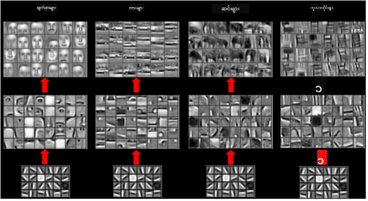

<!--
CO_OP_TRANSLATOR_METADATA:
{
  "original_hash": "088837b42b7d99198bf62db8a42411e0",
  "translation_date": "2025-08-25T22:54:11+00:00",
  "source_file": "lessons/4-ComputerVision/07-ConvNets/README.md",
  "language_code": "my"
}
-->
# Convolutional Neural Networks

ယခင်က ကျွန်ုပ်တို့မြင်ခဲ့သည့်အတိုင်း နယူးရယ်နက်ဝက်များသည် ပုံများကို ကိုင်တွယ်ရာတွင် အတော်လေးကောင်းမွန်ပြီး MNIST ဒေတာစနစ်မှ လက်ဖြင့်ရေးသားထားသော ဂဏန်းများကိုတောင် တစ်လွှာပဲရှိသော perceptron ဖြင့် တော်တော်လေးတိကျစွာ မှတ်မိနိုင်သည်။ သို့သော် MNIST ဒေတာစနစ်သည် အထူးသဖြင့် ဂဏန်းများအားလုံးကို ပုံ၏အလယ်တွင်ထားရှိထားသောကြောင့် အလုပ်ကို ပိုမိုလွယ်ကူစေသည်။

## [Pre-lecture quiz](https://ff-quizzes.netlify.app/en/ai/quiz/13)

အမှန်တကယ်ဘဝတွင် ပုံ၏တိကျသောတည်နေရာမဟုတ်ဘဲ ပုံတစ်ပုံတွင် အရာဝတ္ထုများကို မှတ်မိနိုင်စေရန်လိုအပ်သည်။ ကွန်ပျူတာမြင်ကြည့်မှုသည် အထွေထွေခွဲခြားမှုနှင့်ကွဲပြားပြီး ပုံတစ်ပုံတွင် အရာဝတ္ထုတစ်ခုကို ရှာဖွေရာတွင် အချို့သော **ပုံစံများ** နှင့် ၎င်းတို့၏ပေါင်းစည်းမှုများကို ရှာဖွေရန် ပုံကို စစ်ဆေးနေသည်။ ဥပမာအားဖြင့် ကြောင်တစ်ကောင်ကို ရှာဖွေရာတွင် အရင်ဆုံး အလျားလိုက်လိုင်းများကို ရှာဖွေပြီး ၎င်းတို့သည် ကြောင်၏မုတ်ဆိတ်ဖြစ်နိုင်သည်ဟု သတ်မှတ်နိုင်သည်။ ထို့နောက် မုတ်ဆိတ်ပုံစံတစ်ခုတည်းဖြင့် ၎င်းသည် ကြောင်ပုံတစ်ပုံဖြစ်ကြောင်း ပြောနိုင်သည်။ ပုံတစ်ပုံတွင် တိကျသောတည်နေရာထက် ပုံစံတစ်ခု၏ ဆက်စပ်မှုနှင့် ရှိနေမှုသည် အရေးကြီးသည်။

ပုံစံများကို ထုတ်ယူရန် **convolutional filters** ၏အယူအဆကို အသုံးပြုမည်ဖြစ်သည်။ သင်သိသည့်အတိုင်း ပုံတစ်ပုံကို 2D-မက်ထရစ် သို့မဟုတ် အရောင်အနက်ရှိသော 3D-တန်ဆာဖြင့် ကိုယ်စားပြုသည်။ filter ကို အသုံးပြုခြင်းသည် အလွန်သေးငယ်သော **filter kernel** မက်ထရစ်ကို ယူပြီး မူလပုံ၏ တစ်ခုချင်းစီ pixel အတွက် အနီးအနားရှိအချက်အလက်များနှင့်အတူ အလေးချိန်ပျမ်းမျှကိုတွက်ချက်ခြင်းဖြစ်သည်။ ၎င်းကို ပုံတစ်ပုံလုံးပေါ်တွင် သေးငယ်သောပြတင်းပေါက်တစ်ခုကဲ့သို့ လှိမ့်ပြီး filter kernel မက်ထရစ်ရှိ အလေးချိန်များအတိုင်း pixel အားလုံးကို ပျမ်းမျှစေသည်ဟု မြင်နိုင်သည်။

 | 
----|----

> ပုံ - Dmitry Soshnikov

ဥပမာအားဖြင့် MNIST ဂဏန်းများတွင် 3x3 vertical edge နှင့် horizontal edge filters ကို အသုံးပြုပါက မူလပုံတွင် အလျားလိုက်နှင့် အနံလိုက်အနားများရှိရာနေရာများကို ထင်ရှားစေမည် (ဥပမာ- အမြင့်တန်ဖိုးများ)။ ထို့ကြောင့် ၎င်း filter နှစ်ခုကို အနားများကို "ရှာဖွေ" ရန် အသုံးပြုနိုင်သည်။ ထို့နောက် အခြားအနိမ့်အဆင့်ပုံစံများကို ရှာဖွေရန် filter များကိုလည်း ဒီဇိုင်းဆွဲနိုင်သည်။

> [Leung-Malik Filter Bank](https://www.robots.ox.ac.uk/~vgg/research/texclass/filters.html) ၏ပုံ

သို့သော် ပုံစံများကို လက်ဖြင့် filter များဖြင့် ထုတ်ယူနိုင်သလို၊ နက်ဝက်ကို ပုံစံများကို အလိုအလျောက် သင်ယူနိုင်စေရန် ဒီဇိုင်းဆွဲနိုင်သည်။ ၎င်းသည် CNN ၏ အဓိကအယူအဆတစ်ခုဖြစ်သည်။

## CNN ၏ အဓိကအယူအဆများ

CNN များအလုပ်လုပ်ပုံသည် အောက်ပါအရေးကြီးသောအယူအဆများအပေါ် အခြေခံသည်-

* Convolutional filters များသည် ပုံစံများကို ထုတ်ယူနိုင်သည်။
* Filter များကို အလိုအလျောက် သင်ယူနိုင်စေရန် နက်ဝက်ကို ဒီဇိုင်းဆွဲနိုင်သည်။
* မူလပုံတွင်သာမက အဆင့်မြင့် features တွင်လည်း ပုံစံများကို ရှာဖွေရန် အလားတူနည်းလမ်းကို အသုံးပြုနိုင်သည်။ ထို့ကြောင့် CNN feature extraction သည် အနိမ့်အဆင့် pixel ပေါင်းစည်းမှုမှ စ၍ ပုံ၏ အဆင့်မြင့်အစိတ်အပိုင်းများအထိ feature များ၏ အဆင့်လိုက်အဆင့်လိုက်အဆောက်အအုံအပေါ် အလုပ်လုပ်သည်။

> ပုံ - [Hislop-Lynch ၏စာတမ်း](https://www.semanticscholar.org/paper/Computer-vision-based-pedestrian-trajectory-Hislop-Lynch/26e6f74853fc9bbb7487b06dc2cf095d36c9021d) မှ၊ [၎င်းတို့၏သုတေသန](https://dl.acm.org/doi/abs/10.1145/1553374.1553453) အပေါ်အခြေခံ

## ✍️ လေ့ကျင့်မှုများ: Convolutional Neural Networks

Convolutional neural networks များအလုပ်လုပ်ပုံနှင့် trainable filters များကို မည်သို့ရရှိနိုင်သည်ကို ဆက်လက်လေ့လာရန် အောက်ပါ notebooks များကို အသုံးပြုပါ-

* [Convolutional Neural Networks - PyTorch](../../../../../lessons/4-ComputerVision/07-ConvNets/ConvNetsPyTorch.ipynb)
* [Convolutional Neural Networks - TensorFlow](../../../../../lessons/4-ComputerVision/07-ConvNets/ConvNetsTF.ipynb)

## Pyramid Architecture

ပုံများကို ကိုင်တွယ်ရာတွင် အသုံးပြုသော CNN များအများစုသည် "pyramid architecture" ဟုခေါ်သောဖွဲ့စည်းပုံကို လိုက်နာသည်။ မူလပုံများတွင် ပထမဆုံး convolutional layer သည် အလွန်နည်းသော filter များ (8-16) ကိုသာ ရှိပြီး ၎င်းတို့သည် အလျားလိုက်/အနံလိုက်လိုင်းများကဲ့သို့သော pixel ပေါင်းစည်းမှုများကို ကိုယ်စားပြုသည်။ နောက်အဆင့်တွင် နက်ဝက်၏ အကျယ်အဝန်းကို လျှော့ချပြီး filter များ၏အရေအတွက်ကို တိုးမြှင့်သည်။ ၎င်းသည် ရိုးရှင်းသော feature များ၏ ပေါင်းစည်းမှုများကို ပိုမိုဖြစ်စေသည်။ အလွှာတိုင်းတွင် နောက်ဆုံး classifier သို့ ရောက်သည့်အခါ ပုံ၏ အကျယ်အဝန်းသည် လျှော့ချပြီး filter များ၏အရေအတွက်သည် တိုးပွားသည်။

ဥပမာအားဖြင့် 2014 ခုနှစ်တွင် ImageNet ၏ top-5 classification တွင် 92.7% တိကျမှုရရှိခဲ့သော VGG-16 ၏ဖွဲ့စည်းပုံကို ကြည့်ပါ-

> ပုံ - [Researchgate](https://www.researchgate.net/figure/Vgg16-model-structure-To-get-the-VGG-NIN-model-we-replace-the-2-nd-4-th-6-th-7-th_fig2_335194493)

## အကောင်းဆုံးလူသိများသော CNN ဖွဲ့စည်းပုံများ

[အကောင်းဆုံးလူသိများသော CNN ဖွဲ့စည်းပုံများအကြောင်း ဆက်လက်လေ့လာပါ](CNN_Architectures.md)

**အကြောင်းကြားချက်**:  
ဤစာရွက်စာတမ်းကို AI ဘာသာပြန်ဝန်ဆောင်မှု [Co-op Translator](https://github.com/Azure/co-op-translator) ကို အသုံးပြု၍ ဘာသာပြန်ထားပါသည်။ ကျွန်ုပ်တို့သည် တိကျမှုအတွက် ကြိုးစားနေပါသော်လည်း၊ အလိုအလျောက် ဘာသာပြန်မှုများတွင် အမှားများ သို့မဟုတ် မတိကျမှုများ ပါဝင်နိုင်သည်ကို သတိပြုပါ။ မူရင်းစာရွက်စာတမ်းကို ၎င်း၏ မူရင်းဘာသာစကားဖြင့် အာဏာတရ အရင်းအမြစ်အဖြစ် သတ်မှတ်သင့်ပါသည်။ အရေးကြီးသော အချက်အလက်များအတွက် လူ့ဘာသာပြန်ပညာရှင်များမှ ပရော်ဖက်ရှင်နယ် ဘာသာပြန်မှုကို အကြံပြုပါသည်။ ဤဘာသာပြန်မှုကို အသုံးပြုခြင်းမှ ဖြစ်ပေါ်လာသော အလွဲအလွဲအချော်များ သို့မဟုတ် အနားလွဲမှုများအတွက် ကျွန်ုပ်တို့သည် တာဝန်မယူပါ။