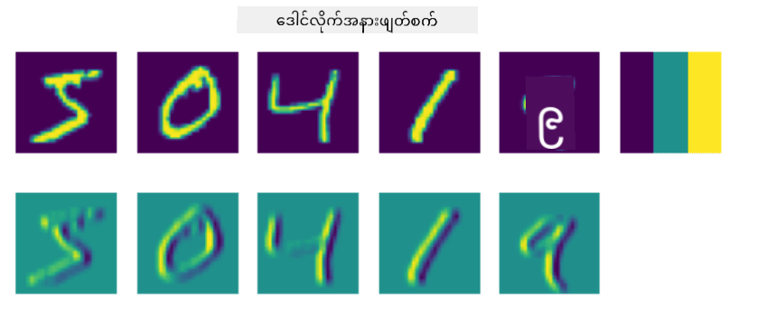

<!--
CO_OP_TRANSLATOR_METADATA:
{
  "original_hash": "a560d5b845962cf33dc102266e409568",
  "translation_date": "2025-09-23T15:14:13+00:00",
  "source_file": "lessons/4-ComputerVision/07-ConvNets/README.md",
  "language_code": "my"
}
-->
# Convolutional Neural Networks

မကြာသေးမီက ကျွန်တော်တို့ neural networks တွေဟာ ပုံတွေကို ကောင်းကောင်းကိုင်တွယ်နိုင်ပြီး၊ တစ်လွှာတည်းသော perceptron ကတောင် MNIST dataset ထဲက လက်ရေးအက္ခရာဂဏန်းတွေကို တော်တော်လေးတိကျမှုရှိရှိနဲ့ မှတ်မိနိုင်တယ်ဆိုတာကို မြင်ခဲ့ပါတယ်။ သို့သော်လည်း MNIST dataset ဟာ အထူးတလည်ဖြစ်ပြီး၊ အက္ခရာဂဏန်းတွေဟာ ပုံထဲမှာ အလယ်မှာထားရှိထားတာကြောင့် အလုပ်ကို ပိုမိုလွယ်ကူစေပါတယ်။

## [Pre-lecture quiz](https://ff-quizzes.netlify.app/en/ai/quiz/13)

အမှန်တကယ်မှာတော့ ပုံထဲမှာ အရာဝတ္ထုတွေကို သူ့နေရာတိကျမှုမဟုတ်ဘဲ မှတ်မိနိုင်ဖို့လိုပါတယ်။ Computer vision ဟာ အထွေထွေ classification နဲ့ ကွဲပြားပါတယ်၊ အကြောင်းကတော့ ပုံထဲမှာ အတိအကျအရာဝတ္ထုတစ်ခုကို ရှာဖွေနေတဲ့အခါမှာ အထူး **patterns** တွေကို ရှာဖွေနေပြီး၊ အဲဒီ patterns တွေကို ပေါင်းစပ်ထားတာကို ရှာဖွေနေပါတယ်။ ဥပမာ၊ ကြောင်ကို ရှာဖွေနေတဲ့အခါမှာ အရင်ဆုံး horizontal lines တွေကို ရှာဖွေနိုင်ပြီး၊ အဲဒီ horizontal lines တွေက whiskers ဖြစ်နိုင်ပြီး၊ whiskers တွေကို ပေါင်းစပ်ထားတဲ့အခါ ကြောင်ပုံတစ်ပုံဖြစ်တယ်ဆိုတာကို သိနိုင်ပါတယ်။ Relative position နဲ့ patterns တစ်ချို့ရဲ့ ရှိမှုက အရေးကြီးပါတယ်၊ သူ့နေရာတိကျမှုကတော့ မဟုတ်ပါဘူး။

Patterns တွေကို ရှာဖွေဖို့ **convolutional filters** ဆိုတဲ့ အယူအဆကို အသုံးပြုပါမယ်။ သင်သိပြီးသားဖြစ်တဲ့အတိုင်း၊ ပုံတစ်ပုံဟာ 2D-matrix, ဒါမှမဟုတ် color depth ပါတဲ့ 3D-tensor အနေနဲ့ ဖော်ပြထားပါတယ်။ Filter ကို အသုံးပြုတဲ့အခါမှာ **filter kernel** matrix လေးတစ်ခုကို ယူပြီး၊ မူရင်းပုံထဲက pixel တစ်ခုစီအတွက် အနီးအနားမှာရှိတဲ့ point တွေနဲ့ weighted average ကိုတွက်ချက်ပါတယ်။ ဒါကို ပုံတစ်ပုံလုံးကို sliding လုပ်ပြီး၊ filter kernel matrix ထဲက weight တွေအတိုင်း pixel တွေကို averaging လုပ်နေတဲ့ window လေးတစ်ခုလိုမျိုး မြင်နိုင်ပါတယ်။

 | 
----|----

> Image by Dmitry Soshnikov

ဥပမာ၊ MNIST digits တွေကို 3x3 vertical edge နဲ့ horizontal edge filters တွေကို အသုံးပြုရင်၊ မူရင်းပုံထဲမှာ vertical နဲ့ horizontal edges ရှိတဲ့နေရာတွေမှာ highlight (ဥပမာ high values) တွေကို ရနိုင်ပါတယ်။ ဒါကြောင့် အဲဒီ filter နှစ်ခုကို edges တွေကို "ရှာဖွေ"ဖို့ အသုံးပြုနိုင်ပါတယ်။ အဲဒီလိုပဲ၊ အခြား low-level patterns တွေကို ရှာဖွေဖို့ filter တွေကို design လုပ်နိုင်ပါတယ်။

> Image of [Leung-Malik Filter Bank](https://www.robots.ox.ac.uk/~vgg/research/texclass/filters.html)

သို့သော်လည်း၊ patterns တွေကို manually design လုပ်နိုင်သလို၊ network ကို design လုပ်တဲ့အခါမှာ patterns တွေကို အလိုအလျောက် သင်ယူနိုင်အောင်လည်း ပြုလုပ်နိုင်ပါတယ်။ ဒါဟာ CNN ရဲ့ အဓိကအယူအဆတစ်ခုဖြစ်ပါတယ်။

## Main ideas behind CNN

CNN တွေဟာ အောက်ပါ အရေးကြီးတဲ့ အယူအဆတွေကို အခြေခံပြီး အလုပ်လုပ်ပါတယ်-

* Convolutional filters တွေက patterns တွေကို ရှာဖွေနိုင်တယ်
* Filters တွေကို အလိုအလျောက် သင်ယူနိုင်အောင် network ကို design လုပ်နိုင်တယ်
* မူရင်းပုံထဲမှာသာမက၊ high-level features တွေထဲမှာ patterns တွေကို ရှာဖွေနိုင်ဖို့ အတူတူပုံစံကို အသုံးပြုနိုင်တယ်။ ဒါကြောင့် CNN feature extraction ဟာ low-level pixel combinations တွေကနေ စပြီး၊ ပုံရဲ့ အပိုင်းပိုင်းတွေကို ပေါင်းစပ်ထားတဲ့ higher-level features တွေထိ hierarchy အတိုင်း အလုပ်လုပ်ပါတယ်။

> Image from [a paper by Hislop-Lynch](https://www.semanticscholar.org/paper/Computer-vision-based-pedestrian-trajectory-Hislop-Lynch/26e6f74853fc9bbb7487b06dc2cf095d36c9021d), based on [their research](https://dl.acm.org/doi/abs/10.1145/1553374.1553453)

## ✍️ Exercises: Convolutional Neural Networks

Convolutional neural networks တွေ ဘယ်လိုအလုပ်လုပ်တယ်ဆိုတာနဲ့၊ trainable filters တွေကို ဘယ်လိုရနိုင်တယ်ဆိုတာကို notebooks တွေကို အသုံးပြုပြီး ဆက်လက်လေ့လာကြမယ်-

* [Convolutional Neural Networks - PyTorch](ConvNetsPyTorch.ipynb)
* [Convolutional Neural Networks - TensorFlow](ConvNetsTF.ipynb)

## Pyramid Architecture

ပုံတွေကို ကိုင်တွယ်တဲ့ CNN တွေဟာ အများအားဖြင့် pyramid architecture ဆိုတဲ့ပုံစံကို လိုက်နာပါတယ်။ မူရင်းပုံတွေကို အသုံးပြုတဲ့ ပထမဆုံး convolutional layer ဟာ filters အနည်းငယ် (8-16) ပါဝင်ပြီး၊ horizontal/vertical lines of strokes လို pixel combinations တွေကို ကိုင်တွယ်ပါတယ်။ နောက်တစ်ဆင့်မှာတော့ network ရဲ့ spatial dimension ကို လျှော့ချပြီး၊ filters အရေအတွက်ကို တိုးမြှင့်ပါတယ်၊ ဒါဟာ simple features တွေကို ပေါင်းစပ်ထားတဲ့ combination တွေကို ပိုမိုရနိုင်စေပါတယ်။ Layer တစ်ခုစီမှာ၊ final classifier ကို ရောက်တဲ့အထိ၊ ပုံရဲ့ spatial dimensions တွေ လျှော့ချပြီး၊ filters အရေအတွက်ကို တိုးမြှင့်ပါတယ်။

ဥပမာအနေနဲ့၊ VGG-16 ရဲ့ architecture ကို ကြည့်ကြမယ်၊ ဒီ network ဟာ 2014 မှာ ImageNet ရဲ့ top-5 classification မှာ 92.7% accuracy ရရှိခဲ့ပါတယ်-

> Image from [Researchgate](https://www.researchgate.net/figure/Vgg16-model-structure-To-get-the-VGG-NIN-model-we-replace-the-2-nd-4-th-6-th-7-th_fig2_335194493)

## Best-Known CNN Architectures

[Best-known CNN architectures တွေကို ဆက်လက်လေ့လာပါ](CNN_Architectures.md)

---

