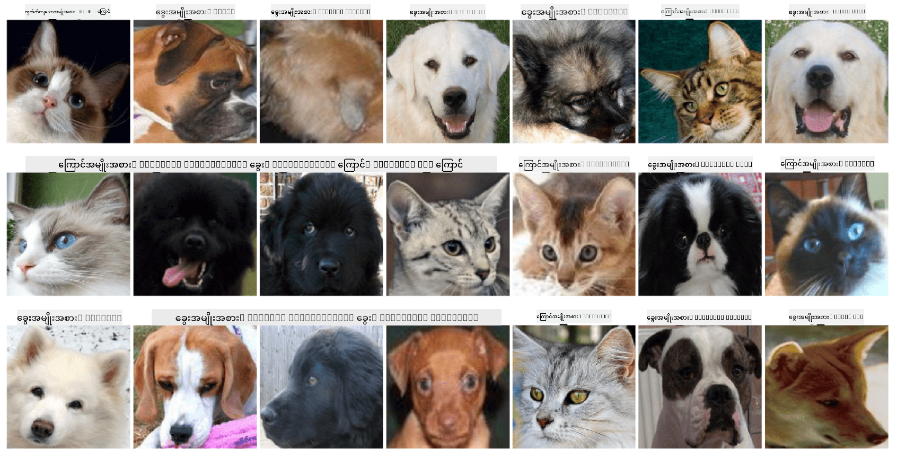

<!--
CO_OP_TRANSLATOR_METADATA:
{
  "original_hash": "f3d2cee9cb3c52160419e560c57a690e",
  "translation_date": "2025-08-25T22:59:13+00:00",
  "source_file": "lessons/4-ComputerVision/07-ConvNets/lab/README.md",
  "language_code": "my"
}
-->
# အိမ်မွေးတိရစ္ဆာန် မျက်နှာများ အမျိုးအစားခွဲခြင်း

[AI for Beginners Curriculum](https://github.com/microsoft/ai-for-beginners) မှ လက်တွေ့လေ့ကျင့်ခန်း။

## တာဝန်

သင်သည် အိမ်မွေးတိရစ္ဆာန် စောင့်ရှောက်ရေးအတွက် အိမ်မွေးတိရစ္ဆာန်များကို စာရင်းသွင်းရန် အက်ပ်တစ်ခု ဖန်တီးရန် လိုအပ်သည်ဟု စိတ်ကူးပါစေ။ ထိုအက်ပ်၏ အထူးအင်္ဂါရပ်တစ်ခုမှာ ဓာတ်ပုံမှ အမျိုးအစားကို အလိုအလျောက် ရှာဖွေနိုင်ခြင်းဖြစ်မည်။ ၎င်းကို နယူးရယ်နက်ဝက်များ (neural networks) အသုံးပြု၍ အောင်မြင်စွာ ပြုလုပ်နိုင်ပါသည်။

သင်သည် **Pet Faces** ဒေတာစနစ်ကို အသုံးပြု၍ ကြောင်နှင့် ခွေး အမျိုးအစားများကို ခွဲခြားနိုင်ရန် convolutional neural network တစ်ခုကို လေ့ကျင့်ရမည်။

## ဒေတာစနစ်

ကျွန်ုပ်တို့သည် [Oxford-IIIT](https://www.robots.ox.ac.uk/~vgg/data/pets/) အိမ်မွေးတိရစ္ဆာန် ဒေတာစနစ်မှ ဆင်းသက်လာသော **Pet Faces** ဒေတာစနစ်ကို အသုံးပြုမည်။ ၎င်းတွင် ခွေးနှင့် ကြောင် အမျိုးအစား ၃၅ မျိုး ပါဝင်သည်။



ဒေတာစနစ်ကို ဒေါင်းလုဒ်လုပ်ရန် အောက်ပါ ကုဒ်ကို အသုံးပြုပါ-

```python
!wget https://thor.robots.ox.ac.uk/~vgg/data/pets/images.tar.gz
!tar xfz images.tar.gz
!rm images.tar.gz
```

## စတင်ရန် Notebook

[PetFaces.ipynb](../../../../../../lessons/4-ComputerVision/07-ConvNets/lab/PetFaces.ipynb) ကို ဖွင့်၍ လက်တွေ့လေ့ကျင့်ခန်းကို စတင်ပါ။

## အဓိက အချက်

သင်သည် ပုံမှန်အခြေခံမှ စတင်၍ ပုံရိပ်ခွဲခြားမှု၏ အတော်လေး ရှုပ်ထွေးသော ပြဿနာကို ဖြေရှင်းနိုင်ခဲ့ပါပြီ! အတန်းများ အတော်များများ ရှိသော်လည်း သင့်အနေဖြင့် သင့်လျော်သော တိကျမှုကို ရရှိနိုင်ခဲ့ပါသည်။ ထို့အပြင် လူသားများအတွက်ပါ အလွန်တူညီသော အတန်းများကို ခွဲခြားရန် ခက်ခဲနိုင်သောကြောင့် top-k accuracy ကို တိုင်းတာခြင်းသည် အဓိကကျပါသည်။

**အကြောင်းကြားချက်**:  
ဤစာရွက်စာတမ်းကို AI ဘာသာပြန်ဝန်ဆောင်မှု [Co-op Translator](https://github.com/Azure/co-op-translator) ကို အသုံးပြု၍ ဘာသာပြန်ထားပါသည်။ ကျွန်ုပ်တို့သည် တိကျမှုအတွက် ကြိုးစားနေသော်လည်း၊ အလိုအလျောက် ဘာသာပြန်မှုများတွင် အမှားများ သို့မဟုတ် မမှန်ကန်မှုများ ပါဝင်နိုင်သည်ကို သတိပြုပါ။ မူရင်းစာရွက်စာတမ်းကို ၎င်း၏ မူရင်းဘာသာစကားဖြင့် အာဏာတရားရှိသော အရင်းအမြစ်အဖြစ် သတ်မှတ်သင့်ပါသည်။ အရေးကြီးသော အချက်အလက်များအတွက် လူ့ဘာသာပြန်ပညာရှင်များမှ ပရော်ဖက်ရှင်နယ် ဘာသာပြန်မှုကို အကြံပြုပါသည်။ ဤဘာသာပြန်မှုကို အသုံးပြုခြင်းမှ ဖြစ်ပေါ်လာသော အလွဲအမှားများ သို့မဟုတ် အနားလွဲမှုများအတွက် ကျွန်ုပ်တို့သည် တာဝန်မယူပါ။