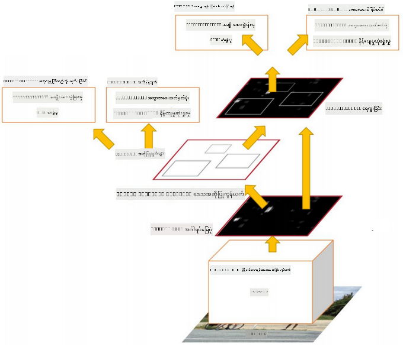
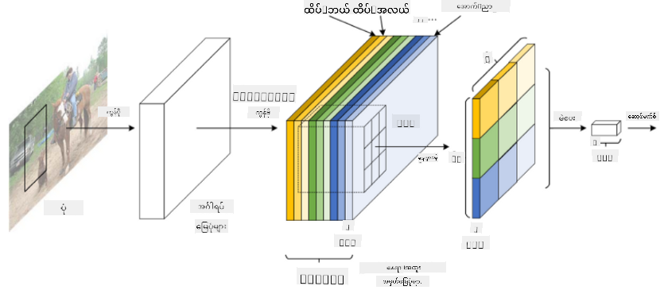

<!--
CO_OP_TRANSLATOR_METADATA:
{
  "original_hash": "d85c8b08f6d1b48fd7f35b99f93c1138",
  "translation_date": "2025-08-25T22:48:25+00:00",
  "source_file": "lessons/4-ComputerVision/11-ObjectDetection/README.md",
  "language_code": "my"
}
-->
# အရာဝတ္ထုရှာဖွေခြင်း

ယခင်က ကျွန်ုပ်တို့ handling လုပ်ခဲ့သော ပုံရိပ်အမျိုးအစားခွဲခြားမှုမော်ဒယ်များသည် ပုံရိပ်တစ်ခုကိုယူပြီး MNIST ပြဿနာတွင် 'number' အတန်းလိုမျိုး အမျိုးအစားရလဒ်တစ်ခုကိုထုတ်ပေးသည်။ သို့သော် အများသောအားဖြင့် ပုံရိပ်တွင် အရာဝတ္ထုများပါဝင်သည်ကိုသာမက၊ ၎င်းတို့၏တိကျသောတည်နေရာကိုသိလိုသည်။ **အရာဝတ္ထုရှာဖွေခြင်း**၏အဓိကရည်ရွယ်ချက်မှာ အတိအကျတည်နေရာကိုသတ်မှတ်နိုင်ရန်ဖြစ်သည်။

## [Pre-lecture quiz](https://ff-quizzes.netlify.app/en/ai/quiz/21)

> ပုံရိပ် [YOLO v2 web site](https://pjreddie.com/darknet/yolov2/) မှ

## အရာဝတ္ထုရှာဖွေခြင်းအတွက် ရိုးရိုးရှင်းရှင်းနည်းလမ်း

ပုံရိပ်တစ်ခုတွင် ကြောင်ကိုရှာဖွေလိုသည်ဟုယူဆပါက၊ အရာဝတ္ထုရှာဖွေခြင်းအတွက် ရိုးရိုးရှင်းရှင်းနည်းလမ်းမှာ အောက်ပါအတိုင်းဖြစ်နိုင်သည်-

1. ပုံရိပ်ကို အပိုင်းအခြားများအဖြစ်ခွဲခြားပါ။
2. တစ်ခုချင်းစီအပေါ် ပုံရိပ်အမျိုးအစားခွဲခြားမှုကို run လုပ်ပါ။
3. activation အဆင့်မြင့်သော အပိုင်းများကို အဆိုပါအရာဝတ္ထုပါဝင်သည်ဟုယူဆနိုင်သည်။

> *ပုံရိပ် [Exercise Notebook](../../../../../lessons/4-ComputerVision/11-ObjectDetection/ObjectDetection-TF.ipynb) မှ*

သို့သော်၊ ဤနည်းလမ်းသည် အလွန်မကျွမ်းကျင်သောနည်းလမ်းဖြစ်ပြီး အရာဝတ္ထု၏ bounding box ကိုတိကျစွာသတ်မှတ်ရန်မလွယ်ကူပါ။ တိကျသောတည်နေရာကိုသတ်မှတ်ရန် **regression** တစ်ခုကို run လုပ်ရန်လိုအပ်ပြီး၊ ၎င်းအတွက် dataset အထူးတစ်ခုလိုအပ်သည်။

## အရာဝတ္ထုရှာဖွေခြင်းအတွက် Regression

[ဤ blog post](https://towardsdatascience.com/object-detection-with-neural-networks-a4e2c46b4491) တွင် shape detection အပေါ် gentle introduction တစ်ခုပါဝင်သည်။

## အရာဝတ္ထုရှာဖွေခြင်းအတွက် Dataset များ

ဤအလုပ်အတွက် dataset များကိုတွေ့နိုင်ပါသည်-

* [PASCAL VOC](http://host.robots.ox.ac.uk/pascal/VOC/) - 20 အတန်းများ
* [COCO](http://cocodataset.org/#home) - Common Objects in Context. 80 အတန်းများ၊ bounding boxes နှင့် segmentation masks

## အရာဝတ္ထုရှာဖွေခြင်း Metrics

### Intersection over Union

ပုံရိပ်အမျိုးအစားခွဲခြားမှုအတွက် algorithm ၏စွမ်းဆောင်ရည်ကိုတိုင်းတာရန်လွယ်ကူသော်လည်း၊ အရာဝတ္ထုရှာဖွေခြင်းတွင် အတန်း၏တိကျမှုနှင့် bounding box တည်နေရာ၏တိကျမှုကိုတိုင်းတာရန်လိုအပ်သည်။ ၎င်းအတွက် **Intersection over Union** (IoU) ကိုအသုံးပြုသည်၊ ၎င်းသည် box နှစ်ခု (သို့မဟုတ် arbitrary areas နှစ်ခု) overlap ဖြစ်မှုကိုတိုင်းတာသည်။

> *ပုံရိပ် [IoU အပေါ် blog post](https://pyimagesearch.com/2016/11/07/intersection-over-union-iou-for-object-detection/) မှ*

အဓိကအကြောင်းအရာမှာ ရှုထောင့်နှစ်ခု၏ intersection ကို union ဖြင့်စား၍ IoU ကိုရရှိသည်။ identical areas အတွက် IoU သည် 1 ဖြစ်ပြီး၊ completely disjointed areas အတွက် 0 ဖြစ်သည်။ အခြားသောအခြေအနေများတွင် 0 မှ 1 အတွင်းရှိသည်။ IoU သတ်မှတ်ချက်တစ်ခုအထက်ရှိ bounding boxes များကိုသာယူဆပါသည်။

### Average Precision

အတန်း $C$ တစ်ခုကိုဘယ်လောက်ကောင်းကောင်းသိရှိနိုင်သည်ကိုတိုင်းတာလိုပါက **Average Precision** metrics ကိုအသုံးပြုသည်၊ ၎င်းကိုအောက်ပါအတိုင်းတွက်ချက်သည်-

1. Precision-Recall curve သည် detection threshold value (0 မှ 1) အပေါ်တွင်တိကျမှုကိုပြသည်။
2. Threshold အပေါ်မူတည်၍ ပုံရိပ်တွင် detection object များနှင့် precision နှင့် recall တန်ဖိုးများကိုရရှိသည်။
3. Curve သည် အောက်ပါပုံစံဖြစ်သည်-

> *ပုံရိပ် [NeuroWorkshop](http://github.com/shwars/NeuroWorkshop) မှ*

အတန်း $C$ အတွက် Average Precision သည် curve အောက်ရှိဧရိယာဖြစ်သည်။ Recall axis ကို 10 အပိုင်းခွဲပြီး Precision ကိုအပိုင်းများအားလုံးတွင်ပျမ်းမျှတွက်ချက်သည်-

$$
AP = {1\over11}\sum_{i=0}^{10}\mbox{Precision}(\mbox{Recall}={i\over10})
$$

### AP နှင့် IoU

IoU သတ်မှတ်ချက်တစ်ခုအထက်ရှိ detection များကိုသာယူဆပါသည်။ ဥပမာ၊ PASCAL VOC dataset တွင် $\mbox{IoU Threshold} = 0.5$ ကိုယူဆပြီး၊ COCO တွင် AP ကို $\mbox{IoU Threshold}$ တန်ဖိုးများအတွက်တိုင်းတာသည်။

> *ပုံရိပ် [NeuroWorkshop](http://github.com/shwars/NeuroWorkshop) မှ*

### Mean Average Precision - mAP

အရာဝတ္ထုရှာဖွေခြင်းအတွက် အဓိက metric သည် **Mean Average Precision** (mAP) ဖြစ်သည်။ ၎င်းသည် Average Precision တန်ဖိုးကို အတန်းအားလုံးနှင့် $\mbox{IoU Threshold}$ အပေါ်ပျမ်းမျှတွက်ချက်ထားသောတန်ဖိုးဖြစ်သည်။ **mAP** တွက်ချက်မှုလုပ်ငန်းစဉ်ကို [ဤ blog post](https://medium.com/@timothycarlen/understanding-the-map-evaluation-metric-for-object-detection-a07fe6962cf3) တွင်အသေးစိတ်ဖော်ပြထားပြီး၊ [code samples](https://gist.github.com/tarlen5/008809c3decf19313de216b9208f3734) တွင်လည်းပါဝင်သည်။

## အရာဝတ္ထုရှာဖွေခြင်းနည်းလမ်းများ

အရာဝတ္ထုရှာဖွေခြင်း algorithm များကို အောက်ပါ broad classes နှစ်ခုအဖြစ်ခွဲခြားနိုင်သည်-

* **Region Proposal Networks** (R-CNN, Fast R-CNN, Faster R-CNN) - အဓိကအကြောင်းအရာမှာ **Regions of Interests** (ROI) များကို generate လုပ်ပြီး CNN ကို run လုပ်ခြင်းဖြစ်သည်။ ဤနည်းလမ်းသည် ရိုးရိုးနည်းလမ်းနှင့်ဆင်တူသော်လည်း ROI များကိုပိုကျွမ်းကျင်စွာ generate လုပ်သည်။ drawback အဓိကမှာ CNN classifier ကို image အပေါ် pass များစွာ run လုပ်ရန်လိုအပ်သောကြောင့် နှေးကွေးသည်။
* **One-pass** (YOLO, SSD, RetinaNet) methods - ဤ architecture များတွင် network ကို class နှင့် ROI များကို pass တစ်ခုတည်းတွင် predict လုပ်ရန် design လုပ်ထားသည်။

### R-CNN: Region-Based CNN

[R-CNN](http://islab.ulsan.ac.kr/files/announcement/513/rcnn_pami.pdf) သည် [Selective Search](http://www.huppelen.nl/publications/selectiveSearchDraft.pdf) ကိုအသုံးပြု၍ ROI regions များ၏ hierarchical structure ကို generate လုပ်ပြီး၊ CNN feature extractors နှင့် SVM-classifiers ကိုအသုံးပြု၍ object class ကိုသတ်မှတ်သည်။ linear regression ကို bounding box coordinates ကိုသတ်မှတ်ရန်အသုံးပြုသည်။ [Official Paper](https://arxiv.org/pdf/1506.01497v1.pdf)

> *ပုံရိပ် van de Sande et al. ICCV’11*

> *ပုံရိပ် [ဤ blog](https://towardsdatascience.com/r-cnn-fast-r-cnn-faster-r-cnn-yolo-object-detection-algorithms-36d53571365e) မှ*

### F-RCNN - Fast R-CNN

ဤနည်းလမ်းသည် R-CNN နှင့်ဆင်တူသော်လည်း convolution layers apply လုပ်ပြီးနောက် regions များကိုသတ်မှတ်သည်။

> ပုံရိပ် [Official Paper](https://www.cv-foundation.org/openaccess/content_iccv_2015/papers/Girshick_Fast_R-CNN_ICCV_2015_paper.pdf), [arXiv](https://arxiv.org/pdf/1504.08083.pdf), 2015

### Faster R-CNN

ဤနည်းလမ်း၏အဓိကအကြောင်းအရာမှာ neural network ကိုအသုံးပြု၍ ROIs ကို predict လုပ်ခြင်းဖြစ်သည်။ *Region Proposal Network* ဟုခေါ်သည်။ [Paper](https://arxiv.org/pdf/1506.01497.pdf), 2016

> ပုံရိပ် [Official Paper](https://arxiv.org/pdf/1506.01497.pdf) မှ

### R-FCN: Region-Based Fully Convolutional Network

ဤ algorithm သည် Faster R-CNN ထက်ပိုမြန်သည်။ အဓိကအကြောင်းအရာမှာ-

1. ResNet-101 ကိုအသုံးပြု၍ features များကို extract လုပ်သည်။
2. Features များကို **Position-Sensitive Score Map** ဖြင့် process လုပ်သည်။ $C$ အတန်းများမှ object တစ်ခုကို $k\times k$ regions ဖြင့်ခွဲခြားပြီး၊ object parts များကို predict လုပ်ရန် training လုပ်သည်။
3. $k\times k$ regions မှ part တစ်ခုစီအတွက် network များသည် object classes အတွက် vote လုပ်ပြီး၊ အများဆုံး vote ရရှိသော object class ကိုရွေးချယ်သည်။

> ပုံရိပ် [Official Paper](https://arxiv.org/abs/1605.06409) မှ

### YOLO - You Only Look Once

YOLO သည် realtime one-pass algorithm ဖြစ်သည်။ အဓိကအကြောင်းအရာမှာ-

 * ပုံရိပ်ကို $S\times S$ regions အဖြစ်ခွဲခြားသည်။
 * Region တစ်ခုစီအတွက် **CNN** သည် $n$ အရာဝတ္ထုများ၊ *bounding box* coordinates နှင့် *confidence*=*probability* * IoU ကို predict လုပ်သည်။

 

> ပုံရိပ် [Official Paper](https://arxiv.org/abs/1506.02640) မှ

### အခြားသော Algorithm များ

* RetinaNet: [Official Paper](https://arxiv.org/abs/1708.02002)
   - [PyTorch Implementation in Torchvision](https://pytorch.org/vision/stable/_modules/torchvision/models/detection/retinanet.html)
   - [Keras Implementation](https://github.com/fizyr/keras-retinanet)
   - [Object Detection with RetinaNet](https://keras.io/examples/vision/retinanet/) in Keras Samples
* SSD (Single Shot Detector): [Official Paper](https://arxiv.org/abs/1512.02325)

## ✍️ အလုပ်များ: အရာဝတ္ထုရှာဖွေခြင်း

အောက်ပါ notebook တွင် သင်ကြားမှုကိုဆက်လက်လေ့လာပါ-

[ObjectDetection.ipynb](../../../../../lessons/4-ComputerVision/11-ObjectDetection/ObjectDetection.ipynb)

## နိဂုံး

ဤသင်ခန်းစာတွင် အရာဝတ္ထုရှာဖွေခြင်းကိုအကွာအဝေးရှိသောနည်းလမ်းများဖြင့်လေ့လာခဲ့ပါသည်။

## 🚀 စိန်ခေါ်မှု

YOLO အပေါ်ရှိဤဆောင်းပါးများနှင့် notebook များကိုဖတ်ရှုပြီး ကိုယ်တိုင်စမ်းသပ်ပါ-

* [Good blog post](https://www.analyticsvidhya.com/blog/2018/12/practical-guide-object-detection-yolo-framewor-python/) describing YOLO
 * [Official site](https://pjreddie.com/darknet/yolo/)
 * Yolo: [Keras implementation](https://github.com/experiencor/keras-yolo2), [step-by-step notebook](https://github.com/experiencor/basic-yolo-keras/blob/master/Yolo%20Step-by-Step.ipynb)
 * Yolo v2: [Keras implementation](https://github.com/experiencor/keras-yolo2), [step-by-step notebook](https://github.com/experiencor/keras-yolo2/blob/master/Yolo%20Step-by-Step.ipynb)

## [Post-lecture quiz](https://ff-quizzes.netlify.app/en/ai/quiz/22)

## Review & Self Study

* [Object Detection](https://tjmachinelearning.com/lectures/1718/obj/) by Nikhil Sardana
* [A good comparison of object detection algorithms](https://lilianweng.github.io/lil-log/2018/12/27/object-detection-part-4.html)
* [Review of Deep Learning Algorithms for Object Detection](https://medium.com/comet-app/review-of-deep-learning-algorithms-for-object-detection-c1f3d437b852)
* [A Step-by-Step Introduction to the Basic Object Detection Algorithms](https://www.analyticsvidhya.com/blog/2018/10/a-step-by-step-introduction-to-the-basic-object-detection-algorithms-part-1/)
* [Implementation of Faster R-CNN in Python for Object Detection](https://www.analyticsvidhya.com/blog/2018/11/implementation-faster-r-cnn-python-object-detection/)

## [Assignment: Object Detection](lab/README.md)

**အကြောင်းကြားချက်**:  
ဤစာရွက်စာတမ်းကို AI ဘာသာပြန်ဝန်ဆောင်မှု [Co-op Translator](https://github.com/Azure/co-op-translator) ကို အသုံးပြု၍ ဘာသာပြန်ထားပါသည်။ ကျွန်ုပ်တို့သည် တိကျမှန်ကန်မှုအတွက် ကြိုးစားနေသော်လည်း၊ အလိုအလျောက် ဘာသာပြန်မှုများတွင် အမှားများ သို့မဟုတ် မမှန်ကန်မှုများ ပါဝင်နိုင်သည်ကို သတိပြုပါ။ မူရင်းစာရွက်စာတမ်းကို ၎င်း၏ မူလဘာသာစကားဖြင့် အာဏာတရားရှိသော အရင်းအမြစ်အဖြစ် သတ်မှတ်သင့်ပါသည်။ အရေးကြီးသော အချက်အလက်များအတွက် လူက ဘာသာပြန်မှုကို အသုံးပြုရန် အကြံပြုပါသည်။ ဤဘာသာပြန်မှုကို အသုံးပြုခြင်းမှ ဖြစ်ပေါ်လာသော အလွဲအလွတ်များ သို့မဟုတ် အနားလွဲမှုများအတွက် ကျွန်ုပ်တို့သည် တာဝန်မယူပါ။