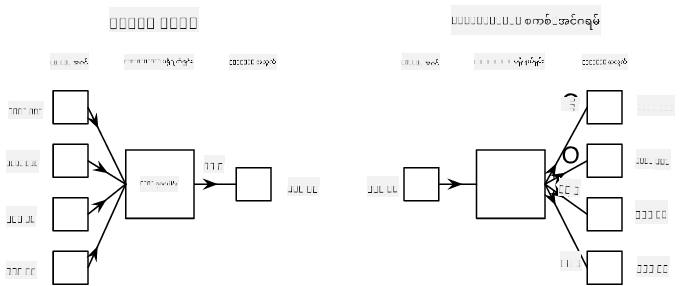

<!--
CO_OP_TRANSLATOR_METADATA:
{
  "original_hash": "31b46ba1f3aa78578134d4829f88be53",
  "translation_date": "2025-08-25T21:57:32+00:00",
  "source_file": "lessons/5-NLP/15-LanguageModeling/README.md",
  "language_code": "my"
}
-->
# ဘာသာစကား မော်ဒယ်ဖွဲ့စည်းခြင်း

Semantic embeddings (ဥပမာ - Word2Vec နှင့် GloVe) ဆိုသည်မှာ **ဘာသာစကား မော်ဒယ်ဖွဲ့စည်းခြင်း** (language modeling) သို့ ရောက်ရှိရန် ပထမအဆင့်ဖြစ်သည်။ ၎င်းသည် ဘာသာစကား၏ သဘာဝကို *နားလည်* (သို့မဟုတ် *တင်ပြ*) နိုင်သော မော်ဒယ်များ ဖန်တီးရန် ရည်ရွယ်သည်။

## [Pre-lecture quiz](https://ff-quizzes.netlify.app/en/ai/quiz/29)

ဘာသာစကား မော်ဒယ်ဖွဲ့စည်းခြင်း၏ အဓိက အကြောင်းအရာမှာ အမှတ်အသားမပါသော ဒေတာများကို unsupervised နည်းလမ်းဖြင့် လေ့ကျင့်ခြင်းဖြစ်သည်။ ၎င်းသည် အရေးကြီးသည်မှာ အမှတ်အသားမပါသော စာသားများမှာ အလွန်များပြားစွာ ရရှိနိုင်သော်လည်း အမှတ်အသားပါသော စာသားများမှာ အမှတ်အသားပေးရန် လိုအပ်သော ကြိုးစားမှုကြောင့် အကန့်အသတ်ရှိလိမ့်မည်ဖြစ်သည်။ အများအားဖြင့်, စာသားအတွင်း **ပျောက်နေသော စကားလုံးများကို ခန့်မှန်းနိုင်သော** ဘာသာစကား မော်ဒယ်များကို ဖန်တီးနိုင်သည်။ ၎င်းသည် စာသားအတွင်းရှိ စကားလုံးတစ်လုံးကို မည်သည့်အချိန်မဆို ဖျောက်ထားပြီး ၎င်းကို လေ့ကျင့်မှု နမူနာအဖြစ် အသုံးပြုနိုင်သောကြောင့် လွယ်ကူသည်။

## Embeddings များကို လေ့ကျင့်ခြင်း

ယခင် ဥပမာများတွင်, pre-trained semantic embeddings များကို အသုံးပြုခဲ့သည်။ သို့သော်, ၎င်းတို့ကို မည်သို့ လေ့ကျင့်နိုင်သည်ကို ကြည့်ရှုခြင်းမှာ စိတ်ဝင်စားဖွယ် ဖြစ်သည်။ အောက်ပါ အကြံဉာဏ်အချို့ကို အသုံးပြုနိုင်သည် -

* **N-Gram** ဘာသာစကား မော်ဒယ်ဖွဲ့စည်းခြင်း - N-gram အရ, ယခင် N စကားလုံးများကို ကြည့်ပြီး token တစ်ခုကို ခန့်မှန်းခြင်း။
* **Continuous Bag-of-Words** (CBoW) - စကားလုံးအစုအနယ် $W_{-N}$, ..., $W_N$ အတွင်းမှ အလယ်တန်း token $W_0$ ကို ခန့်မှန်းခြင်း။
* **Skip-gram** - အလယ်တန်း token $W_0$ မှ စတင်ကာ အနီးအနားရှိ စကားလုံးများ {$W_{-N},\dots, W_{-1}, W_1,\dots, W_N$} ကို ခန့်မှန်းခြင်း။

> [ဤစာတမ်း](https://arxiv.org/pdf/1301.3781.pdf) မှ ရယူထားသော ပုံ။

## ✍️ နမူနာ Notebooks: CBoW မော်ဒယ်ကို လေ့ကျင့်ခြင်း

အောက်ပါ notebooks များတွင် သင့်လေ့လာမှုကို ဆက်လက်လုပ်ဆောင်ပါ -

* [TensorFlow ဖြင့် CBoW Word2Vec ကို လေ့ကျင့်ခြင်း](../../../../../lessons/5-NLP/15-LanguageModeling/CBoW-TF.ipynb)
* [PyTorch ဖြင့် CBoW Word2Vec ကို လေ့ကျင့်ခြင်း](../../../../../lessons/5-NLP/15-LanguageModeling/CBoW-PyTorch.ipynb)

## နိဂုံးချုပ်

ယခင် သင်ခန်းစာတွင်, စကားလုံး embeddings များသည် မျက်လှည့်ကဲ့သို့ အလုပ်လုပ်သည်ကို မြင်ခဲ့ပါသည်။ ယခု, စကားလုံး embeddings များကို လေ့ကျင့်ခြင်းသည် အလွန်ရှုပ်ထွေးသော အလုပ်မဟုတ်ကြောင်း သိရှိပြီး, လိုအပ်ပါက domain-specific စာသားများအတွက် ကိုယ်ပိုင် စကားလုံး embeddings များကို လေ့ကျင့်နိုင်မည်ဖြစ်သည်။

## [Post-lecture quiz](https://ff-quizzes.netlify.app/en/ai/quiz/30)

## ပြန်လည်ဆန်းစစ်ခြင်းနှင့် ကိုယ်တိုင်လေ့လာမှု

* [PyTorch ၏ ဘာသာစကား မော်ဒယ်ဖွဲ့စည်းခြင်းအတွက် တရားဝင် သင်ခန်းစာ](https://pytorch.org/tutorials/beginner/nlp/word_embeddings_tutorial.html)။
* [Word2Vec မော်ဒယ်ကို လေ့ကျင့်ခြင်းအတွက် TensorFlow ၏ တရားဝင် သင်ခန်းစာ](https://www.TensorFlow.org/tutorials/text/word2vec)။
* **gensim** framework ကို အသုံးပြု၍ အများဆုံး အသုံးပြုသော embeddings များကို အချို့သော ကုဒ်လိုင်းများဖြင့် လေ့ကျင့်ခြင်းကို [ဤစာတမ်း](https://pytorch.org/tutorials/beginner/nlp/word_embeddings_tutorial.html) တွင် ဖော်ပြထားသည်။

## 🚀 [တာဝန်: Skip-Gram မော်ဒယ်ကို လေ့ကျင့်ပါ](lab/README.md)

ဤသင်ခန်းစာမှ ကုဒ်ကို ပြင်ဆင်ပြီး Skip-Gram မော်ဒယ်ကို လေ့ကျင့်ရန် စိန်ခေါ်မှုကို lab တွင် ပြုလုပ်ပါ။ [အသေးစိတ်ဖတ်ရှုရန်](lab/README.md)

**အကြောင်းကြားချက်**:  
ဤစာရွက်စာတမ်းကို AI ဘာသာပြန်ဝန်ဆောင်မှု [Co-op Translator](https://github.com/Azure/co-op-translator) ကို အသုံးပြု၍ ဘာသာပြန်ထားပါသည်။ ကျွန်ုပ်တို့သည် တိကျမှန်ကန်မှုအတွက် ကြိုးစားနေသော်လည်း၊ အလိုအလျောက် ဘာသာပြန်မှုများတွင် အမှားများ သို့မဟုတ် မမှန်ကန်မှုများ ပါဝင်နိုင်သည်ကို သတိပြုပါ။ မူရင်းစာရွက်စာတမ်းကို ၎င်း၏ မူလဘာသာစကားဖြင့် အာဏာရှိသောအရင်းအမြစ်အဖြစ် ရှုလေ့လာသင့်ပါသည်။ အရေးကြီးသော အချက်အလက်များအတွက် လူ့ဘာသာပြန်ပညာရှင်များမှ ပရော်ဖက်ရှင်နယ် ဘာသာပြန်မှုကို အကြံပြုပါသည်။ ဤဘာသာပြန်မှုကို အသုံးပြုခြင်းမှ ဖြစ်ပေါ်လာသော အလွဲအလွတ်များ သို့မဟုတ် အနားလွဲမှုများအတွက် ကျွန်ုပ်တို့သည် တာဝန်မယူပါ။