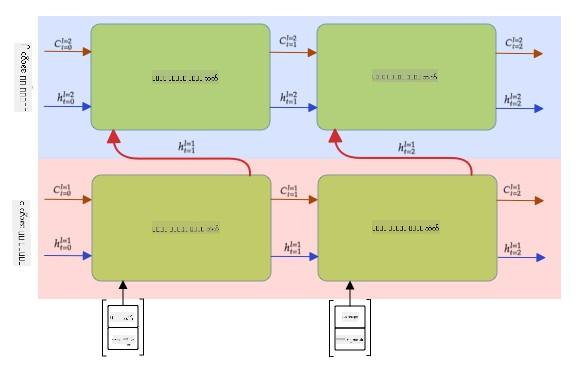

<!--
CO_OP_TRANSLATOR_METADATA:
{
  "original_hash": "58bf4adb210aab53e8f78c8082040e7c",
  "translation_date": "2025-08-25T21:36:05+00:00",
  "source_file": "lessons/5-NLP/16-RNN/README.md",
  "language_code": "my"
}
-->
# ပြန်လည်ထပ်မံလုပ်ဆောင်သော နယူးရယ်နက်ဝက်များ

## [မစခင် စစ်ဆေးမေးခွန်း](https://ff-quizzes.netlify.app/en/ai/quiz/31)

ယခင်ပိုင်းတွင် ကျွန်ုပ်တို့သည် စာသားများ၏ အဓိပ္ပာယ်ကို ဖော်ပြနိုင်သော အထူးသက်ရောက်မှုရှိသော ကိုယ်စားပြုမှုများနှင့် အထက်တွင် ရိုးရှင်းသော လိုင်းနီယာ ခွဲခြားစနစ်ကို အသုံးပြုခဲ့ပါသည်။ ဤစနစ်သည် စာကြောင်းတစ်ကြောင်းအတွင်းရှိ စကားလုံးများ၏ စုပေါင်းအဓိပ္ပာယ်ကို ဖမ်းယူနိုင်သော်လည်း စကားလုံးများ၏ **အစီအစဉ်** ကို မထည့်သွင်းစဉ်းစားပါ၊ အကြောင်းမှာ ကိုယ်စားပြုမှုများအပေါ် စုပေါင်းလုပ်ဆောင်မှုသည် မူလစာသားမှ ဤအချက်အလက်ကို ဖယ်ရှားလိုက်သောကြောင့် ဖြစ်သည်။ ထို့ကြောင့် ဤမော်ဒယ်များသည် စကားလုံးအစီအစဉ်ကို မဖော်ပြနိုင်သဖြင့် စာသားထုတ်လုပ်ခြင်း သို့မဟုတ် မေးခွန်းဖြေဆိုခြင်းကဲ့သို့သော ရှုပ်ထွေးသော အလုပ်များကို မဖြေရှင်းနိုင်ပါ။

စာသားအစီအစဉ်၏ အဓိပ္ပာယ်ကို ဖမ်းယူရန် ကျွန်ုပ်တို့သည် **ပြန်လည်ထပ်မံလုပ်ဆောင်သော နယူးရယ်နက်ဝက်** (Recurrent Neural Network) ဟုခေါ်သော နောက်ထပ် နယူးရယ်နက်ဝက် စနစ်ကို အသုံးပြုရမည်ဖြစ်သည်။ RNN တွင် ကျွန်ုပ်တို့၏ စာကြောင်းကို နက်ဝက်မှတစ်ဆင့် သင်္ကေတတစ်ခုစီဖြင့် ဖြတ်သွားပြီး နက်ဝက်သည် **အခြေအနေ** တစ်ခုကို ထုတ်လုပ်သည်၊ ထို့နောက် နောက်ထပ် သင်္ကေတနှင့်အတူ ထိုအခြေအနေကို နက်ဝက်ထဲသို့ ပြန်လည်ထည့်သွင်းသည်။

> ပုံ - စာရေးသူမှ

အထက်ပါအတိုင်း အထောက်အထားအဖြစ် X0,...,Xn သင်္ကေတများ၏ အစီအစဉ်ကို ပေးထားပါက RNN သည် နယူးရယ်နက်ဝက် ဘလော့များ၏ အစီအစဉ်ကို ဖန်တီးပြီး backpropagation ဖြင့် အဆုံးမှ အစအထိ သင်ကြားပေးသည်။ နက်ဝက်ဘလော့တစ်ခုစီသည် (Xi,Si) ကို အထောက်အထားအဖြစ်ယူပြီး Si+1 ကို ရလဒ်အဖြစ် ထုတ်ပေးသည်။ နောက်ဆုံးအခြေအနေ Sn သို့မဟုတ် (ထွက်ရလဒ် Yn) ကို လိုင်းနီယာ ခွဲခြားစနစ်ထဲသို့ ထည့်သွင်းပြီး ရလဒ်ကို ထုတ်ပေးသည်။ နက်ဝက်ဘလော့များအားလုံးသည် တူညီသော အလေးချိန်များကို မျှဝေထားပြီး backpropagation တစ်ကြိမ်ဖြင့် အဆုံးမှ အစအထိ သင်ကြားပေးသည်။

အခြေအနေဗက်တာများ S0,...,Sn ကို နက်ဝက်မှတစ်ဆင့် ဖြတ်သွားသောကြောင့် စကားလုံးများအကြား အစီအစဉ်ဆိုင်ရာ အချင်းချင်းပေါ်မူတည်မှုများကို သင်ယူနိုင်သည်။ ဥပမာအားဖြင့် *not* စကားလုံးသည် အစီအစဉ်တစ်ခုတွင် တစ်နေရာရာတွင် ပေါ်လာသောအခါ၊ အခြေအနေဗက်တာအတွင်းရှိ အချို့သော အချက်အလက်များကို ငြင်းဆိုရန် သင်ယူနိုင်သည်။

> ✅ အထက်ပါပုံတွင် RNN ဘလော့အားလုံး၏ အလေးချိန်များသည် မျှဝေထားသောကြောင့် ပုံတစ်ခုကို တစ်ခုတည်းသော ဘလော့ (ညာဘက်တွင်) အဖြစ် ကိုယ်စားပြုနိုင်ပြီး နက်ဝက်၏ ထွက်အခြေအနေကို နက်ဝက်ထဲသို့ ပြန်လည်ထည့်သွင်းသည့် ပြန်လည်တုံ့ပြန်မှု လှိမ့်ကြိုးဖြင့် ဖော်ပြနိုင်သည်။

## RNN ဆဲလ်၏ ဖွဲ့စည်းပုံ

ရိုးရှင်းသော RNN ဆဲလ်တစ်ခုသည် အခြေအနေ Si-1 နှင့် လက်ရှိသင်္ကေတ Xi ကို အထောက်အထားအဖြစ် လက်ခံပြီး ထွက်အခြေအနေ Si (တစ်ခါတစ်ရံတွင် ထွက်ရလဒ် Yi ကိုလည်း စိတ်ဝင်စားနိုင်သည်၊ ဥပမာအားဖြင့် ထုတ်လုပ်မှုနက်ဝက်များတွင်) ကို ထုတ်ပေးရမည်ဖြစ်သည်။

ရိုးရှင်းသော RNN ဆဲလ်တွင် အတွင်းပိုင်းတွင် အလေးချိန် မက်ထရစ်နှစ်ခုပါရှိသည် - တစ်ခုသည် အထောက်အထားသင်္ကေတကို ပြောင်းလဲရန် (W ဟုခေါ်မည်) နှင့် နောက်တစ်ခုသည် အထောက်အထားအခြေအနေကို ပြောင်းလဲရန် (H) ဖြစ်သည်။ ဤအခြေအနေတွင် နက်ဝက်၏ ထွက်ရလဒ်ကို σ(W×Xi+H×Si-1+b) အဖြစ်တွက်ချက်သည်၊ ဤတွင် σ သည် activation function ဖြစ်ပြီး b သည် ထပ်ဆင့် bias ဖြစ်သည်။

> ပုံ - စာရေးသူမှ

အများအားဖြင့် အထောက်အထားသင်္ကေတများကို RNN ထဲသို့ ဝင်ရောက်မည့်အခါ dimensionality ကို လျှော့ချရန် embedding layer မှတစ်ဆင့် ဖြတ်သွားသည်။ ဤအခြေအနေတွင် အထောက်အထားဗက်တာ၏ dimension ကို *emb_size* ဟုခေါ်ပြီး အခြေအနေဗက်တာကို *hid_size* ဟုခေါ်ပါက W ၏ အရွယ်အစားသည် *emb_size*×*hid_size* ဖြစ်ပြီး H ၏ အရွယ်အစားသည် *hid_size*×*hid_size* ဖြစ်သည်။

## Long Short Term Memory (LSTM)

ရိုးရှင်းသော RNN များ၏ အဓိကပြဿနာတစ်ခုမှာ **vanishing gradients** ပြဿနာဖြစ်သည်။ RNN များသည် backpropagation တစ်ကြိမ်ဖြင့် အဆုံးမှ အစအထိ သင်ကြားသောကြောင့် error ကို နက်ဝက်၏ ပထမဆုံးအလွှာများသို့ ပြန်လည်ပို့ရန် အခက်အခဲရှိပြီး အကွာအဝေးရှိသော သင်္ကေတများအကြား ဆက်နွယ်မှုများကို သင်ယူ၍ မရနိုင်ပါ။ ဤပြဿနာကို ရှောင်ရှားရန် နည်းလမ်းတစ်ခုမှာ **explicit state management** ကို **gates** ဟုခေါ်သော နည်းလမ်းဖြင့် အသုံးပြုခြင်းဖြစ်သည်။ ဤအမျိုးအစားတွင် နာမည်ကြီးသော architecture နှစ်ခုရှိသည် - **Long Short Term Memory** (LSTM) နှင့် **Gated Relay Unit** (GRU) ဖြစ်သည်။

> ပုံရင်းအရင်းအမြစ် TBD

LSTM နက်ဝက်သည် RNN နှင့် ဆင်တူစီစဉ်ထားသော်လည်း အလွှာတစ်ခုမှ အလွှာတစ်ခုသို့ **state C** နှင့် **hidden vector H** ဟူသော အခြေအနေနှစ်ခုကို ပေးပို့သည်။ Unit တစ်ခုစီတွင် hidden vector Hi ကို input Xi နှင့် ပေါင်းစပ်ပြီး **gates** များမှတစ်ဆင့် state C တွင် ဖြစ်ပေါ်သည့်အရာများကို ထိန်းချုပ်သည်။ Gate တစ်ခုစီသည် sigmoid activation (output [0,1] အတွင်းရှိ) ပါသော နယူးရယ်နက်ဖြစ်ပြီး state vector နှင့် များစွာသော bitwise mask အဖြစ် သတ်မှတ်နိုင်သည်။ 

Gate များမှာ (ပုံတွင် ဘယ်မှညာသို့) -

* **Forget gate** သည် hidden vector ကိုယူပြီး state C ၏ အချို့သော components ကို မေ့ရန်နှင့် ဖြတ်သွားရန် ဆုံးဖြတ်သည်။
* **Input gate** သည် input နှင့် hidden vector များမှ အချက်အလက်အချို့ကို state ထဲသို့ ထည့်သွင်းသည်။
* **Output gate** သည် state ကို linear layer နှင့် *tanh* activation ဖြင့် ပြောင်းလဲပြီး hidden vector Hi ကို အသုံးပြု၍ state အသစ် Ci+1 ကို ထုတ်ပေးသည်။

State C ၏ components များကို flag များအဖြစ် သတ်မှတ်နိုင်သည်။ ဥပမာအားဖြင့် *Alice* ဟူသော နာမည်ကို စာကြောင်းတွင် တွေ့သောအခါ၊ ထိုနာမည်သည် အမျိုးသမီးကို ကိုယ်စားပြုသည်ဟု သတ်မှတ်ပြီး state တွင် အမျိုးသမီးနာမဝိသေသနရှိကြောင်း flag ကို မြှင့်တင်နိုင်သည်။ 

> ✅ LSTM ၏ အတွင်းပိုင်းကို နားလည်ရန် Christopher Olah ၏ [Understanding LSTM Networks](https://colah.github.io/posts/2015-08-Understanding-LSTMs/) သည် အလွန်ကောင်းမွန်သော အရင်းအမြစ်တစ်ခုဖြစ်သည်။

## Bidirectional နှင့် Multilayer RNN များ

ကျွန်ုပ်တို့သည် အစီအစဉ်၏ အစမှ အဆုံးသို့ တစ်ဦးတည်းသော ဦးတည်ချက်ဖြင့် လည်ပတ်သော RNN များကို ဆွေးနွေးခဲ့ပါသည်။ ၎င်းသည် ကျွန်ုပ်တို့ စာဖတ်ခြင်းနှင့် စကားနားထောင်ခြင်း၏ သဘာဝနှင့် ဆင်တူသောကြောင့် သဘာဝကျသည်။ သို့သော် အများအပြား လက်တွေ့အခြေအနေများတွင် input အစီအစဉ်ကို အလွတ်ရယူနိုင်သောကြောင့် အစီအစဉ်၏ နှစ်ဦးတည်းသော ဦးတည်ချက်များဖြင့် လည်ပတ်သော RNN များကို အသုံးပြုရန် make sense ဖြစ်သည်။ ၎င်းတို့ကို **bidirectional RNNs** ဟုခေါ်သည်။ Bidirectional network ကို ကိုင်တွယ်သောအခါ ဦးတည်ချက်တစ်ခုစီအတွက် hidden state vector နှစ်ခုလိုအပ်မည်ဖြစ်သည်။

Recurrent network တစ်ခုသည် အစီအစဉ်အတွင်းရှိ အချို့သော ပုံစံများကို ဖမ်းယူပြီး state vector သို့မဟုတ် output သို့ ပေးပို့နိုင်သည်။ Convolutional network များနှင့်တူပင်၊ ပထမဆုံးအလွှာမှ ထုတ်ယူထားသော အနိမ့်အဆင့်ပုံစံများကို အသုံးပြု၍ အဆင့်မြင့်ပုံစံများကို ဖမ်းယူရန် ပထမအလွှာအပေါ်တွင် နောက်ထပ် recurrent layer တစ်ခုတည်ဆောက်နိုင်သည်။ ၎င်းသည် **multi-layer RNN** ၏ အယူအဆသို့ ဦးတည်စေပြီး ၎င်းသည် recurrent networks နှစ်ခု သို့မဟုတ် ထို့ထက်ပိုသော networks ဖြင့် ဖွဲ့စည်းထားပြီး ယခင်အလွှာ၏ output ကို နောက်တစ်လွှာ၏ input အဖြစ် ပေးပို့သည်။

*ပုံ - Fernando López ၏ [ဤအံ့သြဖွယ် post](https://towardsdatascience.com/from-a-lstm-cell-to-a-multilayer-lstm-network-with-pytorch-2899eb5696f3) မှ*

## ✍️ လေ့ကျင့်မှုများ: Embeddings

အောက်ပါ notebooks များတွင် သင်ကြားမှုကို ဆက်လက်လုပ်ဆောင်ပါ -

* [RNNs with PyTorch](../../../../../lessons/5-NLP/16-RNN/RNNPyTorch.ipynb)
* [RNNs with TensorFlow](../../../../../lessons/5-NLP/16-RNN/RNNTF.ipynb)

## နိဂုံးချုပ်

ဤယူနစ်တွင် RNN များကို အစီအစဉ်ခွဲခြားမှုအတွက် အသုံးပြုနိုင်ကြောင်း မြင်တွေ့ခဲ့ပြီး၊ အမှန်တကယ်၌ ၎င်းတို့သည် စာသားထုတ်လုပ်ခြင်း၊ စက်ဘာသာပြန်ခြင်းနှင့် အခြားအလုပ်များစွာကိုလည်း ကိုင်တွယ်နိုင်သည်။ ၎င်းတို့ကို နောက်ယူနစ်တွင် ဆွေးနွေးမည်ဖြစ်သည်။

## 🚀 စိန်ခေါ်မှု

LSTM များနှင့် ၎င်းတို့၏ လက်တွေ့အသုံးချမှုများအကြောင်း စာတမ်းအချို့ကို ဖတ်ရှုပါ -

- [Grid Long Short-Term Memory](https://arxiv.org/pdf/1507.01526v1.pdf)
- [Show, Attend and Tell: Neural Image Caption Generation with Visual Attention](https://arxiv.org/pdf/1502.03044v2.pdf)

## [မပြီးဆုံးမေးခွန်း](https://ff-quizzes.netlify.app/en/ai/quiz/32)

## ပြန်လည်သုံးသပ်ခြင်းနှင့် ကိုယ်တိုင်လေ့လာခြင်း

- Christopher Olah ၏ [Understanding LSTM Networks](https://colah.github.io/posts/2015-08-Understanding-LSTMs/)

## [အလုပ်ပေးစာ: Notebooks](assignment.md)

**ဝက်ဘ်ဆိုက်မှတ်ချက်**:  
ဤစာရွက်စာတမ်းကို AI ဘာသာပြန်ဝန်ဆောင်မှု [Co-op Translator](https://github.com/Azure/co-op-translator) ကို အသုံးပြု၍ ဘာသာပြန်ထားပါသည်။ ကျွန်ုပ်တို့သည် တိကျမှန်ကန်မှုအတွက် ကြိုးစားနေသော်လည်း၊ အလိုအလျောက်ဘာသာပြန်ခြင်းတွင် အမှားများ သို့မဟုတ် မမှန်ကန်မှုများ ပါဝင်နိုင်ကြောင်း သတိပြုပါ။ မူလဘာသာစကားဖြင့် ရေးသားထားသော စာရွက်စာတမ်းကို အာဏာတည်သော ရင်းမြစ်အဖြစ် သတ်မှတ်သင့်ပါသည်။ အရေးကြီးသော အချက်အလက်များအတွက် လူ့ဘာသာပြန်ပညာရှင်များကို အသုံးပြုရန် အကြံပြုပါသည်။ ဤဘာသာပြန်ကို အသုံးပြုခြင်းမှ ဖြစ်ပေါ်လာသော နားလည်မှုမှားများ သို့မဟုတ် အဓိပ္ပာယ်မှားများအတွက် ကျွန်ုပ်တို့သည် တာဝန်မယူပါ။