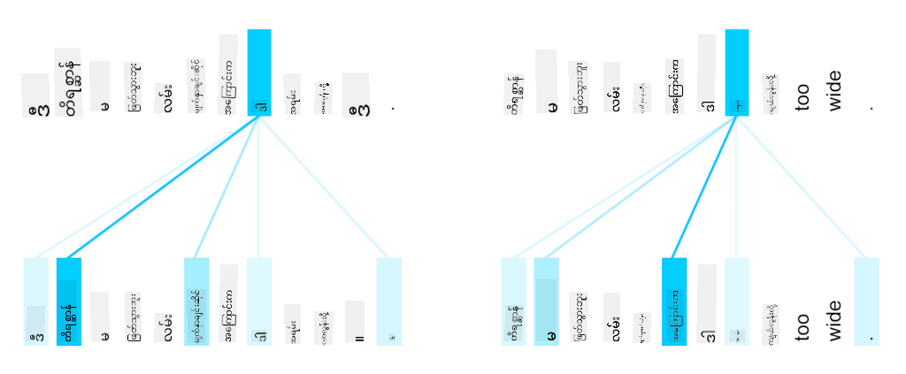

<!--
CO_OP_TRANSLATOR_METADATA:
{
  "original_hash": "7e617f0b8de85a43957a853aba09bfeb",
  "translation_date": "2025-08-25T22:04:27+00:00",
  "source_file": "lessons/5-NLP/18-Transformers/README.md",
  "language_code": "my"
}
-->
# အာရုံစိုက်မှု Mechanisms နှင့် Transformers

## [Pre-lecture quiz](https://ff-quizzes.netlify.app/en/ai/quiz/35)

NLP နယ်ပယ်တွင် အရေးကြီးဆုံးပြဿနာများထဲမှ တစ်ခုက **စက်ဖြင့်ဘာသာပြန်ခြင်း** ဖြစ်ပြီး၊ Google Translate ကဲ့သို့သော tools များ၏ အခြေခံအလုပ်ဖြစ်သည်။ ဒီအပိုင်းမှာ ကျွန်တော်တို့ **စက်ဖြင့်ဘာသာပြန်ခြင်း** (သို့မဟုတ် **sequence-to-sequence** task) ကို အဓိကထားပြီး လေ့လာပါမည်။ 

RNNs အသုံးပြု၍ sequence-to-sequence ကို **encoder** နှင့် **decoder** ဆိုသော recurrent networks နှစ်ခုဖြင့် အကောင်အထည်ဖော်သည်။ Encoder က input sequence ကို hidden state အဖြစ်သို့ ပြောင်းလဲပြီး၊ Decoder က hidden state ကို ပြန်လည်ဖော်ထုတ်ကာ ဘာသာပြန်ရလဒ်ကို ထုတ်ပေးသည်။ ဒီနည်းလမ်းမှာ အချို့ပြဿနာများရှိသည်-

* Encoder network ၏ နောက်ဆုံး state က စာကြောင်းအစကို မှတ်မိရန် အခက်အခဲရှိပြီး၊ အရှည်ကြီးသော စာကြောင်းများအတွက် မော်ဒယ်အရည်အသွေးကို ကျဆင်းစေသည်။
* Sequence ထဲရှိ စကားလုံးအားလုံးသည် ရလဒ်အပေါ် တူညီသော သက်ရောက်မှုရှိသည်။ သို့သော် အမှန်တကယ်မှာ input sequence ထဲရှိ အချို့သော စကားလုံးများသည် အခြားစကားလုံးများထက် output အပေါ် သက်ရောက်မှုပိုရှိသည်။

**Attention Mechanisms** သည် RNN ၏ output prediction တစ်ခုစီအပေါ် input vector တစ်ခုစီ၏ context သက်ရောက်မှုကို အလေးပေးနိုင်စေသော နည်းလမ်းတစ်ခုဖြစ်သည်။ ဒီနည်းလမ်းကို input RNN ၏ intermediate states နှင့် output RNN အကြား shortcut များဖန်တီးခြင်းဖြင့် အကောင်အထည်ဖော်သည်။ ထို့ကြောင့် output symbol yt ကို ဖန်တီးသောအခါ input hidden states hi အားလုံးကို အလေးပေး coefficient များ αt,i ဖြင့် ထည့်သွင်းစဉ်းစားမည်။

> Encoder-decoder model with additive attention mechanism in [Bahdanau et al., 2015](https://arxiv.org/pdf/1409.0473.pdf), cited from [this blog post](https://lilianweng.github.io/lil-log/2018/06/24/attention-attention.html)

Attention matrix {αi,j} သည် output sequence ထဲရှိ စကားလုံးတစ်ခုကို ဖန်တီးရာတွင် input စကားလုံးတစ်ခု၏ သက်ရောက်မှုကို ကိုယ်စားပြုသည်။ အောက်တွင် matrix ၏ ဥပမာတစ်ခုကို ဖော်ပြထားသည်-

> Figure from [Bahdanau et al., 2015](https://arxiv.org/pdf/1409.0473.pdf) (Fig.3)

Attention mechanisms သည် NLP တွင် လက်ရှိ state-of-the-art မော်ဒယ်များ၏ အခြေခံဖြစ်သည်။ သို့သော် attention ကို ထည့်သွင်းခြင်းသည် မော်ဒယ် parameters အရေအတွက်ကို တိုးစေပြီး RNNs တွင် scaling ပြဿနာများကို ဖြစ်စေသည်။ RNNs ၏ key constraint တစ်ခုမှာ recurrent nature ဖြစ်ပြီး training ကို batch နှင့် parallelize လုပ်ရန် အခက်အခဲဖြစ်စေသည်။ Sequence ထဲရှိ element တစ်ခုစီကို အစဉ်လိုက် process လုပ်ရမည်ဖြစ်သောကြောင့် parallelize လုပ်ရန် မလွယ်ကူပါ။

> Figure from [Google's Blog](https://research.googleblog.com/2016/09/a-neural-network-for-machine.html)

Attention mechanisms ကို အသုံးပြုခြင်းနှင့် အထက်ပါ constraint တစ်ခုကြောင့် ယနေ့ကျွန်တော်တို့အသုံးပြုနေသော BERT နှင့် Open-GPT3 ကဲ့သို့သော state-of-the-art Transformer Models များကို ဖန်တီးခဲ့သည်။

## Transformer models

Transformers ၏ အဓိကအယူအဆတစ်ခုမှာ RNNs ၏ sequential nature ကို ရှောင်ရှားပြီး training အတွင်း parallelize လုပ်နိုင်သော မော်ဒယ်တစ်ခုကို ဖန်တီးရန်ဖြစ်သည်။ ဒါကို အောက်ပါအယူအဆနှစ်ခုကို အသုံးပြုခြင်းဖြင့် အကောင်အထည်ဖော်သည်-

* positional encoding
* RNNs (သို့မဟုတ် CNNs) အစား pattern များကို ဖမ်းဆီးရန် self-attention mechanism ကို အသုံးပြုခြင်း (ထို့ကြောင့် transformers ကို ဖော်ပြသော စာတမ်းကို *[Attention is all you need](https://arxiv.org/abs/1706.03762)* ဟုခေါ်သည်)

### Positional Encoding/Embedding

Positional encoding ၏ အယူအဆမှာ အောက်ပါအတိုင်းဖြစ်သည်-
1. RNNs အသုံးပြုသောအခါ token များ၏ relative position ကို steps အရေအတွက်ဖြင့် ကိုယ်စားပြုပြီး၊ ထို့ကြောင့် explicit representation မလိုအပ်ပါ။
2. သို့သော် attention ကို အသုံးပြုသောအခါ sequence အတွင်း token များ၏ relative positions ကို သိရန်လိုအပ်သည်။
3. Positional encoding ရရန် token sequence ကို sequence အတွင်း token positions (ဥပမာ- 0,1,...) sequence ဖြင့် ထပ်တိုးပါမည်။
4. ထို့နောက် token position ကို token embedding vector နှင့် ရောနှောပါမည်။ Position (integer) ကို vector အဖြစ်ပြောင်းရန် အမျိုးမျိုးသောနည်းလမ်းများကို အသုံးပြုနိုင်သည်-

* Token embedding ကဲ့သို့ trainable embedding ကို အသုံးပြုခြင်း။ ဒီနည်းလမ်းကို ဒီမှာ စဉ်းစားပါမည်။ Token နှင့် position နှစ်ခုစလုံးအပေါ် embedding layers ကို အသုံးပြုကာ၊ အတိုင်းအတာတူညီသော embedding vectors ကို ရရှိပြီး၊ ထို့နောက် vectors နှစ်ခုကို ပေါင်းစပ်ပါမည်။
* Original paper တွင် အဆိုပါ fixed position encoding function ကို အသုံးပြုခြင်း။

> Image by the author

Positional embedding ရလဒ်မှာ original token နှင့် sequence အတွင်း position နှစ်ခုစလုံးကို embed လုပ်ထားသည်။

### Multi-Head Self-Attention

နောက်တစ်ခုမှာ sequence အတွင်း pattern များကို ဖမ်းဆီးရန်လိုအပ်သည်။ Transformers တွင် **self-attention** mechanism ကို အသုံးပြုသည်။ Self-attention သည် input နှင့် output အဖြစ် တူညီသော sequence အပေါ် attention ကို အသုံးပြုခြင်းဖြစ်သည်။ Self-attention ကို အသုံးပြုခြင်းဖြင့် **context** ကို စဉ်းစားနိုင်ပြီး၊ စကားလုံးများအကြား inter-related ဖြစ်မှုကို တွေ့နိုင်သည်။ ဥပမာ- *it* ကဲ့သို့သော coreferences ကို ရည်ညွှန်းသော စကားလုံးများကို တွေ့နိုင်ပြီး၊ context ကိုလည်း စဉ်းစားနိုင်သည်-

> Image from the [Google Blog](https://research.googleblog.com/2017/08/transformer-novel-neural-network.html)

Transformers တွင် **Multi-Head Attention** ကို အသုံးပြုကာ network ကို အမျိုးမျိုးသော dependencies (ဥပမာ- long-term vs. short-term word relations, co-reference vs. အခြား) ကို ဖမ်းဆီးနိုင်စွမ်းရှိစေသည်။

[TensorFlow Notebook](../../../../../lessons/5-NLP/18-Transformers/TransformersTF.ipynb) တွင် transformer layers ကို အကောင်အထည်ဖော်ခြင်းအပေါ် အသေးစိတ်ဖော်ပြထားသည်။

### Encoder-Decoder Attention

Transformers တွင် attention ကို အောက်ပါနေရာများတွင် အသုံးပြုသည်-

* Input text အတွင်း pattern များကို self-attention ဖြင့် ဖမ်းဆီးရန်
* Sequence translation ကို ပြုလုပ်ရန် - encoder နှင့် decoder အကြား attention layer ဖြစ်သည်။

Encoder-decoder attention သည် RNNs တွင် အသုံးပြုသော attention mechanism နှင့် အလွန်ဆင်တူသည်။ ဒီ animated diagram သည် encoder-decoder attention ၏ အခန်းကဏ္ဍကို ရှင်းပြထားသည်။

Input position တစ်ခုစီကို output position တစ်ခုစီနှင့် လွတ်လပ်စွာ mapping လုပ်နိုင်သောကြောင့် transformers သည် RNNs ထက် parallelize လုပ်နိုင်စွမ်းပိုရှိသည်။ Attention head တစ်ခုစီကို စကားလုံးများအကြား ဆက်နွယ်မှုများကို သင်ယူရန် အသုံးပြုနိုင်ပြီး၊ Natural Language Processing tasks များကို တိုးတက်စေသည်။

## BERT

**BERT** (Bidirectional Encoder Representations from Transformers) သည် *BERT-base* အတွက် 12 layers နှင့် *BERT-large* အတွက် 24 layers ပါဝင်သော အလွန်ကြီးမားသော multi-layer transformer network ဖြစ်သည်။ မော်ဒယ်ကို unsupervised training (sentence အတွင်း masked words ကို ခန့်မှန်းခြင်း) အသုံးပြုကာ WikiPedia နှင့် books ကဲ့သို့သော text data အကြီးအကျယ် corpus အပေါ် pre-trained လုပ်သည်။ Pre-training အတွင်း မော်ဒယ်သည် language understanding အဆင့်များကို သိမ်းဆည်းပြီး၊ အခြား datasets များနှင့် fine-tuning ဖြင့် အသုံးပြုနိုင်သည်။ ဒီ process ကို **transfer learning** ဟုခေါ်သည်။

> Image [source](http://jalammar.github.io/illustrated-bert/)

## ✍️ Exercises: Transformers

အောက်ပါ notebooks များတွင် သင့်လေ့လာမှုကို ဆက်လက်လုပ်ဆောင်ပါ-

* [Transformers in PyTorch](../../../../../lessons/5-NLP/18-Transformers/TransformersPyTorch.ipynb)
* [Transformers in TensorFlow](../../../../../lessons/5-NLP/18-Transformers/TransformersTF.ipynb)

## Conclusion

ဒီသင်ခန်းစာတွင် Transformers နှင့် Attention Mechanisms အကြောင်းကို လေ့လာခဲ့ပြီး၊ NLP toolbox အတွက် အရေးကြီးသော tools များဖြစ်သည်။ Transformer architectures များတွင် BERT, DistilBERT, BigBird, OpenGPT3 စသည်တို့ပါဝင်ပြီး၊ fine-tuning လုပ်နိုင်သည်။ [HuggingFace package](https://github.com/huggingface/) သည် PyTorch နှင့် TensorFlow နှစ်ခုစလုံးဖြင့် architectures များ training လုပ်ရန် repository ကို ပေးထားသည်။

## 🚀 Challenge

## [Post-lecture quiz](https://ff-quizzes.netlify.app/en/ai/quiz/36)

## Review & Self Study

* [Blog post](https://mchromiak.github.io/articles/2017/Sep/12/Transformer-Attention-is-all-you-need/), explaining the classical [Attention is all you need](https://arxiv.org/abs/1706.03762) paper on transformers.
* [A series of blog posts](https://towardsdatascience.com/transformers-explained-visually-part-1-overview-of-functionality-95a6dd460452) on transformers, explaining the architecture in detail.

## [Assignment](assignment.md)

**အကြောင်းကြားချက်**:  
ဤစာရွက်စာတမ်းကို AI ဘာသာပြန်ဝန်ဆောင်မှု [Co-op Translator](https://github.com/Azure/co-op-translator) ကို အသုံးပြု၍ ဘာသာပြန်ထားပါသည်။ ကျွန်ုပ်တို့သည် တိကျမှုအတွက် ကြိုးစားနေသော်လည်း၊ အလိုအလျောက် ဘာသာပြန်မှုများတွင် အမှားများ သို့မဟုတ် မတိကျမှုများ ပါဝင်နိုင်သည်ကို သတိပြုပါ။ မူရင်းစာရွက်စာတမ်းကို ၎င်း၏ မူရင်းဘာသာစကားဖြင့် အာဏာတရားရှိသော အရင်းအမြစ်အဖြစ် သတ်မှတ်သင့်ပါသည်။ အရေးကြီးသော အချက်အလက်များအတွက် လူ့ဘာသာပြန်ပညာရှင်များမှ ပရော်ဖက်ရှင်နယ် ဘာသာပြန်မှုကို အကြံပြုပါသည်။ ဤဘာသာပြန်မှုကို အသုံးပြုခြင်းမှ ဖြစ်ပေါ်လာသော အလွဲအမှားများ သို့မဟုတ် အနားလွဲမှုများအတွက် ကျွန်ုပ်တို့သည် တာဝန်မယူပါ။