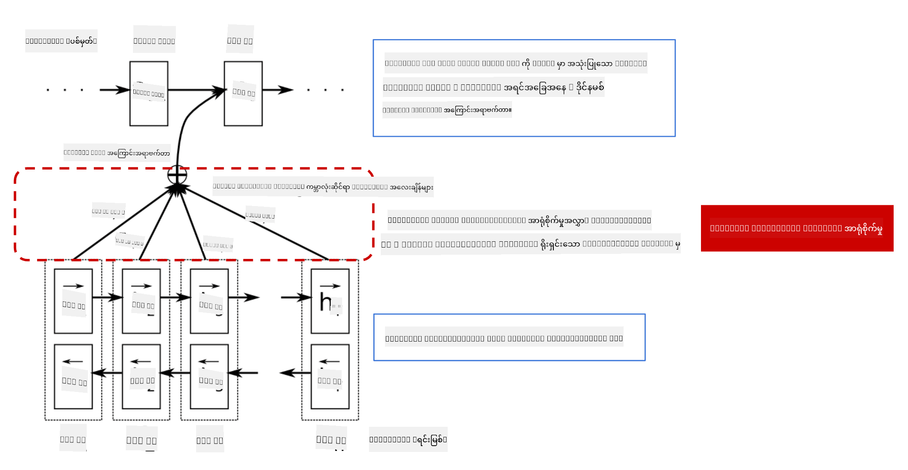
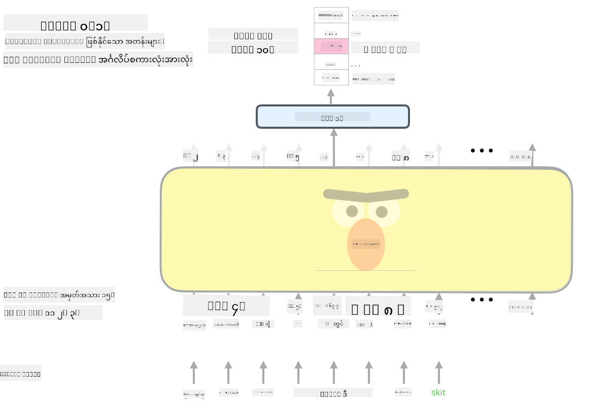

<!--
CO_OP_TRANSLATOR_METADATA:
{
  "original_hash": "f335dfcb4a993920504c387973a36957",
  "translation_date": "2025-09-23T15:24:18+00:00",
  "source_file": "lessons/5-NLP/18-Transformers/README.md",
  "language_code": "my"
}
-->
# အာရုံစိုက်မှု Mechanisms နှင့် Transformers

## [Pre-lecture quiz](https://ff-quizzes.netlify.app/en/ai/quiz/35)

NLP နယ်ပယ်တွင် အရေးကြီးဆုံးပြဿနာများထဲမှ တစ်ခုမှာ **စက်တင်ဘာသာပြန်ခြင်း** ဖြစ်ပြီး၊ Google Translate ကဲ့သို့သော ကိရိယာများ၏ အခြေခံအလုပ်ဖြစ်သည်။ ဒီအပိုင်းမှာ ကျွန်တော်တို့ **စက်တင်ဘာသာပြန်ခြင်း** (သို့မဟုတ် **sequence-to-sequence** task) ကို အဓိကထားပြီး လေ့လာပါမည်။ 

RNNs အသုံးပြု၍ sequence-to-sequence ကို **encoder** နှင့် **decoder** ဆိုသော recurrent networks နှစ်ခုဖြင့် အကောင်အထည်ဖော်သည်။ Encoder သည် input sequence ကို hidden state အဖြစ်သို့ ပြောင်းလဲပြီး၊ Decoder သည် hidden state ကို ပြန်လည်ဖော်ထုတ်ကာ ဘာသာပြန်ရလဒ်ကို ထုတ်ပေးသည်။ သို့သော် ဒီနည်းလမ်းတွင် အခက်အခဲများ ရှိသည်-

* Encoder network ၏ နောက်ဆုံး state သည် စာကြောင်းအစကို မှတ်မိရန် အခက်အခဲရှိပြီး၊ အရှည်ကြီးသော စာကြောင်းများအတွက် မော်ဒယ်အရည်အသွေးကို ကျဆင်းစေသည်။
* Sequence အတွင်းရှိ စကားလုံးအားလုံးသည် ရလဒ်အပေါ် တူညီသော သက်ရောက်မှုရှိသည်ဟု သတ်မှတ်ထားသည်။ သို့သော် အမှန်တကယ်တွင် input sequence အတွင်းရှိ အချို့သော စကားလုံးများသည် အခြားစကားလုံးများထက် output အပေါ် သက်ရောက်မှုပိုရှိသည်။

**Attention Mechanisms** သည် RNN ၏ output prediction အပေါ် input vector တစ်ခုချင်းစီ၏ context သက်ရောက်မှုကို အလေးပေးရန် နည်းလမ်းတစ်ခုဖြစ်သည်။ ဒီနည်းလမ်းကို input RNN ၏ intermediate states နှင့် output RNN အကြား shortcut များဖန်တီးခြင်းဖြင့် အကောင်အထည်ဖော်သည်။ ထို့ကြောင့် output symbol yt ကို ဖန်တီးသောအခါ input hidden states hi အားလုံးကို အလေးပေး coefficient &alpha;t,i များဖြင့် ထည့်သွင်းစဉ်းစားမည်။

> Encoder-decoder မော်ဒယ်နှင့် additive attention mechanism ကို [Bahdanau et al., 2015](https://arxiv.org/pdf/1409.0473.pdf) မှ ရယူထားသည်။ [ဒီ blog post](https://lilianweng.github.io/lil-log/2018/06/24/attention-attention.html) မှာလည်း ရှင်းပြထားသည်။

Attention matrix {&alpha;i,j} သည် output sequence အတွင်း စကားလုံးတစ်ခုကို ဖန်တီးရာတွင် input စကားလုံးတစ်ခုချင်းစီ၏ သက်ရောက်မှုကို ကိုယ်စားပြုသည်။ အောက်တွင် matrix ၏ ဥပမာတစ်ခုကို ဖော်ပြထားသည်-

> [Bahdanau et al., 2015](https://arxiv.org/pdf/1409.0473.pdf) မှာပါရှိသော (Fig.3) ပုံ

Attention mechanisms သည် NLP နယ်ပယ်တွင် လက်ရှိ state-of-the-art မော်ဒယ်များ၏ အခြေခံဖြစ်သည်။ သို့သော် attention ကို ထည့်သွင်းခြင်းသည် မော်ဒယ် parameters အရေအတွက်ကို တိုးစေပြီး RNNs တွင် scaling ပြဿနာများ ဖြစ်ပေါ်စေသည်။ RNNs ၏ key constraint တစ်ခုမှာ recurrent nature ဖြစ်ပြီး၊ sequence အတွင်းရှိ element တစ်ခုချင်းစီကို အဆက်မပြတ် စဉ်ဆက်မပြတ် process လုပ်ရမည်ဖြစ်သောကြောင့် training ကို parallelize လုပ်ရန် အခက်အခဲရှိသည်။

> [Google's Blog](https://research.googleblog.com/2016/09/a-neural-network-for-machine.html) မှ ပုံ

Attention mechanisms ကို RNNs ၏ constraint နှင့် ပေါင်းစပ်ပြီး၊ ယနေ့ကျွန်တော်တို့အသုံးပြုနေသော BERT နှင့် Open-GPT3 ကဲ့သို့သော state-of-the-art Transformer Models များကို ဖန်တီးခဲ့သည်။

## Transformer models

Transformers ၏ အဓိကအယူအဆတစ်ခုမှာ RNNs ၏ sequential nature ကို ရှောင်ရှားပြီး၊ training အတွင်း parallelize လုပ်နိုင်သော မော်ဒယ်တစ်ခုကို ဖန်တီးရန်ဖြစ်သည်။ ဒါကို အောက်ပါအယူအဆနှစ်ခုကို အသုံးပြုခြင်းဖြင့် အကောင်အထည်ဖော်သည်-

* positional encoding
* RNNs (သို့မဟုတ် CNNs) အစား pattern များကို ဖမ်းဆီးရန် self-attention mechanism ကို အသုံးပြုခြင်း (ဒါကြောင့် transformers ကို ဖော်ပြသော စာတမ်းကို *[Attention is all you need](https://arxiv.org/abs/1706.03762)* ဟု အမည်ပေးထားသည်)

### Positional Encoding/Embedding

Positional encoding ၏ အယူအဆမှာ အောက်ပါအတိုင်းဖြစ်သည်-
1. RNNs အသုံးပြုသောအခါ token များ၏ relative position ကို အဆင့်အနစ်အနစ်ဖြင့် ကိုယ်စားပြုထားပြီး၊ ထို့ကြောင့် ထပ်မံကိုယ်စားပြုရန် မလိုအပ်ပါ။
2. သို့သော် attention ကို အသုံးပြုသောအခါ sequence အတွင်း token များ၏ relative position ကို သိရန်လိုအပ်သည်။
3. Positional encoding ရရန် token များ၏ sequence ကို token position များဖြင့် ထပ်ဆောင်းပါသည် (ဥပမာ- 0, 1, ... စသည်ဖြင့် အနစ်အနစ်များ)။
4. ထို့နောက် token position ကို token embedding vector နှင့် ရောနှောပါသည်။ Position (integer) ကို vector အဖြစ် ပြောင်းရန် အနည်းအမျိုးမျိုးရှိသည်-

* Token embedding ကဲ့သို့ trainable embedding ကို အသုံးပြုခြင်း။ ဒီနည်းလမ်းကို ဒီမှာ သုံးပါမည်။ Token နှင့် position နှစ်ခုစလုံးကို embedding layers တွင် ထည့်သွင်းပြီး၊ အချင်းချင်းတူညီသော dimension ရရှိသော embedding vectors ကို ထည့်ပေါင်းပါသည်။
* Original paper တွင် အကြံပြုထားသော fixed position encoding function ကို အသုံးပြုခြင်း။

> ပုံကို အတောအတွင်းရေးသားသူမှ ဖန်တီးထားသည်

Positional embedding ရလဒ်သည် original token နှင့် sequence အတွင်း position နှစ်ခုစလုံးကို embed လုပ်ထားသည်။

### Multi-Head Self-Attention

ထို့နောက် sequence အတွင်း pattern များကို ဖမ်းဆီးရန်လိုအပ်သည်။ Transformers တွင် **self-attention** mechanism ကို အသုံးပြုသည်။ Self-attention သည် input နှင့် output အဖြစ် တူညီသော sequence အပေါ် attention ကို အသုံးပြုခြင်းဖြစ်သည်။ Self-attention ကို အသုံးပြုခြင်းဖြင့် sentence အတွင်း context ကို စဉ်းစားနိုင်ပြီး၊ စကားလုံးများ၏ inter-relationship ကို တွေ့နိုင်သည်။ ဥပမာ- *it* ကဲ့သို့သော coreferences ကို ရှာဖွေနိုင်သည်။

> [Google Blog](https://research.googleblog.com/2017/08/transformer-novel-neural-network.html) မှ ပုံ

Transformers တွင် **Multi-Head Attention** ကို အသုံးပြုသည်။ ဒါဟာ network ကို အမျိုးမျိုးသော dependency များကို ဖမ်းဆီးနိုင်စွမ်းပေးသည်။ ဥပမာ- long-term vs. short-term word relations, co-reference vs. အခြားတစ်ခုစသည်ဖြင့်။

[TensorFlow Notebook](TransformersTF.ipynb) တွင် transformer layers ၏ implementation အကြောင်းကို ပိုမိုအသေးစိတ်ရှင်းပြထားသည်။

### Encoder-Decoder Attention

Transformers တွင် attention ကို အောက်ပါနေရာနှစ်ခုတွင် အသုံးပြုသည်-

* Input text အတွင်း pattern များကို self-attention ဖြင့် ဖမ်းဆီးရန်
* Sequence translation ကို ဆောင်ရွက်ရန် - encoder နှင့် decoder အကြား attention layer ဖြစ်သည်။

Encoder-decoder attention သည် RNNs တွင် အသုံးပြုသော attention mechanism နှင့် အလွန်ဆင်တူသည်။ ဒီ animated diagram သည် encoder-decoder attention ၏ အခန်းကဏ္ဍကို ရှင်းပြထားသည်။

Input position တစ်ခုချင်းစီကို output position တစ်ခုချင်းစီနှင့် independently map လုပ်နိုင်သောကြောင့် transformers သည် RNNs ထက် parallelize လုပ်နိုင်စွမ်းပိုရှိသည်။ ဒါဟာ Natural Language Processing tasks များကို တိုးတက်စေသော စကားလုံးများအကြား relationship များကို သင်ယူရန် attention head တစ်ခုချင်းစီကို အသုံးပြုနိုင်သည်။

## BERT

**BERT** (Bidirectional Encoder Representations from Transformers) သည် *BERT-base* အတွက် 12 layers နှင့် *BERT-large* အတွက် 24 layers ပါဝင်သော အလွန်ကြီးမားသော multi-layer transformer network ဖြစ်သည်။ မော်ဒယ်ကို WikiPedia နှင့် books ကဲ့သို့သော text data အကြီးအကျယ်ကို unsupervised training (sentence အတွင်း masked words များကို ခန့်မှန်းခြင်း) ဖြင့် ပထမဦးဆုံး pre-train လုပ်သည်။ Pre-training အတွင်း မော်ဒယ်သည် language understanding အဆင့်များကို စွမ်းဆောင်နိုင်ပြီး၊ အခြား datasets များနှင့် fine-tuning ဖြင့် အသုံးပြုနိုင်သည်။ ဒီလုပ်ငန်းစဉ်ကို **transfer learning** ဟု ခေါ်သည်။

> ပုံ [source](http://jalammar.github.io/illustrated-bert/)

## ✍️ Exercises: Transformers

အောက်ပါ notebooks များတွင် သင့်လေ့လာမှုကို ဆက်လက်လုပ်ဆောင်ပါ-

* [Transformers in PyTorch](TransformersPyTorch.ipynb)
* [Transformers in TensorFlow](TransformersTF.ipynb)

## Conclusion

ဒီသင်ခန်းစာတွင် Transformers နှင့် Attention Mechanisms အကြောင်းကို လေ့လာခဲ့ပြီး၊ NLP toolbox အတွက် အရေးကြီးသော ကိရိယာများဖြစ်သည်။ Transformer architectures များတွင် BERT, DistilBERT, BigBird, OpenGPT3 စသည်ဖြင့် အမျိုးမျိုးသော variation များရှိပြီး၊ fine-tuning လုပ်နိုင်သည်။ [HuggingFace package](https://github.com/huggingface/) သည် PyTorch နှင့် TensorFlow နှစ်ခုစလုံးဖြင့် architecture များစွာကို training လုပ်ရန် repository ကို ပေးထားသည်။

## 🚀 Challenge

## [Post-lecture quiz](https://ff-quizzes.netlify.app/en/ai/quiz/36)

## Review & Self Study

* [Blog post](https://mchromiak.github.io/articles/2017/Sep/12/Transformer-Attention-is-all-you-need/), classical [Attention is all you need](https://arxiv.org/abs/1706.03762) paper ကို ရှင်းပြထားသည်။
* [A series of blog posts](https://towardsdatascience.com/transformers-explained-visually-part-1-overview-of-functionality-95a6dd460452) တွင် transformers ၏ architecture ကို အသေးစိတ်ရှင်းပြထားသည်။

## [Assignment](assignment.md)

---

