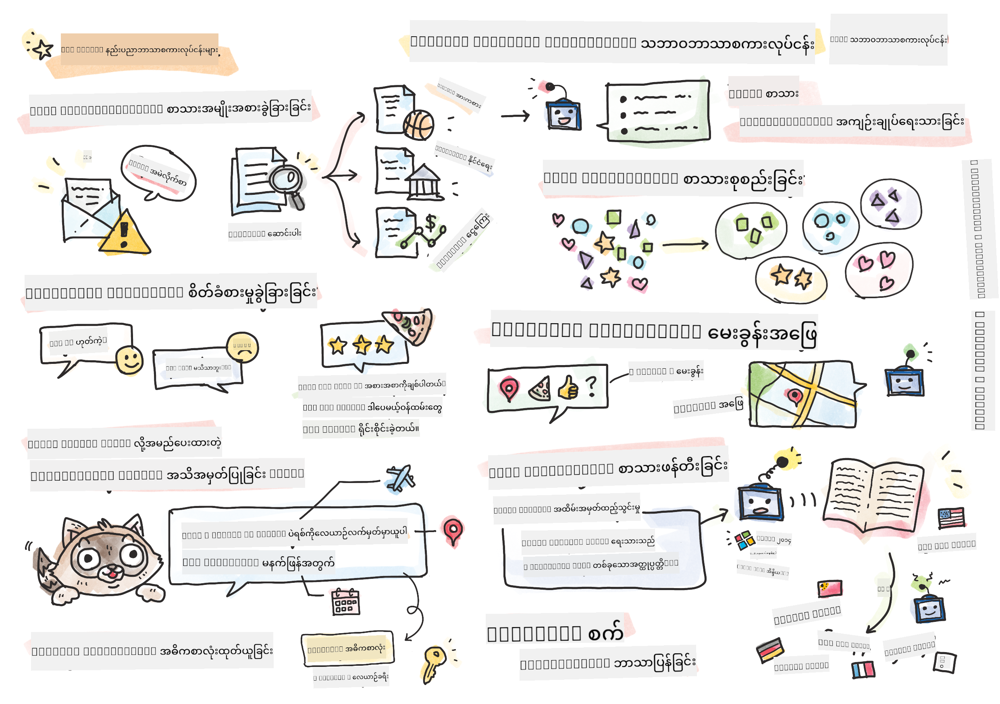

<!--
CO_OP_TRANSLATOR_METADATA:
{
  "original_hash": "8ef02a9318257ea140ed3ed74442096d",
  "translation_date": "2025-08-25T21:31:03+00:00",
  "source_file": "lessons/5-NLP/README.md",
  "language_code": "my"
}
-->
# သဘာဝဘာသာစကားလုပ်ငန်းဆောင်တာ



ဤအပိုင်းတွင် **သဘာဝဘာသာစကားလုပ်ငန်းဆောင်တာ (NLP)** နှင့်ဆက်စပ်သောအလုပ်များကို Neural Networks အသုံးပြု၍ ဖြေရှင်းပုံကို အဓိကထားဆွေးနွေးသွားမည်ဖြစ်သည်။ ကွန်ပျူတာများကို ဖြေရှင်းစေလိုသော NLP ပြဿနာများစွာရှိသည်။

* **စာသားအမျိုးအစားခွဲခြားခြင်း** သည် စာသားအတိုင်းအတာများနှင့်ဆက်စပ်သော အမျိုးအစားခွဲခြားမှုပြဿနာတစ်ခုဖြစ်သည်။ ဥပမာအားဖြင့် အီးမေးလ်များကို spam နှင့် non-spam အဖြစ်ခွဲခြားခြင်း၊ သို့မဟုတ် ဆောင်းပါးများကို အားကစား၊ စီးပွားရေး၊ နိုင်ငံရေး စသည်ဖြင့် အမျိုးအစားခွဲခြားခြင်းတို့ ပါဝင်သည်။ ထို့အပြင် chat bots ဖွံ့ဖြိုးရေးတွင် အသုံးပြုသူ၏ ရည်ရွယ်ချက်ကို နားလည်ရန်လိုအပ်သည်။ ဤကိစ္စတွင် **ရည်ရွယ်ချက်ခွဲခြားခြင်း** (intent classification) ကို ဖြေရှင်းရမည်ဖြစ်သည်။ ရည်ရွယ်ချက်ခွဲခြားမှုတွင် အမျိုးအစားများစွာနှင့် ရင်ဆိုင်ရတတ်သည်။
* **ခံစားချက်ခွဲခြားခြင်း** သည် regression ပြဿနာတစ်ခုဖြစ်ပြီး စာကြောင်း၏ အဓိပ္ပါယ်သည် အပေါင်း/အပြားဘယ်လောက်ရှိသည်ကို သတ်မှတ်ရန် နံပါတ် (ခံစားချက်) တစ်ခုကို သတ်မှတ်ရမည်ဖြစ်သည်။ ခံစားချက်ခွဲခြားမှု၏ အဆင့်မြင့်ဗားရှင်းတစ်ခုမှာ **အပိုင်းအခြေခံခံစားချက်ခွဲခြားခြင်း** (ABSA) ဖြစ်ပြီး စာကြောင်းတစ်ခုလုံးကို မဟုတ်ဘဲ အပိုင်းအခြေများ (aspects) ကို ခံစားချက်သတ်မှတ်ရမည်ဖြစ်သည်။ ဥပမာအားဖြင့် *ဤစားသောက်ဆိုင်တွင် အစားအစာကို ကြိုက်ခဲ့ပေမယ့် ပတ်ဝန်းကျင်က ဆိုးရွားခဲ့သည်*။
* **နာမည်ရရှိထားသောအရာများကို မှတ်သားခြင်း** (NER) သည် စာသားမှ အချို့သောအရာများကို ထုတ်ယူရန် ပြဿနာဖြစ်သည်။ ဥပမာအားဖြင့် *မနက်ဖြန် ပဲရစ်ကို ပျံသန်းရန်လိုအပ်သည်* ဆိုသော စာကြောင်းတွင် *မနက်ဖြန်* သည် DATE ကို ရည်ညွှန်းပြီး *ပဲရစ်* သည် LOCATION ဖြစ်သည်ကို နားလည်ရန်လိုအပ်သည်။
* **အဓိကချက်များထုတ်ယူခြင်း** သည် NER နှင့် ဆင်တူပြီး စာကြောင်း၏ အဓိပ္ပါယ်အတွက် အရေးပါသော စကားလုံးများကို အလိုအလျောက်ထုတ်ယူရန်လိုအပ်သည်။ သတ်မှတ်ထားသောအရာအမျိုးအစားများအတွက် ကြိုတင်လေ့ကျင့်မှုမလိုအပ်ပါ။
* **စာသားစုစည်းခြင်း** သည် နည်းပညာပံ့ပိုးမှုစကားဝိုင်းများတွင် တူညီသောတောင်းဆိုမှုများကို အုပ်စုဖွဲ့လိုသောအခါ အသုံးဝင်သည်။
* **မေးခွန်းဖြေဆိုခြင်း** သည် မေးခွန်းတစ်ခုကို ဖြေဆိုနိုင်စွမ်းကို ရည်ညွှန်းသည်။ မော်ဒယ်သည် စာသားအပိုင်းနှင့် မေးခွန်းကို input အဖြစ်ရရှိပြီး မေးခွန်း၏ အဖြေပါဝင်သောနေရာကို စာသားတွင် ရှာဖွေရန် (တခါတလေ အဖြေစာသားကို ဖန်တီးရန်) လိုအပ်သည်။
* **စာသားဖန်တီးခြင်း** သည် စာသားအသစ်ကို ဖန်တီးနိုင်စွမ်းဖြစ်သည်။ ၎င်းကို *text prompt* အပေါ်အခြေခံပြီး နောက်ထပ်အက္ခရာ/စကားလုံးကို ခန့်မှန်းသော အမျိုးအစားခွဲခြားမှုအလုပ်တစ်ခုအဖြစ် သတ်မှတ်နိုင်သည်။ GPT-3 ကဲ့သို့သော အဆင့်မြင့်စာသားဖန်တီးမော်ဒယ်များသည် [prompt programming](https://towardsdatascience.com/software-3-0-how-prompting-will-change-the-rules-of-the-game-a982fbfe1e0) သို့မဟုတ် [prompt engineering](https://medium.com/swlh/openai-gpt-3-and-prompt-engineering-dcdc2c5fcd29) ဆိုသောနည်းလမ်းများကို အသုံးပြု၍ အခြားသော NLP အလုပ်များကို ဖြေရှင်းနိုင်သည်။
* **စာသားအကျဉ်းချုပ်ရေးခြင်း** သည် ရှည်လျားသောစာသားကို "ဖတ်"၍ အနည်းငယ်သောစာကြောင်းများဖြင့် အကျဉ်းချုပ်ရေးရန်လိုအပ်သောနည်းလမ်းဖြစ်သည်။
* **စက်ဖြင့်ဘာသာပြန်ခြင်း** သည် ဘာသာစကားတစ်ခုတွင် စာသားနားလည်ခြင်းနှင့် အခြားဘာသာစကားတွင် စာသားဖန်တီးခြင်းတို့၏ ပေါင်းစပ်အဖြစ်မြင်နိုင်သည်။

အစပိုင်းတွင် NLP အလုပ်များအများစုကို ဓလေ့ကျင့်နည်းများဖြင့် ဖြေရှင်းခဲ့သည်။ ဥပမာအားဖြင့် စက်ဖြင့်ဘာသာပြန်ခြင်းတွင် စာကြောင်းကို syntax tree အဖြစ်ပြောင်းလဲရန် parsers ကို အသုံးပြုခဲ့ပြီး sentence ၏ အဓိပ္ပါယ်ကို ကိုယ်စားပြုသော semantic structures များကို ထုတ်ယူခဲ့သည်။ ထို့နောက် target ဘာသာစကား၏ grammar အပေါ်အခြေခံ၍ ရလဒ်ကို ဖန်တီးခဲ့သည်။ ယနေ့တွင် Neural Networks ကို အသုံးပြု၍ NLP အလုပ်များစွာကို ပိုမိုထိရောက်စွာ ဖြေရှင်းနိုင်သည်။

> [Natural Language Processing Toolkit (NLTK)](https://www.nltk.org) Python library တွင် classical NLP နည်းလမ်းများစွာကို အကောင်အထည်ဖော်ထားသည်။ [NLTK Book](https://www.nltk.org/book/) သည် NLTK ကို အသုံးပြု၍ NLP အလုပ်များကို ဖြေရှင်းပုံကို ဖော်ပြထားသော အွန်လိုင်းစာအုပ်တစ်ခုဖြစ်သည်။

ဤသင်ခန်းစာတွင် Neural Networks ကို အသုံးပြု၍ NLP ကို အဓိကထားမည်ဖြစ်ပြီး NLTK ကို လိုအပ်သည့်နေရာတွင် အသုံးပြုမည်ဖြစ်သည်။

ကျွန်ုပ်တို့သည် tabular data နှင့် images ကို Neural Networks အသုံးပြု၍ ဖြေရှင်းပုံကို ရှင်းလင်းခဲ့ပြီးဖြစ်သည်။ data အမျိုးအစားများနှင့် စာသားအကြား အဓိကကွာခြားချက်မှာ စာသားသည် အရွယ်အစားမတူညီသော အတိုင်းအတာဖြစ်ပြီး images ၏ input size ကို ကြိုတင်သိနိုင်သည်။ Convolutional networks သည် input data မှ pattern များကို ထုတ်ယူနိုင်သော်လည်း စာသားတွင် pattern များသည် ပိုမိုရှုပ်ထွေးသည်။ ဥပမာအားဖြင့် negation သည် subject နှင့် အကွာအဝေးရှိသော စကားလုံးများဖြင့် ခွဲထားနိုင်သည် (*I do not like oranges* နှင့် *I do not like those big colorful tasty oranges*)၊ ၎င်းကို pattern တစ်ခုအဖြစ် သတ်မှတ်နိုင်ရမည်ဖြစ်သည်။ ထို့ကြောင့် ဘာသာစကားကို ကိုင်တွယ်ရန် *recurrent networks* နှင့် *transformers* ကဲ့သို့သော Neural Network အမျိုးအစားအသစ်များကို မိတ်ဆက်ရန်လိုအပ်သည်။

## Libraries ကို Install လုပ်ခြင်း

ဤသင်ခန်းစာကို local Python installation တွင် run လုပ်မည်ဆိုပါက NLP အတွက်လိုအပ်သော libraries များကို အောက်ပါ command များဖြင့် install လုပ်ရန်လိုအပ်နိုင်သည်။

**PyTorch အတွက်**
```bash
pip install -r requirements-torch.txt
```
**TensorFlow အတွက်**
```bash
pip install -r requirements-tf.txt
```

> TensorFlow ဖြင့် NLP ကို [Microsoft Learn](https://docs.microsoft.com/learn/modules/intro-natural-language-processing-tensorflow/?WT.mc_id=academic-77998-cacaste) တွင် စမ်းသပ်နိုင်သည်။

## GPU သတိပေးချက်

ဤအပိုင်းတွင် မော်ဒယ်များကို training လုပ်ရန် အချို့သော ဥပမာများတွင် ကြီးမားသော မော်ဒယ်များကို training လုပ်မည်ဖြစ်သည်။
* **GPU-enabled ကွန်ပျူတာကို အသုံးပြုပါ**: ကြီးမားသောမော်ဒယ်များနှင့်အလုပ်လုပ်သောအခါ စောင့်ဆိုင်းချိန်များကို လျှော့ချရန် GPU-enabled ကွန်ပျူတာတွင် notebooks များကို run လုပ်ရန် အကြံပြုပါသည်။
* **GPU memory အကန့်အသတ်များ**: GPU တွင် run လုပ်ခြင်းသည် ကြီးမားသောမော်ဒယ်များကို training လုပ်သောအခါ GPU memory ကုန်ဆုံးမှုဖြစ်နိုင်သည်။
* **GPU memory သုံးစွဲမှု**: Training လုပ်စဉ် GPU memory သုံးစွဲမှုသည် minibatch size အပါအဝင် အမျိုးမျိုးသောအချက်များပေါ်မူတည်သည်။
* **Minibatch size ကို လျှော့ချပါ**: GPU memory ပြဿနာများနှင့် ရင်ဆိုင်ပါက minibatch size ကို လျှော့ချရန် code တွင် ပြင်ဆင်ပါ။
* **TensorFlow GPU memory ဖြန့်ချိမှု**: TensorFlow ၏ အဟောင်းဗားရှင်းများသည် Python kernel တစ်ခုတွင် မော်ဒယ်များစွာကို training လုပ်သောအခါ GPU memory ကို မှန်ကန်စွာ ဖြန့်ချိမထားနိုင်ပါ။ GPU memory သုံးစွဲမှုကို ထိန်းချုပ်ရန် TensorFlow ကိုလိုအပ်သည့်အခါ GPU memory ကိုသာ allocate လုပ်ရန် configure လုပ်နိုင်သည်။
* **Code ထည့်သွင်းခြင်း**: TensorFlow ကိုလိုအပ်သည့်အခါ GPU memory allocation ကိုသာ ကြီးထွားစေရန် notebooks တွင် အောက်ပါ code ကို ထည့်သွင်းပါ:

```python
physical_devices = tf.config.list_physical_devices('GPU') 
if len(physical_devices)>0:
    tf.config.experimental.set_memory_growth(physical_devices[0], True) 
```

Classic ML အမြင်မှ NLP ကို လေ့လာလိုပါက [ဤသင်ခန်းစာများ](https://github.com/microsoft/ML-For-Beginners/tree/main/6-NLP) ကို သွားရောက်ကြည့်ရှုပါ။

## ဤအပိုင်းတွင်
ဤအပိုင်းတွင် ကျွန်ုပ်တို့သည် အောက်ပါအကြောင်းအရာများကို လေ့လာမည်ဖြစ်သည်-

* [စာသားကို tensors အဖြစ် ကိုယ်စားပြုခြင်း](13-TextRep/README.md)
* [Word Embeddings](14-Emdeddings/README.md)
* [ဘာသာစကားမော်ဒယ်ရေးခြင်း](15-LanguageModeling/README.md)
* [Recurrent Neural Networks](16-RNN/README.md)
* [Generative Networks](17-GenerativeNetworks/README.md)
* [Transformers](18-Transformers/README.md)

**အကြောင်းကြားချက်**:  
ဤစာရွက်စာတမ်းကို AI ဘာသာပြန်ဝန်ဆောင်မှု [Co-op Translator](https://github.com/Azure/co-op-translator) ကို အသုံးပြု၍ ဘာသာပြန်ထားပါသည်။ ကျွန်ုပ်တို့သည် တိကျမှုအတွက် ကြိုးစားနေသော်လည်း၊ အလိုအလျောက် ဘာသာပြန်မှုများတွင် အမှားများ သို့မဟုတ် မတိကျမှုများ ပါဝင်နိုင်သည်ကို သတိပြုပါ။ မူရင်းစာရွက်စာတမ်းကို ၎င်း၏ မူရင်းဘာသာစကားဖြင့် အာဏာတရားရှိသော အရင်းအမြစ်အဖြစ် ရှုလေ့လာသင့်ပါသည်။ အရေးကြီးသော အချက်အလက်များအတွက် လူ့ဘာသာပြန်ပညာရှင်များမှ ပရော်ဖက်ရှင်နယ် ဘာသာပြန်မှုကို အကြံပြုပါသည်။ ဤဘာသာပြန်မှုကို အသုံးပြုခြင်းမှ ဖြစ်ပေါ်လာသော အလွဲအမှားများ သို့မဟုတ် အနားလွဲမှုများအတွက် ကျွန်ုပ်တို့သည် တာဝန်မယူပါ။