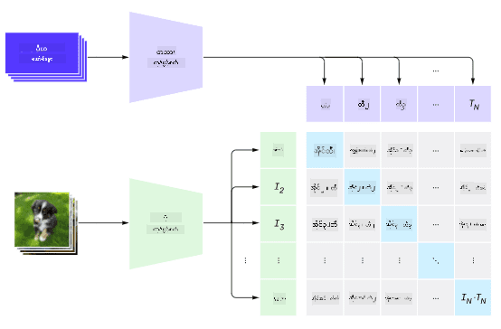

<!--
CO_OP_TRANSLATOR_METADATA:
{
  "original_hash": "9c592c26aca16ca085d268c732284187",
  "translation_date": "2025-08-25T23:41:01+00:00",
  "source_file": "lessons/X-Extras/X1-MultiModal/README.md",
  "language_code": "my"
}
-->
# Multi-Modal Networks

NLP အလုပ်များကို ဖြေရှင်းရန် transformer models အောင်မြင်ပြီးနောက်၊ အတူတူ သို့မဟုတ် ဆင်တူသော architecture များကို computer vision အလုပ်များတွင်လည်း အသုံးပြုလာကြသည်။ Vision နှင့် သဘာဝဘာသာစကားစွမ်းရည်များကို *ပေါင်းစပ်* လုပ်နိုင်မည့် မော်ဒယ်များကို တည်ဆောက်ရန် စိတ်ဝင်စားမှုများလာသည်။ OpenAI မှ CLIP နှင့် DALL.E ဟုခေါ်သော ကြိုးစားမှုတစ်ခုကို ပြုလုပ်ခဲ့သည်။

## Contrastive Image Pre-Training (CLIP)

CLIP ၏ အဓိကအကြောင်းအရာမှာ စာသား prompt များနှင့် ပုံတစ်ပုံကို နှိုင်းယှဉ်ပြီး ပုံသည် prompt နှင့် ဘယ်လောက်တိကျမှုရှိသည်ကို သတ်မှတ်နိုင်ရန်ဖြစ်သည်။

> *ဤ blog post မှ ပုံ [ဒီမှာ](https://openai.com/blog/clip/)*

မော်ဒယ်ကို အင်တာနက်မှ ရရှိသော ပုံများနှင့် ၎င်းတို့၏ caption များဖြင့် သင်ကြားသည်။ Batch တစ်ခုစီအတွက် (image, text) N စုံကို ယူပြီး၊ ၎င်းတို့ကို vector ကိုယ်စားပြုချက်တစ်ခုဖြင့် ပြောင်းလဲသည်။

၎င်း representation များကို ပြန်လည် တွဲဖက်သည်။ Loss function ကို တစ်စုံတစ်တွဲ (ဥပမာ I နှင့် T) နှင့် ကိုက်ညီသော vector များအကြား cosine similarity ကို အများဆုံးဖြစ်အောင်လုပ်ရန်၊ အခြားစုံတွဲများအားလုံးအကြား cosine similarity ကို အနည်းဆုံးဖြစ်အောင်လုပ်ရန် သတ်မှတ်သည်။ ထို့ကြောင့် ဤနည်းလမ်းကို **contrastive** ဟုခေါ်သည်။

CLIP မော်ဒယ်/စာကြည့်တိုက်ကို [OpenAI GitHub](https://github.com/openai/CLIP) မှ ရယူနိုင်သည်။ ဤနည်းလမ်းကို [ဒီ blog post](https://openai.com/blog/clip/) တွင် ဖော်ပြထားပြီး၊ အသေးစိတ်ကို [ဤစာတမ်း](https://arxiv.org/pdf/2103.00020.pdf) တွင် ဖော်ပြထားသည်။

မော်ဒယ်ကို pre-trained ပြီးနောက်၊ ပုံများနှင့် စာသား prompt များကို batch အဖြစ်ပေးပြီး၊ tensor with probabilities ကို ပြန်လည်ရရှိမည်ဖြစ်သည်။ CLIP ကို အောက်ပါအလုပ်များအတွက် အသုံးပြုနိုင်သည်-

**Image Classification**

ဥပမာအားဖြင့် ပုံများကို ကြောင်၊ ခွေး၊ လူတို့အကြား ခွဲခြားရန် လိုအပ်သည်ဟု ယူဆပါစို့။ ဤအခါတွင် မော်ဒယ်ကို ပုံတစ်ပုံနှင့် စာသား prompt များ "*a picture of a cat*", "*a picture of a dog*", "*a picture of a human*" တို့ကို ပေးပါ။ 3 probabilities ရလဒ် vector တွင် အမြင့်ဆုံးတန်ဖိုးရှိသော index ကို ရွေးချယ်ရမည်ဖြစ်သည်။

> *ဤ blog post မှ ပုံ [ဒီမှာ](https://openai.com/blog/clip/)*

**Text-Based Image Search**

ထို့အပြင် ဆန့်ကျင်ဘက်လုပ်ဆောင်နိုင်သည်။ ပုံများစုတစ်ခုရှိပါက၊ ၎င်းကို မော်ဒယ်သို့ ပေးပို့ပြီး၊ စာသား prompt တစ်ခုကို ထည့်သွင်းပါ - ၎င်းသည် prompt နှင့် အနီးဆုံးပုံကို ပြန်ပေးမည်ဖြစ်သည်။

## ✍️ ဥပမာ: [CLIP ကို Image Classification နှင့် Image Search အတွက် အသုံးပြုခြင်း](../../../../../lessons/X-Extras/X1-MultiModal/Clip.ipynb)

CLIP ကို လက်တွေ့အသုံးပြုမှုကို ကြည့်ရန် [Clip.ipynb](../../../../../lessons/X-Extras/X1-MultiModal/Clip.ipynb) notebook ကို ဖွင့်ပါ။

## Image Generation with VQGAN+ CLIP

CLIP ကို **စာသား prompt မှ ပုံဖန်တီးခြင်း** အတွက်လည်း အသုံးပြုနိုင်သည်။ ဤအလုပ်ကို လုပ်ဆောင်ရန် **generator model** တစ်ခုလိုအပ်သည်။ ၎င်းသည် vector input တစ်ခုအပေါ် အခြေခံပြီး ပုံများကို ဖန်တီးနိုင်ရမည်ဖြစ်သည်။ ဤမော်ဒယ်များထဲမှ တစ်ခုမှာ [VQGAN](https://compvis.github.io/taming-transformers/) (Vector-Quantized GAN) ဖြစ်သည်။

VQGAN ၏ GAN (../../4-ComputerVision/10-GANs/README.md) ထက် ကွဲပြားသော အဓိကအချက်များမှာ-
* ပုံကို ဖွဲ့စည်းသော context-rich visual parts များ၏ အစဉ်လိုက်ကို ဖန်တီးရန် autoregressive transformer architecture ကို အသုံးပြုခြင်း။ ဤ visual parts များကို [CNN](../../4-ComputerVision/07-ConvNets/README.md) မှ သင်ယူသည်။
* ပုံ၏ အစိတ်အပိုင်းများသည် "မှန်ကန်" သို့မဟုတ် "အတု" ဖြစ်ကြောင်း ရှာဖွေသော sub-image discriminator ကို အသုံးပြုခြင်း (ရိုးရာ GAN တွင် "all-or-nothing" နည်းလမ်းနှင့် ကွဲပြားသည်)။

VQGAN အကြောင်းကို [Taming Transformers](https://compvis.github.io/taming-transformers/) ဝဘ်ဆိုဒ်တွင် ပိုမိုလေ့လာပါ။

VQGAN နှင့် ရိုးရာ GAN အကြား အရေးကြီးသော ကွာခြားချက်တစ်ခုမှာ၊ နောက်ဆုံးပုံကို မည်သည့် input vector မှမဆို ရိုးရာ GAN သည် သင့်တော်သောပုံကို ဖန်တီးနိုင်သော်လည်း၊ VQGAN သည် coherence မရှိသောပုံကို ဖန်တီးနိုင်သည်။ ထို့ကြောင့် ပုံဖန်တီးမှုလုပ်ငန်းစဉ်ကို CLIP ကို အသုံးပြု၍ ထပ်မံလမ်းညွှန်ရန် လိုအပ်သည်။

စာသား prompt နှင့် ကိုက်ညီသော ပုံတစ်ပုံကို ဖန်တီးရန်၊ random encoding vector တစ်ခုဖြင့် စတင်ပြီး၊ ၎င်းကို VQGAN မှတဆင့် ပုံတစ်ပုံထုတ်လုပ်သည်။ ထို့နောက် CLIP ကို loss function တစ်ခုဖန်တီးရန် အသုံးပြုသည်။ ၎င်းသည် ပုံသည် စာသား prompt နှင့် ဘယ်လောက်ကိုက်ညီသည်ကို ပြသသည်။ ထို့နောက် loss ကို အနည်းဆုံးဖြစ်အောင်လုပ်ရန်၊ back propagation ကို အသုံးပြု၍ input vector parameters များကို ပြင်ဆင်သည်။

VQGAN+CLIP ကို အကောင်အထည်ဖော်ထားသော စာကြည့်တိုက်တစ်ခုမှာ [Pixray](http://github.com/pixray/pixray) ဖြစ်သည်။

 |   | 
----|----|----
Prompt *a closeup watercolor portrait of young male teacher of literature with a book* မှ ဖန်တီးထားသော ပုံ | Prompt *a closeup oil portrait of young female teacher of computer science with a computer* မှ ဖန်တီးထားသော ပုံ | Prompt *a closeup oil portrait of old male teacher of mathematics in front of blackboard* မှ ဖန်တီးထားသော ပုံ

> **Artificial Teachers** စုစည်းမှုမှ ပုံများ [Dmitry Soshnikov](http://soshnikov.com)

## DALL-E
### [DALL-E 1](https://openai.com/research/dall-e)
DALL-E သည် GPT-3 ၏ ဗားရှင်းတစ်ခုဖြစ်ပြီး၊ prompt များမှ ပုံများကို ဖန်တီးရန် သင်ကြားထားသည်။ ၎င်းကို 12-billion parameters ဖြင့် သင်ကြားထားသည်။

CLIP နှင့် မတူကွဲပြားသည်မှာ၊ DALL-E သည် စာသားနှင့် ပုံကို token များ၏ single stream အဖြစ် လက်ခံသည်။ ထို့ကြောင့် prompt များစွာမှ စာသားအပေါ် အခြေခံပြီး ပုံများကို ဖန်တီးနိုင်သည်။

### [DALL-E 2](https://openai.com/dall-e-2)
DALL.E 1 နှင့် 2 အကြား အဓိကကွာခြားချက်မှာ၊ ၎င်းသည် ပိုမိုလက်တွေ့ကျသော ပုံများနှင့် အနုပညာကို ဖန်တီးနိုင်ခြင်းဖြစ်သည်။

DALL-E ဖြင့် ဖန်တီးထားသော ပုံများ၏ ဥပမာများ:
 |   | 
----|----|----
Prompt *a closeup watercolor portrait of young male teacher of literature with a book* မှ ဖန်တီးထားသော ပုံ | Prompt *a closeup oil portrait of young female teacher of computer science with a computer* မှ ဖန်တီးထားသော ပုံ | Prompt *a closeup oil portrait of old male teacher of mathematics in front of blackboard* မှ ဖန်တီးထားသော ပုံ

## References

* VQGAN စာတမ်း: [Taming Transformers for High-Resolution Image Synthesis](https://compvis.github.io/taming-transformers/paper/paper.pdf)
* CLIP စာတမ်း: [Learning Transferable Visual Models From Natural Language Supervision](https://arxiv.org/pdf/2103.00020.pdf)

**အကြောင်းကြားချက်**:  
ဤစာရွက်စာတမ်းကို AI ဘာသာပြန်ဝန်ဆောင်မှု [Co-op Translator](https://github.com/Azure/co-op-translator) ကို အသုံးပြု၍ ဘာသာပြန်ထားပါသည်။ ကျွန်ုပ်တို့သည် တိကျမှုအတွက် ကြိုးစားနေသော်လည်း၊ အလိုအလျောက် ဘာသာပြန်မှုများတွင် အမှားများ သို့မဟုတ် မမှန်ကန်မှုများ ပါဝင်နိုင်သည်ကို သတိပြုပါ။ မူရင်းစာရွက်စာတမ်းကို ၎င်း၏ မူလဘာသာစကားဖြင့် အာဏာတရားရှိသော အရင်းအမြစ်အဖြစ် သတ်မှတ်သင့်ပါသည်။ အရေးကြီးသော အချက်အလက်များအတွက် လူ့ဘာသာပြန်ပညာရှင်များမှ ပရော်ဖက်ရှင်နယ် ဘာသာပြန်မှုကို အကြံပြုပါသည်။ ဤဘာသာပြန်မှုကို အသုံးပြုခြင်းမှ ဖြစ်ပေါ်လာသော အလွဲအလွတ်များ သို့မဟုတ် အနားလွဲမှုများအတွက် ကျွန်ုပ်တို့သည် တာဝန်မယူပါ။