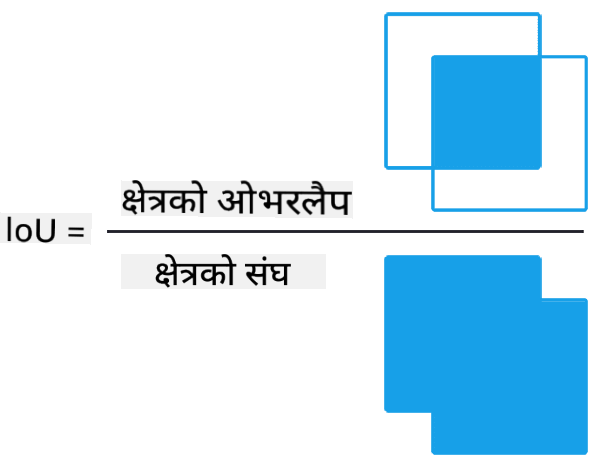
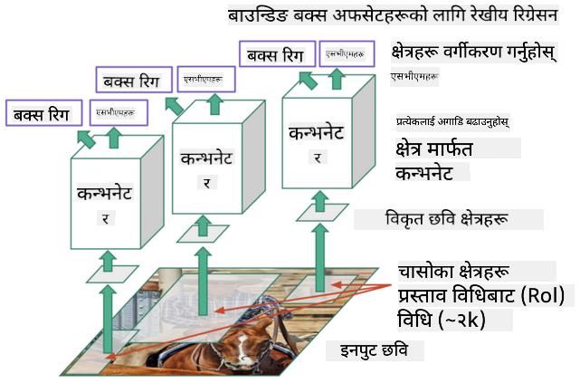
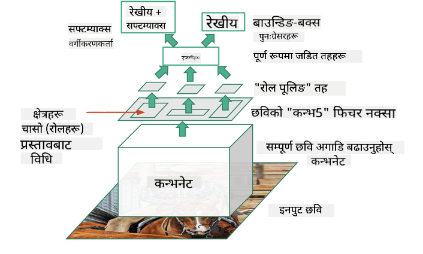
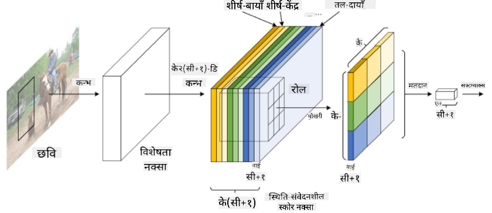
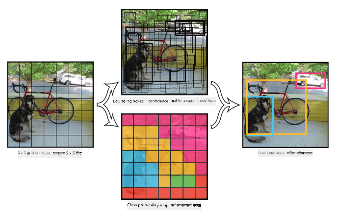

<!--
CO_OP_TRANSLATOR_METADATA:
{
  "original_hash": "d76a7eda28de5210c8b1ba50a6216c69",
  "translation_date": "2025-09-23T07:17:01+00:00",
  "source_file": "lessons/4-ComputerVision/11-ObjectDetection/README.md",
  "language_code": "ne"
}
-->
# वस्तु पहिचान (Object Detection)

अहिलेसम्म हामीले अध्ययन गरेका छवि वर्गीकरण मोडेलहरूले एउटा छवि लिएर वर्गीय परिणाम उत्पादन गर्थे, जस्तै MNIST समस्यामा 'संख्या' वर्ग। तर, धेरै अवस्थामा हामीलाई केवल यो थाहा पाउन चाहिँदैन कि तस्वीरमा वस्तुहरू छन्; हामीलाई तिनीहरूको ठ्याक्कै स्थान पनि पत्ता लगाउन चाहिन्छ। यही उद्देश्यका लागि **वस्तु पहिचान (Object Detection)** प्रयोग गरिन्छ।

## [पूर्व-व्याख्यान क्विज](https://ff-quizzes.netlify.app/en/ai/quiz/21)

> छवि [YOLO v2 वेबसाइट](https://pjreddie.com/darknet/yolov2/) बाट

## वस्तु पहिचानको लागि एक साधारण दृष्टिकोण

मानौं, हामीले एउटा तस्वीरमा बिरालो खोज्नुपर्छ। यसका लागि एकदमै साधारण दृष्टिकोण निम्न हुन सक्छ:

1. तस्वीरलाई साना टाइलहरूमा विभाजन गर्नुहोस्।
2. प्रत्येक टाइलमा छवि वर्गीकरण चलाउनुहोस्।
3. ती टाइलहरू, जसले पर्याप्त उच्च सक्रियता देखाउँछन्, तिनीहरूमा खोजिएको वस्तु भएको मान्न सकिन्छ।

> *छवि [व्यायाम नोटबुक](ObjectDetection-TF.ipynb) बाट*

तर, यो दृष्टिकोण आदर्श छैन, किनभने यसले वस्तुको सीमाना (bounding box) धेरै अस्पष्ट रूपमा मात्र पत्ता लगाउन सक्छ। थप सटीक स्थान पत्ता लगाउन, हामीलाई **रेग्रेशन (Regression)** प्रयोग गरी सीमाना बक्सको समन्वय (coordinates) भविष्यवाणी गर्न आवश्यक पर्छ - र यसका लागि, हामीलाई विशेष डेटासेटहरू चाहिन्छ।

## वस्तु पहिचानका लागि रिग्रेसन

[यो ब्लग पोस्ट](https://towardsdatascience.com/object-detection-with-neural-networks-a4e2c46b4491) ले आकारहरू पत्ता लगाउनको लागि राम्रो परिचय दिन्छ।

## वस्तु पहिचानका लागि डेटासेटहरू

तपाईंले निम्न डेटासेटहरू भेट्टाउन सक्नुहुन्छ:

* [PASCAL VOC](http://host.robots.ox.ac.uk/pascal/VOC/) - २० वर्गहरू
* [COCO](http://cocodataset.org/#home) - सामान्य वस्तुहरू सन्दर्भमा। ८० वर्गहरू, सीमाना बक्सहरू र खण्डन मास्कहरू

## वस्तु पहिचान मेट्रिक्स

### Intersection over Union (IoU)

जहाँ छवि वर्गीकरणका लागि एल्गोरिदमको प्रदर्शन मापन गर्न सजिलो छ, वस्तु पहिचानका लागि वर्गको शुद्धता र अनुमानित सीमाना बक्स स्थानको सटीकता दुवै मापन गर्न आवश्यक छ। पछिल्लोका लागि, हामी **Intersection over Union** (IoU) प्रयोग गर्छौं, जसले दुई बक्सहरू (वा दुई मनमानी क्षेत्रहरू) कत्तिको ओभरल्याप गर्छन् भनेर मापन गर्छ।

> *[IoU सम्बन्धी उत्कृष्ट ब्लग पोस्ट](https://pyimagesearch.com/2016/11/07/intersection-over-union-iou-for-object-detection/) बाट चित्र २*

यो विचार सरल छ - दुई आकृतिहरूको प्रतिच्छेदन क्षेत्रलाई तिनीहरूको संघ क्षेत्रले विभाजन गर्छौं। दुई समान क्षेत्रहरूको लागि, IoU १ हुनेछ, जबकि पूर्ण रूपमा अलग क्षेत्रहरूको लागि यो ० हुनेछ। अन्यथा, यो ० देखि १ सम्म फरक हुनेछ। हामी सामान्यतया ती सीमाना बक्सहरू मात्र विचार गर्छौं, जसको IoU निश्चित मानभन्दा माथि हुन्छ।

### औसत शुद्धता (Average Precision)

मानौं, हामीलाई कुनै वर्ग $C$ को वस्तुहरू कत्तिको राम्रोसँग पहिचान गरिएका छन् भनेर मापन गर्नुपर्छ। यसका लागि, हामी **औसत शुद्धता (Average Precision)** मेट्रिक्स प्रयोग गर्छौं, जुन यसरी गणना गरिन्छ:

1. Precision-Recall वक्रले थ्रेसहोल्ड मान (० देखि १ सम्म) अनुसार शुद्धता देखाउँछ।
2. थ्रेसहोल्डको आधारमा, छविमा बढी वा कम वस्तुहरू पत्ता लाग्छन्, र शुद्धता र रिकलका भिन्न मानहरू प्राप्त हुन्छन्।
3. वक्र यसरी देखिन्छ:

> *[NeuroWorkshop](http://github.com/shwars/NeuroWorkshop) बाट छवि*

कुनै वर्ग $C$ को औसत शुद्धता यो वक्रको क्षेत्रफल हो। विशेष गरी, रिकल अक्षलाई सामान्यतया १० भागमा विभाजन गरिन्छ, र ती सबै बिन्दुहरूमा शुद्धताको औसत निकालिन्छ:

$$
AP = {1\over11}\sum_{i=0}^{10}\mbox{Precision}(\mbox{Recall}={i\over10})
$$

### AP र IoU

हामी केवल ती पहिचानहरू विचार गर्नेछौं, जसको IoU निश्चित मानभन्दा माथि छ। उदाहरणका लागि, PASCAL VOC डेटासेटमा सामान्यतया $\mbox{IoU Threshold} = 0.5$ मानिन्छ, जबकि COCO मा AP विभिन्न $\mbox{IoU Threshold}$ मानहरूको लागि मापन गरिन्छ।

> *[NeuroWorkshop](http://github.com/shwars/NeuroWorkshop) बाट छवि*

### औसत औसत शुद्धता - mAP

वस्तु पहिचानको मुख्य मेट्रिकलाई **औसत औसत शुद्धता (Mean Average Precision)** वा **mAP** भनिन्छ। यो औसत शुद्धताको मान हो, जुन सबै वस्तु वर्गहरूमा औसत गरिएको हुन्छ, र कहिलेकाहीं $\mbox{IoU Threshold}$ मा पनि। mAP गणना गर्ने प्रक्रिया [यस ब्लग पोस्ट](https://medium.com/@timothycarlen/understanding-the-map-evaluation-metric-for-object-detection-a07fe6962cf3) मा विस्तृत रूपमा वर्णन गरिएको छ, र [यहाँ कोड नमूनाहरू](https://gist.github.com/tarlen5/008809c3decf19313de216b9208f3734) सहित पनि।

## विभिन्न वस्तु पहिचान दृष्टिकोणहरू

वस्तु पहिचान एल्गोरिदमका दुई मुख्य वर्गहरू छन्:

* **क्षेत्र प्रस्ताव नेटवर्कहरू** (Region Proposal Networks) (R-CNN, Fast R-CNN, Faster R-CNN)। मुख्य विचार भनेको **रूचिका क्षेत्रहरू** (Regions of Interest) उत्पन्न गर्नु र तिनमा CNN चलाउनु हो, अधिकतम सक्रियता खोज्न। यो दृष्टिकोण साधारण दृष्टिकोणसँग मिल्दोजुल्दो छ, तर ROIs बढी चतुर तरिकाले उत्पन्न गरिन्छ। यस्ता विधिहरूको मुख्य कमजोरी भनेको ती ढिलो हुनु हो, किनभने छविमा CNN वर्गीकरणका धेरै पासहरू आवश्यक पर्छन्।
* **एक-पास** (One-pass) (YOLO, SSD, RetinaNet) विधिहरू। यी आर्किटेक्चरहरूमा, नेटवर्कलाई एकै पासमा वर्गहरू र ROIs दुवै भविष्यवाणी गर्न डिजाइन गरिएको हुन्छ।

### R-CNN: क्षेत्र-आधारित CNN

[R-CNN](http://islab.ulsan.ac.kr/files/announcement/513/rcnn_pami.pdf) ले [Selective Search](http://www.huppelen.nl/publications/selectiveSearchDraft.pdf) प्रयोग गरी ROI क्षेत्रहरूको पदानुक्रम संरचना उत्पन्न गर्छ, जसलाई CNN फिचर एक्स्ट्र्याक्टरहरू र SVM वर्गीकरणकर्ताहरू मार्फत पास गरिन्छ, वस्तु वर्ग निर्धारण गर्न, र *सीमाना बक्स* समन्वय निर्धारण गर्न रेखीय रिग्रेसन प्रयोग गरिन्छ। [आधिकारिक पेपर](https://arxiv.org/pdf/1506.01497v1.pdf)

> *van de Sande et al. ICCV’11 बाट छवि*

> *[यो ब्लग](https://towardsdatascience.com/r-cnn-fast-r-cnn-faster-r-cnn-yolo-object-detection-algorithms-36d53571365e) बाट छविहरू*

### F-RCNN - फास्ट R-CNN

यो दृष्टिकोण R-CNN जस्तै हो, तर क्षेत्रहरू कन्भोल्युसन तहहरू लागू भएपछि परिभाषित गरिन्छन्।

> [आधिकारिक पेपर](https://www.cv-foundation.org/openaccess/content_iccv_2015/papers/Girshick_Fast_R-CNN_ICCV_2015_paper.pdf), [arXiv](https://arxiv.org/pdf/1504.08083.pdf), 2015 बाट छवि

### फास्टर R-CNN

यस दृष्टिकोणको मुख्य विचार भनेको क्षेत्रहरू भविष्यवाणी गर्न न्यूरल नेटवर्क प्रयोग गर्नु हो - जसलाई *क्षेत्र प्रस्ताव नेटवर्क* भनिन्छ। [पेपर](https://arxiv.org/pdf/1506.01497.pdf), 2016

> [आधिकारिक पेपर](https://arxiv.org/pdf/1506.01497.pdf) बाट छवि

### R-FCN: क्षेत्र-आधारित पूर्ण कन्भोल्युसनल नेटवर्क

यो एल्गोरिदम फास्टर R-CNN भन्दा पनि छिटो छ। मुख्य विचार निम्न छ:

1. ResNet-101 प्रयोग गरी फिचरहरू निकालिन्छ।
2. फिचरहरू **पोजिसन-सेंसिटिभ स्कोर म्याप** द्वारा प्रशोधन गरिन्छ। $C$ वर्गका प्रत्येक वस्तु $k\times k$ क्षेत्रहरूमा विभाजन गरिन्छ, र हामी वस्तुका भागहरू भविष्यवाणी गर्न प्रशिक्षण गर्छौं।
3. $k\times k$ क्षेत्रका प्रत्येक भागका लागि सबै नेटवर्कहरूले वस्तु वर्गहरूको लागि मतदान गर्छन्, र अधिकतम भोट भएको वस्तु वर्ग चयन गरिन्छ।

> [आधिकारिक पेपर](https://arxiv.org/abs/1605.06409) बाट छवि

### YOLO - यु ओन्ली लुक वन्स

YOLO एक वास्तविक-समय एक-पास एल्गोरिदम हो। मुख्य विचार निम्न छ:

 * छवि $S\times S$ क्षेत्रहरूमा विभाजन गरिन्छ।
 * प्रत्येक क्षेत्रका लागि, **CNN** ले $n$ सम्भावित वस्तुहरू, *सीमाना बक्स* समन्वय र *विश्वास* = *संभाव्यता* * IoU भविष्यवाणी गर्छ।

 

> [आधिकारिक पेपर](https://arxiv.org/abs/1506.02640) बाट छवि

### अन्य एल्गोरिदमहरू

* RetinaNet: [आधिकारिक पेपर](https://arxiv.org/abs/1708.02002)
   - [Torchvision मा PyTorch कार्यान्वयन](https://pytorch.org/vision/stable/_modules/torchvision/models/detection/retinanet.html)
   - [Keras कार्यान्वयन](https://github.com/fizyr/keras-retinanet)
   - [Keras नमूनाहरूमा RetinaNet संग वस्तु पहिचान](https://keras.io/examples/vision/retinanet/)
* SSD (सिंगल शट डिटेक्टर): [आधिकारिक पेपर](https://arxiv.org/abs/1512.02325)

## ✍️ अभ्यास: वस्तु पहिचान

तपाईंको अध्ययनलाई निम्न नोटबुकमा जारी राख्नुहोस्:

[ObjectDetection.ipynb](ObjectDetection.ipynb)

## निष्कर्ष

यस पाठमा, तपाईंले वस्तु पहिचान गर्न सकिने विभिन्न तरिकाहरूको संक्षिप्त भ्रमण गर्नुभयो!

## 🚀 चुनौती

यी लेखहरू र नोटबुकहरू पढ्नुहोस् र YOLO आफैं प्रयास गर्नुहोस्:

* [YOLO सम्बन्धी राम्रो ब्लग पोस्ट](https://www.analyticsvidhya.com/blog/2018/12/practical-guide-object-detection-yolo-framewor-python/)
 * [आधिकारिक साइट](https://pjreddie.com/darknet/yolo/)
 * YOLO: [Keras कार्यान्वयन](https://github.com/experiencor/keras-yolo2), [स्टेप-बाइ-स्टेप नोटबुक](https://github.com/experiencor/basic-yolo-keras/blob/master/Yolo%20Step-by-Step.ipynb)
 * YOLO v2: [Keras कार्यान्वयन](https://github.com/experiencor/keras-yolo2), [स्टेप-बाइ-स्टेप नोटबुक](https://github.com/experiencor/keras-yolo2/blob/master/Yolo%20Step-by-Step.ipynb)

## [पश्च-व्याख्यान क्विज](https://ff-quizzes.netlify.app/en/ai/quiz/22)

## समीक्षा र आत्म अध्ययन

* [वस्तु पहिचान](https://tjmachinelearning.com/lectures/1718/obj/) निखिल सरदाना द्वारा
* [वस्तु पहिचान एल्गोरिदमहरूको राम्रो तुलना](https://lilianweng.github.io/lil-log/2018/12/27/object-detection-part-4.html)
* [वस्तु पहिचानका लागि गहिरो शिक्षण एल्गोरिदमहरूको समीक्षा](https://medium.com/comet-app/review-of-deep-learning-algorithms-for-object-detection-c1f3d437b852)
* [वस्तु पहिचान एल्गोरिदमहरूको आधारभूत परिचय](https://www.analyticsvidhya.com/blog/2018/10/a-step-by-step-introduction-to-the-basic-object-detection-algorithms-part-1/)
* [Python मा Faster R-CNN को कार्यान्वयन](https://www.analyticsvidhya.com/blog/2018/11/implementation-faster-r-cnn-python-object-detection/)

## [कार्य: वस्तु पहिचान](lab/README.md)

---

