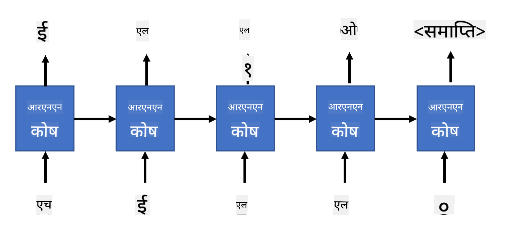

<!--
CO_OP_TRANSLATOR_METADATA:
{
  "original_hash": "d9de7847385eeeda67cfdcce1640ab72",
  "translation_date": "2025-08-26T08:20:56+00:00",
  "source_file": "lessons/5-NLP/17-GenerativeNetworks/README.md",
  "language_code": "ne"
}
-->
# जेनेरेटिभ नेटवर्कहरू

## [पाठ अघि क्विज](https://red-field-0a6ddfd03.1.azurestaticapps.net/quiz/117)

रिकरन्ट न्युरल नेटवर्कहरू (RNNs) र तिनका गेटेड सेल भेरियन्टहरू जस्तै लङ सर्ट टर्म मेमोरी सेलहरू (LSTMs) र गेटेड रिकरन्ट युनिटहरू (GRUs) ले भाषा मोडलिङको लागि एक मेकानिज्म प्रदान गर्छन् जसले शब्दहरूको क्रम सिक्न सक्छ र अनुक्रममा अर्को शब्दको भविष्यवाणी गर्न सक्छ। यसले RNNs लाई **जेनेरेटिभ कार्यहरू** जस्तै सामान्य पाठ उत्पादन, मेसिन अनुवाद, र छविको क्याप्शनिङको लागि प्रयोग गर्न अनुमति दिन्छ।

> ✅ सोच्नुहोस् तपाईंले पाठ पूरा गर्न जस्तै जेनेरेटिभ कार्यहरूबाट कति पटक फाइदा लिनुभएको छ। तपाईंको मनपर्ने एप्लिकेसनहरूमा अनुसन्धान गर्नुहोस् कि तिनीहरूले RNNs प्रयोग गरेका छन् कि छैनन्।

पछिल्लो युनिटमा हामीले चर्चा गरेको RNN आर्किटेक्चरमा, प्रत्येक RNN युनिटले अर्को लुकेको अवस्था उत्पादन गर्थ्यो। तर, हामी प्रत्येक रिकरन्ट युनिटमा अर्को आउटपुट थप्न सक्छौं, जसले हामीलाई **अनुक्रम** (जसको लम्बाइ मूल अनुक्रमसँग समान छ) उत्पादन गर्न अनुमति दिन्छ। साथै, हामी RNN युनिटहरू प्रयोग गर्न सक्छौं जसले प्रत्येक चरणमा इनपुट स्वीकार गर्दैनन्, र केवल केही प्रारम्भिक अवस्था भेक्टर लिन्छन्, र त्यसपछि आउटपुटहरूको अनुक्रम उत्पादन गर्छन्।

यसले विभिन्न न्युरल आर्किटेक्चरहरूलाई अनुमति दिन्छ जुन तलको चित्रमा देखाइएको छ:


> ब्लग पोस्ट [Unreasonable Effectiveness of Recurrent Neural Networks](http://karpathy.github.io/2015/05/21/rnn-effectiveness/) बाट [Andrej Karpaty](http://karpathy.github.io/) द्वारा

* **वन-टु-वन** एक परम्परागत न्युरल नेटवर्क हो जसमा एक इनपुट र एक आउटपुट हुन्छ।
* **वन-टु-म्यानी** एक जेनेरेटिभ आर्किटेक्चर हो जसले एक इनपुट मान स्वीकार्छ, र आउटपुट मानहरूको अनुक्रम उत्पन्न गर्छ। उदाहरणका लागि, यदि हामी एउटा **छवि क्याप्शनिङ** नेटवर्कलाई तालिम दिन चाहन्छौं जसले चित्रको पाठ विवरण उत्पादन गर्छ, हामी चित्रलाई इनपुटको रूपमा लिन सक्छौं, यसलाई CNN मार्फत पास गरेर यसको लुकेको अवस्था प्राप्त गर्न सक्छौं, र त्यसपछि रिकरन्ट चेनले शब्द-दर-शब्द क्याप्शन उत्पन्न गर्छ।
* **म्यानी-टु-वन** पछिल्लो युनिटमा वर्णन गरिएको RNN आर्किटेक्चरहरूसँग मेल खान्छ, जस्तै पाठ वर्गीकरण।
* **म्यानी-टु-म्यानी**, वा **अनुक्रम-टु-अनुक्रम** जस्तै कार्यहरूलाई मेल खान्छ जस्तै **मेसिन अनुवाद**, जहाँ पहिलो RNN ले इनपुट अनुक्रमबाट सबै जानकारी लुकेको अवस्थामा सङ्कलन गर्छ, र अर्को RNN चेनले यो अवस्था आउटपुट अनुक्रममा अनरोल गर्छ।

यस युनिटमा, हामी सरल जेनेरेटिभ मोडेलहरूमा केन्द्रित हुनेछौं जसले हामीलाई पाठ उत्पन्न गर्न मद्दत गर्छ। सरलताको लागि, हामी क्यारेक्टर-स्तर टोकनाइजेशन प्रयोग गर्नेछौं।

हामी यस RNN लाई चरण-दर-चरण पाठ उत्पन्न गर्न तालिम दिनेछौं। प्रत्येक चरणमा, हामी `nchars` लम्बाइको क्यारेक्टरहरूको अनुक्रम लिन्छौं, र नेटवर्कलाई प्रत्येक इनपुट क्यारेक्टरको लागि अर्को आउटपुट क्यारेक्टर उत्पन्न गर्न सोध्छौं:



पाठ उत्पन्न गर्दा (इनफरेन्सको समयमा), हामी केही **प्रम्प्ट** बाट सुरु गर्छौं, जुन RNN सेलहरू मार्फत पास गरिन्छ यसको अन्तरिम अवस्था उत्पन्न गर्न, र त्यसपछि यस अवस्थाबाट उत्पादन सुरु हुन्छ। हामी एक पटकमा एक क्यारेक्टर उत्पन्न गर्छौं, र अर्को RNN सेलमा अवस्था र उत्पन्न क्यारेक्टर पास गर्छौं अर्को क्यारेक्टर उत्पन्न गर्न, जबसम्म पर्याप्त क्यारेक्टरहरू उत्पन्न हुँदैन।


> लेखकद्वारा चित्र

## ✍️ अभ्यासहरू: जेनेरेटिभ नेटवर्कहरू

तलका नोटबुकहरूमा आफ्नो सिकाइ जारी राख्नुहोस्:

* [PyTorch संग जेनेरेटिभ नेटवर्कहरू](../../../../../lessons/5-NLP/17-GenerativeNetworks/GenerativePyTorch.ipynb)
* [TensorFlow संग जेनेरेटिभ नेटवर्कहरू](../../../../../lessons/5-NLP/17-GenerativeNetworks/GenerativeTF.ipynb)

## सफ्ट पाठ उत्पादन र तापक्रम

प्रत्येक RNN सेलको आउटपुट क्यारेक्टरहरूको सम्भाव्यता वितरण हो। यदि हामी सधैं उच्चतम सम्भाव्यता भएको क्यारेक्टरलाई उत्पन्न पाठको अर्को क्यारेक्टरको रूपमा लिन्छौं भने, पाठ अक्सर "चक्रित" हुन सक्छ र बारम्बार उही क्यारेक्टर अनुक्रमहरूमा फस्न सक्छ, जस्तै यो उदाहरणमा:

```
today of the second the company and a second the company ...
```

तर, यदि हामी अर्को क्यारेक्टरको सम्भाव्यता वितरणलाई हेर्छौं भने, केही उच्चतम सम्भावनाहरूको बीचको भिन्नता ठूलो नहुन सक्छ, जस्तै एक क्यारेक्टरको सम्भाव्यता 0.2 हुन सक्छ, अर्को - 0.19, आदि। उदाहरणका लागि, '*play*' अनुक्रममा अर्को क्यारेक्टरको खोज गर्दा, अर्को क्यारेक्टर स्पेस वा **e** (जस्तै शब्द *player* मा) हुन सक्छ।

यसले हामीलाई यो निष्कर्षमा पुर्‍याउँछ कि उच्च सम्भाव्यता भएको क्यारेक्टर चयन गर्नु सधैं "न्यायोचित" हुँदैन, किनकि दोस्रो उच्च सम्भाव्यता चयन गर्दा पनि अर्थपूर्ण पाठमा पुग्न सक्छ। यो अधिक बुद्धिमानी हुन्छ कि नेटवर्क आउटपुटले दिएको सम्भाव्यता वितरणबाट क्यारेक्टरहरू **नमूना** गरौं। हामी **तापक्रम** नामक एक प्यारामिटर पनि प्रयोग गर्न सक्छौं, जसले सम्भाव्यता वितरणलाई समतल बनाउँछ, यदि हामी थप अनियमितता थप्न चाहन्छौं, वा यसलाई अधिक तीव्र बनाउँछ, यदि हामी उच्च सम्भाव्यता क्यारेक्टरहरूमा बढी टाँसिन चाहन्छौं।

तलका नोटबुकहरूमा यो सफ्ट पाठ उत्पादन कसरी कार्यान्वयन गरिएको छ भनेर अन्वेषण गर्नुहोस्।

## निष्कर्ष

पाठ उत्पादन आफैंमा उपयोगी हुन सक्छ, तर प्रमुख फाइदा RNNs प्रयोग गरेर केही प्रारम्भिक फिचर भेक्टरबाट पाठ उत्पन्न गर्ने क्षमताबाट आउँछ। उदाहरणका लागि, पाठ उत्पादन मेसिन अनुवादको भागको रूपमा प्रयोग गरिन्छ (अनुक्रम-टु-अनुक्रम, यस अवस्थामा *एन्कोडर* बाट राज्य भेक्टर प्रयोग गरेर अनुवाद गरिएको सन्देश उत्पन्न वा *डिकोड* गर्न), वा छविको पाठ विवरण उत्पन्न गर्न (यस अवस्थामा फिचर भेक्टर CNN एक्स्ट्र्याक्टरबाट आउँछ)।

## 🚀 चुनौती

यस विषयमा Microsoft Learn मा केही पाठहरू लिनुहोस्

* [PyTorch](https://docs.microsoft.com/learn/modules/intro-natural-language-processing-pytorch/6-generative-networks/?WT.mc_id=academic-77998-cacaste)/[TensorFlow](https://docs.microsoft.com/learn/modules/intro-natural-language-processing-tensorflow/5-generative-networks/?WT.mc_id=academic-77998-cacaste) संग पाठ उत्पादन

## [पाठ पछि क्विज](https://red-field-0a6ddfd03.1.azurestaticapps.net/quiz/217)

## समीक्षा र आत्म अध्ययन

तपाईंको ज्ञान विस्तार गर्नका लागि यहाँ केही लेखहरू छन्:

* मार्कोभ चेन, LSTM र GPT-2 संग पाठ उत्पादनका विभिन्न दृष्टिकोणहरू: [ब्लग पोस्ट](https://towardsdatascience.com/text-generation-gpt-2-lstm-markov-chain-9ea371820e1e)
* [Keras डकुमेन्टेशन](https://keras.io/examples/generative/lstm_character_level_text_generation/) मा पाठ उत्पादनको नमूना

## [असाइनमेन्ट](lab/README.md)

हामीले क्यारेक्टर-दर-क्यारेक्टर पाठ उत्पादन कसरी गर्ने देख्यौं। प्रयोगशालामा, तपाईं शब्द-स्तर पाठ उत्पादन अन्वेषण गर्नुहुनेछ।

**अस्वीकरण**:  
यो दस्तावेज़ AI अनुवाद सेवा [Co-op Translator](https://github.com/Azure/co-op-translator) प्रयोग गरी अनुवाद गरिएको हो। हामी यथासम्भव शुद्धताको प्रयास गर्छौं, तर कृपया ध्यान दिनुहोस् कि स्वचालित अनुवादमा त्रुटि वा अशुद्धता हुन सक्छ। मूल भाषामा रहेको मूल दस्तावेज़लाई आधिकारिक स्रोत मानिनुपर्छ। महत्वपूर्ण जानकारीका लागि, व्यावसायिक मानव अनुवाद सिफारिस गरिन्छ। यस अनुवादको प्रयोगबाट उत्पन्न हुने कुनै पनि गलतफहमी वा गलत व्याख्याका लागि हामी जिम्मेवार हुने छैनौं।