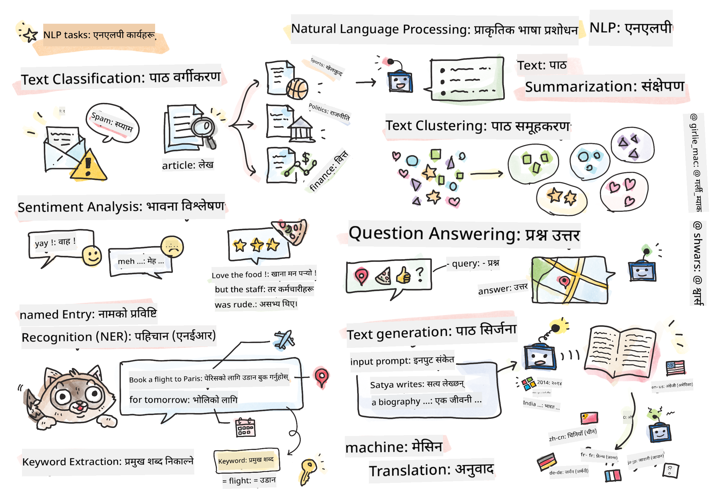

<!--
CO_OP_TRANSLATOR_METADATA:
{
  "original_hash": "8ef02a9318257ea140ed3ed74442096d",
  "translation_date": "2025-08-26T08:05:24+00:00",
  "source_file": "lessons/5-NLP/README.md",
  "language_code": "ne"
}
-->
# प्राकृतिक भाषा प्रशोधन



यस खण्डमा, हामी **प्राकृतिक भाषा प्रशोधन (NLP)** सम्बन्धित कार्यहरू समाधान गर्न न्युरल नेटवर्कहरू प्रयोग गर्ने कुरामा ध्यान केन्द्रित गर्नेछौं। कम्प्युटरले समाधान गर्नुपर्ने धेरै NLP समस्याहरू छन्:

* **पाठ वर्गीकरण** पाठ अनुक्रमसँग सम्बन्धित एक सामान्य वर्गीकरण समस्या हो। उदाहरणहरूमा ईमेल सन्देशहरूलाई स्पाम र नन-स्पाममा वर्गीकरण गर्नु, वा लेखहरूलाई खेलकुद, व्यापार, राजनीति आदि जस्ता श्रेणीहरूमा वर्गीकरण गर्नु समावेश छ। साथै, च्याट बोटहरू विकास गर्दा, प्रायः प्रयोगकर्ताले के भन्न खोजेको हो बुझ्न आवश्यक हुन्छ - यस अवस्थामा हामी **आशय वर्गीकरण**सँग व्यवहार गरिरहेका हुन्छौं। आशय वर्गीकरणमा प्रायः धेरै श्रेणीहरूसँग व्यवहार गर्नुपर्छ।

* **भावना विश्लेषण** एक सामान्य प्रतिगमन समस्या हो, जहाँ वाक्यको अर्थ कति सकारात्मक/नकारात्मक छ भन्ने संख्या (भावना) दिनुपर्छ। भावना विश्लेषणको उन्नत संस्करण **पक्ष-आधारित भावना विश्लेषण** (ABSA) हो, जहाँ भावना सम्पूर्ण वाक्यलाई होइन, यसको विभिन्न भागहरू (पक्षहरू) लाई दिनुपर्छ। जस्तै, *यो रेस्टुरेन्टमा मलाई खाना मन पर्‍यो, तर वातावरण डरलाग्दो थियो*।

* **नामित इकाई पहिचान** (NER) पाठबाट निश्चित इकाईहरू निकाल्ने समस्यालाई जनाउँछ। उदाहरणका लागि, वाक्यांश *म भोलि पेरिस जानुपर्छ* मा *भोलि* शब्दले मिति (DATE) जनाउँछ, र *पेरिस* स्थान (LOCATION) हो भन्ने बुझ्न आवश्यक हुन सक्छ।  

* **किवर्ड निकाल्ने** NER जस्तै हो, तर यसमा विशिष्ट इकाई प्रकारहरूको लागि पूर्व-प्रशिक्षण नगरी वाक्यको अर्थका लागि महत्त्वपूर्ण शब्दहरू स्वचालित रूपमा निकाल्नुपर्छ।

* **पाठ क्लस्टरिङ** उपयोगी हुन्छ जब हामी समान वाक्यहरूलाई समूहबद्ध गर्न चाहन्छौं, जस्तै, प्राविधिक समर्थन वार्तालापहरूमा समान अनुरोधहरू।

* **प्रश्न उत्तर दिने** मोडेलको क्षमता हो जसले विशिष्ट प्रश्नको उत्तर दिन्छ। मोडेलले पाठ खण्ड र प्रश्नलाई इनपुटको रूपमा लिन्छ, र प्रश्नको उत्तर समावेश भएको पाठको स्थान प्रदान गर्नुपर्छ (कहिलेकाहीँ, उत्तर पाठ उत्पन्न गर्नुपर्छ)।

* **पाठ उत्पन्न गर्ने** मोडेलको क्षमता हो जसले नयाँ पाठ उत्पन्न गर्छ। यसलाई *पाठ संकेत* को आधारमा अर्को अक्षर/शब्दको भविष्यवाणी गर्ने वर्गीकरण कार्यको रूपमा मान्न सकिन्छ। उन्नत पाठ उत्पन्न गर्ने मोडेलहरू, जस्तै GPT-3, [प्रम्ट प्रोग्रामिङ](https://towardsdatascience.com/software-3-0-how-prompting-will-change-the-rules-of-the-game-a982fbfe1e0) वा [प्रम्ट इन्जिनियरिङ](https://medium.com/swlh/openai-gpt-3-and-prompt-engineering-dcdc2c5fcd29) नामक प्रविधि प्रयोग गरेर अन्य NLP कार्यहरू समाधान गर्न सक्षम छन्।

* **पाठ संक्षेपण** एउटा प्रविधि हो जहाँ हामी कम्प्युटरलाई लामो पाठ "पढ्न" र केही वाक्यहरूमा संक्षेप गर्न चाहन्छौं।

* **मेसिन अनुवाद** एउटा प्रविधि हो जसले एउटा भाषामा पाठ बुझ्ने र अर्को भाषामा पाठ उत्पन्न गर्ने संयोजनको रूपमा काम गर्छ।

सुरुमा, धेरै NLP कार्यहरू परम्परागत विधिहरू जस्तै व्याकरण प्रयोग गरेर समाधान गरिन्थ्यो। उदाहरणका लागि, मेसिन अनुवादमा प्रारम्भिक वाक्यलाई वाक्य संरचना (syntax tree) मा रूपान्तरण गर्न पार्सरहरू प्रयोग गरिन्थ्यो, त्यसपछि वाक्यको अर्थ प्रतिनिधित्व गर्न उच्च स्तरका अर्थ संरचनाहरू निकालिन्थ्यो, र यस अर्थ र लक्ष्य भाषाको व्याकरणको आधारमा परिणाम उत्पन्न गरिन्थ्यो। आजकल, धेरै NLP कार्यहरू न्युरल नेटवर्कहरू प्रयोग गरेर बढी प्रभावकारी रूपमा समाधान गरिन्छ।

> धेरै परम्परागत NLP विधिहरू [Natural Language Processing Toolkit (NLTK)](https://www.nltk.org) नामक Python पुस्तकालयमा कार्यान्वयन गरिएका छन्। [NLTK पुस्तक](https://www.nltk.org/book/) अनलाइन उपलब्ध छ, जसले NLTK प्रयोग गरेर विभिन्न NLP कार्यहरू कसरी समाधान गर्न सकिन्छ भन्ने कभर गर्छ।

हाम्रो पाठ्यक्रममा, हामी NLP का लागि न्युरल नेटवर्कहरू प्रयोग गर्नमा ध्यान केन्द्रित गर्नेछौं, र आवश्यक परेमा NLTK प्रयोग गर्नेछौं।

हामीले पहिले नै तालिका डेटा र छविहरूसँग व्यवहार गर्न न्युरल नेटवर्कहरू प्रयोग गर्ने बारे सिकिसकेका छौं। ती प्रकारका डेटा र पाठबीचको मुख्य भिन्नता यो हो कि पाठ एक परिवर्तनशील लम्बाइको अनुक्रम हो, जबकि छविहरूको इनपुट आकार पहिले नै थाहा हुन्छ। यद्यपि, कनभोलुसनल नेटवर्कहरूले इनपुट डेटा बाट ढाँचाहरू निकाल्न सक्छन्, पाठमा ढाँचाहरू अझ जटिल हुन्छन्। जस्तै, नकारात्मकता (negation) विषयबाट धेरै शब्दहरू टाढा हुन सक्छ (जस्तै, *मलाई सुन्तला मन पर्दैन* vs. *मलाई ती ठूला रङ्गीन स्वादिष्ट सुन्तला मन पर्दैन*), र यसलाई अझै पनि एउटै ढाँचाको रूपमा व्याख्या गर्नुपर्छ। त्यसैले, भाषा व्यवस्थापन गर्न हामीले नयाँ न्युरल नेटवर्क प्रकारहरू, जस्तै *पुनरावर्ती नेटवर्कहरू* र *ट्रान्सफर्मरहरू* परिचय गराउन आवश्यक छ।

## पुस्तकालयहरू स्थापना गर्नुहोस्

यदि तपाईंले यो पाठ्यक्रम चलाउन स्थानीय Python स्थापना प्रयोग गर्दै हुनुहुन्छ भने, NLP का लागि आवश्यक सबै पुस्तकालयहरू निम्न आदेशहरू प्रयोग गरेर स्थापना गर्नुपर्ने हुन सक्छ:

**PyTorch का लागि**
```bash
pip install -r requirements-torch.txt
```
**TensorFlow का लागि**
```bash
pip install -r requirements-tf.txt
```

> तपाईं [Microsoft Learn](https://docs.microsoft.com/learn/modules/intro-natural-language-processing-tensorflow/?WT.mc_id=academic-77998-cacaste) मा TensorFlow प्रयोग गरेर NLP प्रयास गर्न सक्नुहुन्छ।

## GPU चेतावनी

यस खण्डमा, केही उदाहरणहरूमा हामी ठूला मोडेलहरू प्रशिक्षण गर्नेछौं।
* **GPU-सक्षम कम्प्युटर प्रयोग गर्नुहोस्**: ठूला मोडेलहरूसँग काम गर्दा प्रतीक्षा समय घटाउन GPU-सक्षम कम्प्युटरमा नोटबुकहरू चलाउन सिफारिस गरिन्छ।
* **GPU मेमोरी सीमाहरू**: GPU मा चलाउँदा, विशेष गरी ठूला मोडेलहरू प्रशिक्षण गर्दा, GPU मेमोरी सकिने अवस्था आउन सक्छ।
* **GPU मेमोरी खपत**: प्रशिक्षणको क्रममा GPU मेमोरी खपत विभिन्न कारकहरूमा निर्भर गर्दछ, जस्तै मिनिब्याच साइज।
* **मिनिब्याच साइज घटाउनुहोस्**: यदि GPU मेमोरी समस्याहरू सामना गर्नुहुन्छ भने, तपाईंको कोडमा मिनिब्याच साइज घटाउने कुरा समाधानको रूपमा विचार गर्न सक्नुहुन्छ।
* **TensorFlow GPU मेमोरी रिलीज**: TensorFlow का पुराना संस्करणहरूले एउटै Python कर्नेलमा धेरै मोडेलहरू प्रशिक्षण गर्दा GPU मेमोरी सही रूपमा रिलीज नगर्न सक्छ। GPU मेमोरी प्रयोगलाई प्रभावकारी रूपमा व्यवस्थापन गर्न, तपाईं TensorFlow लाई आवश्यक पर्दा मात्र GPU मेमोरी आवंटन गर्न कन्फिगर गर्न सक्नुहुन्छ।
* **कोड समावेश गर्नुहोस्**: TensorFlow लाई आवश्यक पर्दा मात्र GPU मेमोरी बढ्न दिन निम्न कोड तपाईंको नोटबुकहरूमा समावेश गर्नुहोस्:

```python
physical_devices = tf.config.list_physical_devices('GPU') 
if len(physical_devices)>0:
    tf.config.experimental.set_memory_growth(physical_devices[0], True) 
```

यदि तपाईं क्लासिक ML दृष्टिकोणबाट NLP सिक्न इच्छुक हुनुहुन्छ भने, [यस पाठहरूको सेट](https://github.com/microsoft/ML-For-Beginners/tree/main/6-NLP) भ्रमण गर्नुहोस्।

## यस खण्डमा
यस खण्डमा हामी सिक्नेछौं:

* [पाठलाई टेन्सरको रूपमा प्रतिनिधित्व गर्ने](13-TextRep/README.md)
* [शब्द एम्बेडिङहरू](14-Emdeddings/README.md)
* [भाषा मोडलिङ](15-LanguageModeling/README.md)
* [पुनरावर्ती न्युरल नेटवर्कहरू](16-RNN/README.md)
* [उत्पन्न गर्ने नेटवर्कहरू](17-GenerativeNetworks/README.md)
* [ट्रान्सफर्मरहरू](18-Transformers/README.md)

**अस्वीकरण**:  
यो दस्तावेज़ AI अनुवाद सेवा [Co-op Translator](https://github.com/Azure/co-op-translator) प्रयोग गरेर अनुवाद गरिएको छ। हामी शुद्धताको लागि प्रयास गर्छौं, तर कृपया ध्यान दिनुहोस् कि स्वचालित अनुवादमा त्रुटिहरू वा अशुद्धताहरू हुन सक्छ। यसको मूल भाषा मा रहेको मूल दस्तावेज़लाई आधिकारिक स्रोत मानिनुपर्छ। महत्वपूर्ण जानकारीको लागि, व्यावसायिक मानव अनुवाद सिफारिस गरिन्छ। यस अनुवादको प्रयोगबाट उत्पन्न हुने कुनै पनि गलतफहमी वा गलत व्याख्याको लागि हामी जिम्मेवार हुने छैनौं।