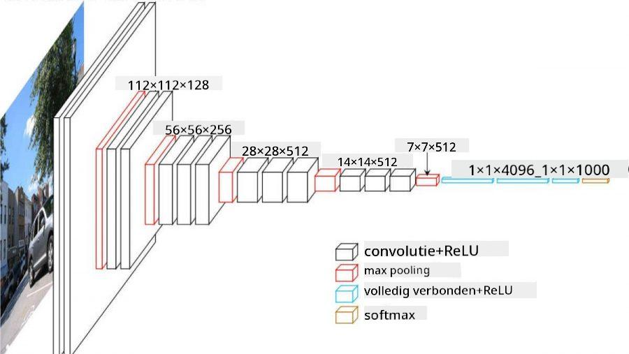

<!--
CO_OP_TRANSLATOR_METADATA:
{
  "original_hash": "53faab85adfcebd8c10bcd71dc2fa557",
  "translation_date": "2025-09-23T10:07:06+00:00",
  "source_file": "lessons/4-ComputerVision/07-ConvNets/CNN_Architectures.md",
  "language_code": "nl"
}
-->
# Bekende CNN-Architecturen

### VGG-16

VGG-16 is een netwerk dat in 2014 een nauwkeurigheid van 92,7% behaalde in de ImageNet top-5 classificatie. Het heeft de volgende laagstructuur:

Zoals je kunt zien, volgt VGG een traditionele piramide-architectuur, wat een opeenvolging is van convolutie- en poolinglagen.

> Afbeelding van [Researchgate](https://www.researchgate.net/figure/Vgg16-model-structure-To-get-the-VGG-NIN-model-we-replace-the-2-nd-4-th-6-th-7-th_fig2_335194493)

### ResNet

ResNet is een familie van modellen die in 2015 werd voorgesteld door Microsoft Research. Het belangrijkste idee achter ResNet is het gebruik van **residuele blokken**:

> Afbeelding uit [dit artikel](https://arxiv.org/pdf/1512.03385.pdf)

De reden voor het gebruik van een identiteitsdoorvoer is dat de laag **het verschil** voorspelt tussen het resultaat van een vorige laag en de uitvoer van het residuele blok - vandaar de naam *residueel*. Deze blokken zijn veel gemakkelijker te trainen, en men kan netwerken bouwen met honderden van deze blokken (de meest voorkomende varianten zijn ResNet-52, ResNet-101 en ResNet-152).

Je kunt dit netwerk ook zien als een model dat zijn complexiteit aanpast aan de dataset. Aan het begin van de training, wanneer de gewichten klein zijn, gaat het grootste deel van het signaal door de identiteitslagen. Naarmate de training vordert en de gewichten groter worden, neemt het belang van de netwerkparameters toe, en past het netwerk zich aan om de benodigde expressieve kracht te bieden om de trainingsafbeeldingen correct te classificeren.

### Google Inception

De Google Inception-architectuur gaat nog een stap verder en bouwt elke netwerklaag als een combinatie van verschillende paden:

> Afbeelding van [Researchgate](https://www.researchgate.net/figure/Inception-module-with-dimension-reductions-left-and-schema-for-Inception-ResNet-v1_fig2_355547454)

Hier moeten we de rol van 1x1-convoluties benadrukken, omdat ze in eerste instantie misschien niet logisch lijken. Waarom zouden we een afbeelding doorlopen met een 1x1-filter? Je moet echter onthouden dat convolutiefilters ook werken met meerdere dieptekanalen (oorspronkelijk RGB-kleuren, in latere lagen kanalen voor verschillende filters), en 1x1-convolutie wordt gebruikt om deze invoerkanalen samen te voegen met verschillende trainbare gewichten. Het kan ook worden gezien als downsampling (pooling) over de kanaaldimensie.

Hier is [een goed blogartikel](https://medium.com/analytics-vidhya/talented-mr-1x1-comprehensive-look-at-1x1-convolution-in-deep-learning-f6b355825578) over dit onderwerp, en [het originele artikel](https://arxiv.org/pdf/1312.4400.pdf).

### MobileNet

MobileNet is een familie van modellen met een kleinere omvang, geschikt voor mobiele apparaten. Gebruik ze als je beperkte middelen hebt en een beetje nauwkeurigheid kunt opofferen. Het belangrijkste idee achter deze modellen is de zogenaamde **depthwise separable convolution**, waarmee convolutiefilters kunnen worden weergegeven als een samenstelling van ruimtelijke convoluties en 1x1-convolutie over dieptekanalen. Dit vermindert het aantal parameters aanzienlijk, waardoor het netwerk kleiner wordt en ook gemakkelijker te trainen is met minder data.

Hier is [een goed blogartikel over MobileNet](https://medium.com/analytics-vidhya/image-classification-with-mobilenet-cc6fbb2cd470).

## Conclusie

In deze eenheid heb je het belangrijkste concept achter neurale netwerken voor computervisie geleerd: convolutionele netwerken. Architecturen uit de praktijk die beeldclassificatie, objectdetectie en zelfs beeldgeneratie aandrijven, zijn allemaal gebaseerd op CNN's, alleen met meer lagen en enkele extra trainingstechnieken.

## 🚀 Uitdaging

In de bijbehorende notebooks staan onderaan notities over hoe je een hogere nauwkeurigheid kunt behalen. Doe wat experimenten om te zien of je een betere nauwkeurigheid kunt bereiken.

## [Post-lecture quiz](https://ff-quizzes.netlify.app/en/ai/quiz/14)

## Herziening & Zelfstudie

Hoewel CNN's meestal worden gebruikt voor computervisie-taken, zijn ze over het algemeen goed in het extraheren van patronen van vaste grootte. Bijvoorbeeld, als we met geluiden werken, kunnen we ook CNN's gebruiken om naar specifieke patronen in het audiosignaal te zoeken - in dat geval zouden de filters 1-dimensionaal zijn (en dit CNN zou een 1D-CNN worden genoemd). Soms wordt ook een 3D-CNN gebruikt om kenmerken in een multidimensionale ruimte te extraheren, zoals bepaalde gebeurtenissen die plaatsvinden in video's - een CNN kan bepaalde patronen van kenmerkveranderingen in de tijd vastleggen. Doe wat onderzoek en zelfstudie over andere taken die met CNN's kunnen worden uitgevoerd.

## [Opdracht](lab/README.md)

In dit lab krijg je de taak om verschillende katten- en hondenrassen te classificeren. Deze afbeeldingen zijn complexer dan de MNIST-dataset, hebben hogere dimensies en er zijn meer dan 10 klassen.

---

