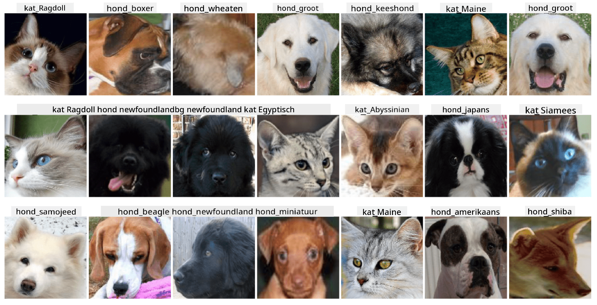

<!--
CO_OP_TRANSLATOR_METADATA:
{
  "original_hash": "f3d2cee9cb3c52160419e560c57a690e",
  "translation_date": "2025-08-28T19:26:02+00:00",
  "source_file": "lessons/4-ComputerVision/07-ConvNets/lab/README.md",
  "language_code": "nl"
}
-->
# Classificatie van Huisdiergezichten

Labopdracht uit de [AI for Beginners Curriculum](https://github.com/microsoft/ai-for-beginners).

## Taak

Stel je voor dat je een applicatie moet ontwikkelen voor een dierenopvang om alle huisdieren te catalogiseren. Een geweldige functie van zo'n applicatie zou zijn om automatisch het ras te herkennen aan de hand van een foto. Dit kan succesvol worden gedaan met behulp van neurale netwerken.

Je moet een convolutioneel neuraal netwerk trainen om verschillende rassen van katten en honden te classificeren met behulp van de **Pet Faces** dataset.

## De Dataset

We zullen de **Pet Faces** dataset gebruiken, afgeleid van de [Oxford-IIIT](https://www.robots.ox.ac.uk/~vgg/data/pets/) huisdieren-dataset. Deze bevat 35 verschillende rassen van honden en katten.



Gebruik de volgende codefragment om de dataset te downloaden:

```python
!wget https://mslearntensorflowlp.blob.core.windows.net/data/petfaces.tar.gz
!tar xfz petfaces.tar.gz
!rm petfaces.tar.gz
```

## Start Notebook

Begin het lab door [PetFaces.ipynb](PetFaces.ipynb) te openen.

## Belangrijkste Leerpunten

Je hebt een relatief complex probleem van beeldclassificatie vanaf nul opgelost! Er waren behoorlijk veel klassen, en je hebt toch een redelijke nauwkeurigheid weten te behalen! Het is ook logisch om de top-k nauwkeurigheid te meten, omdat het gemakkelijk is om sommige klassen te verwarren die zelfs voor mensen niet duidelijk verschillend zijn.

---

**Disclaimer**:  
Dit document is vertaald met behulp van de AI-vertalingsservice [Co-op Translator](https://github.com/Azure/co-op-translator). Hoewel we ons best doen voor nauwkeurigheid, dient u zich ervan bewust te zijn dat geautomatiseerde vertalingen fouten of onnauwkeurigheden kunnen bevatten. Het originele document in zijn oorspronkelijke taal moet worden beschouwd als de gezaghebbende bron. Voor cruciale informatie wordt professionele menselijke vertaling aanbevolen. Wij zijn niet aansprakelijk voor eventuele misverstanden of verkeerde interpretaties die voortvloeien uit het gebruik van deze vertaling.