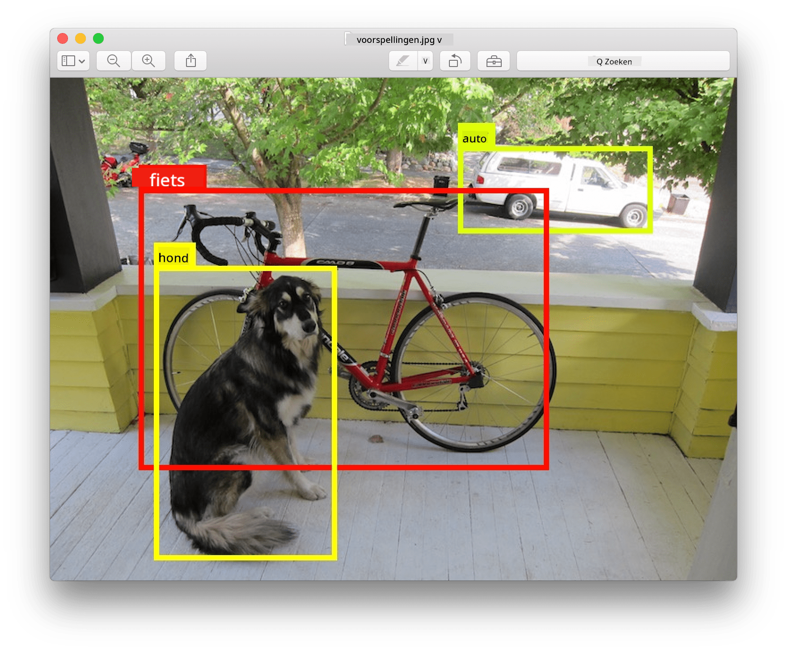
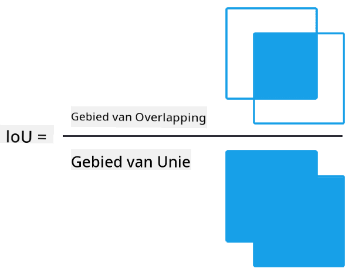
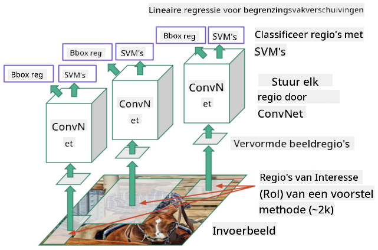
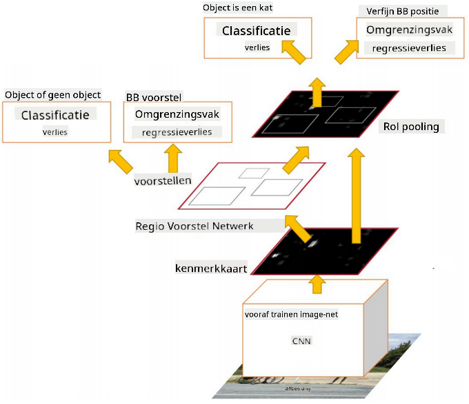
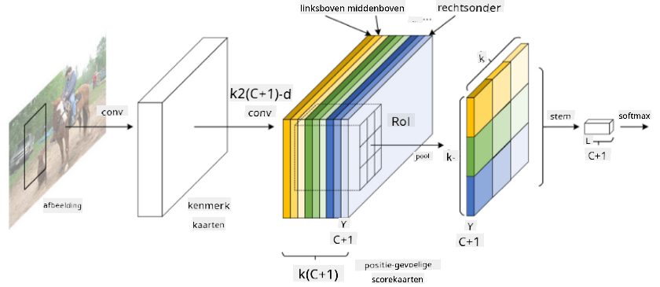
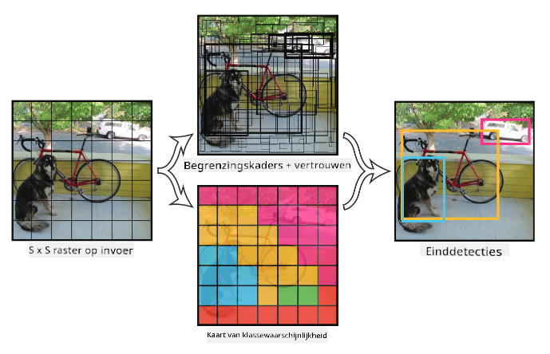

<!--
CO_OP_TRANSLATOR_METADATA:
{
  "original_hash": "d76a7eda28de5210c8b1ba50a6216c69",
  "translation_date": "2025-09-23T10:08:15+00:00",
  "source_file": "lessons/4-ComputerVision/11-ObjectDetection/README.md",
  "language_code": "nl"
}
-->
# Objectdetectie

De beeldclassificatiemodellen die we tot nu toe hebben behandeld, namen een afbeelding en produceerden een categorisch resultaat, zoals de klasse 'nummer' in een MNIST-probleem. Echter, in veel gevallen willen we niet alleen weten dat een afbeelding objecten toont - we willen ook hun exacte locatie bepalen. Dit is precies het doel van **objectdetectie**.

## [Pre-lecture quiz](https://ff-quizzes.netlify.app/en/ai/quiz/21)

> Afbeelding van [YOLO v2 website](https://pjreddie.com/darknet/yolov2/)

## Een eenvoudige aanpak voor objectdetectie

Stel dat we een kat op een afbeelding willen vinden, een zeer eenvoudige aanpak voor objectdetectie zou als volgt zijn:

1. Verdeel de afbeelding in een aantal tegels.
2. Voer beeldclassificatie uit op elke tegel.
3. De tegels die een voldoende hoge activatie opleveren, kunnen worden beschouwd als tegels die het betreffende object bevatten.

> *Afbeelding uit [Exercise Notebook](ObjectDetection-TF.ipynb)*

Deze aanpak is echter verre van ideaal, omdat het algoritme de begrenzingskaders van het object slechts zeer onnauwkeurig kan bepalen. Voor een nauwkeurigere locatie moeten we een vorm van **regressie** uitvoeren om de coördinaten van begrenzingskaders te voorspellen - en daarvoor hebben we specifieke datasets nodig.

## Regressie voor objectdetectie

[Deze blogpost](https://towardsdatascience.com/object-detection-with-neural-networks-a4e2c46b4491) biedt een uitstekende introductie tot het detecteren van vormen.

## Datasets voor objectdetectie

Je kunt de volgende datasets tegenkomen voor deze taak:

* [PASCAL VOC](http://host.robots.ox.ac.uk/pascal/VOC/) - 20 klassen
* [COCO](http://cocodataset.org/#home) - Common Objects in Context. 80 klassen, begrenzingskaders en segmentatiemaskers

## Objectdetectie-metrics

### Intersection over Union

Bij beeldclassificatie is het eenvoudig om te meten hoe goed het algoritme presteert, maar bij objectdetectie moeten we zowel de juistheid van de klasse als de precisie van de voorspelde locatie van het begrenzingskader meten. Voor dat laatste gebruiken we de zogenaamde **Intersection over Union** (IoU), die meet hoe goed twee kaders (of twee willekeurige gebieden) overlappen.

> *Figuur 2 uit [deze uitstekende blogpost over IoU](https://pyimagesearch.com/2016/11/07/intersection-over-union-iou-for-object-detection/)*

Het idee is simpel - we delen het gebied van de overlap tussen twee figuren door het gebied van hun unie. Voor twee identieke gebieden zou IoU 1 zijn, terwijl voor volledig gescheiden gebieden IoU 0 is. Anders varieert het van 0 tot 1. We beschouwen doorgaans alleen die begrenzingskaders waarvoor IoU boven een bepaalde waarde ligt.

### Gemiddelde precisie

Stel dat we willen meten hoe goed een bepaalde klasse van objecten $C$ wordt herkend. Om dit te meten gebruiken we de **Gemiddelde Precisie**-metric, die als volgt wordt berekend:

1. Beschouw de Precision-Recall-curve die de nauwkeurigheid toont afhankelijk van een detectiedrempelwaarde (van 0 tot 1).
2. Afhankelijk van de drempelwaarde worden meer of minder objecten gedetecteerd in de afbeelding, met verschillende waarden voor precisie en recall.
3. De curve ziet er als volgt uit:

> *Afbeelding van [NeuroWorkshop](http://github.com/shwars/NeuroWorkshop)*

De gemiddelde precisie voor een bepaalde klasse $C$ is het gebied onder deze curve. Meer precies, de Recall-as wordt doorgaans verdeeld in 10 delen, en de precisie wordt gemiddeld over al deze punten:

$$
AP = {1\over11}\sum_{i=0}^{10}\mbox{Precision}(\mbox{Recall}={i\over10})
$$

### AP en IoU

We beschouwen alleen die detecties waarvoor IoU boven een bepaalde waarde ligt. Bijvoorbeeld, in de PASCAL VOC-dataset wordt doorgaans $\mbox{IoU Threshold} = 0.5$ aangenomen, terwijl in COCO AP wordt gemeten voor verschillende waarden van $\mbox{IoU Threshold}$.

> *Afbeelding van [NeuroWorkshop](http://github.com/shwars/NeuroWorkshop)*

### Gemiddelde gemiddelde precisie - mAP

De belangrijkste metric voor objectdetectie wordt **Gemiddelde Gemiddelde Precisie**, of **mAP**, genoemd. Dit is de waarde van de gemiddelde precisie, gemiddeld over alle objectklassen, en soms ook over $\mbox{IoU Threshold}$. Het proces van het berekenen van **mAP** wordt in meer detail beschreven
[in deze blogpost](https://medium.com/@timothycarlen/understanding-the-map-evaluation-metric-for-object-detection-a07fe6962cf3)), en ook [hier met codevoorbeelden](https://gist.github.com/tarlen5/008809c3decf19313de216b9208f3734).

## Verschillende benaderingen voor objectdetectie

Er zijn twee brede categorieën van objectdetectie-algoritmen:

* **Region Proposal Networks** (R-CNN, Fast R-CNN, Faster R-CNN). Het belangrijkste idee is om **Regions of Interest** (ROI) te genereren en CNN eroverheen te laten lopen, op zoek naar maximale activatie. Het lijkt een beetje op de eenvoudige aanpak, met als uitzondering dat ROI's op een slimmere manier worden gegenereerd. Een van de grootste nadelen van dergelijke methoden is dat ze traag zijn, omdat we veel passes van de CNN-classificator over de afbeelding nodig hebben.
* **One-pass** (YOLO, SSD, RetinaNet) methoden. In deze architecturen ontwerpen we het netwerk om zowel klassen als ROI's in één keer te voorspellen.

### R-CNN: Region-Based CNN

[R-CNN](http://islab.ulsan.ac.kr/files/announcement/513/rcnn_pami.pdf) gebruikt [Selective Search](http://www.huppelen.nl/publications/selectiveSearchDraft.pdf) om een hiërarchische structuur van ROI-regio's te genereren, die vervolgens door CNN-feature extractors en SVM-classificators worden geleid om de objectklasse te bepalen, en lineaire regressie om de coördinaten van *begrenzingskaders* te bepalen. [Officiële paper](https://arxiv.org/pdf/1506.01497v1.pdf)

> *Afbeelding van van de Sande et al. ICCV’11*

> *Afbeeldingen uit [deze blog](https://towardsdatascience.com/r-cnn-fast-r-cnn-faster-r-cnn-yolo-object-detection-algorithms-36d53571365e)*

### F-RCNN - Fast R-CNN

Deze aanpak lijkt op R-CNN, maar regio's worden gedefinieerd nadat convolutielagen zijn toegepast.

> Afbeelding uit [de officiële paper](https://www.cv-foundation.org/openaccess/content_iccv_2015/papers/Girshick_Fast_R-CNN_ICCV_2015_paper.pdf), [arXiv](https://arxiv.org/pdf/1504.08083.pdf), 2015

### Faster R-CNN

Het belangrijkste idee van deze aanpak is om een neuraal netwerk te gebruiken om ROI's te voorspellen - de zogenaamde *Region Proposal Network*. [Paper](https://arxiv.org/pdf/1506.01497.pdf), 2016

> Afbeelding uit [de officiële paper](https://arxiv.org/pdf/1506.01497.pdf)

### R-FCN: Region-Based Fully Convolutional Network

Dit algoritme is zelfs sneller dan Faster R-CNN. Het belangrijkste idee is als volgt:

1. We extraheren features met behulp van ResNet-101.
2. Features worden verwerkt door **Position-Sensitive Score Map**. Elk object uit $C$ klassen wordt verdeeld in $k\times k$ regio's, en we trainen om delen van objecten te voorspellen.
3. Voor elk deel uit $k\times k$ regio's stemmen alle netwerken op objectklassen, en de objectklasse met de meeste stemmen wordt geselecteerd.

> Afbeelding uit [officiële paper](https://arxiv.org/abs/1605.06409)

### YOLO - You Only Look Once

YOLO is een realtime one-pass algoritme. Het belangrijkste idee is als volgt:

 * De afbeelding wordt verdeeld in $S\times S$ regio's.
 * Voor elke regio voorspelt **CNN** $n$ mogelijke objecten, *begrenzingskader*-coördinaten en *vertrouwen*=*waarschijnlijkheid* * IoU.

 

> Afbeelding uit [officiële paper](https://arxiv.org/abs/1506.02640)

### Andere algoritmen

* RetinaNet: [officiële paper](https://arxiv.org/abs/1708.02002)
   - [PyTorch-implementatie in Torchvision](https://pytorch.org/vision/stable/_modules/torchvision/models/detection/retinanet.html)
   - [Keras-implementatie](https://github.com/fizyr/keras-retinanet)
   - [Objectdetectie met RetinaNet](https://keras.io/examples/vision/retinanet/) in Keras Samples
* SSD (Single Shot Detector): [officiële paper](https://arxiv.org/abs/1512.02325)

## ✍️ Oefeningen: Objectdetectie

Ga verder met leren in het volgende notebook:

[ObjectDetection.ipynb](ObjectDetection.ipynb)

## Conclusie

In deze les heb je een snelle rondleiding gekregen langs de verschillende manieren waarop objectdetectie kan worden uitgevoerd!

## 🚀 Uitdaging

Lees deze artikelen en notebooks over YOLO en probeer ze zelf uit:

* [Goede blogpost](https://www.analyticsvidhya.com/blog/2018/12/practical-guide-object-detection-yolo-framewor-python/) over YOLO
 * [Officiële site](https://pjreddie.com/darknet/yolo/)
 * Yolo: [Keras-implementatie](https://github.com/experiencor/keras-yolo2), [stap-voor-stap notebook](https://github.com/experiencor/basic-yolo-keras/blob/master/Yolo%20Step-by-Step.ipynb)
 * Yolo v2: [Keras-implementatie](https://github.com/experiencor/keras-yolo2), [stap-voor-stap notebook](https://github.com/experiencor/keras-yolo2/blob/master/Yolo%20Step-by-Step.ipynb)

## [Post-lecture quiz](https://ff-quizzes.netlify.app/en/ai/quiz/22)

## Review & Zelfstudie

* [Objectdetectie](https://tjmachinelearning.com/lectures/1718/obj/) door Nikhil Sardana
* [Een goede vergelijking van objectdetectie-algoritmen](https://lilianweng.github.io/lil-log/2018/12/27/object-detection-part-4.html)
* [Review van deep learning-algoritmen voor objectdetectie](https://medium.com/comet-app/review-of-deep-learning-algorithms-for-object-detection-c1f3d437b852)
* [Een stapsgewijze introductie tot de basisobjectdetectie-algoritmen](https://www.analyticsvidhya.com/blog/2018/10/a-step-by-step-introduction-to-the-basic-object-detection-algorithms-part-1/)
* [Implementatie van Faster R-CNN in Python voor objectdetectie](https://www.analyticsvidhya.com/blog/2018/11/implementation-faster-r-cnn-python-object-detection/)

## [Opdracht: Objectdetectie](lab/README.md)

---

