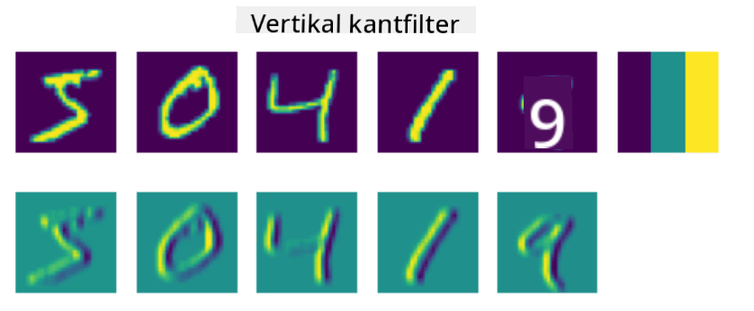
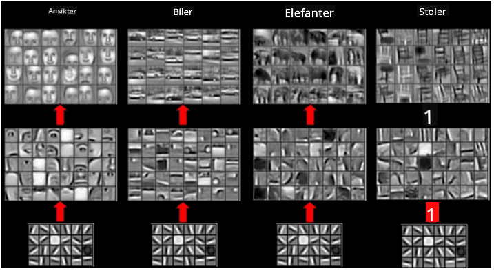

<!--
CO_OP_TRANSLATOR_METADATA:
{
  "original_hash": "a560d5b845962cf33dc102266e409568",
  "translation_date": "2025-09-23T09:38:44+00:00",
  "source_file": "lessons/4-ComputerVision/07-ConvNets/README.md",
  "language_code": "no"
}
-->
# Konvolusjonelle Nevrale Nettverk

Vi har tidligere sett at nevrale nettverk er ganske gode til å håndtere bilder, og til og med en ett-lags perceptron kan gjenkjenne håndskrevne sifre fra MNIST-datasettet med rimelig nøyaktighet. MNIST-datasettet er imidlertid veldig spesielt, og alle sifrene er sentrert i bildet, noe som gjør oppgaven enklere.

## [Quiz før forelesning](https://ff-quizzes.netlify.app/en/ai/quiz/13)

I virkeligheten ønsker vi å kunne gjenkjenne objekter på et bilde uavhengig av deres eksakte plassering i bildet. Datamaskinsyn er forskjellig fra generell klassifisering, fordi når vi prøver å finne et bestemt objekt i bildet, skanner vi bildet og leter etter spesifikke **mønstre** og deres kombinasjoner. For eksempel, når vi ser etter en katt, kan vi først se etter horisontale linjer som kan danne værhår, og deretter kan en viss kombinasjon av værhår fortelle oss at det faktisk er et bilde av en katt. Relativ posisjon og tilstedeværelse av visse mønstre er viktig, og ikke deres eksakte plassering i bildet.

For å trekke ut mønstre, vil vi bruke begrepet **konvolusjonsfiltre**. Som du vet, er et bilde representert av en 2D-matrise, eller en 3D-tensor med fargedybde. Å bruke et filter betyr at vi tar en relativt liten **filterkjerne**-matrise, og for hver piksel i det originale bildet beregner vi det vektede gjennomsnittet med nabopunktene. Vi kan se på dette som et lite vindu som glir over hele bildet og jevner ut alle pikslene i henhold til vektene i filterkjernematrisen.

 | 
----|----

> Bilde av Dmitry Soshnikov

For eksempel, hvis vi bruker 3x3 vertikale og horisontale kantfiltre på MNIST-sifrene, kan vi få fremhevinger (f.eks. høye verdier) der det er vertikale og horisontale kanter i vårt originale bilde. Dermed kan disse to filtrene brukes til å "se etter" kanter. På samme måte kan vi designe forskjellige filtre for å se etter andre lavnivåmønstre:

> Bilde av [Leung-Malik Filter Bank](https://www.robots.ox.ac.uk/~vgg/research/texclass/filters.html)

Mens vi kan designe filtrene manuelt for å trekke ut noen mønstre, kan vi også designe nettverket slik at det lærer mønstrene automatisk. Dette er en av hovedideene bak CNN.

## Hovedideer bak CNN

Måten CNN-er fungerer på er basert på følgende viktige ideer:

* Konvolusjonsfiltre kan trekke ut mønstre
* Vi kan designe nettverket slik at filtrene trenes automatisk
* Vi kan bruke samme tilnærming for å finne mønstre i høyere nivå-funksjoner, ikke bare i det originale bildet. Dermed fungerer CNN-funksjonsekstraksjon på en hierarki av funksjoner, fra lavnivå pikselkombinasjoner til høyere nivå kombinasjoner av bildeelementer.

> Bilde fra [en artikkel av Hislop-Lynch](https://www.semanticscholar.org/paper/Computer-vision-based-pedestrian-trajectory-Hislop-Lynch/26e6f74853fc9bbb7487b06dc2cf095d36c9021d), basert på [deres forskning](https://dl.acm.org/doi/abs/10.1145/1553374.1553453)

## ✍️ Øvelser: Konvolusjonelle Nevrale Nettverk

La oss fortsette å utforske hvordan konvolusjonelle nevrale nettverk fungerer, og hvordan vi kan oppnå trenbare filtre, ved å jobbe gjennom de tilhørende notatbøkene:

* [Konvolusjonelle Nevrale Nettverk - PyTorch](ConvNetsPyTorch.ipynb)
* [Konvolusjonelle Nevrale Nettverk - TensorFlow](ConvNetsTF.ipynb)

## Pyramidearkitektur

De fleste CNN-er som brukes til bildebehandling følger en såkalt pyramidearkitektur. Det første konvolusjonslaget som brukes på de originale bildene har vanligvis et relativt lavt antall filtre (8-16), som tilsvarer forskjellige pikselkombinasjoner, som horisontale/vertikale linjer eller strøk. På neste nivå reduserer vi den romlige dimensjonen til nettverket og øker antallet filtre, som tilsvarer flere mulige kombinasjoner av enkle funksjoner. Med hvert lag, når vi beveger oss mot den endelige klassifiseringen, reduseres de romlige dimensjonene til bildet, og antallet filtre øker.

Som et eksempel, la oss se på arkitekturen til VGG-16, et nettverk som oppnådde 92,7 % nøyaktighet i ImageNet's topp-5 klassifisering i 2014:

> Bilde fra [Researchgate](https://www.researchgate.net/figure/Vgg16-model-structure-To-get-the-VGG-NIN-model-we-replace-the-2-nd-4-th-6-th-7-th_fig2_335194493)

## Mest Kjente CNN-arkitekturer

[Fortsett studiet om de mest kjente CNN-arkitekturene](CNN_Architectures.md)

---

