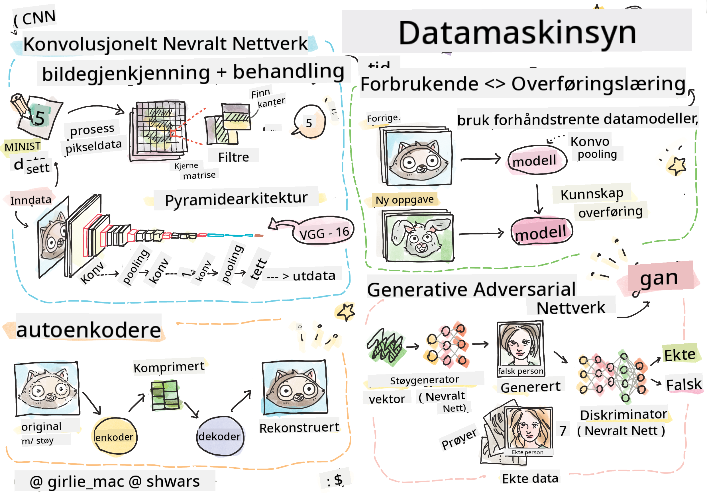

<!--
CO_OP_TRANSLATOR_METADATA:
{
  "original_hash": "58a52f000089c1d8906a4daa4ab1169b",
  "translation_date": "2025-08-28T15:11:53+00:00",
  "source_file": "lessons/4-ComputerVision/README.md",
  "language_code": "no"
}
-->
# Datamaskinsyn

I denne delen skal vi lære om:

* [Introduksjon til datamaskinsyn og OpenCV](06-IntroCV/README.md)
* [Konvolusjonelle nevrale nettverk](07-ConvNets/README.md)
* [Forhåndstrente nettverk og overføringslæring](08-TransferLearning/README.md) 
* [Autoenkodere](09-Autoencoders/README.md)
* [Generative adversarielle nettverk](10-GANs/README.md)
* [Objektdeteksjon](11-ObjectDetection/README.md)
* [Semantisk segmentering](12-Segmentation/README.md)

---

**Ansvarsfraskrivelse**:  
Dette dokumentet er oversatt ved hjelp av AI-oversettelsestjenesten [Co-op Translator](https://github.com/Azure/co-op-translator). Selv om vi streber etter nøyaktighet, vær oppmerksom på at automatiske oversettelser kan inneholde feil eller unøyaktigheter. Det originale dokumentet på sitt opprinnelige språk bør anses som den autoritative kilden. For kritisk informasjon anbefales profesjonell menneskelig oversettelse. Vi er ikke ansvarlige for misforståelser eller feiltolkninger som oppstår ved bruk av denne oversettelsen.