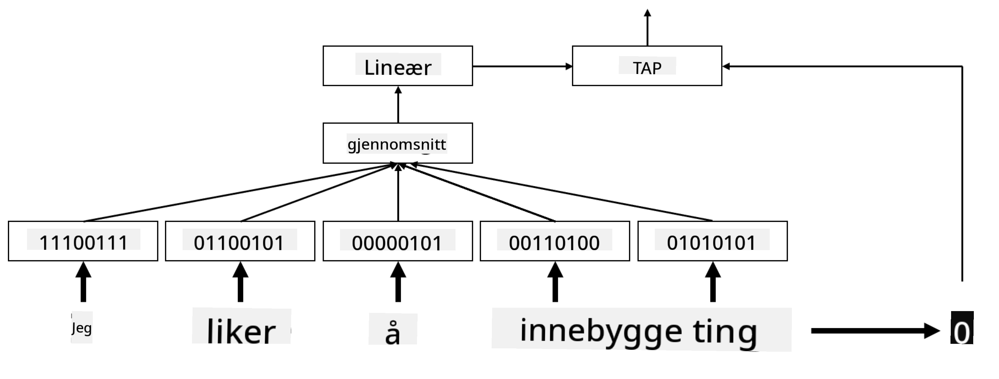

<!--
CO_OP_TRANSLATOR_METADATA:
{
  "original_hash": "e40b47ac3fd48f71304ede1474e66293",
  "translation_date": "2025-08-28T16:01:34+00:00",
  "source_file": "lessons/5-NLP/14-Embeddings/README.md",
  "language_code": "no"
}
-->
# Innebygginger

## [Quiz før forelesning](https://red-field-0a6ddfd03.1.azurestaticapps.net/quiz/114)

Når vi trente klassifikatorer basert på BoW eller TF/IDF, jobbet vi med høy-dimensjonale bag-of-words-vektorer med lengde `vocab_size`, og vi konverterte eksplisitt fra lav-dimensjonale posisjonsrepresentasjonsvektorer til sparsomme én-hot-representasjoner. Denne én-hot-representasjonen er imidlertid ikke minneeffektiv. I tillegg behandles hvert ord uavhengig av hverandre, dvs. én-hot-kodede vektorer uttrykker ingen semantisk likhet mellom ord.

Ideen med **innebygging** er å representere ord med lavere-dimensjonale tette vektorer, som på en eller annen måte reflekterer den semantiske betydningen av et ord. Vi vil senere diskutere hvordan man bygger meningsfulle ord-innbygginger, men for nå kan vi bare tenke på innebygginger som en måte å redusere dimensjonaliteten til en ordvektor.

Så, innebyggingslaget vil ta et ord som input og produsere en output-vektor med spesifisert `embedding_size`. På en måte er det veldig likt et `Linear`-lag, men i stedet for å ta en én-hot-kodet vektor, vil det kunne ta et ordnummer som input, slik at vi kan unngå å lage store én-hot-kodede vektorer.

Ved å bruke et innebyggingslag som det første laget i vårt klassifikatornettverk, kan vi bytte fra en bag-of-words til **embedding bag**-modell, hvor vi først konverterer hvert ord i teksten vår til tilsvarende innebygging, og deretter beregner en aggregatfunksjon over alle disse innebyggingene, som `sum`, `average` eller `max`.  

> Bilde av forfatteren

## ✍️ Øvelser: Innebygginger

Fortsett læringen i følgende notatbøker:
* [Innebygginger med PyTorch](EmbeddingsPyTorch.ipynb)
* [Innebygginger med TensorFlow](EmbeddingsTF.ipynb)

## Semantiske innebygginger: Word2Vec

Mens innebyggingslaget lærte å mappe ord til vektorrepresentasjon, hadde denne representasjonen imidlertid ikke nødvendigvis mye semantisk betydning. Det ville vært fint å lære en vektorrepresentasjon slik at lignende ord eller synonymer tilsvarer vektorer som er nær hverandre i henhold til en eller annen vektordistanse (f.eks. euklidsk distanse).

For å oppnå dette, må vi forhåndstrene innebyggingsmodellen vår på en stor samling tekst på en spesifikk måte. En måte å trene semantiske innebygginger på kalles [Word2Vec](https://en.wikipedia.org/wiki/Word2vec). Det er basert på to hovedarkitekturer som brukes til å produsere en distribuert representasjon av ord:

 - **Continuous bag-of-words** (CBoW) — i denne arkitekturen trener vi modellen til å forutsi et ord fra den omkringliggende konteksten. Gitt ngrammet $(W_{-2},W_{-1},W_0,W_1,W_2)$, er målet for modellen å forutsi $W_0$ fra $(W_{-2},W_{-1},W_1,W_2)$.
 - **Continuous skip-gram** er motsatt av CBoW. Modellen bruker det omkringliggende vinduet av kontekstord til å forutsi det nåværende ordet.

CBoW er raskere, mens skip-gram er tregere, men gjør en bedre jobb med å representere sjeldne ord.

> Bilde fra [denne artikkelen](https://arxiv.org/pdf/1301.3781.pdf)

Forhåndstrente Word2Vec-innbygginger (samt andre lignende modeller, som GloVe) kan også brukes i stedet for innebyggingslaget i nevrale nettverk. Imidlertid må vi håndtere vokabularer, fordi vokabularet som ble brukt til å forhåndstrene Word2Vec/GloVe sannsynligvis vil avvike fra vokabularet i vår tekstkorpus. Ta en titt på de ovennevnte notatbøkene for å se hvordan dette problemet kan løses.

## Kontekstuelle innebygginger

En viktig begrensning med tradisjonelle forhåndstrente innebyggingsrepresentasjoner som Word2Vec er problemet med ordsanse-diskriminering. Mens forhåndstrente innebygginger kan fange noe av betydningen av ord i kontekst, er hver mulig betydning av et ord kodet inn i den samme innebyggingen. Dette kan forårsake problemer i nedstrømsmodeller, siden mange ord, som ordet 'play', har forskjellige betydninger avhengig av konteksten de brukes i.

For eksempel har ordet 'play' i disse to forskjellige setningene ganske forskjellige betydninger:

- Jeg dro på en **forestilling** på teateret.
- John vil **leke** med vennene sine.

De forhåndstrente innebyggingene ovenfor representerer begge disse betydningene av ordet 'play' i den samme innebyggingen. For å overvinne denne begrensningen, må vi bygge innebygginger basert på **språkmodellen**, som er trent på en stor tekstkorpus og *vet* hvordan ord kan settes sammen i forskjellige kontekster. Diskusjon om kontekstuelle innebygginger er utenfor omfanget av denne opplæringen, men vi vil komme tilbake til dem når vi snakker om språkmodeller senere i kurset.

## Konklusjon

I denne leksjonen oppdaget du hvordan du kan bygge og bruke innebyggingslag i TensorFlow og PyTorch for bedre å reflektere den semantiske betydningen av ord.

## 🚀 Utfordring

Word2Vec har blitt brukt til noen interessante applikasjoner, inkludert generering av sangtekster og poesi. Ta en titt på [denne artikkelen](https://www.politetype.com/blog/word2vec-color-poems) som forklarer hvordan forfatteren brukte Word2Vec til å generere poesi. Se også [denne videoen av Dan Shiffmann](https://www.youtube.com/watch?v=LSS_bos_TPI&ab_channel=TheCodingTrain) for å oppdage en annen forklaring på denne teknikken. Prøv deretter å bruke disse teknikkene på din egen tekstkorpus, kanskje hentet fra Kaggle.

## [Quiz etter forelesning](https://red-field-0a6ddfd03.1.azurestaticapps.net/quiz/214)

## Gjennomgang & Selvstudium

Les gjennom denne artikkelen om Word2Vec: [Efficient Estimation of Word Representations in Vector Space](https://arxiv.org/pdf/1301.3781.pdf)

## [Oppgave: Notatbøker](assignment.md)

---

**Ansvarsfraskrivelse**:  
Dette dokumentet er oversatt ved hjelp av AI-oversettelsestjenesten [Co-op Translator](https://github.com/Azure/co-op-translator). Selv om vi streber etter nøyaktighet, vær oppmerksom på at automatiserte oversettelser kan inneholde feil eller unøyaktigheter. Det originale dokumentet på sitt opprinnelige språk bør anses som den autoritative kilden. For kritisk informasjon anbefales profesjonell menneskelig oversettelse. Vi er ikke ansvarlige for misforståelser eller feiltolkninger som oppstår ved bruk av denne oversettelsen.