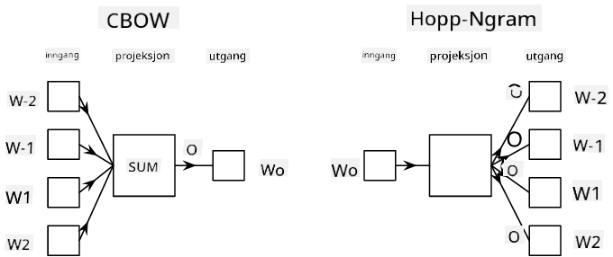

<!--
CO_OP_TRANSLATOR_METADATA:
{
  "original_hash": "31b46ba1f3aa78578134d4829f88be53",
  "translation_date": "2025-08-28T15:53:44+00:00",
  "source_file": "lessons/5-NLP/15-LanguageModeling/README.md",
  "language_code": "no"
}
-->
# Språkmodellering

Semantiske embeddinger, som Word2Vec og GloVe, er faktisk et første steg mot **språkmodellering** - å lage modeller som på en eller annen måte *forstår* (eller *representerer*) språkets natur.

## [Quiz før forelesning](https://red-field-0a6ddfd03.1.azurestaticapps.net/quiz/115)

Hovedideen bak språkmodellering er å trene dem på umerkede datasett på en usupervisert måte. Dette er viktig fordi vi har enorme mengder umerket tekst tilgjengelig, mens mengden merket tekst alltid vil være begrenset av hvor mye innsats vi kan legge i merking. Oftest kan vi bygge språkmodeller som kan **forutsi manglende ord** i teksten, fordi det er enkelt å maskere et tilfeldig ord i teksten og bruke det som et treningsprøve.

## Trening av embeddinger

I våre tidligere eksempler brukte vi forhåndstrente semantiske embeddinger, men det er interessant å se hvordan disse embeddingene kan trenes. Det finnes flere mulige ideer som kan brukes:

* **N-Gram** språkmodellering, der vi forutsier et token ved å se på N tidligere token (N-gram)
* **Continuous Bag-of-Words** (CBoW), der vi forutsier det midterste tokenet $W_0$ i en sekvens av token $W_{-N}$, ..., $W_N$.
* **Skip-gram**, der vi forutsier et sett av nabotoken {$W_{-N},\dots, W_{-1}, W_1,\dots, W_N$} fra det midterste tokenet $W_0$.

> Bilde fra [denne artikkelen](https://arxiv.org/pdf/1301.3781.pdf)

## ✍️ Eksempelnotatbøker: Trening av CBoW-modell

Fortsett læringen i følgende notatbøker:

* [Trening av CBoW Word2Vec med TensorFlow](CBoW-TF.ipynb)
* [Trening av CBoW Word2Vec med PyTorch](CBoW-PyTorch.ipynb)

## Konklusjon

I forrige leksjon så vi at ordembeddinger fungerer som magi! Nå vet vi at trening av ordembeddinger ikke er en veldig kompleks oppgave, og vi bør kunne trene våre egne ordembeddinger for domenespesifikk tekst hvis nødvendig.

## [Quiz etter forelesning](https://red-field-0a6ddfd03.1.azurestaticapps.net/quiz/215)

## Gjennomgang & Selvstudium

* [Offisiell PyTorch-veiledning om språkmodellering](https://pytorch.org/tutorials/beginner/nlp/word_embeddings_tutorial.html).
* [Offisiell TensorFlow-veiledning om trening av Word2Vec-modell](https://www.TensorFlow.org/tutorials/text/word2vec).
* Bruk av **gensim**-rammeverket for å trene de mest brukte embeddingene med noen få linjer kode er beskrevet [i denne dokumentasjonen](https://pytorch.org/tutorials/beginner/nlp/word_embeddings_tutorial.html).

## 🚀 [Oppgave: Tren Skip-Gram-modell](lab/README.md)

I laboratoriet utfordrer vi deg til å endre koden fra denne leksjonen for å trene en skip-gram-modell i stedet for CBoW. [Les detaljene](lab/README.md)

---

**Ansvarsfraskrivelse**:  
Dette dokumentet er oversatt ved hjelp av AI-oversettelsestjenesten [Co-op Translator](https://github.com/Azure/co-op-translator). Selv om vi tilstreber nøyaktighet, vennligst vær oppmerksom på at automatiske oversettelser kan inneholde feil eller unøyaktigheter. Det originale dokumentet på sitt opprinnelige språk bør anses som den autoritative kilden. For kritisk informasjon anbefales profesjonell menneskelig oversettelse. Vi er ikke ansvarlige for eventuelle misforståelser eller feiltolkninger som oppstår ved bruk av denne oversettelsen.