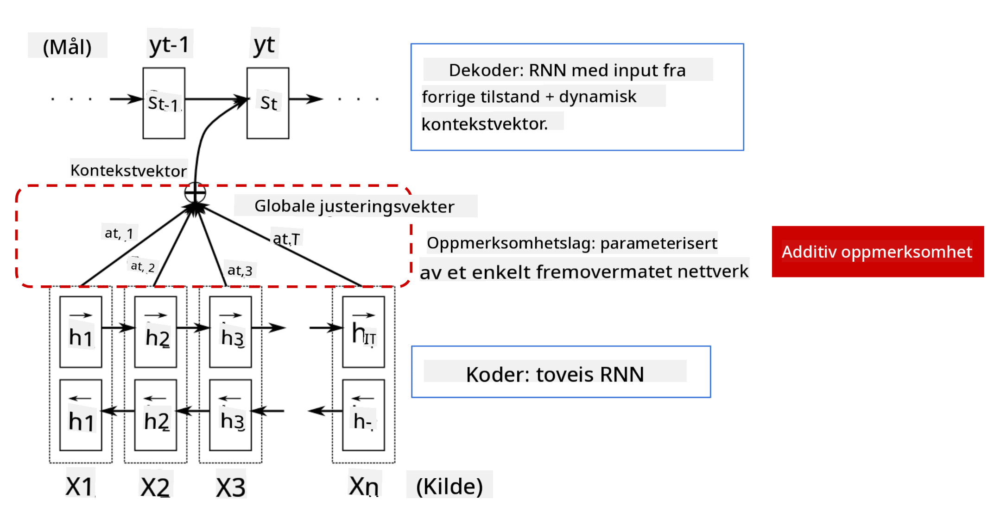
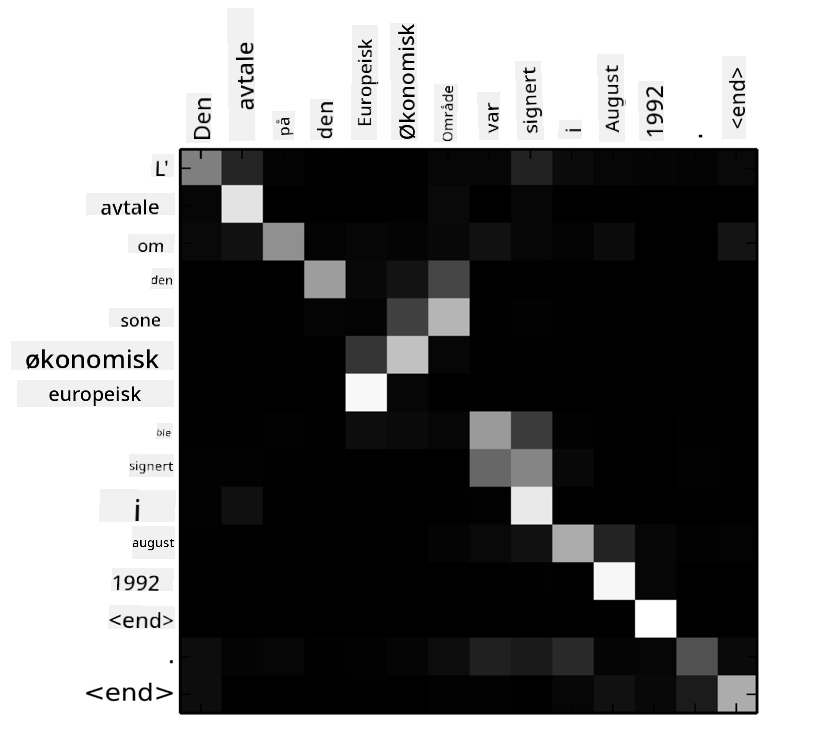
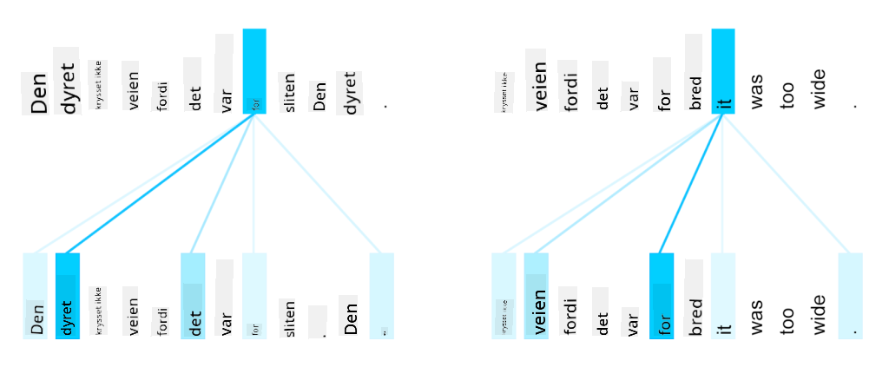
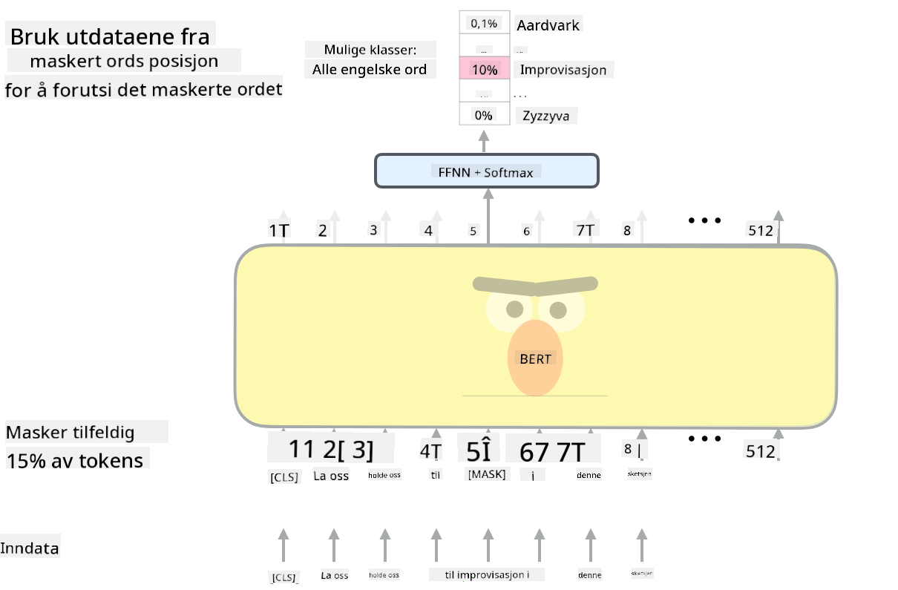

<!--
CO_OP_TRANSLATOR_METADATA:
{
  "original_hash": "f335dfcb4a993920504c387973a36957",
  "translation_date": "2025-09-23T09:46:06+00:00",
  "source_file": "lessons/5-NLP/18-Transformers/README.md",
  "language_code": "no"
}
-->
# Oppmerksomhetsmekanismer og Transformere

## [Quiz før forelesning](https://ff-quizzes.netlify.app/en/ai/quiz/35)

Et av de viktigste problemene innen NLP-feltet er **maskinoversettelse**, en essensiell oppgave som ligger til grunn for verktøy som Google Translate. I denne delen vil vi fokusere på maskinoversettelse, eller mer generelt, på enhver *sekvens-til-sekvens*-oppgave (som også kalles **setningstransduksjon**).

Med RNN-er implementeres sekvens-til-sekvens med to rekurrente nettverk, hvor ett nettverk, **enkoderen**, komprimerer en inngangssekvens til en skjult tilstand, mens et annet nettverk, **dekoderen**, utvider denne skjulte tilstanden til et oversatt resultat. Det er et par problemer med denne tilnærmingen:

* Den endelige tilstanden til enkodernettverket har vanskelig for å huske begynnelsen av en setning, noe som fører til dårlig modellkvalitet for lange setninger.
* Alle ord i en sekvens har samme innvirkning på resultatet. I virkeligheten har imidlertid spesifikke ord i inngangssekvensen ofte større innvirkning på sekvensielle utganger enn andre.

**Oppmerksomhetsmekanismer** gir en måte å vekte den kontekstuelle innvirkningen av hver inngangsvektor på hver utgangsprediksjon av RNN. Dette implementeres ved å lage snarveier mellom mellomliggende tilstander i inngangs-RNN og utgangs-RNN. På denne måten, når vi genererer utgangssymbolet yt, tar vi hensyn til alle skjulte inngangstilstander hi, med forskjellige vektkoeffisienter &alpha;t,i.

> Enkoder-dekoder-modellen med additiv oppmerksomhetsmekanisme i [Bahdanau et al., 2015](https://arxiv.org/pdf/1409.0473.pdf), sitert fra [denne bloggposten](https://lilianweng.github.io/lil-log/2018/06/24/attention-attention.html)

Oppmerksomhetsmatrisen {&alpha;i,j} representerer graden av innflytelse visse inngangsord har på genereringen av et gitt ord i utgangssekvensen. Nedenfor er et eksempel på en slik matrise:

> Figur fra [Bahdanau et al., 2015](https://arxiv.org/pdf/1409.0473.pdf) (Fig.3)

Oppmerksomhetsmekanismer er ansvarlige for mye av den nåværende eller nesten nåværende toppmoderne utviklingen innen NLP. Å legge til oppmerksomhet øker imidlertid antallet modellparametere betydelig, noe som førte til skaleringsproblemer med RNN-er. En viktig begrensning ved skalering av RNN-er er at den rekursive naturen til modellene gjør det utfordrende å batch-prosessere og parallellisere trening. I en RNN må hvert element i en sekvens behandles i sekvensiell rekkefølge, noe som betyr at det ikke enkelt kan parallelliseres.

> Figur fra [Googles Blogg](https://research.googleblog.com/2016/09/a-neural-network-for-machine.html)

Adopsjonen av oppmerksomhetsmekanismer kombinert med denne begrensningen førte til opprettelsen av de nå toppmoderne transformermodellene vi kjenner og bruker i dag, som BERT og Open-GPT3.

## Transformermodeller

En av hovedideene bak transformere er å unngå den sekvensielle naturen til RNN-er og lage en modell som kan parallelliseres under trening. Dette oppnås ved å implementere to ideer:

* posisjonskoding
* bruk av selvoppmerksomhetsmekanisme for å fange mønstre i stedet for RNN-er (eller CNN-er) (det er derfor artikkelen som introduserer transformere heter *[Attention is all you need](https://arxiv.org/abs/1706.03762)*)

### Posisjonskoding/Embedding

Ideen med posisjonskoding er som følger:
1. Når man bruker RNN-er, representeres den relative posisjonen til tokenene av antall steg, og trenger derfor ikke å bli eksplisitt representert.
2. Når vi derimot bytter til oppmerksomhet, må vi vite de relative posisjonene til tokenene i en sekvens.
3. For å få posisjonskoding, utvider vi vår sekvens av token med en sekvens av tokenposisjoner i sekvensen (dvs. en sekvens av tall 0,1, ...).
4. Vi blander deretter tokenposisjonen med en token-embedding-vektor. For å transformere posisjonen (heltall) til en vektor, kan vi bruke forskjellige tilnærminger:

* Trenbar embedding, lik token-embedding. Dette er tilnærmingen vi vurderer her. Vi bruker embedding-lag på både tokenene og deres posisjoner, noe som resulterer i embedding-vektorer med samme dimensjoner, som vi deretter legger sammen.
* Fast posisjonskodingsfunksjon, som foreslått i den originale artikkelen.

> Bilde av forfatteren

Resultatet vi får med posisjonsembedding inkluderer både det originale tokenet og dets posisjon i en sekvens.

### Multi-Head Selvoppmerksomhet

Deretter må vi fange noen mønstre i vår sekvens. For å gjøre dette bruker transformere en **selvoppmerksomhetsmekanisme**, som i hovedsak er oppmerksomhet anvendt på samme sekvens som inngang og utgang. Å bruke selvoppmerksomhet lar oss ta hensyn til **kontekst** i setningen og se hvilke ord som er relaterte. For eksempel lar det oss se hvilke ord som refereres til av korreferanser, som *det*, og også ta konteksten i betraktning:

> Bilde fra [Google Blog](https://research.googleblog.com/2017/08/transformer-novel-neural-network.html)

I transformere bruker vi **Multi-Head Attention** for å gi nettverket kraften til å fange flere forskjellige typer avhengigheter, f.eks. langvarige vs. kortvarige ordrelasjoner, korreferanse vs. noe annet, osv.

[TensorFlow Notebook](TransformersTF.ipynb) inneholder flere detaljer om implementeringen av transformer-lag.

### Enkoder-Dekoder Oppmerksomhet

I transformere brukes oppmerksomhet på to steder:

* For å fange mønstre i inngangsteksten ved hjelp av selvoppmerksomhet.
* For å utføre sekvensoversettelse - det er oppmerksomhetslaget mellom enkoder og dekoder.

Enkoder-dekoder oppmerksomhet er veldig lik oppmerksomhetsmekanismen som brukes i RNN-er, som beskrevet i begynnelsen av denne delen. Denne animerte diagrammet forklarer rollen til enkoder-dekoder oppmerksomhet.

Siden hver inngangsposisjon kartlegges uavhengig til hver utgangsposisjon, kan transformere parallellisere bedre enn RNN-er, noe som muliggjør mye større og mer uttrykksfulle språkmodeller. Hver oppmerksomhetshode kan brukes til å lære forskjellige relasjoner mellom ord som forbedrer nedstrøms oppgaver innen naturlig språkbehandling.

## BERT

**BERT** (Bidirectional Encoder Representations from Transformers) er et veldig stort flerlags transformernettverk med 12 lag for *BERT-base*, og 24 for *BERT-large*. Modellen er først forhåndstrent på en stor tekstkorpus (Wikipedia + bøker) ved hjelp av usupervisert trening (predikere maskerte ord i en setning). Under forhåndstreningen absorberer modellen betydelige nivåer av språkforståelse som deretter kan utnyttes med andre datasett ved hjelp av finjustering. Denne prosessen kalles **transfer learning**.

> Bilde [kilde](http://jalammar.github.io/illustrated-bert/)

## ✍️ Øvelser: Transformere

Fortsett læringen i følgende notatbøker:

* [Transformere i PyTorch](TransformersPyTorch.ipynb)
* [Transformere i TensorFlow](TransformersTF.ipynb)

## Konklusjon

I denne leksjonen lærte du om Transformere og Oppmerksomhetsmekanismer, alle essensielle verktøy i NLP-verktøykassen. Det finnes mange varianter av transformerarkitekturer, inkludert BERT, DistilBERT, BigBird, OpenGPT3 og flere som kan finjusteres. [HuggingFace-pakken](https://github.com/huggingface/) gir et bibliotek for trening av mange av disse arkitekturene med både PyTorch og TensorFlow.

## 🚀 Utfordring

## [Quiz etter forelesning](https://ff-quizzes.netlify.app/en/ai/quiz/36)

## Gjennomgang og Selvstudium

* [Bloggpost](https://mchromiak.github.io/articles/2017/Sep/12/Transformer-Attention-is-all-you-need/), som forklarer den klassiske [Attention is all you need](https://arxiv.org/abs/1706.03762)-artikkelen om transformere.
* [En serie bloggposter](https://towardsdatascience.com/transformers-explained-visually-part-1-overview-of-functionality-95a6dd460452) om transformere, som forklarer arkitekturen i detalj.

## [Oppgave](assignment.md)

---

