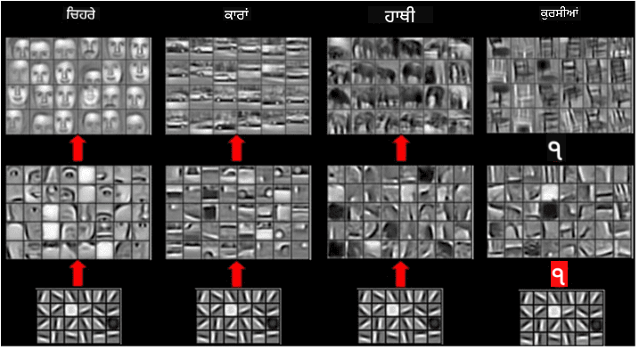
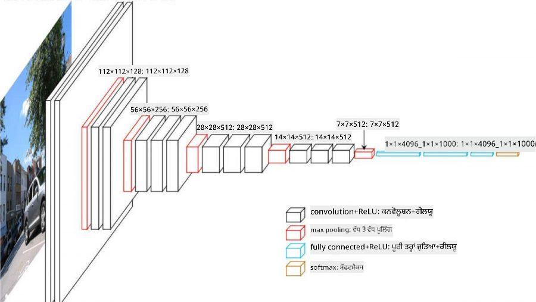

<!--
CO_OP_TRANSLATOR_METADATA:
{
  "original_hash": "088837b42b7d99198bf62db8a42411e0",
  "translation_date": "2025-08-26T09:29:13+00:00",
  "source_file": "lessons/4-ComputerVision/07-ConvNets/README.md",
  "language_code": "pa"
}
-->
# ਕਨਵੋਲੂਸ਼ਨਲ ਨਿਊਰਲ ਨੈਟਵਰਕਸ

ਅਸੀਂ ਪਹਿਲਾਂ ਦੇਖਿਆ ਹੈ ਕਿ ਨਿਊਰਲ ਨੈਟਵਰਕਸ ਚਿੱਤਰਾਂ ਨਾਲ ਨਿਪਟਣ ਵਿੱਚ ਕਾਫ਼ੀ ਚੰਗੇ ਹਨ, ਅਤੇ ਇੱਕ-ਲੇਅਰ ਪਰਸੈਪਟ੍ਰਾਨ ਵੀ MNIST ਡੇਟਾਸੈੱਟ ਤੋਂ ਹੱਥ ਨਾਲ ਲਿਖੇ ਅੰਕਾਂ ਨੂੰ ਵਾਜਬ ਸਹੀਤਾ ਨਾਲ ਪਛਾਣ ਸਕਦਾ ਹੈ। ਹਾਲਾਂਕਿ, MNIST ਡੇਟਾਸੈੱਟ ਬਹੁਤ ਵਿਸ਼ੇਸ਼ ਹੈ, ਅਤੇ ਸਾਰੇ ਅੰਕ ਚਿੱਤਰ ਦੇ ਅੰਦਰ ਕੇਂਦਰਿਤ ਹਨ, ਜਿਸ ਨਾਲ ਕੰਮ ਸੌਖਾ ਹੋ ਜਾਂਦਾ ਹੈ।

## [ਪ੍ਰੀ-ਲੈਕਚਰ ਕਵਿਜ਼](https://red-field-0a6ddfd03.1.azurestaticapps.net/quiz/107)

ਅਸਲ ਜ਼ਿੰਦਗੀ ਵਿੱਚ, ਅਸੀਂ ਚਾਹੁੰਦੇ ਹਾਂ ਕਿ ਚਿੱਤਰ ਵਿੱਚ ਕਿਸੇ ਵੀ ਸਥਾਨ ਤੋਂ ਵਸਤੂਆਂ ਨੂੰ ਪਛਾਣ ਸਕੀਏ। ਕੰਪਿਊਟਰ ਵਿਜ਼ਨ ਆਮ ਵਰਗੀਕਰਨ ਤੋਂ ਵੱਖ ਹੈ, ਕਿਉਂਕਿ ਜਦੋਂ ਅਸੀਂ ਚਿੱਤਰ ਵਿੱਚ ਕਿਸੇ ਖਾਸ ਵਸਤੂ ਨੂੰ ਲੱਭਣ ਦੀ ਕੋਸ਼ਿਸ਼ ਕਰਦੇ ਹਾਂ, ਤਾਂ ਅਸੀਂ ਚਿੱਤਰ ਨੂੰ ਸਕੈਨ ਕਰਦੇ ਹਾਂ ਅਤੇ ਕੁਝ ਖਾਸ **ਪੈਟਰਨਜ਼** ਅਤੇ ਉਨ੍ਹਾਂ ਦੇ ਸੰਯੋਜਨਾਂ ਦੀ ਭਾਲ ਕਰਦੇ ਹਾਂ। ਉਦਾਹਰਣ ਲਈ, ਜਦੋਂ ਅਸੀਂ ਬਿੱਲੀ ਦੀ ਭਾਲ ਕਰਦੇ ਹਾਂ, ਤਾਂ ਪਹਿਲਾਂ ਅਸੀਂ ਆੜੀ ਲਾਈਨਾਂ ਦੀ ਭਾਲ ਕਰ ਸਕਦੇ ਹਾਂ, ਜੋ ਮੂੰਹ ਦੇ ਬਾਲ ਬਣ ਸਕਦੇ ਹਨ, ਅਤੇ ਫਿਰ ਮੂੰਹ ਦੇ ਬਾਲਾਂ ਦੇ ਕੁਝ ਖਾਸ ਸੰਯੋਜਨ ਸਾਨੂੰ ਦੱਸ ਸਕਦੇ ਹਨ ਕਿ ਇਹ ਅਸਲ ਵਿੱਚ ਬਿੱਲੀ ਦੀ ਤਸਵੀਰ ਹੈ। ਕੁਝ ਪੈਟਰਨਜ਼ ਦੀ ਸਬੰਧਿਤ ਸਥਿਤੀ ਅਤੇ ਮੌਜੂਦਗੀ ਮਹੱਤਵਪੂਰਨ ਹੈ, ਨਾ ਕਿ ਚਿੱਤਰ ਵਿੱਚ ਉਨ੍ਹਾਂ ਦੀ ਸਹੀ ਸਥਿਤੀ।

ਪੈਟਰਨਜ਼ ਨੂੰ ਕੱਢਣ ਲਈ, ਅਸੀਂ **ਕਨਵੋਲੂਸ਼ਨਲ ਫਿਲਟਰਜ਼** ਦੀ ਧਾਰਨਾ ਦੀ ਵਰਤੋਂ ਕਰਾਂਗੇ। ਜਿਵੇਂ ਕਿ ਤੁਸੀਂ ਜਾਣਦੇ ਹੋ, ਇੱਕ ਚਿੱਤਰ ਨੂੰ 2D-ਮੈਟ੍ਰਿਕਸ ਜਾਂ ਰੰਗ ਦੀ ਗਹਿਰਾਈ ਵਾਲੇ 3D-ਟੈਂਸਰ ਦੁਆਰਾ ਦਰਸਾਇਆ ਜਾਂਦਾ ਹੈ। ਇੱਕ ਫਿਲਟਰ ਲਾਗੂ ਕਰਨ ਦਾ ਮਤਲਬ ਹੈ ਕਿ ਅਸੀਂ ਇੱਕ ਛੋਟੀ **ਫਿਲਟਰ ਕਰਨਲ** ਮੈਟ੍ਰਿਕਸ ਲੈਂਦੇ ਹਾਂ, ਅਤੇ ਮੂਲ ਚਿੱਤਰ ਵਿੱਚ ਹਰ ਪਿਕਸਲ ਲਈ ਅਸੀਂ ਪੜੋਸੀ ਬਿੰਦੂਆਂ ਨਾਲ ਵਜ਼ਨੀ ਔਸਤ ਦੀ ਗਣਨਾ ਕਰਦੇ ਹਾਂ। ਅਸੀਂ ਇਸਨੂੰ ਇਸ ਤਰ੍ਹਾਂ ਦੇਖ ਸਕਦੇ ਹਾਂ ਕਿ ਇੱਕ ਛੋਟੀ ਖਿੜਕੀ ਪੂਰੇ ਚਿੱਤਰ 'ਤੇ ਸਲਾਈਡ ਕਰ ਰਹੀ ਹੈ, ਅਤੇ ਫਿਲਟਰ ਕਰਨਲ ਮੈਟ੍ਰਿਕਸ ਵਿੱਚ ਵਜ਼ਨਾਂ ਦੇ ਅਨੁਸਾਰ ਸਾਰੇ ਪਿਕਸਲਾਂ ਨੂੰ ਔਸਤ ਕਰ ਰਹੀ ਹੈ।

 | 
----|----

> ਚਿੱਤਰ: ਦਿਮਿਤਰੀ ਸੋਸ਼ਨਿਕੋਵ

ਉਦਾਹਰਣ ਲਈ, ਜੇ ਅਸੀਂ MNIST ਅੰਕਾਂ 'ਤੇ 3x3 ਵਰਟੀਕਲ ਐਜ ਅਤੇ ਹੋਰਿਜ਼ੋਂਟਲ ਐਜ ਫਿਲਟਰ ਲਾਗੂ ਕਰਦੇ ਹਾਂ, ਤਾਂ ਅਸੀਂ ਹਾਈਲਾਈਟਸ (ਜਿਵੇਂ ਕਿ ਉੱਚ ਮੁੱਲ) ਪ੍ਰਾਪਤ ਕਰ ਸਕਦੇ ਹਾਂ ਜਿੱਥੇ ਸਾਡੇ ਮੂਲ ਚਿੱਤਰ ਵਿੱਚ ਵਰਟੀਕਲ ਅਤੇ ਹੋਰਿਜ਼ੋਂਟਲ ਐਜ ਹਨ। ਇਸ ਤਰ੍ਹਾਂ ਇਹ ਦੋ ਫਿਲਟਰ "ਐਜ" ਦੀ ਭਾਲ ਕਰਨ ਲਈ ਵਰਤੇ ਜਾ ਸਕਦੇ ਹਨ। ਇਸੇ ਤਰ੍ਹਾਂ, ਅਸੀਂ ਹੋਰ ਨੀਚਲੇ-ਸਤਹ ਦੇ ਪੈਟਰਨਜ਼ ਦੀ ਭਾਲ ਕਰਨ ਲਈ ਵੱਖ-ਵੱਖ ਫਿਲਟਰ ਡਿਜ਼ਾਈਨ ਕਰ ਸਕਦੇ ਹਾਂ:

> ਚਿੱਤਰ: [Leung-Malik Filter Bank](https://www.robots.ox.ac.uk/~vgg/research/texclass/filters.html)

ਹਾਲਾਂਕਿ, ਜਦੋਂ ਕਿ ਅਸੀਂ ਕੁਝ ਪੈਟਰਨਜ਼ ਨੂੰ ਕੱਢਣ ਲਈ ਫਿਲਟਰਜ਼ ਨੂੰ ਹੱਥੋਂ ਡਿਜ਼ਾਈਨ ਕਰ ਸਕਦੇ ਹਾਂ, ਅਸੀਂ ਨੈਟਵਰਕ ਨੂੰ ਇਸ ਤਰ੍ਹਾਂ ਵੀ ਡਿਜ਼ਾਈਨ ਕਰ ਸਕਦੇ ਹਾਂ ਕਿ ਇਹ ਪੈਟਰਨਜ਼ ਨੂੰ ਆਪਣੇ ਆਪ ਸਿੱਖੇ। ਇਹ CNN ਦੇ ਪਿੱਛੇ ਮੁੱਖ ਵਿਚਾਰਾਂ ਵਿੱਚੋਂ ਇੱਕ ਹੈ।

## CNN ਦੇ ਮੁੱਖ ਵਿਚਾਰ

CNNs ਦੇ ਕੰਮ ਕਰਨ ਦਾ ਤਰੀਕਾ ਹੇਠਾਂ ਦਿੱਤੇ ਮਹੱਤਵਪੂਰਨ ਵਿਚਾਰਾਂ 'ਤੇ ਅਧਾਰਿਤ ਹੈ:

* ਕਨਵੋਲੂਸ਼ਨਲ ਫਿਲਟਰਜ਼ ਪੈਟਰਨਜ਼ ਕੱਢ ਸਕਦੇ ਹਨ
* ਅਸੀਂ ਨੈਟਵਰਕ ਨੂੰ ਇਸ ਤਰ੍ਹਾਂ ਡਿਜ਼ਾਈਨ ਕਰ ਸਕਦੇ ਹਾਂ ਕਿ ਫਿਲਟਰਜ਼ ਆਪਣੇ ਆਪ ਸਿੱਖੇ ਜਾਂ ਸਿਖਾਏ ਜਾਣ
* ਅਸੀਂ ਇਹੀ ਤਰੀਕਾ ਉੱਚ-ਸਤਹ ਦੀਆਂ ਵਿਸ਼ੇਸ਼ਤਾਵਾਂ ਵਿੱਚ ਪੈਟਰਨਜ਼ ਲੱਭਣ ਲਈ ਵਰਤ ਸਕਦੇ ਹਾਂ, ਸਿਰਫ਼ ਮੂਲ ਚਿੱਤਰ ਵਿੱਚ ਹੀ ਨਹੀਂ। ਇਸ ਤਰ੍ਹਾਂ CNN ਵਿਸ਼ੇਸ਼ਤਾ ਕੱਢਣ ਦਾ ਕੰਮ ਵਿਸ਼ੇਸ਼ਤਾਵਾਂ ਦੀ ਇੱਕ ਹਾਇਰਾਰਕੀ 'ਤੇ ਕੰਮ ਕਰਦਾ ਹੈ, ਜੋ ਨੀਚਲੇ-ਸਤਹ ਦੇ ਪਿਕਸਲ ਸੰਯੋਜਨਾਂ ਤੋਂ ਸ਼ੁਰੂ ਹੁੰਦਾ ਹੈ, ਅਤੇ ਚਿੱਤਰ ਦੇ ਹਾਈ-ਲੈਵਲ ਹਿੱਸਿਆਂ ਦੇ ਸੰਯੋਜਨ ਤੱਕ ਪਹੁੰਚਦਾ ਹੈ।

> ਚਿੱਤਰ: [Hislop-Lynch ਦੇ ਪੇਪਰ](https://www.semanticscholar.org/paper/Computer-vision-based-pedestrian-trajectory-Hislop-Lynch/26e6f74853fc9bbb7487b06dc2cf095d36c9021d), [ਉਨ੍ਹਾਂ ਦੇ ਰਿਸਰਚ](https://dl.acm.org/doi/abs/10.1145/1553374.1553453) ਦੇ ਅਧਾਰ 'ਤੇ

## ✍️ ਅਭਿਆਸ: ਕਨਵੋਲੂਸ਼ਨਲ ਨਿਊਰਲ ਨੈਟਵਰਕਸ

ਆਓ ਕਨਵੋਲੂਸ਼ਨਲ ਨਿਊਰਲ ਨੈਟਵਰਕਸ ਦੇ ਕੰਮ ਕਰਨ ਦੇ ਤਰੀਕੇ ਦੀ ਜਾਂਚ ਜਾਰੀ ਰੱਖੀਏ, ਅਤੇ ਸਿਖਣਯੋਗ ਫਿਲਟਰ ਪ੍ਰਾਪਤ ਕਰਨ ਦੇ ਤਰੀਕੇ ਨੂੰ ਸਮਝਣ ਲਈ ਸੰਬੰਧਿਤ ਨੋਟਬੁੱਕਸ 'ਤੇ ਕੰਮ ਕਰੀਏ:

* [ਕਨਵੋਲੂਸ਼ਨਲ ਨਿਊਰਲ ਨੈਟਵਰਕਸ - PyTorch](../../../../../lessons/4-ComputerVision/07-ConvNets/ConvNetsPyTorch.ipynb)
* [ਕਨਵੋਲੂਸ਼ਨਲ ਨਿਊਰਲ ਨੈਟਵਰਕਸ - TensorFlow](../../../../../lessons/4-ComputerVision/07-ConvNets/ConvNetsTF.ipynb)

## ਪਿਰਾਮਿਡ ਆਰਕੀਟੈਕਚਰ

ਚਿੱਤਰ ਪ੍ਰੋਸੈਸਿੰਗ ਲਈ ਵਰਤੇ ਜਾਣ ਵਾਲੇ ਜ਼ਿਆਦਾਤਰ CNNs ਨੂੰ ਪਿਰਾਮਿਡ ਆਰਕੀਟੈਕਚਰ ਕਿਹਾ ਜਾਂਦਾ ਹੈ। ਮੂਲ ਚਿੱਤਰਾਂ 'ਤੇ ਲਾਗੂ ਕੀਤੀ ਗਈ ਪਹਿਲੀ ਕਨਵੋਲੂਸ਼ਨਲ ਲੇਅਰ ਵਿੱਚ ਆਮ ਤੌਰ 'ਤੇ ਫਿਲਟਰਜ਼ ਦੀ ਸੰਖਿਆ ਘੱਟ ਹੁੰਦੀ ਹੈ (8-16), ਜੋ ਵੱਖ-ਵੱਖ ਪਿਕਸਲ ਸੰਯੋਜਨਾਂ ਨੂੰ ਦਰਸਾਉਂਦੀ ਹੈ, ਜਿਵੇਂ ਕਿ ਆੜੀ/ਲੰਬੀ ਲਾਈਨਾਂ ਜਾਂ ਸਟ੍ਰੋਕਸ। ਅਗਲੇ ਪੱਧਰ 'ਤੇ, ਅਸੀਂ ਨੈਟਵਰਕ ਦੇ ਸਪੇਸ਼ਲ ਡਾਇਮੈਂਸ਼ਨ ਨੂੰ ਘਟਾਉਂਦੇ ਹਾਂ, ਅਤੇ ਫਿਲਟਰਜ਼ ਦੀ ਸੰਖਿਆ ਵਧਾਉਂਦੇ ਹਾਂ, ਜੋ ਸਧਾਰਨ ਵਿਸ਼ੇਸ਼ਤਾਵਾਂ ਦੇ ਹੋਰ ਸੰਭਾਵਿਤ ਸੰਯੋਜਨਾਂ ਨੂੰ ਦਰਸਾਉਂਦੀ ਹੈ। ਹਰ ਲੇਅਰ ਦੇ ਨਾਲ, ਜਦੋਂ ਅਸੀਂ ਅੰਤਮ ਵਰਗੀਕਰਨ ਵੱਲ ਵਧਦੇ ਹਾਂ, ਚਿੱਤਰ ਦੇ ਸਪੇਸ਼ਲ ਡਾਇਮੈਂਸ਼ਨ ਘਟਦੇ ਹਨ, ਅਤੇ ਫਿਲਟਰਜ਼ ਦੀ ਗਿਣਤੀ ਵਧਦੀ ਹੈ।

ਉਦਾਹਰਣ ਵਜੋਂ, ਆਓ VGG-16 ਦੀ ਆਰਕੀਟੈਕਚਰ ਨੂੰ ਦੇਖੀਏ, ਇੱਕ ਨੈਟਵਰਕ ਜਿਸ ਨੇ 2014 ਵਿੱਚ ImageNet ਦੇ ਟਾਪ-5 ਵਰਗੀਕਰਨ ਵਿੱਚ 92.7% ਸਹੀਤਾ ਹਾਸਲ ਕੀਤੀ:

> ਚਿੱਤਰ: [Researchgate](https://www.researchgate.net/figure/Vgg16-model-structure-To-get-the-VGG-NIN-model-we-replace-the-2-nd-4-th-6-th-7-th_fig2_335194493)

## ਸਭ ਤੋਂ ਪ੍ਰਸਿੱਧ CNN ਆਰਕੀਟੈਕਚਰਜ਼

[ਸਭ ਤੋਂ ਪ੍ਰਸਿੱਧ CNN ਆਰਕੀਟੈਕਚਰਜ਼ ਬਾਰੇ ਆਪਣਾ ਅਧਿਐਨ ਜਾਰੀ ਰੱਖੋ](CNN_Architectures.md)

**ਅਸਵੀਕਰਤੀ**:  
ਇਹ ਦਸਤਾਵੇਜ਼ AI ਅਨੁਵਾਦ ਸੇਵਾ [Co-op Translator](https://github.com/Azure/co-op-translator) ਦੀ ਵਰਤੋਂ ਕਰਕੇ ਅਨੁਵਾਦ ਕੀਤਾ ਗਿਆ ਹੈ। ਜਦੋਂ ਕਿ ਅਸੀਂ ਸਹੀ ਹੋਣ ਦਾ ਯਤਨ ਕਰਦੇ ਹਾਂ, ਕਿਰਪਾ ਕਰਕੇ ਧਿਆਨ ਦਿਓ ਕਿ ਸਵੈਚਾਲਿਤ ਅਨੁਵਾਦਾਂ ਵਿੱਚ ਗਲਤੀਆਂ ਜਾਂ ਅਸੁਣਤੀਆਂ ਹੋ ਸਕਦੀਆਂ ਹਨ। ਇਸ ਦੀ ਮੂਲ ਭਾਸ਼ਾ ਵਿੱਚ ਮੌਜੂਦ ਮੂਲ ਦਸਤਾਵੇਜ਼ ਨੂੰ ਪ੍ਰਮਾਣਿਕ ਸਰੋਤ ਮੰਨਿਆ ਜਾਣਾ ਚਾਹੀਦਾ ਹੈ। ਮਹੱਤਵਪੂਰਨ ਜਾਣਕਾਰੀ ਲਈ, ਪੇਸ਼ੇਵਰ ਮਨੁੱਖੀ ਅਨੁਵਾਦ ਦੀ ਸਿਫਾਰਸ਼ ਕੀਤੀ ਜਾਂਦੀ ਹੈ। ਇਸ ਅਨੁਵਾਦ ਦੇ ਪ੍ਰਯੋਗ ਤੋਂ ਪੈਦਾ ਹੋਣ ਵਾਲੇ ਕਿਸੇ ਵੀ ਗਲਤਫਹਿਮੀ ਜਾਂ ਗਲਤ ਵਿਆਖਿਆ ਲਈ ਅਸੀਂ ਜ਼ਿੰਮੇਵਾਰ ਨਹੀਂ ਹਾਂ।