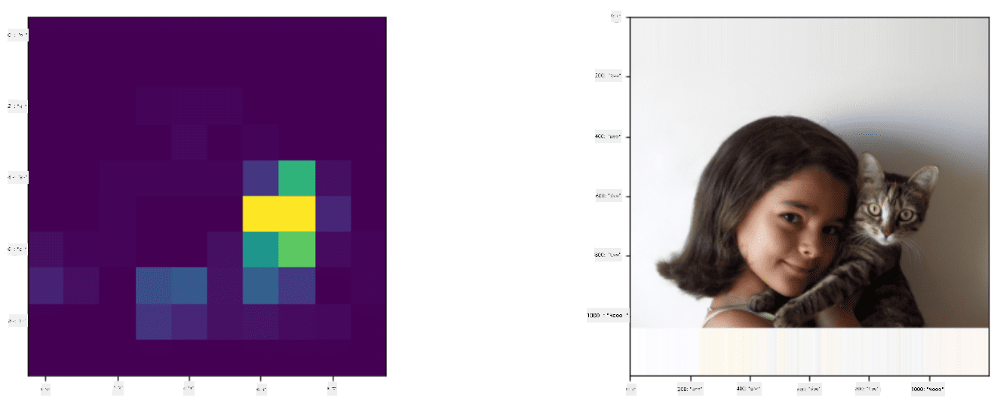
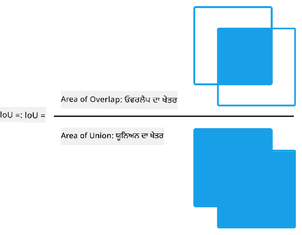
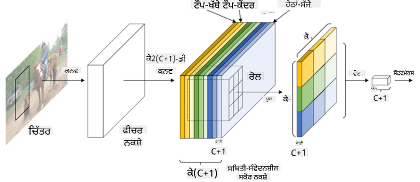
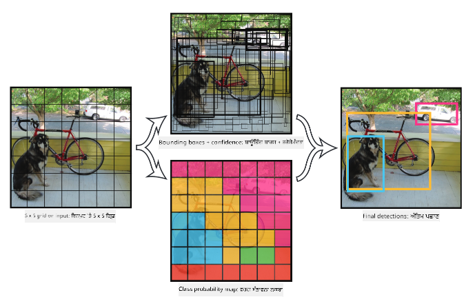

<!--
CO_OP_TRANSLATOR_METADATA:
{
  "original_hash": "d76a7eda28de5210c8b1ba50a6216c69",
  "translation_date": "2025-09-23T07:30:11+00:00",
  "source_file": "lessons/4-ComputerVision/11-ObjectDetection/README.md",
  "language_code": "pa"
}
-->
# ਆਬਜੈਕਟ ਡਿਟੈਕਸ਼ਨ

ਜੋ ਇਮੇਜ ਕਲਾਸੀਫਿਕੇਸ਼ਨ ਮਾਡਲਾਂ ਨਾਲ ਅਸੀਂ ਹੁਣ ਤੱਕ ਡੀਲ ਕੀਤਾ ਹੈ, ਉਹ ਇੱਕ ਤਸਵੀਰ ਲੈਂਦੇ ਹਨ ਅਤੇ ਇੱਕ ਸ਼੍ਰੇਣੀਕਰਣ ਨਤੀਜਾ ਪੈਦਾ ਕਰਦੇ ਹਨ, ਜਿਵੇਂ ਕਿ MNIST ਸਮੱਸਿਆ ਵਿੱਚ 'ਨੰਬਰ' ਸ਼੍ਰੇਣੀ। ਹਾਲਾਂਕਿ, ਕਈ ਕੇਸਾਂ ਵਿੱਚ ਅਸੀਂ ਸਿਰਫ ਇਹ ਨਹੀਂ ਜਾਣਨਾ ਚਾਹੁੰਦੇ ਕਿ ਤਸਵੀਰ ਵਿੱਚ ਵਸਤੂਆਂ ਹਨ - ਅਸੀਂ ਇਹ ਵੀ ਜਾਣਨਾ ਚਾਹੁੰਦੇ ਹਾਂ ਕਿ ਉਹਨਾਂ ਦੀ ਸਹੀ ਸਥਿਤੀ ਕੀ ਹੈ। ਇਹੀ **ਆਬਜੈਕਟ ਡਿਟੈਕਸ਼ਨ** ਦਾ ਮੁੱਖ ਉਦੇਸ਼ ਹੈ।

## [ਪ੍ਰੀ-ਲੈਕਚਰ ਕਵਿਜ਼](https://ff-quizzes.netlify.app/en/ai/quiz/21)

> ਤਸਵੀਰ [YOLO v2 ਵੈਬਸਾਈਟ](https://pjreddie.com/darknet/yolov2/) ਤੋਂ

## ਆਬਜੈਕਟ ਡਿਟੈਕਸ਼ਨ ਲਈ ਇੱਕ ਸਧਾਰਨ ਪਹੁੰਚ

ਮੰਨ ਲਓ ਕਿ ਅਸੀਂ ਇੱਕ ਤਸਵੀਰ ਵਿੱਚ ਬਿੱਲੀ ਨੂੰ ਲੱਭਣਾ ਚਾਹੁੰਦੇ ਹਾਂ, ਤਾਂ ਆਬਜੈਕਟ ਡਿਟੈਕਸ਼ਨ ਲਈ ਇੱਕ ਬਹੁਤ ਹੀ ਸਧਾਰਨ ਪਹੁੰਚ ਇਹ ਹੋਵੇਗੀ:

1. ਤਸਵੀਰ ਨੂੰ ਕਈ ਟਾਈਲਾਂ ਵਿੱਚ ਵੰਡੋ।
2. ਹਰ ਟਾਈਲ 'ਤੇ ਇਮੇਜ ਕਲਾਸੀਫਿਕੇਸ਼ਨ ਚਲਾਓ।
3. ਉਹ ਟਾਈਲਾਂ ਜਿਨ੍ਹਾਂ ਵਿੱਚ ਕਾਫ਼ੀ ਉੱਚੀ ਐਕਟੀਵੇਸ਼ਨ ਹੁੰਦੀ ਹੈ, ਉਹਨਾਂ ਨੂੰ ਉਹ ਵਸਤੂ ਸ਼ਾਮਲ ਕਰਨ ਵਾਲੇ ਮੰਨਿਆ ਜਾ ਸਕਦਾ ਹੈ।

> *ਤਸਵੀਰ [ਐਕਸਰਸਾਈਜ਼ ਨੋਟਬੁੱਕ](ObjectDetection-TF.ipynb) ਤੋਂ*

ਹਾਲਾਂਕਿ, ਇਹ ਪਹੁੰਚ ਆਦਰਸ਼ ਤੋਂ ਦੂਰ ਹੈ, ਕਿਉਂਕਿ ਇਹ ਐਲਗੋਰਿਦਮ ਨੂੰ ਵਸਤੂ ਦੇ ਬਾਊਂਡਿੰਗ ਬਾਕਸ ਨੂੰ ਬਹੁਤ ਹੀ ਅਸਪਸ਼ਟ ਤਰੀਕੇ ਨਾਲ ਸਥਿਤ ਕਰਨ ਦੀ ਆਗਿਆ ਦਿੰਦੀ ਹੈ। ਹੋਰ ਸਹੀ ਸਥਿਤੀ ਲਈ, ਸਾਨੂੰ **ਰੇਗ੍ਰੈਸ਼ਨ** ਦੀ ਕਿਸੇ ਤਰ੍ਹਾਂ ਦੀ ਲੋੜ ਹੈ ਜੋ ਬਾਊਂਡਿੰਗ ਬਾਕਸ ਦੇ ਕੋਆਰਡੀਨੇਟਸ ਦੀ ਪੇਸ਼ਗੂਈ ਕਰ ਸਕੇ - ਅਤੇ ਇਸ ਲਈ ਸਾਨੂੰ ਵਿਸ਼ੇਸ਼ ਡੇਟਾਸੈਟ ਦੀ ਲੋੜ ਹੈ।

## ਆਬਜੈਕਟ ਡਿਟੈਕਸ਼ਨ ਲਈ ਰੇਗ੍ਰੈਸ਼ਨ

[ਇਹ ਬਲੌਗ ਪੋਸਟ](https://towardsdatascience.com/object-detection-with-neural-networks-a4e2c46b4491) ਸ਼ੇਪਸ ਦੀ ਪਛਾਣ ਕਰਨ ਲਈ ਇੱਕ ਵਧੀਆ ਸਧਾਰਨ ਜਾਣਕਾਰੀ ਦਿੰਦੀ ਹੈ।

## ਆਬਜੈਕਟ ਡਿਟੈਕਸ਼ਨ ਲਈ ਡੇਟਾਸੈਟ

ਤੁਹਾਨੂੰ ਇਸ ਕੰਮ ਲਈ ਹੇਠਾਂ ਦਿੱਤੇ ਡੇਟਾਸੈਟ ਮਿਲ ਸਕਦੇ ਹਨ:

* [PASCAL VOC](http://host.robots.ox.ac.uk/pascal/VOC/) - 20 ਕਲਾਸਾਂ
* [COCO](http://cocodataset.org/#home) - ਸਧਾਰਨ ਵਸਤੂਆਂ ਸੰਦਰਭ ਵਿੱਚ। 80 ਕਲਾਸਾਂ, ਬਾਊਂਡਿੰਗ ਬਾਕਸ ਅਤੇ ਸੈਗਮੈਂਟੇਸ਼ਨ ਮਾਸਕ

## ਆਬਜੈਕਟ ਡਿਟੈਕਸ਼ਨ ਮੈਟ੍ਰਿਕਸ

### ਇੰਟਰਸੈਕਸ਼ਨ ਓਵਰ ਯੂਨੀਅਨ

ਜਦੋਂ ਕਿ ਇਮੇਜ ਕਲਾਸੀਫਿਕੇਸ਼ਨ ਲਈ ਇਹ ਮਾਪਣਾ ਆਸਾਨ ਹੈ ਕਿ ਐਲਗੋਰਿਦਮ ਕਿੰਨਾ ਚੰਗਾ ਕੰਮ ਕਰਦਾ ਹੈ, ਆਬਜੈਕਟ ਡਿਟੈਕਸ਼ਨ ਲਈ ਸਾਨੂੰ ਕਲਾਸ ਦੀ ਸਹੀਤਾ ਦੇ ਨਾਲ-साथ ਅਨੁਮਾਨਿਤ ਬਾਊਂਡਿੰਗ ਬਾਕਸ ਸਥਿਤੀ ਦੀ ਸ਼ੁੱਧਤਾ ਨੂੰ ਮਾਪਣਾ ਪੈਂਦਾ ਹੈ। ਇਸ ਲਈ, ਅਸੀਂ **ਇੰਟਰਸੈਕਸ਼ਨ ਓਵਰ ਯੂਨੀਅਨ** (IoU) ਦੀ ਵਰਤੋਂ ਕਰਦੇ ਹਾਂ, ਜੋ ਮਾਪਦਾ ਹੈ ਕਿ ਦੋ ਬਾਕਸ (ਜਾਂ ਦੋ ਮਨਮਾਨੇ ਖੇਤਰ) ਕਿੰਨੇ ਚੰਗੇ ਤਰੀਕੇ ਨਾਲ ਓਵਰਲੈਪ ਕਰਦੇ ਹਨ।

> *ਫਿਗਰ 2 [ਇਹ ਸ਼ਾਨਦਾਰ ਬਲੌਗ ਪੋਸਟ IoU 'ਤੇ](https://pyimagesearch.com/2016/11/07/intersection-over-union-iou-for-object-detection/) ਤੋਂ*

ਵਿਚਾਰ ਸਧਾਰਨ ਹੈ - ਅਸੀਂ ਦੋ ਆਕ੍ਰਿਤੀਆਂ ਦੇ ਵਿਚਕਾਰ ਇੰਟਰਸੈਕਸ਼ਨ ਦੇ ਖੇਤਰ ਨੂੰ ਉਹਨਾਂ ਦੇ ਯੂਨੀਅਨ ਦੇ ਖੇਤਰ ਨਾਲ ਵੰਡਦੇ ਹਾਂ। ਦੋ ਇਕਸਾਰ ਖੇਤਰਾਂ ਲਈ, IoU 1 ਹੋਵੇਗਾ, ਜਦੋਂ ਕਿ ਪੂਰੀ ਤਰ੍ਹਾਂ ਅਲੱਗ-ਅਲੱਗ ਖੇਤਰਾਂ ਲਈ ਇਹ 0 ਹੋਵੇਗਾ। ਨਹੀਂ ਤਾਂ ਇਹ 0 ਤੋਂ 1 ਤੱਕ ਵੱਖ-ਵੱਖ ਹੋਵੇਗਾ। ਅਸੀਂ ਆਮ ਤੌਰ 'ਤੇ ਉਹਨਾਂ ਬਾਊਂਡਿੰਗ ਬਾਕਸਾਂ ਨੂੰ ਹੀ ਮੰਨਦੇ ਹਾਂ ਜਿਨ੍ਹਾਂ ਲਈ IoU ਇੱਕ ਨਿਰਧਾਰਿਤ ਮੁੱਲ ਤੋਂ ਵੱਧ ਹੈ।

### ਐਵਰੇਜ ਪ੍ਰਿਸੀਜ਼ਨ

ਮੰਨ ਲਓ ਕਿ ਅਸੀਂ ਮਾਪਣਾ ਚਾਹੁੰਦੇ ਹਾਂ ਕਿ ਦਿੱਤੀ ਗਈ ਵਸਤੂਆਂ ਦੀ ਸ਼੍ਰੇਣੀ $C$ ਕਿੰਨੀ ਚੰਗੀ ਤਰ੍ਹਾਂ ਪਛਾਣੀ ਜਾਂਦੀ ਹੈ। ਇਸ ਨੂੰ ਮਾਪਣ ਲਈ, ਅਸੀਂ **ਐਵਰੇਜ ਪ੍ਰਿਸੀਜ਼ਨ** ਮੈਟ੍ਰਿਕਸ ਦੀ ਵਰਤੋਂ ਕਰਦੇ ਹਾਂ, ਜੋ ਹੇਠਾਂ ਦਿੱਤੇ ਤਰੀਕੇ ਨਾਲ ਗਣਨਾ ਕੀਤੀ ਜਾਂਦੀ ਹੈ:

1. ਪ੍ਰਿਸੀਜ਼ਨ-ਰੀਕਾਲ ਕਰਵ ਸਹੀਤਾ ਨੂੰ ਦਿਖਾਉਂਦਾ ਹੈ ਜੋ ਡਿਟੈਕਸ਼ਨ ਥ੍ਰੈਸ਼ਹੋਲਡ ਮੁੱਲ (0 ਤੋਂ 1) 'ਤੇ ਨਿਰਭਰ ਕਰਦਾ ਹੈ।
2. ਥ੍ਰੈਸ਼ਹੋਲਡ ਦੇ ਅਧਾਰ 'ਤੇ, ਸਾਨੂੰ ਤਸਵੀਰ ਵਿੱਚ ਹੋਰ ਜਾਂ ਘੱਟ ਵਸਤੂਆਂ ਮਿਲਣਗੀਆਂ, ਅਤੇ ਪ੍ਰਿਸੀਜ਼ਨ ਅਤੇ ਰੀਕਾਲ ਦੇ ਵੱਖ-ਵੱਖ ਮੁੱਲ ਮਿਲਣਗੇ।
3. ਕਰਵ ਇਸ ਤਰ੍ਹਾਂ ਦੇਖਾਈ ਦੇਵੇਗਾ:

> *ਤਸਵੀਰ [NeuroWorkshop](http://github.com/shwars/NeuroWorkshop) ਤੋਂ*

ਦਿੱਤੀ ਗਈ ਸ਼੍ਰੇਣੀ $C$ ਲਈ ਐਵਰੇਜ ਪ੍ਰਿਸੀਜ਼ਨ ਇਸ ਕਰਵ ਦੇ ਹੇਠਾਂ ਖੇਤਰ ਹੈ। ਹੋਰ ਸਪਸ਼ਟ ਤੌਰ 'ਤੇ, ਰੀਕਾਲ ਅਕਸ ਨੂੰ ਆਮ ਤੌਰ 'ਤੇ 10 ਹਿੱਸਿਆਂ ਵਿੱਚ ਵੰਡਿਆ ਜਾਂਦਾ ਹੈ, ਅਤੇ ਪ੍ਰਿਸੀਜ਼ਨ ਨੂੰ ਉਹਨਾਂ ਸਾਰੇ ਬਿੰਦੂਆਂ 'ਤੇ ਐਵਰੇਜ ਕੀਤਾ ਜਾਂਦਾ ਹੈ:

$$
AP = {1\over11}\sum_{i=0}^{10}\mbox{Precision}(\mbox{Recall}={i\over10})
$$

### AP ਅਤੇ IoU

ਅਸੀਂ ਸਿਰਫ ਉਹਨਾਂ ਡਿਟੈਕਸ਼ਨ ਨੂੰ ਮੰਨਾਂਗੇ, ਜਿਨ੍ਹਾਂ ਲਈ IoU ਇੱਕ ਨਿਰਧਾਰਿਤ ਮੁੱਲ ਤੋਂ ਵੱਧ ਹੈ। ਉਦਾਹਰਣ ਲਈ, PASCAL VOC ਡੇਟਾਸੈਟ ਵਿੱਚ ਆਮ ਤੌਰ 'ਤੇ $\mbox{IoU Threshold} = 0.5$ ਮੰਨਿਆ ਜਾਂਦਾ ਹੈ, ਜਦੋਂ ਕਿ COCO ਵਿੱਚ AP ਵੱਖ-ਵੱਖ $\mbox{IoU Threshold}$ ਮੁੱਲਾਂ ਲਈ ਮਾਪਿਆ ਜਾਂਦਾ ਹੈ।

> *ਤਸਵੀਰ [NeuroWorkshop](http://github.com/shwars/NeuroWorkshop) ਤੋਂ*

### ਮੀਨ ਐਵਰੇਜ ਪ੍ਰਿਸੀਜ਼ਨ - mAP

ਆਬਜੈਕਟ ਡਿਟੈਕਸ਼ਨ ਲਈ ਮੁੱਖ ਮੈਟ੍ਰਿਕਸ **ਮੀਨ ਐਵਰੇਜ ਪ੍ਰਿਸੀਜ਼ਨ**, ਜਾਂ **mAP** ਕਿਹਾ ਜਾਂਦਾ ਹੈ। ਇਹ ਐਵਰੇਜ ਪ੍ਰਿਸੀਜ਼ਨ ਦਾ ਮੁੱਲ ਹੈ, ਜੋ ਸਾਰੀਆਂ ਵਸਤੂਆਂ ਦੀਆਂ ਸ਼੍ਰੇਣੀਆਂ 'ਤੇ ਐਵਰੇਜ ਕੀਤਾ ਜਾਂਦਾ ਹੈ, ਅਤੇ ਕਈ ਵਾਰ $\mbox{IoU Threshold}$ 'ਤੇ ਵੀ। ਹੋਰ ਵਿਸਥਾਰ ਵਿੱਚ, **mAP** ਦੀ ਗਣਨਾ ਕਰਨ ਦੀ ਪ੍ਰਕਿਰਿਆ [ਇਸ ਬਲੌਗ ਪੋਸਟ](https://medium.com/@timothycarlen/understanding-the-map-evaluation-metric-for-object-detection-a07fe6962cf3) ਵਿੱਚ ਵਰਣਨ ਕੀਤੀ ਗਈ ਹੈ, ਅਤੇ [ਇੱਥੇ ਕੋਡ ਨਮੂਨਿਆਂ ਨਾਲ](https://gist.github.com/tarlen5/008809c3decf19313de216b9208f3734) ਵੀ।

## ਵੱਖ-ਵੱਖ ਆਬਜੈਕਟ ਡਿਟੈਕਸ਼ਨ ਪਹੁੰਚਾਂ

ਆਬਜੈਕਟ ਡਿਟੈਕਸ਼ਨ ਐਲਗੋਰਿਦਮਾਂ ਦੀਆਂ ਦੋ ਵੱਡੀਆਂ ਸ਼੍ਰੇਣੀਆਂ ਹਨ:

* **ਰੀਜਨ ਪ੍ਰੋਪੋਜ਼ਲ ਨੈਟਵਰਕਸ** (R-CNN, Fast R-CNN, Faster R-CNN)। ਮੁੱਖ ਵਿਚਾਰ **Regions of Interests** (ROI) ਪੈਦਾ ਕਰਨਾ ਹੈ ਅਤੇ CNN 'ਤੇ ਚਲਾਉਣਾ ਹੈ, ਵੱਧ ਤੋਂ ਵੱਧ ਐਕਟੀਵੇਸ਼ਨ ਦੀ ਭਾਲ ਕਰਨਾ। ਇਹ ਸਧਾਰਨ ਪਹੁੰਚ ਦੇ ਸਮਾਨ ਹੈ, ਸਿਵਾਏ ਇਸਦੇ ਕਿ ROI ਹੋਰ ਚਤੁਰ ਤਰੀਕੇ ਨਾਲ ਪੈਦਾ ਕੀਤੇ ਜਾਂਦੇ ਹਨ। ਇਸ ਤਰ੍ਹਾਂ ਦੇ ਤਰੀਕਿਆਂ ਦਾ ਇੱਕ ਮੁੱਖ ਨੁਕਸਾਨ ਇਹ ਹੈ ਕਿ ਇਹ ਹੌਲੀ ਹੁੰਦੇ ਹਨ, ਕਿਉਂਕਿ ਸਾਨੂੰ ਤਸਵੀਰ 'ਤੇ CNN ਕਲਾਸੀਫਾਇਰ ਦੇ ਕਈ ਪਾਸੇ ਦੀ ਲੋੜ ਹੁੰਦੀ ਹੈ।
* **ਵਨ-ਪਾਸ** (YOLO, SSD, RetinaNet) ਤਰੀਕੇ। ਉਹਨਾਂ ਆਰਕੀਟੈਕਚਰਾਂ ਵਿੱਚ ਅਸੀਂ ਨੈਟਵਰਕ ਨੂੰ ਇੱਕ ਪਾਸ ਵਿੱਚ ਕਲਾਸਾਂ ਅਤੇ ROI ਦੀ ਪੇਸ਼ਗੂਈ ਕਰਨ ਲਈ ਡਿਜ਼ਾਈਨ ਕਰਦੇ ਹਾਂ।

### R-CNN: ਰੀਜਨ-ਬੇਸਡ CNN

[R-CNN](http://islab.ulsan.ac.kr/files/announcement/513/rcnn_pami.pdf) [Selective Search](http://www.huppelen.nl/publications/selectiveSearchDraft.pdf) ਦੀ ਵਰਤੋਂ ਕਰਦਾ ਹੈ ROI ਖੇਤਰਾਂ ਦੀ ਹਾਇਰਾਰਕੀਕਲ ਸਟ੍ਰਕਚਰ ਪੈਦਾ ਕਰਨ ਲਈ, ਜੋ ਫਿਰ CNN ਫੀਚਰ ਐਕਸਟ੍ਰੈਕਟਰ ਅਤੇ SVM-ਕਲਾਸੀਫਾਇਰਾਂ ਦੁਆਰਾ ਪਾਸ ਕੀਤੇ ਜਾਂਦੇ ਹਨ ਵਸਤੂਆਂ ਦੀ ਸ਼੍ਰੇਣੀ ਨੂੰ ਨਿਰਧਾਰਤ ਕਰਨ ਲਈ, ਅਤੇ *ਬਾਊਂਡਿੰਗ ਬਾਕਸ* ਕੋਆਰਡੀਨੇਟਸ ਨੂੰ ਨਿਰਧਾਰਤ ਕਰਨ ਲਈ ਲੀਨੀਅਰ ਰੇਗ੍ਰੈਸ਼ਨ। [ਆਧਿਕਾਰਿਕ ਪੇਪਰ](https://arxiv.org/pdf/1506.01497v1.pdf)

> *ਤਸਵੀਰ ਵੈਨ ਡੇ ਸੈਂਡ ਆਦਿ ICCV’11 ਤੋਂ*

> *ਤਸਵੀਰਾਂ [ਇਸ ਬਲੌਗ](https://towardsdatascience.com/r-cnn-fast-r-cnn-faster-r-cnn-yolo-object-detection-algorithms-36d53571365e) ਤੋਂ*

### F-RCNN - ਫਾਸਟ R-CNN

ਇਹ ਪਹੁੰਚ R-CNN ਦੇ ਸਮਾਨ ਹੈ, ਪਰ ਖੇਤਰ ਕਨਵੋਲੂਸ਼ਨ ਲੇਅਰਾਂ ਦੇ ਲਾਗੂ ਹੋਣ ਤੋਂ ਬਾਅਦ ਨਿਰਧਾਰਤ ਕੀਤੇ ਜਾਂਦੇ ਹਨ।

> ਤਸਵੀਰ [ਆਧਿਕਾਰਿਕ ਪੇਪਰ](https://www.cv-foundation.org/openaccess/content_iccv_2015/papers/Girshick_Fast_R-CNN_ICCV_2015_paper.pdf), [arXiv](https://arxiv.org/pdf/1504.08083.pdf), 2015 ਤੋਂ

### Faster R-CNN

ਇਸ ਪਹੁੰਚ ਦਾ ਮੁੱਖ ਵਿਚਾਰ ROI ਦੀ ਪੇਸ਼ਗੂਈ ਕਰਨ ਲਈ ਨਿਊਰਲ ਨੈਟਵਰਕ ਦੀ ਵਰਤੋਂ ਕਰਨਾ ਹੈ - ਜਿਸਨੂੰ *Region Proposal Network* ਕਿਹਾ ਜਾਂਦਾ ਹੈ। [ਪੇਪਰ](https://arxiv.org/pdf/1506.01497.pdf), 2016

> ਤਸਵੀਰ [ਆਧਿਕਾਰਿਕ ਪੇਪਰ](https://arxiv.org/pdf/1506.01497.pdf) ਤੋਂ

### R-FCN: ਰੀਜਨ-ਬੇਸਡ ਫੁੱਲੀ ਕਨਵੋਲੂਸ਼ਨਲ ਨੈਟਵਰਕ

ਇਹ ਐਲਗੋਰਿਦਮ Faster R-CNN ਤੋਂ ਵੀ ਤੇਜ਼ ਹੈ। ਮੁੱਖ ਵਿਚਾਰ ਹੇਠਾਂ ਦਿੱਤਾ ਗਿਆ ਹੈ:

1. ਅਸੀਂ ResNet-101 ਦੀ ਵਰਤੋਂ ਕਰਕੇ ਫੀਚਰ ਐਕਸਟ੍ਰੈਕਟ ਕਰਦੇ ਹਾਂ।
1. ਫੀਚਰ **ਪੋਜ਼ੀਸ਼ਨ-ਸੈਂਸਿਟਿਵ ਸਕੋਰ ਮੈਪ** ਦੁਆਰਾ ਪ੍ਰੋਸੈਸ ਕੀਤੇ ਜਾਂਦੇ ਹਨ। $C$ ਕਲਾਸਾਂ ਵਿੱਚੋਂ ਹਰ ਵਸਤੂ ਨੂੰ $k\times k$ ਖੇਤਰਾਂ ਦੁਆਰਾ ਵੰਡਿਆ ਜਾਂਦਾ ਹੈ, ਅਤੇ ਅਸੀਂ ਵਸਤੂਆਂ ਦੇ ਹਿੱਸਿਆਂ ਦੀ ਪੇਸ਼ਗੂਈ ਕਰਨ ਲਈ ਟ੍ਰੇਨਿੰਗ ਕਰਦੇ ਹਾਂ।
1. $k\times k$ ਖੇਤਰਾਂ ਵਿੱਚੋਂ ਹਰ ਹਿੱਸੇ ਲਈ ਸਾਰੇ ਨੈਟਵਰਕ ਵਸਤੂਆਂ ਦੀਆਂ ਕਲਾਸਾਂ ਲਈ ਵੋਟ ਕਰਦੇ ਹਨ, ਅਤੇ ਵਧੇਰੇ ਵੋਟ ਵਾਲੀ ਵਸਤੂ ਦੀ ਕਲਾਸ ਚੁਣੀ ਜਾਂਦੀ ਹੈ।

> ਤਸਵੀਰ [ਆਧਿਕਾਰਿਕ ਪੇਪਰ](https://arxiv.org/abs/1605.06409) ਤੋਂ

### YOLO - ਯੂ ਓਨਲੀ ਲੁੱਕ ਵੰਸ

YOLO ਇੱਕ ਰੀਅਲਟਾਈਮ ਵਨ-ਪਾਸ ਐਲਗੋਰਿਦਮ ਹੈ। ਮੁੱਖ ਵਿਚਾਰ ਹੇਠਾਂ ਦਿੱਤਾ ਗਿਆ ਹੈ:

 * ਤਸਵੀਰ ਨੂੰ $S\times S$ ਖੇਤਰਾਂ ਵਿੱਚ ਵੰਡਿਆ ਜਾਂਦਾ ਹੈ।
 * ਹਰ ਖੇਤਰ ਲਈ, **CNN** $n$ ਸੰਭਾਵਿਤ ਵਸਤੂਆਂ, *ਬਾਊਂਡਿੰਗ ਬਾਕਸ* ਕੋਆਰਡੀਨੇਟਸ ਅਤੇ *ਕਾਨਫਿਡੈਂਸ*=*ਪ੍ਰੋਬੈਬਿਲਿਟੀ* * IoU ਦੀ ਪੇਸ਼ਗੂਈ ਕਰਦਾ ਹੈ।

 

> ਤਸਵੀਰ [ਆਧਿਕਾਰਿਕ ਪੇਪਰ](https://arxiv.org/abs/1506.02640) ਤੋਂ

### ਹੋਰ ਐਲਗੋਰਿਦਮ

* RetinaNet: [ਆਧਿਕਾਰਿਕ ਪੇਪਰ](https://arxiv.org/abs/1708.02002)
   - [Torchvision ਵਿੱਚ PyTorch ਇੰਪਲੀਮੈਂਟੇਸ਼ਨ](https://pytorch.org/vision/stable/_modules/torchvision/models/detection/retinanet.html)
   - [Keras ਇੰਪਲੀਮੈਂਟੇਸ਼ਨ](https://github.com/fizyr/keras-retinanet)
   - [Keras ਸੈਂਪਲਜ਼ ਵਿੱਚ RetinaNet ਨਾਲ ਆਬਜੈਕਟ ਡਿਟੈਕਸ਼ਨ](https://keras.io/examples/vision/retinanet/)
* SSD (Single Shot Detector): [ਆਧਿਕਾਰਿਕ ਪੇਪਰ](https://arxiv.org/abs/1512.02325)

## ✍️ ਐਕਸਰਸਾਈਜ਼: ਆਬਜੈਕਟ ਡਿਟੈਕਸ਼ਨ

ਹੇਠਾਂ ਦਿੱਤੇ ਨੋਟਬੁੱਕ ਵਿੱਚ ਆਪਣੀ ਸਿੱਖਿਆ ਜਾਰੀ ਰੱਖੋ:

[ObjectDetection.ipynb](ObjectDetection.ipynb)

## ਨਿਸਕਰਸ਼

ਇਸ ਪਾਠ ਵਿੱਚ ਤੁਸੀਂ ਆਬਜੈਕਟ ਡਿਟੈਕਸ਼ਨ ਨੂੰ ਪੂਰਾ ਕਰਨ ਦੇ ਵੱਖ-ਵੱਖ ਤਰੀਕਿਆਂ ਦਾ ਇੱਕ ਤੇਜ਼ ਦੌਰਾ ਕੀਤਾ!

## 🚀 ਚੈਲੈਂਜ

ਇਹ ਲੇਖਾਂ ਅਤੇ ਨੋਟਬੁੱਕਾਂ ਨੂੰ YOLO ਬਾਰੇ ਪੜ੍ਹੋ ਅਤੇ ਉਹਨਾਂ ਨੂੰ ਖੁਦ ਅਜ਼ਮਾਓ:

* [YOLO ਬਾਰੇ ਵਧੀਆ ਬਲੌਗ ਪੋਸਟ](https://www.analyticsvidhya.com/blog/2018/12/practical-guide-object-detection-yolo-framewor-python/)
 * [ਆਧਿਕਾਰਿਕ ਸਾਈਟ](https://pjreddie.com/darknet/yolo/)
 * YOLO: [Keras ਇੰਪਲੀਮੈਂਟੇਸ਼ਨ](https://github.com/experiencor/keras-yolo2), [ਸਟੈਪ-ਬਾਈ-ਸਟੈਪ ਨੋਟਬੁੱਕ](https://github.com/experiencor/basic-yolo-keras/blob/master/Yolo%20Step-by-Step.ipynb)
 * YOLO v2: [Keras ਇੰਪਲੀਮੈਂਟ

---

