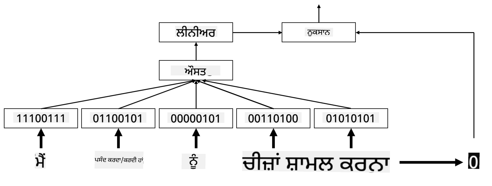

<!--
CO_OP_TRANSLATOR_METADATA:
{
  "original_hash": "e40b47ac3fd48f71304ede1474e66293",
  "translation_date": "2025-08-26T08:16:36+00:00",
  "source_file": "lessons/5-NLP/14-Embeddings/README.md",
  "language_code": "pa"
}
-->
# ਐਮਬੈਡਿੰਗਜ਼

## [ਪ੍ਰੀ-ਲੈਕਚਰ ਕਵਿਜ਼](https://red-field-0a6ddfd03.1.azurestaticapps.net/quiz/114)

ਜਦੋਂ BoW ਜਾਂ TF/IDF ਅਧਾਰਿਤ ਕਲਾਸੀਫਾਇਰਾਂ ਨੂੰ ਟ੍ਰੇਨ ਕੀਤਾ ਜਾਂਦਾ ਹੈ, ਅਸੀਂ `vocab_size` ਦੀ ਲੰਬਾਈ ਵਾਲੇ ਉੱਚ-ਡਾਈਮੇਨਸ਼ਨਲ ਬੈਗ-ਆਫ-ਵਰਡਜ਼ ਵੇਕਟਰਾਂ 'ਤੇ ਕੰਮ ਕਰਦੇ ਸੀ, ਅਤੇ ਅਸੀਂ ਖੁਦ-ਡਾਈਮੇਨਸ਼ਨਲ ਪੋਜ਼ੀਸ਼ਨਲ ਰਿਪ੍ਰਜ਼ੇਨਟੇਸ਼ਨ ਵੇਕਟਰਾਂ ਨੂੰ sparse one-hot ਰਿਪ੍ਰਜ਼ੇਨਟੇਸ਼ਨ ਵਿੱਚ ਬਦਲ ਰਹੇ ਸੀ। ਇਹ one-hot ਰਿਪ੍ਰਜ਼ੇਨਟੇਸ਼ਨ, ਹਾਲਾਂਕਿ, ਮੈਮੋਰੀ-ਇਫ਼ਿਸ਼ੈਂਟ ਨਹੀਂ ਹੈ। ਇਸ ਤੋਂ ਇਲਾਵਾ, ਹਰ ਸ਼ਬਦ ਨੂੰ ਇੱਕ-ਦੂਜੇ ਤੋਂ ਅਜ਼ਾਦ ਮੰਨਿਆ ਜਾਂਦਾ ਹੈ, ਜ਼ਿਆਦਾਤਰ ਇੱਕ-ਹਾਟ ਕੋਡ ਕੀਤੇ ਵੇਕਟਰ ਸ਼ਬਦਾਂ ਦੇ semantic ਸਮਾਨਤਾ ਨੂੰ ਪ੍ਰਗਟ ਨਹੀਂ ਕਰਦੇ।

**ਐਮਬੈਡਿੰਗ** ਦਾ ਵਿਚਾਰ ਇਹ ਹੈ ਕਿ ਸ਼ਬਦਾਂ ਨੂੰ ਘੱਟ-ਡਾਈਮੇਨਸ਼ਨਲ ਡੈਂਸ ਵੇਕਟਰਾਂ ਦੁਆਰਾ ਪ੍ਰਸਤੁਤ ਕੀਤਾ ਜਾਵੇ, ਜੋ ਕਿਸੇ ਤਰ੍ਹਾਂ ਸ਼ਬਦ ਦੇ semantic ਅਰਥ ਨੂੰ ਦਰਸਾਉਂਦੇ ਹਨ। ਅਸੀਂ ਬਾਅਦ ਵਿੱਚ ਚਰਚਾ ਕਰਾਂਗੇ ਕਿ ਅਰਥਪੂਰਨ ਸ਼ਬਦ ਐਮਬੈਡਿੰਗਜ਼ ਕਿਵੇਂ ਬਣਾਈਆਂ ਜਾਣ, ਪਰ ਇਸ ਸਮੇਂ ਲਈ, ਆਓ ਐਮਬੈਡਿੰਗਜ਼ ਨੂੰ ਸ਼ਬਦ ਵੇਕਟਰ ਦੀ ਡਾਈਮੇਨਸ਼ਨਲਟੀ ਨੂੰ ਘਟਾਉਣ ਦੇ ਤਰੀਕੇ ਵਜੋਂ ਸੋਚੀਏ।

ਇਸ ਲਈ, ਐਮਬੈਡਿੰਗ ਲੇਅਰ ਇੱਕ ਸ਼ਬਦ ਨੂੰ ਇਨਪੁਟ ਵਜੋਂ ਲਵੇਗੀ ਅਤੇ ਨਿਰਧਾਰਤ `embedding_size` ਦਾ ਆਉਟਪੁੱਟ ਵੇਕਟਰ ਪੈਦਾ ਕਰੇਗੀ। ਇੱਕ ਅਰਥ ਵਿੱਚ, ਇਹ `Linear` ਲੇਅਰ ਦੇ ਬਹੁਤ ਹੀ ਸਮਾਨ ਹੈ, ਪਰ ਇੱਕ-ਹਾਟ ਕੋਡ ਕੀਤੇ ਵੇਕਟਰ ਨੂੰ ਲੈਣ ਦੀ ਬਜਾਏ, ਇਹ ਇੱਕ ਸ਼ਬਦ ਨੰਬਰ ਨੂੰ ਇਨਪੁਟ ਵਜੋਂ ਲੈਣ ਦੇ ਯੋਗ ਹੋਵੇਗੀ, ਜਿਸ ਨਾਲ ਸਾਨੂੰ ਵੱਡੇ ਇੱਕ-ਹਾਟ-ਕੋਡ ਕੀਤੇ ਵੇਕਟਰ ਬਣਾਉਣ ਤੋਂ ਬਚਣ ਦੀ ਆਗਿਆ ਮਿਲੇਗੀ।

ਐਮਬੈਡਿੰਗ ਲੇਅਰ ਨੂੰ ਸਾਡੇ ਕਲਾਸੀਫਾਇਰ ਨੈਟਵਰਕ ਵਿੱਚ ਪਹਿਲੀ ਲੇਅਰ ਵਜੋਂ ਵਰਤ ਕੇ, ਅਸੀਂ ਬੈਗ-ਆਫ-ਵਰਡਜ਼ ਤੋਂ **embedding bag** ਮਾਡਲ ਵਿੱਚ ਸਵਿੱਚ ਕਰ ਸਕਦੇ ਹਾਂ, ਜਿੱਥੇ ਅਸੀਂ ਪਹਿਲਾਂ ਆਪਣੇ ਟੈਕਸਟ ਵਿੱਚ ਹਰ ਸ਼ਬਦ ਨੂੰ ਸੰਬੰਧਿਤ ਐਮਬੈਡਿੰਗ ਵਿੱਚ ਬਦਲਦੇ ਹਾਂ, ਅਤੇ ਫਿਰ ਸਾਰੇ ਐਮਬੈਡਿੰਗਜ਼ 'ਤੇ ਕੁਝ ਸਮੁੱਚੇ ਫੰਕਸ਼ਨ ਦੀ ਗਣਨਾ ਕਰਦੇ ਹਾਂ, ਜਿਵੇਂ ਕਿ `sum`, `average` ਜਾਂ `max`।  

> ਲੇਖਕ ਦੁਆਰਾ ਚਿੱਤਰ

## ✍️ ਅਭਿਆਸ: ਐਮਬੈਡਿੰਗਜ਼

ਹੇਠਾਂ ਦਿੱਤੇ ਨੋਟਬੁੱਕਾਂ ਵਿੱਚ ਆਪਣਾ ਸਿੱਖਣਾ ਜਾਰੀ ਰੱਖੋ:
* [PyTorch ਨਾਲ ਐਮਬੈਡਿੰਗਜ਼](../../../../../lessons/5-NLP/14-Embeddings/EmbeddingsPyTorch.ipynb)
* [TensorFlow ਨਾਲ ਐਮਬੈਡਿੰਗਜ਼](../../../../../lessons/5-NLP/14-Embeddings/EmbeddingsTF.ipynb)

## ਸੈਮਾਂਟਿਕ ਐਮਬੈਡਿੰਗਜ਼: Word2Vec

ਹਾਲਾਂਕਿ ਐਮਬੈਡਿੰਗ ਲੇਅਰ ਨੇ ਸ਼ਬਦਾਂ ਨੂੰ ਵੇਕਟਰ ਰਿਪ੍ਰਜ਼ੇਨਟੇਸ਼ਨ ਵਿੱਚ ਮੈਪ ਕਰਨਾ ਸਿੱਖਿਆ, ਪਰ ਇਹ ਰਿਪ੍ਰਜ਼ੇਨਟੇਸ਼ਨ ਜ਼ਰੂਰੀ ਨਹੀਂ ਕਿ semantic ਅਰਥ ਰੱਖਦਾ ਹੋਵੇ। ਇਹ ਚੰਗਾ ਹੋਵੇਗਾ ਕਿ ਇੱਕ ਵੇਕਟਰ ਰਿਪ੍ਰਜ਼ੇਨਟੇਸ਼ਨ ਸਿੱਖਿਆ ਜਾਵੇ ਜਿਸ ਵਿੱਚ ਸਮਾਨ ਸ਼ਬਦ ਜਾਂ synonyms ਉਹਨਾਂ ਵੇਕਟਰਾਂ ਦੇ ਨੇੜੇ ਹੋਣ ਜੋ ਕੁਝ ਵੇਕਟਰ ਦੂਰੀ (ਜਿਵੇਂ ਕਿ Euclidean ਦੂਰੀ) ਦੇ ਅਨੁਸਾਰ ਹੋਣ।

ਇਸ ਨੂੰ ਕਰਨ ਲਈ, ਸਾਨੂੰ ਇੱਕ ਵਿਸ਼ੇਸ਼ ਤਰੀਕੇ ਨਾਲ ਟੈਕਸਟ ਦੇ ਵੱਡੇ ਸੰਗ੍ਰਹਿ 'ਤੇ ਆਪਣੇ ਐਮਬੈਡਿੰਗ ਮਾਡਲ ਨੂੰ ਪ੍ਰੀ-ਟ੍ਰੇਨ ਕਰਨ ਦੀ ਜ਼ਰੂਰਤ ਹੈ। semantic ਐਮਬੈਡਿੰਗਜ਼ ਨੂੰ ਟ੍ਰੇਨ ਕਰਨ ਦਾ ਇੱਕ ਤਰੀਕਾ [Word2Vec](https://en.wikipedia.org/wiki/Word2vec) ਕਿਹਾ ਜਾਂਦਾ ਹੈ। ਇਹ ਦੋ ਮੁੱਖ ਆਰਕੀਟੈਕਚਰਾਂ 'ਤੇ ਅਧਾਰਿਤ ਹੈ ਜੋ ਸ਼ਬਦਾਂ ਦੀ ਵਿਤਰਿਤ ਰਿਪ੍ਰਜ਼ੇਨਟੇਸ਼ਨ ਪੈਦਾ ਕਰਨ ਲਈ ਵਰਤੇ ਜਾਂਦੇ ਹਨ:

 - **ਕੰਟਿਨਿਊਅਸ ਬੈਗ-ਆਫ-ਵਰਡਜ਼** (CBoW) — ਇਸ ਆਰਕੀਟੈਕਚਰ ਵਿੱਚ, ਅਸੀਂ ਮਾਡਲ ਨੂੰ ਆਸ-ਪਾਸ ਦੇ ਸੰਦਰਭ ਤੋਂ ਇੱਕ ਸ਼ਬਦ ਦੀ ਭਵਿੱਖਵਾਣੀ ਕਰਨ ਲਈ ਟ੍ਰੇਨ ਕਰਦੇ ਹਾਂ। ਦਿੱਤੇ ngram $(W_{-2},W_{-1},W_0,W_1,W_2)$, ਮਾਡਲ ਦਾ ਉਦੇਸ਼ $(W_{-2},W_{-1},W_1,W_2)$ ਤੋਂ $W_0$ ਦੀ ਭਵਿੱਖਵਾਣੀ ਕਰਨਾ ਹੈ।
 - **ਕੰਟਿਨਿਊਅਸ ਸਕਿਪ-ਗ੍ਰਾਮ** CBoW ਦੇ ਉਲਟ ਹੈ। ਮਾਡਲ ਸੰਦਰਭ ਸ਼ਬਦਾਂ ਦੀ ਵਿੰਡੋ ਨੂੰ ਵਰਤਦਾ ਹੈ ਤਾਂ ਜੋ ਮੌਜੂਦਾ ਸ਼ਬਦ ਦੀ ਭਵਿੱਖਵਾਣੀ ਕੀਤੀ ਜਾ ਸਕੇ।

CBoW ਤੇਜ਼ ਹੈ, ਜਦਕਿ ਸਕਿਪ-ਗ੍ਰਾਮ ਹੌਲੀ ਹੈ, ਪਰ ਅਲਭ ਸ਼ਬਦਾਂ ਦੀ ਰਿਪ੍ਰਜ਼ੇਨਟੇਸ਼ਨ ਕਰਨ ਵਿੱਚ ਵਧੀਆ ਕੰਮ ਕਰਦਾ ਹੈ।

> [ਇਸ ਪੇਪਰ](https://arxiv.org/pdf/1301.3781.pdf) ਤੋਂ ਚਿੱਤਰ

Word2Vec ਪ੍ਰੀ-ਟ੍ਰੇਨ ਕੀਤੇ ਐਮਬੈਡਿੰਗਜ਼ (ਜਿਵੇਂ ਕਿ ਹੋਰ ਸਮਾਨ ਮਾਡਲ, ਜਿਵੇਂ GloVe) ਨੂੰ ਨਿਊਰਲ ਨੈਟਵਰਕ ਵਿੱਚ ਐਮਬੈਡਿੰਗ ਲੇਅਰ ਦੀ ਜਗ੍ਹਾ ਵੀ ਵਰਤਿਆ ਜਾ ਸਕਦਾ ਹੈ। ਹਾਲਾਂਕਿ, ਸਾਨੂੰ ਸ਼ਬਦਾਵਲੀ ਨਾਲ ਨਿਪਟਣਾ ਪਵੇਗਾ, ਕਿਉਂਕਿ Word2Vec/GloVe ਨੂੰ ਪ੍ਰੀ-ਟ੍ਰੇਨ ਕਰਨ ਲਈ ਵਰਤੀ ਗਈ ਸ਼ਬਦਾਵਲੀ ਸਾਡੇ ਟੈਕਸਟ ਕੋਰਪਸ ਵਿੱਚ ਸ਼ਬਦਾਵਲੀ ਤੋਂ ਵੱਖਰੀ ਹੋਣ ਦੀ ਸੰਭਾਵਨਾ ਹੈ। ਉਪਰੋਕਤ ਨੋਟਬੁੱਕਾਂ ਵਿੱਚ ਦੇਖੋ ਕਿ ਇਸ ਸਮੱਸਿਆ ਨੂੰ ਕਿਵੇਂ ਹੱਲ ਕੀਤਾ ਜਾ ਸਕਦਾ ਹੈ।

## ਸੰਦਰਭਕ ਐਮਬੈਡਿੰਗਜ਼

ਪ੍ਰਚੀਨ ਪ੍ਰੀ-ਟ੍ਰੇਨ ਕੀਤੇ ਐਮਬੈਡਿੰਗ ਰਿਪ੍ਰਜ਼ੇਨਟੇਸ਼ਨ ਜਿਵੇਂ Word2Vec ਦੀ ਇੱਕ ਮੁੱਖ ਸੀਮਾ ਸ਼ਬਦ ਅਰਥ ਵਿਸ਼ੇਸ਼ਤਾ ਦੀ ਸਮੱਸਿਆ ਹੈ। ਹਾਲਾਂਕਿ ਪ੍ਰੀ-ਟ੍ਰੇਨ ਕੀਤੇ ਐਮਬੈਡਿੰਗਜ਼ ਸ਼ਬਦਾਂ ਦੇ ਸੰਦਰਭ ਵਿੱਚ ਕੁਝ ਅਰਥ ਨੂੰ ਕੈਪਚਰ ਕਰ ਸਕਦੇ ਹਨ, ਇੱਕ ਸ਼ਬਦ ਦਾ ਹਰ ਸੰਭਾਵਿਤ ਅਰਥ ਇੱਕੋ ਐਮਬੈਡਿੰਗ ਵਿੱਚ ਕੋਡ ਕੀਤਾ ਜਾਂਦਾ ਹੈ। ਇਹ ਡਾਊਨਸਟ੍ਰੀਮ ਮਾਡਲਾਂ ਵਿੱਚ ਸਮੱਸਿਆ ਪੈਦਾ ਕਰ ਸਕਦਾ ਹੈ, ਕਿਉਂਕਿ ਬਹੁਤ ਸਾਰੇ ਸ਼ਬਦ ਜਿਵੇਂ 'play' ਦਾ ਅਰਥ ਸੰਦਰਭ ਦੇ ਅਨੁਸਾਰ ਵੱਖਰਾ ਹੁੰਦਾ ਹੈ।

ਉਦਾਹਰਨ ਲਈ, 'play' ਸ਼ਬਦ ਦਾ ਅਰਥ ਹੇਠਾਂ ਦਿੱਤੇ ਦੋ ਵਾਕਾਂ ਵਿੱਚ ਬਹੁਤ ਵੱਖਰਾ ਹੈ:

- ਮੈਂ ਥੀਏਟਰ ਵਿੱਚ ਇੱਕ **play** ਦੇਖਣ ਗਿਆ।
- ਜੌਨ ਆਪਣੇ ਦੋਸਤਾਂ ਨਾਲ **play** ਕਰਨਾ ਚਾਹੁੰਦਾ ਹੈ।

ਉਪਰੋਕਤ ਪ੍ਰੀ-ਟ੍ਰੇਨ ਕੀਤੇ ਐਮਬੈਡਿੰਗਜ਼ 'play' ਸ਼ਬਦ ਦੇ ਦੋਵੇਂ ਅਰਥਾਂ ਨੂੰ ਇੱਕੋ ਐਮਬੈਡਿੰਗ ਵਿੱਚ ਰਿਪ੍ਰਜ਼ੇਨਟ ਕਰਦੇ ਹਨ। ਇਸ ਸੀਮਾ ਨੂੰ ਦੂਰ ਕਰਨ ਲਈ, ਸਾਨੂੰ **ਭਾਸ਼ਾ ਮਾਡਲ** ਦੇ ਅਧਾਰ 'ਤੇ ਐਮਬੈਡਿੰਗਜ਼ ਬਣਾਉਣ ਦੀ ਜ਼ਰੂਰਤ ਹੈ, ਜੋ ਟੈਕਸਟ ਦੇ ਵੱਡੇ ਸੰਗ੍ਰਹਿ 'ਤੇ ਟ੍ਰੇਨ ਕੀਤਾ ਜਾਂਦਾ ਹੈ, ਅਤੇ *ਜਾਣਦਾ ਹੈ* ਕਿ ਸ਼ਬਦਾਂ ਨੂੰ ਵੱਖ-ਵੱਖ ਸੰਦਰਭਾਂ ਵਿੱਚ ਕਿਵੇਂ ਇਕੱਠਾ ਕੀਤਾ ਜਾ ਸਕਦਾ ਹੈ। ਸੰਦਰਭਕ ਐਮਬੈਡਿੰਗਜ਼ ਦੀ ਚਰਚਾ ਇਸ ਟਿਊਟੋਰਿਅਲ ਦੇ ਦਾਇਰੇ ਤੋਂ ਬਾਹਰ ਹੈ, ਪਰ ਅਸੀਂ ਇਸ ਕੋਰਸ ਵਿੱਚ ਬਾਅਦ ਵਿੱਚ ਭਾਸ਼ਾ ਮਾਡਲਾਂ ਬਾਰੇ ਗੱਲ ਕਰਦੇ ਸਮੇਂ ਵਾਪਸ ਆਵਾਂਗੇ।

## ਨਿਸਕਰਸ਼

ਇਸ ਪਾਠ ਵਿੱਚ, ਤੁਸੀਂ TensorFlow ਅਤੇ PyTorch ਵਿੱਚ ਐਮਬੈਡਿੰਗ ਲੇਅਰਾਂ ਨੂੰ ਬਣਾਉਣ ਅਤੇ ਵਰਤਣ ਦਾ ਪਤਾ ਲਗਾਇਆ, ਤਾਂ ਜੋ ਸ਼ਬਦਾਂ ਦੇ semantic ਅਰਥਾਂ ਨੂੰ ਬਿਹਤਰ ਰਿਪ੍ਰਜ਼ੇਨਟ ਕੀਤਾ ਜਾ ਸਕੇ।

## 🚀 ਚੁਣੌਤੀ

Word2Vec ਨੂੰ ਕੁਝ ਦਿਲਚਸਪ ਐਪਲੀਕੇਸ਼ਨਾਂ ਲਈ ਵਰਤਿਆ ਗਿਆ ਹੈ, ਜਿਵੇਂ ਕਿ ਗੀਤਾਂ ਦੇ ਬੋਲ ਅਤੇ ਕਵਿਤਾ ਪੈਦਾ ਕਰਨਾ। [ਇਸ ਲੇਖ](https://www.politetype.com/blog/word2vec-color-poems) ਨੂੰ ਵੇਖੋ ਜੋ ਦਿਖਾਉਂਦਾ ਹੈ ਕਿ ਲੇਖਕ ਨੇ Word2Vec ਨੂੰ ਕਵਿਤਾ ਪੈਦਾ ਕਰਨ ਲਈ ਕਿਵੇਂ ਵਰਤਿਆ। [ਡੈਨ ਸ਼ਿਫਮੈਨ ਦੁਆਰਾ ਇਹ ਵੀਡੀਓ](https://www.youtube.com/watch?v=LSS_bos_TPI&ab_channel=TheCodingTrain) ਵੀ ਦੇਖੋ ਤਾਂ ਜੋ ਇਸ ਤਕਨੀਕ ਦੀ ਵੱਖਰੀ ਵਿਆਖਿਆ ਪਤਾ ਲਗ ਸਕੇ। ਫਿਰ ਇਸ ਤਕਨੀਕ ਨੂੰ ਆਪਣੇ ਟੈਕਸਟ ਕੋਰਪਸ 'ਤੇ ਲਾਗੂ ਕਰਨ ਦੀ ਕੋਸ਼ਿਸ਼ ਕਰੋ, ਸ਼ਾਇਦ Kaggle ਤੋਂ ਸੰਗ੍ਰਹਿ ਕੀਤਾ ਗਿਆ ਹੋਵੇ।

## [ਪੋਸਟ-ਲੈਕਚਰ ਕਵਿਜ਼](https://red-field-0a6ddfd03.1.azurestaticapps.net/quiz/214)

## ਸਮੀਖਿਆ ਅਤੇ ਸਵੈ-ਅਧਿਐਨ

Word2Vec 'ਤੇ ਇਸ ਪੇਪਰ ਨੂੰ ਪੜ੍ਹੋ: [Efficient Estimation of Word Representations in Vector Space](https://arxiv.org/pdf/1301.3781.pdf)

## [ਅਸਾਈਨਮੈਂਟ: ਨੋਟਬੁੱਕ](assignment.md)

**ਅਸਵੀਕਰਤੀ**:  
ਇਹ ਦਸਤਾਵੇਜ਼ AI ਅਨੁਵਾਦ ਸੇਵਾ [Co-op Translator](https://github.com/Azure/co-op-translator) ਦੀ ਵਰਤੋਂ ਕਰਕੇ ਅਨੁਵਾਦ ਕੀਤਾ ਗਿਆ ਹੈ। ਜਦੋਂ ਕਿ ਅਸੀਂ ਸਹੀ ਹੋਣ ਦੀ ਕੋਸ਼ਿਸ਼ ਕਰਦੇ ਹਾਂ, ਕਿਰਪਾ ਕਰਕੇ ਧਿਆਨ ਦਿਓ ਕਿ ਸਵੈਚਾਲਿਤ ਅਨੁਵਾਦਾਂ ਵਿੱਚ ਗਲਤੀਆਂ ਜਾਂ ਅਸੁਣਤੀਆਂ ਹੋ ਸਕਦੀਆਂ ਹਨ। ਇਸ ਦੀ ਮੂਲ ਭਾਸ਼ਾ ਵਿੱਚ ਮੌਜੂਦ ਮੂਲ ਦਸਤਾਵੇਜ਼ ਨੂੰ ਅਧਿਕਾਰਕ ਸਰੋਤ ਮੰਨਿਆ ਜਾਣਾ ਚਾਹੀਦਾ ਹੈ। ਮਹੱਤਵਪੂਰਨ ਜਾਣਕਾਰੀ ਲਈ, ਪੇਸ਼ੇਵਰ ਮਨੁੱਖੀ ਅਨੁਵਾਦ ਦੀ ਸਿਫਾਰਸ਼ ਕੀਤੀ ਜਾਂਦੀ ਹੈ। ਇਸ ਅਨੁਵਾਦ ਦੇ ਉਪਯੋਗ ਤੋਂ ਪੈਦਾ ਹੋਣ ਵਾਲੇ ਕਿਸੇ ਵੀ ਗਲਤਫਹਿਮੀ ਜਾਂ ਗਲਤ ਵਿਆਖਿਆ ਲਈ ਅਸੀਂ ਜ਼ਿੰਮੇਵਾਰ ਨਹੀਂ ਹਾਂ।