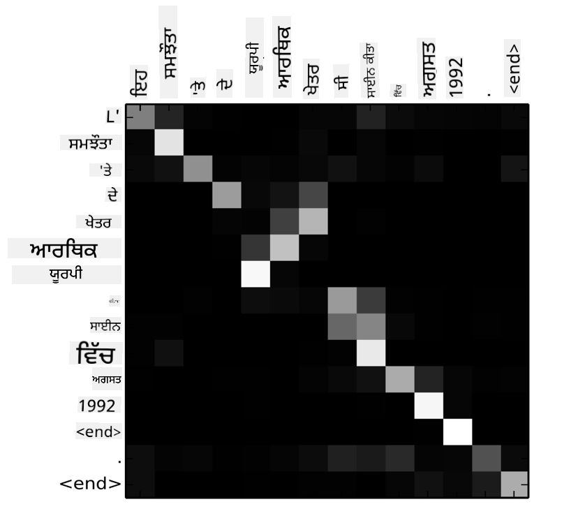
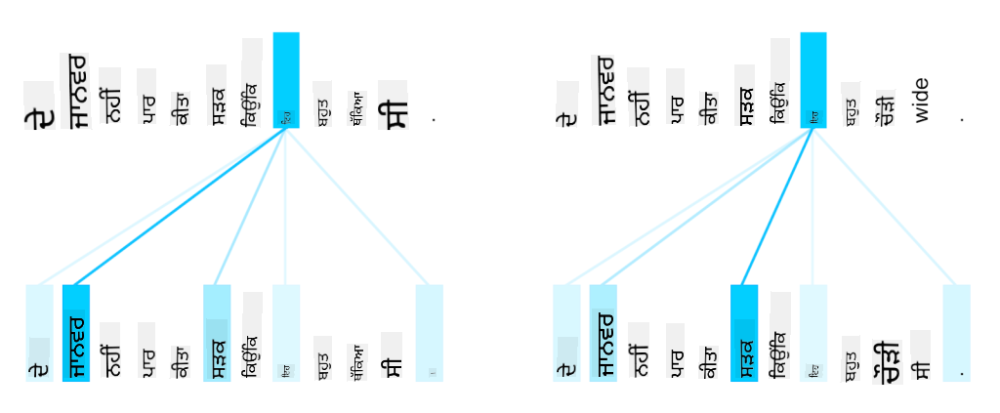

<!--
CO_OP_TRANSLATOR_METADATA:
{
  "original_hash": "f335dfcb4a993920504c387973a36957",
  "translation_date": "2025-09-23T07:39:41+00:00",
  "source_file": "lessons/5-NLP/18-Transformers/README.md",
  "language_code": "pa"
}
-->
# ਧਿਆਨ ਮਕੈਨਿਜ਼ਮ ਅਤੇ ਟ੍ਰਾਂਸਫਾਰਮਰ

## [ਪ੍ਰੀ-ਲੈਕਚਰ ਕਵਿਜ਼](https://ff-quizzes.netlify.app/en/ai/quiz/35)

NLP ਖੇਤਰ ਵਿੱਚ ਸਭ ਤੋਂ ਮਹੱਤਵਪੂਰਨ ਸਮੱਸਿਆਵਾਂ ਵਿੱਚੋਂ ਇੱਕ ਹੈ **ਮਸ਼ੀਨ ਅਨੁਵਾਦ**, ਜੋ Google Translate ਵਰਗੇ ਟੂਲਾਂ ਦੇ ਅਧਾਰ ਵਿੱਚ ਇੱਕ ਜਰੂਰੀ ਕੰਮ ਹੈ। ਇਸ ਭਾਗ ਵਿੱਚ, ਅਸੀਂ ਮਸ਼ੀਨ ਅਨੁਵਾਦ 'ਤੇ ਧਿਆਨ ਦੇਵਾਂਗੇ, ਜਾਂ, ਵਧੇਰੇ ਆਮ ਤੌਰ 'ਤੇ, ਕਿਸੇ ਵੀ *ਸੀਕਵੈਂਸ-ਟੂ-ਸੀਕਵੈਂਸ* ਕੰਮ (ਜਿਸਨੂੰ **ਵਾਕ ਸੰਚਾਰ** ਵੀ ਕਿਹਾ ਜਾਂਦਾ ਹੈ) 'ਤੇ।

RNNs ਨਾਲ, ਸੀਕਵੈਂਸ-ਟੂ-ਸੀਕਵੈਂਸ ਦੋ ਰਿਕਰੰਟ ਨੈਟਵਰਕਾਂ ਦੁਆਰਾ ਲਾਗੂ ਕੀਤਾ ਜਾਂਦਾ ਹੈ, ਜਿੱਥੇ ਇੱਕ ਨੈਟਵਰਕ, **ਐਨਕੋਡਰ**, ਇੱਕ ਇਨਪੁਟ ਸੀਕਵੈਂਸ ਨੂੰ ਇੱਕ ਹਿਡਨ ਸਟੇਟ ਵਿੱਚ ਸੰਗ੍ਰਹਿਤ ਕਰਦਾ ਹੈ, ਜਦਕਿ ਦੂਜਾ ਨੈਟਵਰਕ, **ਡਿਕੋਡਰ**, ਇਸ ਹਿਡਨ ਸਟੇਟ ਨੂੰ ਇੱਕ ਅਨੁਵਾਦੀ ਨਤੀਜੇ ਵਿੱਚ ਖੋਲ੍ਹਦਾ ਹੈ। ਇਸ ਪਹੁੰਚ ਨਾਲ ਕੁਝ ਸਮੱਸਿਆਵਾਂ ਹਨ:

* ਐਨਕੋਡਰ ਨੈਟਵਰਕ ਦੀ ਆਖਰੀ ਸਟੇਟ ਨੂੰ ਵਾਕ ਦੇ ਸ਼ੁਰੂ ਨੂੰ ਯਾਦ ਰੱਖਣ ਵਿੱਚ ਮੁਸ਼ਕਲ ਹੁੰਦੀ ਹੈ, ਜਿਸ ਕਾਰਨ ਲੰਬੇ ਵਾਕਾਂ ਲਈ ਮਾਡਲ ਦੀ ਗੁਣਵੱਤਾ ਘਟ ਜਾਂਦੀ ਹੈ।
* ਇੱਕ ਸੀਕਵੈਂਸ ਵਿੱਚ ਸਾਰੇ ਸ਼ਬਦਾਂ ਦਾ ਨਤੀਜੇ 'ਤੇ ਇੱਕੋ ਜਿਹਾ ਪ੍ਰਭਾਵ ਹੁੰਦਾ ਹੈ। ਹਕੀਕਤ ਵਿੱਚ, ਹਾਲਾਂਕਿ, ਇਨਪੁਟ ਸੀਕਵੈਂਸ ਵਿੱਚ ਕੁਝ ਵਿਸ਼ੇਸ਼ ਸ਼ਬਦਾਂ ਦਾ ਕਈ ਵਾਰ ਕ੍ਰਮਵਾਰ ਨਤੀਜਿਆਂ 'ਤੇ ਹੋਰਾਂ ਨਾਲੋਂ ਵੱਧ ਪ੍ਰਭਾਵ ਹੁੰਦਾ ਹੈ।

**ਧਿਆਨ ਮਕੈਨਿਜ਼ਮ** RNN ਦੇ ਹਰ ਆਉਟਪੁੱਟ ਅਨੁਮਾਨ 'ਤੇ ਹਰ ਇਨਪੁਟ ਵੇਕਟਰ ਦੇ ਸੰਦਰਭਕ ਪ੍ਰਭਾਵ ਨੂੰ ਵਜਨ ਦੇਣ ਦਾ ਇੱਕ ਢੰਗ ਪ੍ਰਦਾਨ ਕਰਦੇ ਹਨ। ਇਹ ਇਸ ਤਰੀਕੇ ਨਾਲ ਲਾਗੂ ਕੀਤਾ ਜਾਂਦਾ ਹੈ ਕਿ ਇਨਪੁਟ RNN ਦੇ ਮੱਧਵਰਤੀ ਸਟੇਟਾਂ ਅਤੇ ਆਉਟਪੁੱਟ RNN ਦੇ ਵਿਚਕਾਰ ਸ਼ਾਰਟਕਟ ਬਣਾਏ ਜਾਂਦੇ ਹਨ। ਇਸ ਤਰੀਕੇ ਨਾਲ, ਜਦੋਂ ਆਉਟਪੁੱਟ ਚਿੰਨ੍ਹ yt ਬਣਾਇਆ ਜਾਂਦਾ ਹੈ, ਅਸੀਂ ਸਾਰੇ ਇਨਪੁਟ ਹਿਡਨ ਸਟੇਟ hi ਨੂੰ ਵੱਖ-ਵੱਖ ਵਜਨ ਗੁਣਾਂਕ &alpha;t,i ਦੇ ਨਾਲ ਧਿਆਨ ਵਿੱਚ ਲਵਾਂਗੇ।

> [Bahdanau et al., 2015](https://arxiv.org/pdf/1409.0473.pdf) ਵਿੱਚ additive attention ਮਕੈਨਿਜ਼ਮ ਨਾਲ ਐਨਕੋਡਰ-ਡਿਕੋਡਰ ਮਾਡਲ, [ਇਸ ਬਲੌਗ ਪੋਸਟ](https://lilianweng.github.io/lil-log/2018/06/24/attention-attention.html) ਤੋਂ ਲਿਆ ਗਿਆ।

Attention ਮੈਟ੍ਰਿਕਸ {&alpha;i,j} ਇਹ ਦਰਸਾਉਂਦੀ ਹੈ ਕਿ ਕੁਝ ਇਨਪੁਟ ਸ਼ਬਦਾਂ ਦਾ ਇੱਕ ਦਿੱਤੇ ਗਏ ਆਉਟਪੁੱਟ ਸੀਕਵੈਂਸ ਵਿੱਚ ਸ਼ਬਦ ਬਣਾਉਣ ਵਿੱਚ ਕਿੰਨਾ ਯੋਗਦਾਨ ਹੈ। ਹੇਠਾਂ ਇਸ ਮੈਟ੍ਰਿਕਸ ਦਾ ਇੱਕ ਉਦਾਹਰਨ ਦਿੱਤਾ ਗਿਆ ਹੈ:

> [Bahdanau et al., 2015](https://arxiv.org/pdf/1409.0473.pdf) (Fig.3) ਤੋਂ ਚਿੱਤਰ

Attention ਮਕੈਨਿਜ਼ਮ NLP ਵਿੱਚ ਮੌਜੂਦਾ ਜਾਂ ਲਗਭਗ ਮੌਜੂਦਾ state-of-the-art ਲਈ ਜ਼ਿੰਮੇਵਾਰ ਹਨ। Attention ਸ਼ਾਮਲ ਕਰਨ ਨਾਲ ਮਾਡਲ ਪੈਰਾਮੀਟਰਾਂ ਦੀ ਗਿਣਤੀ ਵਿੱਚ ਕਾਫ਼ੀ ਵਾਧਾ ਹੁੰਦਾ ਹੈ, ਜਿਸ ਕਾਰਨ RNNs ਨਾਲ ਸਕੇਲਿੰਗ ਸਮੱਸਿਆਵਾਂ ਆਈਆਂ। RNNs ਨੂੰ ਸਕੇਲ ਕਰਨ ਦੀ ਇੱਕ ਮੁੱਖ ਪਾਬੰਦੀ ਇਹ ਹੈ ਕਿ ਮਾਡਲਾਂ ਦੀ ਰਿਕਰੰਟ ਪ੍ਰਕਿਰਿਆ ਟ੍ਰੇਨਿੰਗ ਨੂੰ ਬੈਚ ਅਤੇ ਪੈਰਾਲਲਾਈਜ਼ ਕਰਨਾ ਮੁਸ਼ਕਲ ਬਣਾ ਦਿੰਦੀ ਹੈ। RNN ਵਿੱਚ ਇੱਕ ਸੀਕਵੈਂਸ ਦੇ ਹਰ ਤੱਤ ਨੂੰ ਕ੍ਰਮਵਾਰ ਪ੍ਰਕਿਰਿਆਵਧੀ ਕਰਨ ਦੀ ਲੋੜ ਹੁੰਦੀ ਹੈ, ਜਿਸਦਾ ਮਤਲਬ ਹੈ ਕਿ ਇਸਨੂੰ ਆਸਾਨੀ ਨਾਲ ਪੈਰਾਲਲਾਈਜ਼ ਨਹੀਂ ਕੀਤਾ ਜਾ ਸਕਦਾ।

> [Google's Blog](https://research.googleblog.com/2016/09/a-neural-network-for-machine.html) ਤੋਂ ਚਿੱਤਰ

Attention ਮਕੈਨਿਜ਼ਮ ਦੀ ਅਪਣਾਉਣੀ ਅਤੇ ਇਸ ਪਾਬੰਦੀ ਨੇ ਅੱਜ ਦੇ ਮੌਜੂਦਾ state-of-the-art ਟ੍ਰਾਂਸਫਾਰਮਰ ਮਾਡਲਾਂ ਦੀ ਰਚਨਾ ਲਈ ਰਾਹ ਹਮਵਾਰ ਕੀਤਾ, ਜਿਵੇਂ ਕਿ BERT ਤੋਂ Open-GPT3।

## ਟ੍ਰਾਂਸਫਾਰਮਰ ਮਾਡਲ

ਟ੍ਰਾਂਸਫਾਰਮਰਾਂ ਦੇ ਪਿੱਛੇ ਇੱਕ ਮੁੱਖ ਵਿਚਾਰ ਇਹ ਹੈ ਕਿ RNNs ਦੀ ਕ੍ਰਮਵਾਰ ਪ੍ਰਕਿਰਿਆਵਧੀ ਨੂੰ ਟਾਲਿਆ ਜਾਵੇ ਅਤੇ ਇੱਕ ਮਾਡਲ ਬਣਾਇਆ ਜਾਵੇ ਜੋ ਟ੍ਰੇਨਿੰਗ ਦੌਰਾਨ ਪੈਰਾਲਲਾਈਜ਼ ਕੀਤਾ ਜਾ ਸਕੇ। ਇਹ ਦੋ ਵਿਚਾਰਾਂ ਨੂੰ ਲਾਗੂ ਕਰਕੇ ਹਾਸਲ ਕੀਤਾ ਜਾਂਦਾ ਹੈ:

* positional encoding
* RNNs (ਜਾਂ CNNs) ਦੀ ਬਜਾਏ ਪੈਟਰਨ ਨੂੰ ਕੈਪਚਰ ਕਰਨ ਲਈ self-attention ਮਕੈਨਿਜ਼ਮ ਦੀ ਵਰਤੋਂ (ਇਸ ਲਈ ਟ੍ਰਾਂਸਫਾਰਮਰਾਂ ਨੂੰ ਪੇਸ਼ ਕਰਨ ਵਾਲੇ ਪੇਪਰ ਦਾ ਨਾਮ *[Attention is all you need](https://arxiv.org/abs/1706.03762)* ਹੈ)

### Positional Encoding/Embedding

Positional encoding ਦਾ ਵਿਚਾਰ ਹੇਠਾਂ ਦਿੱਤਾ ਗਿਆ ਹੈ।  
1. RNNs ਦੀ ਵਰਤੋਂ ਕਰਦੇ ਸਮੇਂ, ਟੋਕਨ ਦਾ ਸਬੰਧਿਤ ਸਥਾਨ ਕਦਮਾਂ ਦੀ ਗਿਣਤੀ ਦੁਆਰਾ ਦਰਸਾਇਆ ਜਾਂਦਾ ਹੈ, ਅਤੇ ਇਸ ਲਈ ਇਸਨੂੰ ਸਪਸ਼ਟ ਤੌਰ 'ਤੇ ਦਰਸਾਉਣ ਦੀ ਲੋੜ ਨਹੀਂ ਹੁੰਦੀ।  
2. ਹਾਲਾਂਕਿ, ਜਦੋਂ ਅਸੀਂ attention ਦੀ ਵਰਤੋਂ ਕਰਦੇ ਹਾਂ, ਤਾਂ ਸਾਨੂੰ ਇੱਕ ਸੀਕਵੈਂਸ ਵਿੱਚ ਟੋਕਨ ਦੇ ਸਬੰਧਿਤ ਸਥਾਨਾਂ ਨੂੰ ਜਾਣਨ ਦੀ ਲੋੜ ਹੁੰਦੀ ਹੈ।  
3. Positional encoding ਪ੍ਰਾਪਤ ਕਰਨ ਲਈ, ਅਸੀਂ ਆਪਣੇ ਟੋਕਨ ਦੇ ਸੀਕਵੈਂਸ ਨੂੰ ਸੀਕਵੈਂਸ ਵਿੱਚ ਟੋਕਨ ਸਥਾਨਾਂ ਦੇ ਸੀਕਵੈਂਸ (ਜਾਂ, 0,1, ...) ਨਾਲ ਵਧਾਉਂਦੇ ਹਾਂ।  
4. ਫਿਰ ਅਸੀਂ ਟੋਕਨ ਸਥਾਨ ਨੂੰ ਟੋਕਨ embedding ਵੇਕਟਰ ਨਾਲ ਮਿਲਾਉਂਦੇ ਹਾਂ। ਸਥਾਨ (integer) ਨੂੰ ਇੱਕ ਵੇਕਟਰ ਵਿੱਚ ਬਦਲਣ ਲਈ, ਅਸੀਂ ਵੱਖ-ਵੱਖ ਪਹੁੰਚਾਂ ਦੀ ਵਰਤੋਂ ਕਰ ਸਕਦੇ ਹਾਂ:

* Trainable embedding, ਟੋਕਨ embedding ਦੇ ਸਮਾਨ। ਇਹ ਪਹੁੰਚ ਅਸੀਂ ਇੱਥੇ ਵਿਚਾਰ ਕਰਦੇ ਹਾਂ। ਅਸੀਂ ਟੋਕਨ ਅਤੇ ਉਨ੍ਹਾਂ ਦੇ ਸਥਾਨਾਂ ਦੋਵਾਂ 'ਤੇ embedding layers ਲਾਗੂ ਕਰਦੇ ਹਾਂ, ਜਿਸ ਨਾਲ ਇੱਕੋ ਮਾਪ ਦੇ embedding ਵੇਕਟਰ ਪ੍ਰਾਪਤ ਹੁੰਦੇ ਹਨ, ਜਿਨ੍ਹਾਂ ਨੂੰ ਅਸੀਂ ਫਿਰ ਇਕੱਠੇ ਜੋੜਦੇ ਹਾਂ।  
* Fixed position encoding function, ਜਿਵੇਂ ਕਿ ਮੂਲ ਪੇਪਰ ਵਿੱਚ ਪ੍ਰਸਤਾਵਿਤ ਕੀਤਾ ਗਿਆ ਹੈ।  

> ਲੇਖਕ ਦੁਆਰਾ ਚਿੱਤਰ

ਜੋ ਨਤੀਜਾ ਅਸੀਂ positional embedding ਨਾਲ ਪ੍ਰਾਪਤ ਕਰਦੇ ਹਾਂ, ਉਹ ਮੂਲ ਟੋਕਨ ਅਤੇ ਇਸਦਾ ਇੱਕ ਸੀਕਵੈਂਸ ਵਿੱਚ ਸਥਾਨ ਦੋਵਾਂ ਨੂੰ embed ਕਰਦਾ ਹੈ।

### Multi-Head Self-Attention

ਅਗਲੇ, ਸਾਨੂੰ ਆਪਣੇ ਸੀਕਵੈਂਸ ਵਿੱਚ ਕੁਝ ਪੈਟਰਨ ਕੈਪਚਰ ਕਰਨ ਦੀ ਲੋੜ ਹੈ। ਇਹ ਕਰਨ ਲਈ, ਟ੍ਰਾਂਸਫਾਰਮਰ **self-attention** ਮਕੈਨਿਜ਼ਮ ਦੀ ਵਰਤੋਂ ਕਰਦੇ ਹਨ, ਜੋ ਮੂਲ ਤੌਰ 'ਤੇ attention ਹੈ ਜੋ ਇਨਪੁਟ ਅਤੇ ਆਉਟਪੁੱਟ ਦੇ ਤੌਰ 'ਤੇ ਇੱਕੋ ਸੀਕਵੈਂਸ 'ਤੇ ਲਾਗੂ ਹੁੰਦੀ ਹੈ। Self-attention ਲਾਗੂ ਕਰਨ ਨਾਲ ਸਾਨੂੰ **context** ਨੂੰ ਵਾਕ ਵਿੱਚ ਧਿਆਨ ਵਿੱਚ ਲੈਣ ਦੀ ਆਗਿਆ ਮਿਲਦੀ ਹੈ, ਅਤੇ ਵੇਖਣ ਦੀ ਆਗਿਆ ਮਿਲਦੀ ਹੈ ਕਿ ਕਿਹੜੇ ਸ਼ਬਦ ਆਪਸ ਵਿੱਚ ਜੁੜੇ ਹੋਏ ਹਨ। ਉਦਾਹਰਨ ਲਈ, ਇਹ ਸਾਨੂੰ ਇਹ ਵੇਖਣ ਦੀ ਆਗਿਆ ਦਿੰਦਾ ਹੈ ਕਿ ਕਿਹੜੇ ਸ਼ਬਦ coreferences ਦੁਆਰਾ ਦਰਸਾਏ ਜਾਂਦੇ ਹਨ, ਜਿਵੇਂ ਕਿ *it*, ਅਤੇ context ਨੂੰ ਵੀ ਧਿਆਨ ਵਿੱਚ ਲੈਣ ਦੀ ਆਗਿਆ ਦਿੰਦਾ ਹੈ:

> [Google Blog](https://research.googleblog.com/2017/08/transformer-novel-neural-network.html) ਤੋਂ ਚਿੱਤਰ

ਟ੍ਰਾਂਸਫਾਰਮਰਾਂ ਵਿੱਚ, ਅਸੀਂ **Multi-Head Attention** ਦੀ ਵਰਤੋਂ ਕਰਦੇ ਹਾਂ ਤਾਂ ਜੋ ਨੈਟਵਰਕ ਨੂੰ ਵੱਖ-ਵੱਖ ਕਿਸਮ ਦੇ dependencies ਕੈਪਚਰ ਕਰਨ ਦੀ ਸ਼ਕਤੀ ਦਿੱਤੀ ਜਾ ਸਕੇ, ਜਿਵੇਂ ਕਿ long-term vs. short-term ਸ਼ਬਦ ਸੰਬੰਧ, co-reference vs. ਕੁਝ ਹੋਰ, ਆਦਿ।

[TensorFlow Notebook](TransformersTF.ipynb) ਵਿੱਚ ਟ੍ਰਾਂਸਫਾਰਮਰ ਲੇਅਰਾਂ ਦੀ ਲਾਗੂ ਕਰਨ ਦੀ ਵਧੇਰੇ ਜਾਣਕਾਰੀ ਹੈ।

### Encoder-Decoder Attention

ਟ੍ਰਾਂਸਫਾਰਮਰਾਂ ਵਿੱਚ, attention ਦੋ ਸਥਾਨਾਂ 'ਤੇ ਵਰਤੀ ਜਾਂਦੀ ਹੈ:

* ਇਨਪੁਟ ਟੈਕਸਟ ਵਿੱਚ ਪੈਟਰਨ ਕੈਪਚਰ ਕਰਨ ਲਈ self-attention ਦੀ ਵਰਤੋਂ  
* ਸੀਕਵੈਂਸ ਅਨੁਵਾਦ ਕਰਨ ਲਈ - ਇਹ attention layer ਹੈ ਜੋ ਐਨਕੋਡਰ ਅਤੇ ਡਿਕੋਡਰ ਦੇ ਵਿਚਕਾਰ ਹੈ।  

Encoder-decoder attention RNNs ਵਿੱਚ ਵਰਤੇ attention ਮਕੈਨਿਜ਼ਮ ਦੇ ਬਹੁਤ ਹੀ ਸਮਾਨ ਹੈ, ਜਿਵੇਂ ਕਿ ਇਸ ਭਾਗ ਦੇ ਸ਼ੁਰੂ ਵਿੱਚ ਵਰਣਨ ਕੀਤਾ ਗਿਆ ਹੈ। ਇਹ animated diagram ਟ੍ਰਾਂਸਫਾਰਮਰ ਮਾਡਲਾਂ ਵਿੱਚ encoder-decoder attention ਦੀ ਭੂਮਿਕਾ ਨੂੰ ਸਮਝਾਉਂਦਾ ਹੈ।

ਕਿਉਂਕਿ ਹਰ ਇਨਪੁਟ ਸਥਾਨ ਨੂੰ ਹਰ ਆਉਟਪੁੱਟ ਸਥਾਨ ਨਾਲ ਅਜ਼ਾਦੀ ਨਾਲ ਮੈਪ ਕੀਤਾ ਜਾਂਦਾ ਹੈ, ਟ੍ਰਾਂਸਫਾਰਮਰ RNNs ਨਾਲੋਂ ਵਧੀਆ ਪੈਰਾਲਲਾਈਜ਼ ਕਰ ਸਕਦੇ ਹਨ, ਜਿਸ ਨਾਲ ਕਾਫ਼ੀ ਵੱਡੇ ਅਤੇ ਹੋਰ ਪ੍ਰਗਟਵਾਦੀ ਭਾਸ਼ਾ ਮਾਡਲਾਂ ਨੂੰ ਯੋਗ ਬਣਾਇਆ ਜਾਂਦਾ ਹੈ। ਹਰ attention head ਸ਼ਬਦਾਂ ਦੇ ਵਿਚਕਾਰ ਵੱਖ-ਵੱਖ ਸੰਬੰਧਾਂ ਨੂੰ ਸਿੱਖਣ ਲਈ ਵਰਤੀ ਜਾ ਸਕਦੀ ਹੈ, ਜੋ NLP ਦੇ ਹੇਠਾਂ ਦੇ ਕੰਮਾਂ ਨੂੰ ਸੁਧਾਰਦਾ ਹੈ।

## BERT

**BERT** (Bidirectional Encoder Representations from Transformers) ਇੱਕ ਬਹੁਤ ਵੱਡਾ multi-layer ਟ੍ਰਾਂਸਫਾਰਮਰ ਨੈਟਵਰਕ ਹੈ ਜਿਸ ਵਿੱਚ *BERT-base* ਲਈ 12 ਲੇਅਰ ਹਨ, ਅਤੇ *BERT-large* ਲਈ 24। ਮਾਡਲ ਨੂੰ ਪਹਿਲਾਂ ਇੱਕ ਵੱਡੇ ਟੈਕਸਟ ਡਾਟਾ ਕੋਰਪਸ (WikiPedia + ਕਿਤਾਬਾਂ) 'ਤੇ unsupervised training (ਵਾਕ ਵਿੱਚ masked ਸ਼ਬਦਾਂ ਦੀ ਪੇਸ਼ਕਸ਼) ਦੀ ਵਰਤੋਂ ਕਰਕੇ pre-train ਕੀਤਾ ਜਾਂਦਾ ਹੈ। Pre-training ਦੌਰਾਨ ਮਾਡਲ ਭਾਸ਼ਾ ਸਮਝਣ ਦੇ ਮਹੱਤਵਪੂਰਨ ਪੱਧਰਾਂ ਨੂੰ ਅਪਣਾਉਂਦਾ ਹੈ, ਜਿਸਨੂੰ ਫਿਰ ਹੋਰ ਡਾਟਾਸੈਟਾਂ ਨਾਲ fine-tuning ਦੁਆਰਾ leveraged ਕੀਤਾ ਜਾ ਸਕਦਾ ਹੈ। ਇਸ ਪ੍ਰਕਿਰਿਆ ਨੂੰ **transfer learning** ਕਿਹਾ ਜਾਂਦਾ ਹੈ।

> ਚਿੱਤਰ [source](http://jalammar.github.io/illustrated-bert/)

## ✍️ ਅਭਿਆਸ: ਟ੍ਰਾਂਸਫਾਰਮਰ

ਹੇਠਾਂ ਦਿੱਤੇ ਨੋਟਬੁੱਕਾਂ ਵਿੱਚ ਆਪਣੀ ਸਿੱਖਿਆ ਜਾਰੀ ਰੱਖੋ:

* [Transformers in PyTorch](TransformersPyTorch.ipynb)
* [Transformers in TensorFlow](TransformersTF.ipynb)

## ਨਿਸਕਰਸ਼

ਇਸ ਪਾਠ ਵਿੱਚ ਤੁਸੀਂ ਟ੍ਰਾਂਸਫਾਰਮਰ ਅਤੇ Attention ਮਕੈਨਿਜ਼ਮ ਬਾਰੇ ਸਿੱਖਿਆ, ਜੋ NLP ਟੂਲਬਾਕਸ ਵਿੱਚ ਜ਼ਰੂਰੀ ਸੰਦ ਹਨ। ਟ੍ਰਾਂਸਫਾਰਮਰ ਆਰਕੀਟੈਕਚਰਾਂ ਦੇ ਕਈ ਰੂਪ ਹਨ ਜਿਵੇਂ ਕਿ BERT, DistilBERT, BigBird, OpenGPT3 ਅਤੇ ਹੋਰ ਜੋ fine-tuned ਕੀਤੇ ਜਾ ਸਕਦੇ ਹਨ। [HuggingFace ਪੈਕੇਜ](https://github.com/huggingface/) PyTorch ਅਤੇ TensorFlow ਦੋਵਾਂ ਨਾਲ ਕਈ ਆਰਕੀਟੈਕਚਰਾਂ ਨੂੰ ਟ੍ਰੇਨ ਕਰਨ ਲਈ repository ਪ੍ਰਦਾਨ ਕਰਦਾ ਹੈ।

## 🚀 ਚੁਣੌਤੀ

## [ਪੋਸਟ-ਲੈਕਚਰ ਕਵਿਜ਼](https://ff-quizzes.netlify.app/en/ai/quiz/36)

## ਸਮੀਖਿਆ ਅਤੇ ਸਵੈ-ਅਧਿਐਨ

* [Blog post](https://mchromiak.github.io/articles/2017/Sep/12/Transformer-Attention-is-all-you-need/), explaining the classical [Attention is all you need](https://arxiv.org/abs/1706.03762) paper on transformers.
* [A series of blog posts](https://towardsdatascience.com/transformers-explained-visually-part-1-overview-of-functionality-95a6dd460452) on transformers, explaining the architecture in detail.

## [ਅਸਾਈਨਮੈਂਟ](assignment.md)

---

