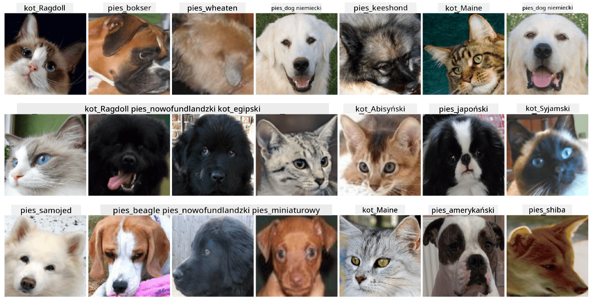

<!--
CO_OP_TRANSLATOR_METADATA:
{
  "original_hash": "b70fcf7fcee862990f848c679090943f",
  "translation_date": "2025-10-03T14:54:42+00:00",
  "source_file": "lessons/4-ComputerVision/07-ConvNets/lab/README.md",
  "language_code": "pl"
}
-->
# Klasyfikacja Twarzy Zwierząt Domowych

Zadanie laboratoryjne z [Kursu AI dla Początkujących](https://github.com/microsoft/ai-for-beginners).

## Zadanie

Wyobraź sobie, że musisz stworzyć aplikację dla przedszkola dla zwierząt, aby katalogować wszystkie zwierzęta. Jedną z świetnych funkcji takiej aplikacji byłoby automatyczne rozpoznawanie rasy na podstawie fotografii. Można to skutecznie osiągnąć za pomocą sieci neuronowych.

Twoim zadaniem jest wytrenowanie konwolucyjnej sieci neuronowej do klasyfikacji różnych ras kotów i psów, korzystając z zestawu danych **Pet Faces**.

## Zestaw Danych

Użyjemy [Oxford-IIIT Pet Dataset](https://www.robots.ox.ac.uk/~vgg/data/pets/), który zawiera obrazy 37 różnych ras psów i kotów.



Aby pobrać zestaw danych, użyj tego fragmentu kodu:

```python
!wget https://thor.robots.ox.ac.uk/~vgg/data/pets/images.tar.gz
!tar xfz images.tar.gz
!rm images.tar.gz
```

**Uwaga:** Obrazy w zestawie danych Oxford-IIIT Pet Dataset są zorganizowane według nazw plików (np. `Abyssinian_1.jpg`, `Bengal_2.jpg`). Notebook zawiera kod do organizacji tych obrazów w podkatalogi specyficzne dla ras, co ułatwia klasyfikację.

## Rozpoczęcie Pracy z Notebookiem

Rozpocznij pracę z laboratorium, otwierając [PetFaces.ipynb](PetFaces.ipynb)

## Wnioski

Rozwiązałeś stosunkowo złożony problem klasyfikacji obrazów od podstaw! Było całkiem sporo klas, a mimo to udało Ci się osiągnąć rozsądną dokładność! Warto również zmierzyć dokładność top-k, ponieważ łatwo pomylić niektóre klasy, które nawet dla ludzi nie są wyraźnie różne.

---

**Zastrzeżenie**:  
Ten dokument został przetłumaczony za pomocą usługi tłumaczenia AI [Co-op Translator](https://github.com/Azure/co-op-translator). Chociaż dokładamy wszelkich starań, aby tłumaczenie było precyzyjne, prosimy pamiętać, że automatyczne tłumaczenia mogą zawierać błędy lub nieścisłości. Oryginalny dokument w jego języku źródłowym powinien być uznawany za autorytatywne źródło. W przypadku informacji o kluczowym znaczeniu zaleca się skorzystanie z profesjonalnego tłumaczenia wykonanego przez człowieka. Nie ponosimy odpowiedzialności za jakiekolwiek nieporozumienia lub błędne interpretacje wynikające z użycia tego tłumaczenia.