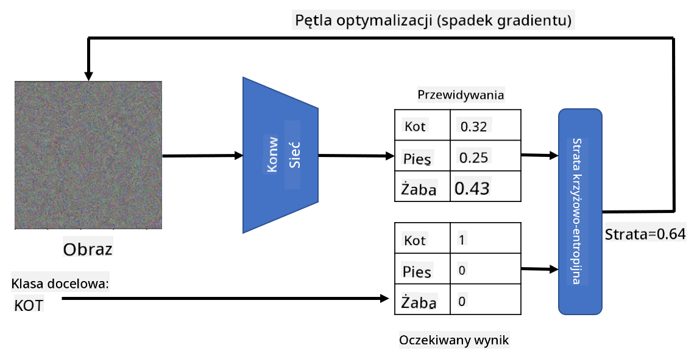

<!--
CO_OP_TRANSLATOR_METADATA:
{
  "original_hash": "178c0b5ee5395733eb18aec51e71a0a9",
  "translation_date": "2025-09-23T13:51:34+00:00",
  "source_file": "lessons/4-ComputerVision/08-TransferLearning/README.md",
  "language_code": "pl"
}
-->
# Wstępnie wytrenowane sieci i transfer uczenia

Trenowanie CNN może zająć dużo czasu, a do tego zadania potrzebne są duże ilości danych. Jednak większość czasu poświęca się na naukę najlepszych filtrów niskiego poziomu, które sieć może wykorzystać do wyodrębniania wzorców z obrazów. Pojawia się naturalne pytanie - czy możemy użyć sieci neuronowej wytrenowanej na jednym zbiorze danych i dostosować ją do klasyfikacji innych obrazów bez konieczności pełnego procesu trenowania?

## [Quiz przed wykładem](https://ff-quizzes.netlify.app/en/ai/quiz/15)

To podejście nazywa się **transferem uczenia**, ponieważ przenosimy pewną wiedzę z jednego modelu sieci neuronowej do innego. W transferze uczenia zazwyczaj zaczynamy od modelu wstępnie wytrenowanego, który został wytrenowany na dużym zbiorze obrazów, takim jak **ImageNet**. Te modele potrafią już dobrze wyodrębniać różne cechy z ogólnych obrazów, a w wielu przypadkach samo zbudowanie klasyfikatora na podstawie tych wyodrębnionych cech może dać dobre rezultaty.

> ✅ Transfer uczenia to termin, który można znaleźć w innych dziedzinach akademickich, takich jak edukacja. Odnosi się do procesu przenoszenia wiedzy z jednej dziedziny i stosowania jej w innej.

## Wstępnie wytrenowane modele jako ekstraktory cech

Sieci konwolucyjne, o których mówiliśmy w poprzedniej sekcji, zawierają wiele warstw, z których każda ma za zadanie wyodrębniać pewne cechy z obrazu, zaczynając od kombinacji pikseli niskiego poziomu (takich jak linie poziome/pionowe czy kreski), aż po kombinacje cech wyższego poziomu, odpowiadające np. oku płomienia. Jeśli wytrenujemy CNN na wystarczająco dużym zbiorze ogólnych i zróżnicowanych obrazów, sieć powinna nauczyć się wyodrębniać te wspólne cechy.

Zarówno Keras, jak i PyTorch zawierają funkcje umożliwiające łatwe ładowanie wstępnie wytrenowanych wag sieci neuronowych dla niektórych popularnych architektur, z których większość została wytrenowana na obrazach z ImageNet. Najczęściej używane z nich są opisane na stronie [Architektury CNN](../07-ConvNets/CNN_Architectures.md) z poprzedniej lekcji. W szczególności warto rozważyć użycie jednej z poniższych:

* **VGG-16/VGG-19**, które są stosunkowo prostymi modelami, ale nadal dają dobrą dokładność. Często użycie VGG jako pierwszej próby jest dobrym wyborem, aby zobaczyć, jak działa transfer uczenia.
* **ResNet** to rodzina modeli zaproponowanych przez Microsoft Research w 2015 roku. Mają więcej warstw, a zatem wymagają więcej zasobów.
* **MobileNet** to rodzina modeli o zmniejszonym rozmiarze, odpowiednia dla urządzeń mobilnych. Używaj ich, jeśli masz ograniczone zasoby i możesz poświęcić trochę dokładności.

Oto przykładowe cechy wyodrębnione z obrazu kota przez sieć VGG-16:

## Zbiór danych Koty vs. Psy

W tym przykładzie użyjemy zbioru danych [Koty i Psy](https://www.microsoft.com/download/details.aspx?id=54765&WT.mc_id=academic-77998-cacaste), który jest bardzo zbliżony do scenariusza klasyfikacji obrazów w rzeczywistych warunkach.

## ✍️ Ćwiczenie: Transfer uczenia

Zobaczmy transfer uczenia w praktyce w odpowiednich notebookach:

* [Transfer uczenia - PyTorch](TransferLearningPyTorch.ipynb)
* [Transfer uczenia - TensorFlow](TransferLearningTF.ipynb)

## Wizualizacja idealnego kota

Wstępnie wytrenowana sieć neuronowa zawiera różne wzorce w swoim *mózgu*, w tym pojęcia **idealnego kota** (jak również idealnego psa, idealnej zebry itd.). Byłoby interesujące jakoś **zwizualizować ten obraz**. Jednak nie jest to proste, ponieważ wzorce są rozproszone po wagach sieci i zorganizowane w hierarchiczną strukturę.

Jednym z podejść, które możemy zastosować, jest rozpoczęcie od losowego obrazu, a następnie próba użycia techniki **optymalizacji metodą gradientu** w celu dostosowania tego obrazu w taki sposób, aby sieć zaczęła myśleć, że to kot.

Jednak jeśli to zrobimy, otrzymamy coś bardzo podobnego do losowego szumu. Dzieje się tak, ponieważ *istnieje wiele sposobów, aby sieć myślała, że obraz wejściowy to kot*, w tym takie, które nie mają sensu wizualnie. Chociaż te obrazy zawierają wiele wzorców typowych dla kota, nic nie zmusza ich do bycia wizualnie wyraźnymi.

Aby poprawić wynik, możemy dodać kolejny składnik do funkcji straty, który nazywa się **stratą wariacji**. Jest to metryka pokazująca, jak podobne są sąsiadujące piksele obrazu. Minimalizowanie straty wariacji sprawia, że obraz staje się bardziej gładki i pozbywa się szumu - ujawniając bardziej atrakcyjne wizualnie wzorce. Oto przykład takich "idealnych" obrazów, które są klasyfikowane jako kot i jako zebra z dużym prawdopodobieństwem:

 | 
-----|-----
 *Idealny kot* | *Idealna zebra*

Podobne podejście można zastosować do przeprowadzania tzw. **ataków adversarialnych** na sieć neuronową. Załóżmy, że chcemy oszukać sieć neuronową i sprawić, by pies wyglądał jak kot. Jeśli weźmiemy obraz psa, który jest rozpoznawany przez sieć jako pies, możemy go nieco zmodyfikować za pomocą optymalizacji metodą gradientu, aż sieć zacznie klasyfikować go jako kota:

 | 
-----|-----
*Oryginalny obraz psa* | *Obraz psa klasyfikowany jako kot*

Zobacz kod, aby odtworzyć powyższe wyniki w następującym notebooku:

* [Idealny i adversarialny kot - TensorFlow](AdversarialCat_TF.ipynb)

## Podsumowanie

Dzięki transferowi uczenia możesz szybko stworzyć klasyfikator do zadania klasyfikacji niestandardowych obiektów i osiągnąć wysoką dokładność. Widać, że bardziej złożone zadania, które teraz rozwiązujemy, wymagają większej mocy obliczeniowej i nie mogą być łatwo rozwiązane na CPU. W następnej jednostce spróbujemy użyć bardziej lekkiej implementacji, aby wytrenować ten sam model przy użyciu mniejszych zasobów obliczeniowych, co skutkuje tylko nieznacznie niższą dokładnością.

## 🚀 Wyzwanie

W towarzyszących notebookach znajdują się notatki na dole dotyczące tego, jak transfer wiedzy działa najlepiej z nieco podobnymi danymi treningowymi (na przykład nowy typ zwierzęcia). Przeprowadź eksperymenty z zupełnie nowymi typami obrazów, aby zobaczyć, jak dobrze lub źle działają Twoje modele transferu wiedzy.

## [Quiz po wykładzie](https://ff-quizzes.netlify.app/en/ai/quiz/16)

## Przegląd i samodzielna nauka

Przeczytaj [TrainingTricks.md](TrainingTricks.md), aby pogłębić swoją wiedzę na temat innych sposobów trenowania modeli.

## [Zadanie](lab/README.md)

W tym laboratorium użyjemy rzeczywistego zbioru danych [Oxford-IIIT](https://www.robots.ox.ac.uk/~vgg/data/pets/) zawierającego 35 ras kotów i psów, i zbudujemy klasyfikator transferu uczenia.

---

