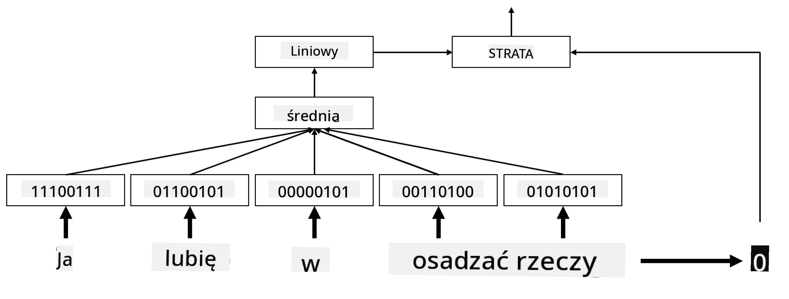

<!--
CO_OP_TRANSLATOR_METADATA:
{
  "original_hash": "b708c9b85b833864c73c6281f1e6b96e",
  "translation_date": "2025-09-23T14:00:17+00:00",
  "source_file": "lessons/5-NLP/14-Embeddings/README.md",
  "language_code": "pl"
}
-->
# Osadzenia

## [Quiz przed wykładem](https://ff-quizzes.netlify.app/en/ai/quiz/27)

Podczas trenowania klasyfikatorów opartych na BoW lub TF/IDF operowaliśmy na wysokowymiarowych wektorach bag-of-words o długości `vocab_size`, a także jawnie konwertowaliśmy niskowymiarowe wektory reprezentacji pozycyjnej na rzadkie wektory one-hot. Jednakże reprezentacja one-hot nie jest efektywna pod względem pamięci. Dodatkowo, każde słowo jest traktowane niezależnie od innych, tj. zakodowane wektory one-hot nie wyrażają żadnego semantycznego podobieństwa między słowami.

Pomysł **osadzenia** polega na reprezentowaniu słów za pomocą niskowymiarowych, gęstych wektorów, które w pewien sposób odzwierciedlają semantyczne znaczenie słowa. Później omówimy, jak budować znaczące osadzenia słów, ale na razie pomyślmy o osadzeniach jako o sposobie na zmniejszenie wymiarowości wektora słowa.

Warstwa osadzenia przyjmuje słowo jako wejście i generuje wektor wyjściowy o określonym `embedding_size`. W pewnym sensie jest bardzo podobna do warstwy `Linear`, ale zamiast przyjmować zakodowany wektor one-hot, może przyjmować numer słowa jako wejście, co pozwala nam uniknąć tworzenia dużych wektorów zakodowanych one-hot.

Używając warstwy osadzenia jako pierwszej warstwy w naszej sieci klasyfikatora, możemy przejść od modelu bag-of-words do modelu **embedding bag**, gdzie najpierw konwertujemy każde słowo w naszym tekście na odpowiadające mu osadzenie, a następnie obliczamy pewną funkcję agregującą dla wszystkich tych osadzeń, taką jak `sum`, `average` lub `max`.

> Obraz autorstwa autora

## ✍️ Ćwiczenia: Osadzenia

Kontynuuj naukę w poniższych notatnikach:
* [Osadzenia z PyTorch](EmbeddingsPyTorch.ipynb)
* [Osadzenia TensorFlow](EmbeddingsTF.ipynb)

## Semantyczne osadzenia: Word2Vec

Chociaż warstwa osadzenia nauczyła się mapować słowa na reprezentację wektorową, ta reprezentacja niekoniecznie miała wiele semantycznego znaczenia. Byłoby dobrze nauczyć się reprezentacji wektorowej, w której podobne słowa lub synonimy odpowiadają wektorom bliskim sobie pod względem pewnej odległości wektorowej (np. odległości euklidesowej).

Aby to osiągnąć, musimy wstępnie wytrenować nasz model osadzenia na dużym zbiorze tekstów w określony sposób. Jednym ze sposobów trenowania semantycznych osadzeń jest [Word2Vec](https://en.wikipedia.org/wiki/Word2vec). Opiera się on na dwóch głównych architekturach używanych do tworzenia rozproszonej reprezentacji słów:

 - **Continuous bag-of-words** (CBoW) — w tej architekturze uczymy model przewidywania słowa na podstawie otaczającego kontekstu. Mając ngram $(W_{-2},W_{-1},W_0,W_1,W_2)$, celem modelu jest przewidzenie $W_0$ na podstawie $(W_{-2},W_{-1},W_1,W_2)$.
 - **Continuous skip-gram** — jest przeciwieństwem CBoW. Model używa otaczającego okna słów kontekstowych do przewidywania bieżącego słowa.

CBoW działa szybciej, podczas gdy skip-gram jest wolniejszy, ale lepiej reprezentuje rzadkie słowa.

> Obraz z [tego artykułu](https://arxiv.org/pdf/1301.3781.pdf)

Wstępnie wytrenowane osadzenia Word2Vec (oraz inne podobne modele, takie jak GloVe) mogą być również używane zamiast warstwy osadzenia w sieciach neuronowych. Jednak musimy poradzić sobie ze słownikami, ponieważ słownik używany do wstępnego trenowania Word2Vec/GloVe prawdopodobnie różni się od słownika w naszym korpusie tekstowym. Zajrzyj do powyższych notatników, aby zobaczyć, jak można rozwiązać ten problem.

## Kontekstowe osadzenia

Jednym z kluczowych ograniczeń tradycyjnych wstępnie wytrenowanych reprezentacji osadzeń, takich jak Word2Vec, jest problem rozróżniania znaczeń słów. Chociaż wstępnie wytrenowane osadzenia mogą uchwycić część znaczenia słów w kontekście, każde możliwe znaczenie słowa jest kodowane w tym samym osadzeniu. Może to powodować problemy w modelach downstream, ponieważ wiele słów, takich jak słowo 'play', ma różne znaczenia w zależności od kontekstu, w którym są używane.

Na przykład słowo 'play' w tych dwóch różnych zdaniach ma zupełnie inne znaczenie:

- Poszedłem na **sztukę** do teatru.
- John chce się **bawić** ze swoimi przyjaciółmi.

Wstępnie wytrenowane osadzenia powyżej reprezentują oba te znaczenia słowa 'play' w tym samym osadzeniu. Aby przezwyciężyć to ograniczenie, musimy budować osadzenia oparte na **modelu językowym**, który jest trenowany na dużym korpusie tekstów i *wie*, jak słowa mogą być używane w różnych kontekstach. Omówienie kontekstowych osadzeń wykracza poza zakres tego tutorialu, ale wrócimy do nich, gdy będziemy omawiać modele językowe później w kursie.

## Podsumowanie

W tej lekcji odkryłeś, jak budować i używać warstw osadzeń w TensorFlow i Pytorch, aby lepiej odzwierciedlać semantyczne znaczenia słów.

## 🚀 Wyzwanie

Word2Vec był używany w ciekawych aplikacjach, w tym do generowania tekstów piosenek i poezji. Zajrzyj do [tego artykułu](https://www.politetype.com/blog/word2vec-color-poems), który opisuje, jak autor użył Word2Vec do generowania poezji. Obejrzyj również [ten film Dana Shiffmanna](https://www.youtube.com/watch?v=LSS_bos_TPI&ab_channel=TheCodingTrain), aby odkryć inne wyjaśnienie tej techniki. Następnie spróbuj zastosować te techniki do własnego korpusu tekstowego, być może pochodzącego z Kaggle.

## [Quiz po wykładzie](https://ff-quizzes.netlify.app/en/ai/quiz/28)

## Przegląd i samodzielna nauka

Przeczytaj ten artykuł o Word2Vec: [Efficient Estimation of Word Representations in Vector Space](https://arxiv.org/pdf/1301.3781.pdf)

## [Zadanie: Notatniki](assignment.md)

---

