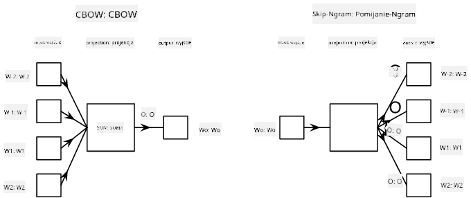

<!--
CO_OP_TRANSLATOR_METADATA:
{
  "original_hash": "7ba20f54a5bfcd6521018cdfb17c7c57",
  "translation_date": "2025-09-23T13:58:26+00:00",
  "source_file": "lessons/5-NLP/15-LanguageModeling/README.md",
  "language_code": "pl"
}
-->
# Modelowanie języka

Semantyczne osadzenia, takie jak Word2Vec i GloVe, są w rzeczywistości pierwszym krokiem w kierunku **modelowania języka** - tworzenia modeli, które w pewien sposób *rozumieją* (lub *reprezentują*) naturę języka.

## [Quiz przed wykładem](https://ff-quizzes.netlify.app/en/ai/quiz/29)

Główna idea modelowania języka polega na trenowaniu modeli na nieoznaczonych zbiorach danych w sposób nienadzorowany. Jest to istotne, ponieważ mamy ogromne ilości nieoznaczonego tekstu, podczas gdy ilość oznaczonego tekstu zawsze będzie ograniczona przez wysiłek, jaki możemy poświęcić na jego oznaczanie. Najczęściej możemy budować modele językowe, które potrafią **przewidywać brakujące słowa** w tekście, ponieważ łatwo jest zamaskować losowe słowo w tekście i użyć go jako próbki treningowej.

## Trenowanie osadzeń

W naszych wcześniejszych przykładach korzystaliśmy z wstępnie wytrenowanych semantycznych osadzeń, ale warto zobaczyć, jak można je trenować. Istnieje kilka możliwych podejść:

* **Modelowanie języka N-Gram**, gdzie przewidujemy token, patrząc na N poprzednich tokenów (N-gram).
* **Continuous Bag-of-Words** (CBoW), gdzie przewidujemy środkowy token $W_0$ w sekwencji tokenów $W_{-N}$, ..., $W_N$.
* **Skip-gram**, gdzie przewidujemy zestaw sąsiednich tokenów {$W_{-N},\dots, W_{-1}, W_1,\dots, W_N$} na podstawie środkowego tokena $W_0$.

> Obraz z [tego artykułu](https://arxiv.org/pdf/1301.3781.pdf)

## ✍️ Przykładowe notatniki: Trenowanie modelu CBoW

Kontynuuj naukę w poniższych notatnikach:

* [Trenowanie CBoW Word2Vec z TensorFlow](CBoW-TF.ipynb)
* [Trenowanie CBoW Word2Vec z PyTorch](CBoW-PyTorch.ipynb)

## Podsumowanie

W poprzedniej lekcji zobaczyliśmy, że osadzenia słów działają jak magia! Teraz wiemy, że trenowanie osadzeń słów nie jest bardzo skomplikowanym zadaniem i powinniśmy być w stanie wytrenować własne osadzenia słów dla tekstów specyficznych dla danej dziedziny, jeśli zajdzie taka potrzeba.

## [Quiz po wykładzie](https://ff-quizzes.netlify.app/en/ai/quiz/30)

## Przegląd i samodzielna nauka

* [Oficjalny samouczek PyTorch dotyczący modelowania języka](https://pytorch.org/tutorials/beginner/nlp/word_embeddings_tutorial.html).
* [Oficjalny samouczek TensorFlow dotyczący trenowania modelu Word2Vec](https://www.TensorFlow.org/tutorials/text/word2vec).
* Korzystanie z frameworka **gensim** do trenowania najczęściej używanych osadzeń w kilku liniach kodu jest opisane [w tej dokumentacji](https://pytorch.org/tutorials/beginner/nlp/word_embeddings_tutorial.html).

## 🚀 [Zadanie: Wytrenuj model Skip-Gram](lab/README.md)

W laboratorium zachęcamy Cię do zmodyfikowania kodu z tej lekcji, aby wytrenować model Skip-Gram zamiast CBoW. [Przeczytaj szczegóły](lab/README.md)

---

