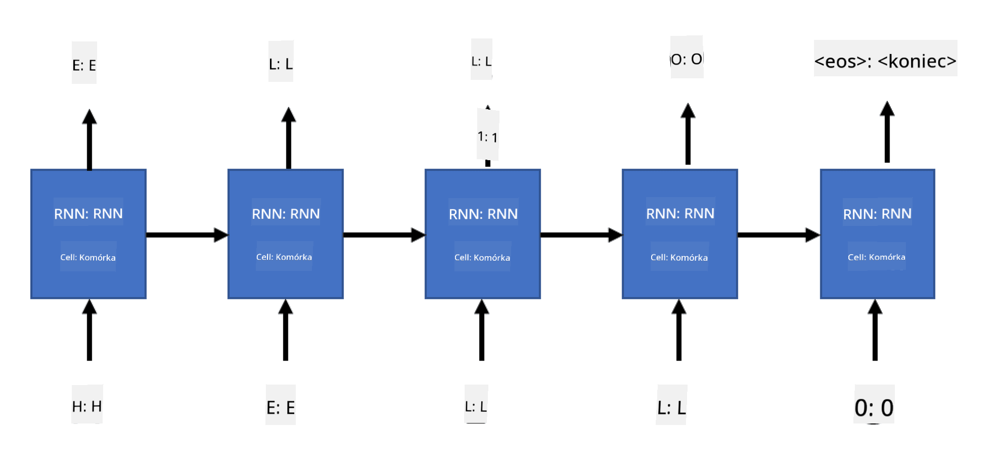

<!--
CO_OP_TRANSLATOR_METADATA:
{
  "original_hash": "51be6057374d01d70e07dd5ec88ebc0d",
  "translation_date": "2025-09-23T13:58:05+00:00",
  "source_file": "lessons/5-NLP/17-GenerativeNetworks/README.md",
  "language_code": "pl"
}
-->
# Generatywne sieci

## [Quiz przed wykładem](https://ff-quizzes.netlify.app/en/ai/quiz/33)

Rekurencyjne sieci neuronowe (RNN) oraz ich warianty z komórkami bramkowymi, takie jak komórki pamięci długoterminowej (LSTM) i jednostki rekurencyjne z bramkami (GRU), umożliwiają modelowanie języka, ponieważ potrafią uczyć się kolejności słów i przewidywać następne słowo w sekwencji. Dzięki temu możemy używać RNN do **zadań generatywnych**, takich jak generowanie tekstu, tłumaczenie maszynowe, a nawet opisywanie obrazów.

> ✅ Pomyśl o wszystkich sytuacjach, w których korzystałeś z zadań generatywnych, takich jak uzupełnianie tekstu podczas pisania. Poszukaj informacji o swoich ulubionych aplikacjach, aby sprawdzić, czy wykorzystują RNN.

W architekturze RNN, którą omawialiśmy w poprzedniej jednostce, każda jednostka RNN generowała kolejny ukryty stan jako wyjście. Możemy jednak dodać kolejne wyjście do każdej jednostki rekurencyjnej, co pozwoli na generowanie **sekwencji** (o długości równej oryginalnej sekwencji). Ponadto możemy używać jednostek RNN, które nie przyjmują danych wejściowych na każdym kroku, a jedynie początkowy wektor stanu, aby generować sekwencję wyjść.

To umożliwia różne architektury sieci neuronowych, które przedstawiono na poniższym obrazku:


> Obraz z wpisu na blogu [Unreasonable Effectiveness of Recurrent Neural Networks](http://karpathy.github.io/2015/05/21/rnn-effectiveness/) autorstwa [Andreja Karpaty](http://karpathy.github.io/)

* **One-to-one** to tradycyjna sieć neuronowa z jednym wejściem i jednym wyjściem
* **One-to-many** to architektura generatywna, która przyjmuje jedną wartość wejściową i generuje sekwencję wartości wyjściowych. Na przykład, jeśli chcemy wytrenować sieć do **opisywania obrazów**, która generuje tekstowy opis obrazu, możemy podać obraz jako wejście, przepuścić go przez CNN, aby uzyskać ukryty stan, a następnie użyć łańcucha rekurencyjnego do generowania opisu słowo po słowie
* **Many-to-one** odpowiada architekturom RNN, które opisaliśmy w poprzedniej jednostce, takich jak klasyfikacja tekstu
* **Many-to-many**, czyli **sequence-to-sequence**, odpowiada zadaniom takim jak **tłumaczenie maszynowe**, gdzie pierwsza RNN zbiera wszystkie informacje z sekwencji wejściowej do ukrytego stanu, a kolejny łańcuch RNN rozwija ten stan w sekwencję wyjściową.

W tej jednostce skupimy się na prostych modelach generatywnych, które pomagają generować tekst. Dla uproszczenia użyjemy tokenizacji na poziomie znaków.

Wytrenujemy tę RNN do generowania tekstu krok po kroku. Na każdym kroku weźmiemy sekwencję znaków o długości `nchars` i poprosimy sieć o wygenerowanie kolejnego znaku wyjściowego dla każdego znaku wejściowego:



Podczas generowania tekstu (w trakcie inferencji) zaczynamy od jakiegoś **podpowiedzi** (prompt), która jest przepuszczana przez komórki RNN, aby wygenerować jej stan pośredni, a następnie z tego stanu rozpoczyna się generowanie. Generujemy jeden znak na raz, przekazujemy stan i wygenerowany znak do kolejnej komórki RNN, aby wygenerować następny znak, aż wygenerujemy wystarczającą liczbę znaków.


> Obraz autorstwa autora

## ✍️ Ćwiczenia: Generatywne sieci

Kontynuuj naukę w poniższych notatnikach:

* [Generatywne sieci w PyTorch](GenerativePyTorch.ipynb)
* [Generatywne sieci w TensorFlow](GenerativeTF.ipynb)

## Miękkie generowanie tekstu i temperatura

Wyjście każdej komórki RNN to rozkład prawdopodobieństwa znaków. Jeśli zawsze wybieramy znak o najwyższym prawdopodobieństwie jako kolejny znak w generowanym tekście, tekst często może "cyklicznie" powtarzać te same sekwencje znaków, jak w tym przykładzie:

```
today of the second the company and a second the company ...
```

Jednak jeśli spojrzymy na rozkład prawdopodobieństwa dla kolejnego znaku, może się okazać, że różnica między kilkoma najwyższymi prawdopodobieństwami nie jest duża, np. jeden znak może mieć prawdopodobieństwo 0.2, a inny 0.19 itd. Na przykład, gdy szukamy kolejnego znaku w sekwencji '*play*', kolejnym znakiem może być zarówno spacja, jak i **e** (jak w słowie *player*).

To prowadzi nas do wniosku, że nie zawsze "uczciwe" jest wybieranie znaku o najwyższym prawdopodobieństwie, ponieważ wybór drugiego najwyższego może również prowadzić do sensownego tekstu. Mądrzejszym podejściem jest **próbkowanie** znaków z rozkładu prawdopodobieństwa podanego przez wyjście sieci. Możemy również użyć parametru **temperatura**, który spłaszczy rozkład prawdopodobieństwa, jeśli chcemy dodać więcej losowości, lub uczyni go bardziej stromym, jeśli chcemy trzymać się znaków o najwyższym prawdopodobieństwie.

Zbadaj, jak to miękkie generowanie tekstu jest zaimplementowane w notatnikach podlinkowanych powyżej.

## Podsumowanie

Chociaż generowanie tekstu może być użyteczne samo w sobie, główne korzyści wynikają z możliwości generowania tekstu za pomocą RNN z początkowego wektora cech. Na przykład generowanie tekstu jest używane jako część tłumaczenia maszynowego (sequence-to-sequence, w tym przypadku wektor stanu z *enkodera* jest używany do generowania lub *dekodowania* przetłumaczonej wiadomości) lub generowania tekstowego opisu obrazu (w takim przypadku wektor cech pochodzi z ekstraktora CNN).

## 🚀 Wyzwanie

Weź udział w lekcjach na Microsoft Learn na ten temat:

* Generowanie tekstu w [PyTorch](https://docs.microsoft.com/learn/modules/intro-natural-language-processing-pytorch/6-generative-networks/?WT.mc_id=academic-77998-cacaste)/[TensorFlow](https://docs.microsoft.com/learn/modules/intro-natural-language-processing-tensorflow/5-generative-networks/?WT.mc_id=academic-77998-cacaste)

## [Quiz po wykładzie](https://ff-quizzes.netlify.app/en/ai/quiz/34)

## Przegląd i samodzielna nauka

Oto kilka artykułów, które poszerzą Twoją wiedzę:

* Różne podejścia do generowania tekstu z Markov Chain, LSTM i GPT-2: [wpis na blogu](https://towardsdatascience.com/text-generation-gpt-2-lstm-markov-chain-9ea371820e1e)
* Przykład generowania tekstu w [dokumentacji Keras](https://keras.io/examples/generative/lstm_character_level_text_generation/)

## [Zadanie](lab/README.md)

Widzieliśmy, jak generować tekst znak po znaku. W laboratorium będziesz eksplorować generowanie tekstu na poziomie słów.

---

