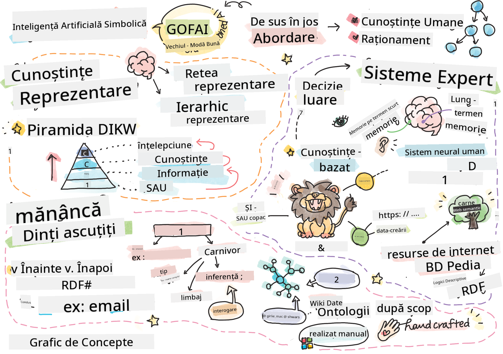
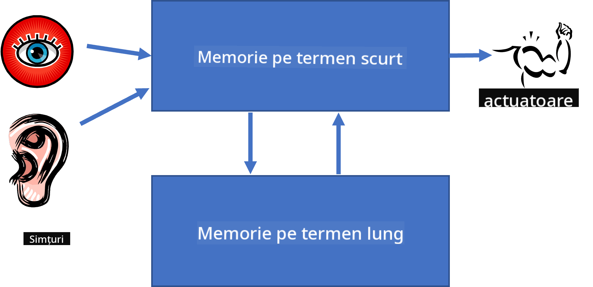
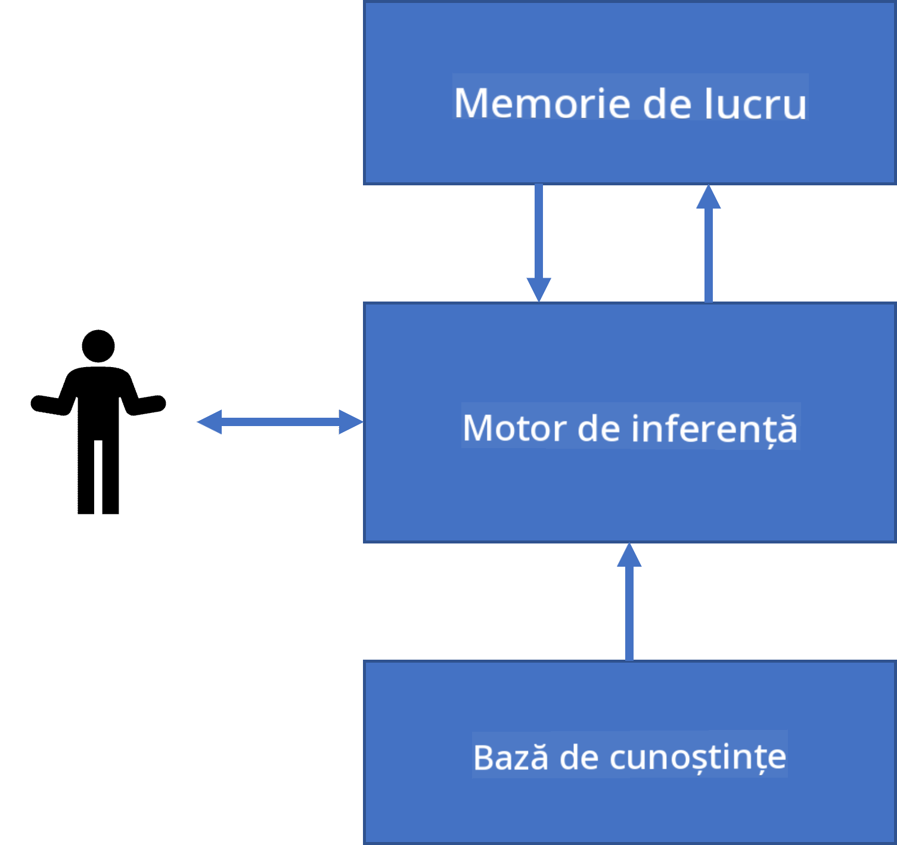

<!--
CO_OP_TRANSLATOR_METADATA:
{
  "original_hash": "98c5222ff9556b55223fed2337145e18",
  "translation_date": "2025-08-26T00:23:02+00:00",
  "source_file": "lessons/2-Symbolic/README.md",
  "language_code": "ro"
}
-->
# Reprezentarea Cunoștințelor și Sisteme Expert



> Sketchnote de [Tomomi Imura](https://twitter.com/girlie_mac)

Căutarea inteligenței artificiale se bazează pe dorința de a înțelege lumea într-un mod similar cu cel al oamenilor. Dar cum putem realiza acest lucru?

## [Chestionar înainte de lecție](https://red-field-0a6ddfd03.1.azurestaticapps.net/quiz/102)

În primele zile ale AI, abordarea de sus în jos pentru crearea sistemelor inteligente (discutată în lecția anterioară) era populară. Ideea era să extragem cunoștințele de la oameni într-o formă care să poată fi citită de mașini și apoi să le folosim pentru a rezolva automat probleme. Această abordare se baza pe două idei mari:

* Reprezentarea Cunoștințelor
* Raționamentul

## Reprezentarea Cunoștințelor

Unul dintre conceptele importante în AI simbolic este **cunoașterea**. Este important să diferențiem cunoașterea de *informație* sau *date*. De exemplu, putem spune că cărțile conțin cunoștințe, deoarece putem studia cărțile și deveni experți. Totuși, ceea ce conțin cărțile se numește de fapt *date*, iar prin citirea cărților și integrarea acestor date în modelul nostru al lumii, transformăm datele în cunoștințe.

> ✅ **Cunoașterea** este ceva ce se află în mintea noastră și reprezintă înțelegerea noastră asupra lumii. Este obținută printr-un proces activ de **învățare**, care integrează bucăți de informație pe care le primim în modelul nostru activ al lumii.

De cele mai multe ori, nu definim strict cunoașterea, dar o aliniem cu alte concepte conexe folosind [Piramida DIKW](https://en.wikipedia.org/wiki/DIKW_pyramid). Aceasta conține următoarele concepte:

* **Datele** sunt ceva reprezentat pe un suport fizic, cum ar fi textul scris sau cuvintele rostite. Datele există independent de ființele umane și pot fi transmise între oameni.
* **Informația** este modul în care interpretăm datele în mintea noastră. De exemplu, când auzim cuvântul *calculator*, avem o anumită înțelegere despre ce este.
* **Cunoașterea** este informația integrată în modelul nostru al lumii. De exemplu, odată ce învățăm ce este un calculator, începem să avem idei despre cum funcționează, cât costă și la ce poate fi folosit. Această rețea de concepte interconectate formează cunoașterea noastră.
* **Înțelepciunea** este un nivel și mai avansat al înțelegerii noastre asupra lumii și reprezintă *meta-cunoaștere*, adică o idee despre cum și când ar trebui folosită cunoașterea.

*Imagine [de pe Wikipedia](https://commons.wikimedia.org/w/index.php?curid=37705247), realizată de Longlivetheux - Lucrare proprie, CC BY-SA 4.0*

Astfel, problema **reprezentării cunoștințelor** este de a găsi o modalitate eficientă de a reprezenta cunoștințele într-un computer sub formă de date, pentru a le face utilizabile automat. Acest lucru poate fi văzut ca un spectru:


> Imagine de [Dmitry Soshnikov](http://soshnikov.com)

* În partea stângă, există tipuri foarte simple de reprezentări ale cunoștințelor care pot fi utilizate eficient de computere. Cea mai simplă este cea algoritmică, când cunoștințele sunt reprezentate printr-un program de calculator. Totuși, aceasta nu este cea mai bună modalitate de a reprezenta cunoștințele, deoarece nu este flexibilă. Cunoștințele din mintea noastră sunt adesea non-algoritmice.
* În partea dreaptă, există reprezentări precum textul natural. Este cea mai puternică, dar nu poate fi utilizată pentru raționament automat.

> ✅ Gândește-te un minut la modul în care reprezinți cunoștințele în mintea ta și le transformi în notițe. Există un format anume care funcționează bine pentru tine pentru a reține informațiile?

## Clasificarea Reprezentărilor Cunoștințelor în Computere

Putem clasifica diferitele metode de reprezentare a cunoștințelor în computere în următoarele categorii:

* **Reprezentările de tip rețea** se bazează pe faptul că avem o rețea de concepte interconectate în mintea noastră. Putem încerca să reproducem aceleași rețele sub formă de graf în interiorul unui computer - o așa-numită **rețea semantică**.

1. **Triplete Obiect-Atribut-Valoare** sau **perechi atribut-valoare**. Deoarece un graf poate fi reprezentat într-un computer ca o listă de noduri și muchii, putem reprezenta o rețea semantică printr-o listă de triplete, conținând obiecte, atribute și valori. De exemplu, construim următoarele triplete despre limbajele de programare:

Obiect | Atribut | Valoare
-------|---------|--------
Python | este | Limbaj-Netipat
Python | inventat-de | Guido van Rossum
Python | sintaxa-bloc | indentare
Limbaj-Netipat | nu-are | definiții de tip

> ✅ Gândește-te cum pot fi utilizate tripletele pentru a reprezenta alte tipuri de cunoștințe.

2. **Reprezentările ierarhice** subliniază faptul că adesea creăm o ierarhie de obiecte în mintea noastră. De exemplu, știm că un canar este o pasăre, iar toate păsările au aripi. De asemenea, avem o idee despre ce culoare are de obicei un canar și ce viteză de zbor are.

   - **Reprezentarea prin cadre** se bazează pe reprezentarea fiecărui obiect sau clasă de obiecte ca un **cadru** care conține **sloturi**. Sloturile au valori implicite posibile, restricții de valoare sau proceduri stocate care pot fi apelate pentru a obține valoarea unui slot. Toate cadrele formează o ierarhie similară cu o ierarhie de obiecte din limbajele de programare orientate pe obiecte.
   - **Scenariile** sunt un tip special de cadre care reprezintă situații complexe care se pot desfășura în timp.

**Python**

Slot | Valoare | Valoare implicită | Interval |
-----|--------|-------------------|----------|
Nume | Python | | |
Este-Un | Limbaj-Netipat | | |
Caz Variabilă | | CamelCase | |
Lungime Program | | | 5-5000 linii |
Sintaxa Bloc | Indentare | | |

3. **Reprezentările procedurale** se bazează pe reprezentarea cunoștințelor printr-o listă de acțiuni care pot fi executate atunci când apare o anumită condiție.
   - Regulile de producție sunt declarații de tipul dacă-atunci care ne permit să tragem concluzii. De exemplu, un doctor poate avea o regulă care spune că **Dacă** un pacient are febră mare **sau** un nivel ridicat de proteină C-reactivă în analiza de sânge **atunci** are o inflamație. Odată ce întâlnim una dintre condiții, putem trage o concluzie despre inflamație și apoi o putem folosi în raționamente ulterioare.
   - Algoritmii pot fi considerați o altă formă de reprezentare procedurală, deși aproape niciodată nu sunt folosiți direct în sistemele bazate pe cunoștințe.

4. **Logica** a fost propusă inițial de Aristotel ca o modalitate de a reprezenta cunoștințele universale umane.
   - Logica predicatelor ca teorie matematică este prea bogată pentru a fi calculabilă, prin urmare se folosește de obicei un subset al acesteia, cum ar fi clauzele Horn utilizate în Prolog.
   - Logica descriptivă este o familie de sisteme logice utilizate pentru a reprezenta și raționa despre ierarhiile de obiecte și reprezentările distribuite ale cunoștințelor, cum ar fi *web-ul semantic*.

## Sisteme Expert

Unul dintre primele succese ale AI simbolic au fost așa-numitele **sisteme expert** - sisteme informatice concepute să acționeze ca un expert într-un domeniu limitat de probleme. Acestea se bazau pe o **bază de cunoștințe** extrasă de la unul sau mai mulți experți umani și conțineau un **motor de inferență** care efectua un raționament pe baza acesteia.

 | 
---------------------------------------------|------------------------------------------------
Structura simplificată a sistemului neural uman | Arhitectura unui sistem bazat pe cunoștințe

Sistemele expert sunt construite similar cu sistemul de raționament uman, care conține **memorie pe termen scurt** și **memorie pe termen lung**. În mod similar, în sistemele bazate pe cunoștințe distingem următoarele componente:

* **Memoria problemei**: conține cunoștințele despre problema care este rezolvată în prezent, de exemplu temperatura sau tensiunea arterială a unui pacient, dacă are sau nu inflamație etc. Aceste cunoștințe sunt numite și **cunoștințe statice**, deoarece conțin o imagine de ansamblu a ceea ce știm în prezent despre problemă - așa-numita *stare a problemei*.
* **Baza de cunoștințe**: reprezintă cunoștințele pe termen lung despre un domeniu de probleme. Este extrasă manual de la experți umani și nu se schimbă de la o consultație la alta. Deoarece ne permite să navigăm de la o stare a problemei la alta, este numită și **cunoștințe dinamice**.
* **Motorul de inferență**: orchestrează întregul proces de căutare în spațiul stării problemei, punând întrebări utilizatorului atunci când este necesar. Este, de asemenea, responsabil pentru găsirea regulilor potrivite care trebuie aplicate fiecărei stări.

Ca exemplu, să luăm în considerare următorul sistem expert pentru determinarea unui animal pe baza caracteristicilor sale fizice:


> Imagine de [Dmitry Soshnikov](http://soshnikov.com)

Acest diagramă se numește **arbore AND-OR** și este o reprezentare grafică a unui set de reguli de producție. Desenarea unui arbore este utilă la începutul procesului de extragere a cunoștințelor de la expert. Pentru a reprezenta cunoștințele în interiorul computerului, este mai convenabil să folosim reguli:

```
IF the animal eats meat
OR (animal has sharp teeth
    AND animal has claws
    AND animal has forward-looking eyes
) 
THEN the animal is a carnivore
```

Puteți observa că fiecare condiție din partea stângă a regulii și acțiunea sunt, în esență, triplete Obiect-Atribut-Valoare (OAV). **Memoria de lucru** conține setul de triplete OAV care corespund problemei rezolvate în prezent. Un **motor de reguli** caută reguli pentru care o condiție este satisfăcută și le aplică, adăugând un alt triplet în memoria de lucru.

> ✅ Scrie propriul tău arbore AND-OR pe un subiect care îți place!

### Inferență înainte vs. înapoi

Procesul descris mai sus se numește **inferență înainte**. Acesta începe cu unele date inițiale despre problemă disponibile în memoria de lucru și apoi execută următorul ciclu de raționament:

1. Dacă atributul țintă este prezent în memoria de lucru - oprește-te și oferă rezultatul
2. Caută toate regulile a căror condiție este satisfăcută în prezent - obține **setul de conflict** al regulilor.
3. Efectuează **rezolvarea conflictelor** - selectează o regulă care va fi executată în acest pas. Pot exista diferite strategii de rezolvare a conflictelor:
   - Selectează prima regulă aplicabilă din baza de cunoștințe
   - Selectează o regulă aleatorie
   - Selectează o regulă *mai specifică*, adică cea care îndeplinește cele mai multe condiții din partea stângă (LHS)
4. Aplică regula selectată și inserează o nouă bucată de cunoștințe în starea problemei
5. Repetă de la pasul 1.

Totuși, în unele cazuri, s-ar putea să dorim să începem cu o cunoaștere goală despre problemă și să punem întrebări care ne vor ajuta să ajungem la concluzie. De exemplu, atunci când facem un diagnostic medical, de obicei nu efectuăm toate analizele medicale în avans înainte de a începe diagnosticarea pacientului. Mai degrabă, dorim să efectuăm analize atunci când trebuie luată o decizie.

Acest proces poate fi modelat folosind **inferența înapoi**. Este condus de **scop** - valoarea atributului pe care încercăm să o găsim:

1. Selectează toate regulile care ne pot oferi valoarea unui scop (adică cu scopul în partea dreaptă (RHS)) - un set de conflict
1. Dacă nu există reguli pentru acest atribut sau există o regulă care spune că ar trebui să întrebăm utilizatorul valoarea - întreabă, altfel:
1. Folosește o strategie de rezolvare a conflictelor pentru a selecta o regulă pe care o vom folosi ca *ipoteză* - vom încerca să o demonstrăm
1. Recurent, repetă procesul pentru toate atributele din partea stângă a regulii, încercând să le demonstrăm ca scopuri
1. Dacă în orice moment procesul eșuează - folosește o altă regulă la pasul 3.

> ✅ În ce situații este mai potrivită inferența înainte? Dar inferența înapoi?

### Implementarea Sistemelor Expert

Sistemele expert pot fi implementate folosind diferite instrumente:

* Programarea lor directă într-un limbaj de programare de nivel înalt. Aceasta nu este cea mai bună idee, deoarece principalul avantaj al unui sistem bazat pe cunoștințe este că cunoștințele sunt separate de inferență, iar un expert în domeniul problemei ar trebui să poată scrie reguli fără a înțelege detaliile procesului de inferență.
* Utilizarea unui **shell pentru sisteme expert**, adică un sistem conceput special pentru a fi populat cu cunoștințe folosind un limbaj de reprezentare a cunoștințelor.

## ✍️ Exercițiu: Inferența Animalelor

Vezi [Animals.ipynb](https://github.com/microsoft/AI-For-Beginners/blob/main/lessons/2-Symbolic/Animals.ipynb) pentru un exemplu de implementare a unui sistem expert cu inferență înainte și înapoi.
> **Notă**: Acest exemplu este destul de simplu și oferă doar o idee despre cum arată un sistem expert. Odată ce începi să creezi un astfel de sistem, vei observa un comportament *inteligent* doar după ce ajungi la un anumit număr de reguli, în jur de 200+. La un moment dat, regulile devin prea complexe pentru a le ține pe toate în minte, iar în acel moment s-ar putea să te întrebi de ce sistemul ia anumite decizii. Totuși, o caracteristică importantă a sistemelor bazate pe cunoștințe este că poți întotdeauna *explica* exact cum a fost luată orice decizie.
## Ontologii și Web-ul Semantic

La sfârșitul secolului al XX-lea, a existat o inițiativă de a utiliza reprezentarea cunoștințelor pentru a adnota resursele de pe Internet, astfel încât să fie posibilă găsirea resurselor care corespund unor interogări foarte specifice. Această mișcare a fost numită **Web Semantic**, și s-a bazat pe mai multe concepte:

- O reprezentare specială a cunoștințelor bazată pe **[logici descriptive](https://en.wikipedia.org/wiki/Description_logic)** (DL). Este similară cu reprezentarea cunoștințelor în cadre, deoarece construiește o ierarhie de obiecte cu proprietăți, dar are o semantică logică formală și inferență. Există o întreagă familie de DL-uri care echilibrează între expresivitate și complexitatea algoritmică a inferenței.
- Reprezentarea distribuită a cunoștințelor, unde toate conceptele sunt reprezentate printr-un identificator global URI, făcând posibilă crearea ierarhiilor de cunoștințe care se extind pe internet.
- O familie de limbaje bazate pe XML pentru descrierea cunoștințelor: RDF (Resource Description Framework), RDFS (RDF Schema), OWL (Ontology Web Language).

Un concept de bază în Web-ul Semantic este conceptul de **Ontologie**. Acesta se referă la o specificație explicită a unui domeniu de problemă utilizând o reprezentare formală a cunoștințelor. Cea mai simplă ontologie poate fi doar o ierarhie de obiecte într-un domeniu de problemă, dar ontologiile mai complexe vor include reguli care pot fi utilizate pentru inferență.

În Web-ul Semantic, toate reprezentările se bazează pe triplete. Fiecare obiect și fiecare relație sunt identificate în mod unic prin URI. De exemplu, dacă dorim să afirmăm faptul că acest Curriculum AI a fost dezvoltat de Dmitry Soshnikov pe 1 ianuarie 2022 - iată tripletele pe care le putem utiliza:


```
http://github.com/microsoft/ai-for-beginners http://www.example.com/terms/creation-date “Jan 13, 2007”
http://github.com/microsoft/ai-for-beginners http://purl.org/dc/elements/1.1/creator http://soshnikov.com
```

> ✅ Aici `http://www.example.com/terms/creation-date` și `http://purl.org/dc/elements/1.1/creator` sunt câteva URI bine cunoscute și universal acceptate pentru a exprima conceptele de *creator* și *data creării*.

Într-un caz mai complex, dacă dorim să definim o listă de creatori, putem utiliza unele structuri de date definite în RDF.


> Diagramele de mai sus de [Dmitry Soshnikov](http://soshnikov.com)

Progresul construirii Web-ului Semantic a fost cumva încetinit de succesul motoarelor de căutare și al tehnicilor de procesare a limbajului natural, care permit extragerea datelor structurate din text. Cu toate acestea, în unele domenii există încă eforturi semnificative pentru a menține ontologii și baze de cunoștințe. Câteva proiecte notabile:

* [WikiData](https://wikidata.org/) este o colecție de baze de cunoștințe lizibile de mașini asociate cu Wikipedia. Majoritatea datelor sunt extrase din *InfoBox-uri* Wikipedia, bucăți de conținut structurat din paginile Wikipedia. Puteți [interoga](https://query.wikidata.org/) WikiData în SPARQL, un limbaj special de interogare pentru Web-ul Semantic. Iată un exemplu de interogare care afișează cele mai populare culori ale ochilor la oameni:

```sparql
#defaultView:BubbleChart
SELECT ?eyeColorLabel (COUNT(?human) AS ?count)
WHERE
{
  ?human wdt:P31 wd:Q5.       # human instance-of homo sapiens
  ?human wdt:P1340 ?eyeColor. # human eye-color ?eyeColor
  SERVICE wikibase:label { bd:serviceParam wikibase:language "en". }
}
GROUP BY ?eyeColorLabel
```

* [DBpedia](https://www.dbpedia.org/) este un alt efort similar cu WikiData.

> ✅ Dacă doriți să experimentați cu construirea propriilor ontologii sau deschiderea celor existente, există un editor vizual excelent de ontologii numit [Protégé](https://protege.stanford.edu/). Descărcați-l sau utilizați-l online.


*Editorul Web Protégé deschis cu ontologia Familiei Romanov. Captură de ecran de Dmitry Soshnikov*

## ✍️ Exercițiu: O Ontologie a Familiei

Consultați [FamilyOntology.ipynb](https://github.com/Ezana135/AI-For-Beginners/blob/main/lessons/2-Symbolic/FamilyOntology.ipynb) pentru un exemplu de utilizare a tehnicilor Web-ului Semantic pentru a raționa despre relațiile de familie. Vom lua un arbore genealogic reprezentat în formatul comun GEDCOM și o ontologie a relațiilor de familie și vom construi un grafic al tuturor relațiilor de familie pentru un set dat de indivizi.

## Microsoft Concept Graph

În cele mai multe cazuri, ontologiile sunt create cu atenție manual. Cu toate acestea, este posibil și să **extragem** ontologii din date nestructurate, de exemplu, din texte în limbaj natural.

O astfel de încercare a fost realizată de Microsoft Research și a rezultat în [Microsoft Concept Graph](https://blogs.microsoft.com/ai/microsoft-researchers-release-graph-that-helps-machines-conceptualize/?WT.mc_id=academic-77998-cacaste).

Este o colecție mare de entități grupate împreună utilizând relația de moștenire `is-a`. Permite răspunsuri la întrebări precum "Ce este Microsoft?" - răspunsul fiind ceva de genul "o companie cu probabilitatea 0.87 și un brand cu probabilitatea 0.75".

Graficul este disponibil fie ca API REST, fie ca un fișier text mare descărcabil care listează toate perechile de entități.

## ✍️ Exercițiu: Un Grafic de Concepte

Încercați notebook-ul [MSConceptGraph.ipynb](https://github.com/microsoft/AI-For-Beginners/blob/main/lessons/2-Symbolic/MSConceptGraph.ipynb) pentru a vedea cum putem utiliza Microsoft Concept Graph pentru a grupa articole de știri în mai multe categorii.

## Concluzie

În zilele noastre, AI este adesea considerată sinonimă cu *Învățarea Automată* sau *Rețelele Neuronale*. Cu toate acestea, o ființă umană manifestă și raționament explicit, ceva ce rețelele neuronale nu gestionează în prezent. În proiectele din lumea reală, raționamentul explicit este încă utilizat pentru a îndeplini sarcini care necesită explicații sau capacitatea de a modifica comportamentul sistemului într-un mod controlat.

## 🚀 Provocare

În notebook-ul Ontologiei Familiei asociat acestei lecții, există oportunitatea de a experimenta cu alte relații de familie. Încercați să descoperiți noi conexiuni între persoanele din arborele genealogic.

## [Quiz post-lectură](https://red-field-0a6ddfd03.1.azurestaticapps.net/quiz/202)

## Recapitulare și Studiu Individual

Faceți cercetări pe internet pentru a descoperi domenii în care oamenii au încercat să cuantifice și să codifice cunoștințele. Aruncați o privire asupra Taxonomiei lui Bloom și mergeți înapoi în istorie pentru a învăța cum oamenii au încercat să înțeleagă lumea lor. Explorați munca lui Linnaeus pentru a crea o taxonomie a organismelor și observați modul în care Dmitri Mendeleev a creat o modalitate de a descrie și grupa elementele chimice. Ce alte exemple interesante puteți găsi?

**Temă**: [Construiți o Ontologie](assignment.md)

**Declinare de responsabilitate**:  
Acest document a fost tradus folosind serviciul de traducere AI [Co-op Translator](https://github.com/Azure/co-op-translator). Deși ne străduim să asigurăm acuratețea, vă rugăm să fiți conștienți că traducerile automate pot conține erori sau inexactități. Documentul original în limba sa natală ar trebui considerat sursa autoritară. Pentru informații critice, se recomandă traducerea profesională realizată de un specialist uman. Nu ne asumăm responsabilitatea pentru eventualele neînțelegeri sau interpretări greșite care pot apărea din utilizarea acestei traduceri.