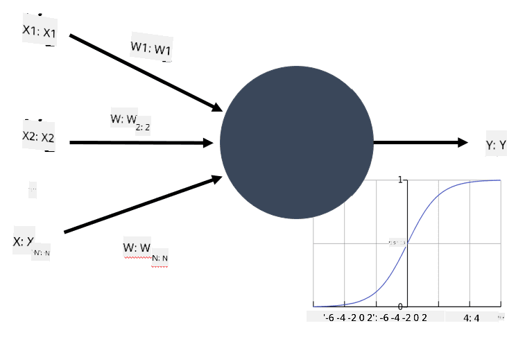

<!--
CO_OP_TRANSLATOR_METADATA:
{
  "original_hash": "5abc5f7978919be90cd313f0c20e8228",
  "translation_date": "2025-09-07T14:36:23+00:00",
  "source_file": "lessons/3-NeuralNetworks/README.md",
  "language_code": "ro"
}
-->
# Introducere în Rețele Neurale

Așa cum am discutat în introducere, unul dintre modurile de a obține inteligență este să antrenăm un **model de computer** sau un **creier artificial**. Începând cu mijlocul secolului XX, cercetătorii au încercat diferite modele matematice, până când, în ultimii ani, această direcție s-a dovedit a fi extrem de reușită. Aceste modele matematice ale creierului sunt numite **rețele neurale**.

> Uneori, rețelele neurale sunt numite *Rețele Neurale Artificiale*, ANNs, pentru a indica faptul că vorbim despre modele, nu despre rețele reale de neuroni.

## Învățare Automată

Rețelele neurale fac parte dintr-o disciplină mai largă numită **Învățare Automată**, al cărei scop este să folosească date pentru a antrena modele de computer capabile să rezolve probleme. Învățarea Automată constituie o mare parte din Inteligența Artificială, însă nu acoperim Învățarea Automată clasică în acest curriculum.

> Vizitați curriculumul nostru separat **[Machine Learning for Beginners](http://github.com/microsoft/ml-for-beginners)** pentru a afla mai multe despre Învățarea Automată clasică.

În Învățarea Automată, presupunem că avem un set de date de exemple **X** și valori de ieșire corespunzătoare **Y**. Exemplele sunt adesea vectori N-dimensionali care constau din **caracteristici**, iar ieșirile sunt numite **etichete**.

Vom analiza cele mai comune două probleme de învățare automată:

* **Clasificare**, unde trebuie să clasificăm un obiect de intrare în două sau mai multe clase.
* **Regresie**, unde trebuie să prezicem un număr numeric pentru fiecare dintre exemplele de intrare.

> Când reprezentăm intrările și ieșirile ca tensori, setul de date de intrare este o matrice de dimensiune M×N, unde M este numărul de exemple și N este numărul de caracteristici. Etichetele de ieșire Y sunt vectori de dimensiune M.

În acest curriculum, ne vom concentra doar pe modelele de rețele neurale.

## Un Model al Neuronului

Din biologie știm că creierul nostru este format din celule neuronale, fiecare dintre ele având multiple "intrări" (axoni) și o ieșire (dendrită). Axonii și dendritele pot conduce semnale electrice, iar conexiunile dintre axoni și dendrite pot prezenta diferite grade de conductivitate (controlate de neuromediatori).

 | 
----|----
Neuron Real *([Imagine](https://en.wikipedia.org/wiki/Synapse#/media/File:SynapseSchematic_lines.svg) de pe Wikipedia)* | Neuron Artificial *(Imagine de Autor)*

Astfel, cel mai simplu model matematic al unui neuron conține mai multe intrări X1, ..., XN și o ieșire Y, și o serie de greutăți W1, ..., WN. Ieșirea este calculată astfel:

unde f este o **funcție de activare** neliniară.

> Modelele timpurii ale neuronului au fost descrise în lucrarea clasică [A logical calculus of the ideas immanent in nervous activity](https://www.cs.cmu.edu/~./epxing/Class/10715/reading/McCulloch.and.Pitts.pdf) de Warren McCullock și Walter Pitts în 1943. Donald Hebb, în cartea sa "[The Organization of Behavior: A Neuropsychological Theory](https://books.google.com/books?id=VNetYrB8EBoC)", a propus modul în care aceste rețele pot fi antrenate.

## În această Secțiune

În această secțiune vom învăța despre:
* [Perceptron](03-Perceptron/README.md), unul dintre cele mai timpurii modele de rețele neurale pentru clasificarea în două clase
* [Rețele multi-stratificate](04-OwnFramework/README.md) cu un notebook asociat [cum să construim propriul nostru framework](04-OwnFramework/OwnFramework.ipynb)
* [Framework-uri pentru Rețele Neurale](05-Frameworks/README.md), cu aceste notebook-uri: [PyTorch](05-Frameworks/IntroPyTorch.ipynb) și [Keras/Tensorflow](05-Frameworks/IntroKerasTF.ipynb)
* [Overfitting](../../../../lessons/3-NeuralNetworks/05-Frameworks)

---

**Declinare de responsabilitate**:  
Acest document a fost tradus folosind serviciul de traducere AI [Co-op Translator](https://github.com/Azure/co-op-translator). Deși ne străduim să asigurăm acuratețea, vă rugăm să rețineți că traducerile automate pot conține erori sau inexactități. Documentul original în limba sa natală ar trebui considerat sursa autoritară. Pentru informații critice, se recomandă traducerea profesională realizată de un specialist uman. Nu ne asumăm responsabilitatea pentru eventualele neînțelegeri sau interpretări greșite care pot apărea din utilizarea acestei traduceri.