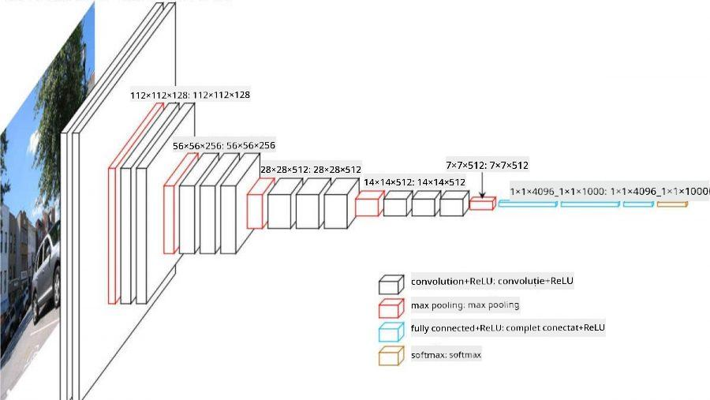

<!--
CO_OP_TRANSLATOR_METADATA:
{
  "original_hash": "2f7b97b375358cb51a1e098df306bf73",
  "translation_date": "2025-08-25T22:55:34+00:00",
  "source_file": "lessons/4-ComputerVision/07-ConvNets/CNN_Architectures.md",
  "language_code": "ro"
}
-->
# Arhitecturi CNN Cunoscute

### VGG-16

VGG-16 este o rețea care a atins o acuratețe de 92,7% în clasificarea top-5 ImageNet în 2014. Are următoarea structură de straturi:

După cum se poate observa, VGG urmează o arhitectură piramidală tradițională, care este o secvență de straturi de convoluție și pooling.

> Imagine de la [Researchgate](https://www.researchgate.net/figure/Vgg16-model-structure-To-get-the-VGG-NIN-model-we-replace-the-2-nd-4-th-6-th-7-th_fig2_335194493)

### ResNet

ResNet este o familie de modele propusă de Microsoft Research în 2015. Ideea principală a ResNet este utilizarea **blocurilor reziduale**:

> Imagine din [acest articol](https://arxiv.org/pdf/1512.03385.pdf)

Motivul utilizării trecerii identitare este ca stratul nostru să prezică **diferența** dintre rezultatul unui strat anterior și ieșirea blocului rezidual - de aici și numele *rezidual*. Aceste blocuri sunt mult mai ușor de antrenat, iar rețelele pot fi construite cu câteva sute de astfel de blocuri (variantele cele mai comune sunt ResNet-52, ResNet-101 și ResNet-152).

De asemenea, poți considera această rețea ca fiind capabilă să-și ajusteze complexitatea în funcție de setul de date. Inițial, când începi să antrenezi rețeaua, valorile greutăților sunt mici, iar majoritatea semnalului trece prin straturile identitare. Pe măsură ce antrenamentul progresează și greutățile devin mai mari, semnificația parametrilor rețelei crește, iar rețeaua se ajustează pentru a acomoda puterea expresivă necesară clasificării corecte a imaginilor de antrenament.

### Google Inception

Arhitectura Google Inception duce această idee un pas mai departe și construiește fiecare strat al rețelei ca o combinație de mai multe căi diferite:

> Imagine de la [Researchgate](https://www.researchgate.net/figure/Inception-module-with-dimension-reductions-left-and-schema-for-Inception-ResNet-v1_fig2_355547454)

Aici, trebuie să subliniem rolul convoluțiilor 1x1, deoarece la început acestea nu par să aibă sens. De ce ar fi nevoie să trecem prin imagine cu un filtru 1x1? Totuși, trebuie să ne amintim că filtrele de convoluție funcționează și cu mai multe canale de adâncime (inițial - culorile RGB, în straturile ulterioare - canale pentru diferite filtre), iar convoluția 1x1 este utilizată pentru a combina aceste canale de intrare folosind greutăți antrenabile diferite. Poate fi privită și ca o reducere a dimensiunii (pooling) pe dimensiunea canalului.

Iată [un articol bun pe blog](https://medium.com/analytics-vidhya/talented-mr-1x1-comprehensive-look-at-1x1-convolution-in-deep-learning-f6b355825578) pe acest subiect și [articolul original](https://arxiv.org/pdf/1312.4400.pdf).

### MobileNet

MobileNet este o familie de modele cu dimensiuni reduse, potrivite pentru dispozitive mobile. Folosește-le dacă ai resurse limitate și poți sacrifica puțin din acuratețe. Ideea principală din spatele lor este așa-numita **convoluție separabilă pe adâncime**, care permite reprezentarea filtrelor de convoluție printr-o compoziție de convoluții spațiale și convoluții 1x1 pe canalele de adâncime. Acest lucru reduce semnificativ numărul de parametri, făcând rețeaua mai mică ca dimensiune și mai ușor de antrenat cu mai puține date.

Iată [un articol bun pe blog despre MobileNet](https://medium.com/analytics-vidhya/image-classification-with-mobilenet-cc6fbb2cd470).

## Concluzie

În această unitate, ai învățat conceptul principal din spatele rețelelor neuronale pentru viziune computerizată - rețelele convoluționale. Arhitecturile din viața reală care alimentează clasificarea imaginilor, detectarea obiectelor și chiar rețelele de generare a imaginilor se bazează toate pe CNN-uri, doar cu mai multe straturi și câteva trucuri suplimentare de antrenament.

## 🚀 Provocare

În caietele de lucru însoțitoare, există note la final despre cum să obții o acuratețe mai mare. Fă câteva experimente pentru a vedea dacă poți atinge o acuratețe mai mare.

## [Chestionar post-lectură](https://red-field-0a6ddfd03.1.azurestaticapps.net/quiz/207)

## Recapitulare și Studiu Individual

Deși CNN-urile sunt cel mai des utilizate pentru sarcini de Viziune Computerizată, ele sunt în general bune pentru extragerea de tipare de dimensiuni fixe. De exemplu, dacă lucrăm cu sunete, am putea dori să folosim CNN-uri pentru a căuta anumite tipare specifice în semnalul audio - caz în care filtrele ar fi unidimensionale (iar acest CNN ar fi numit 1D-CNN). De asemenea, uneori se folosește 3D-CNN pentru a extrage caracteristici în spațiu multidimensional, cum ar fi anumite evenimente care au loc într-un videoclip - CNN poate captura anumite tipare de schimbare a caracteristicilor în timp. Fă o recapitulare și un studiu individual despre alte sarcini care pot fi realizate cu CNN-uri.

## [Temă](lab/README.md)

În acest laborator, ai sarcina de a clasifica diferite rase de pisici și câini. Aceste imagini sunt mai complexe decât setul de date MNIST, au dimensiuni mai mari și există mai mult de 10 clase.

**Declinare de responsabilitate**:  
Acest document a fost tradus folosind serviciul de traducere AI [Co-op Translator](https://github.com/Azure/co-op-translator). Deși ne străduim să asigurăm acuratețea, vă rugăm să fiți conștienți că traducerile automate pot conține erori sau inexactități. Documentul original în limba sa natală ar trebui considerat sursa autoritară. Pentru informații critice, se recomandă traducerea profesională realizată de un specialist uman. Nu ne asumăm responsabilitatea pentru eventualele neînțelegeri sau interpretări greșite care pot apărea din utilizarea acestei traduceri.