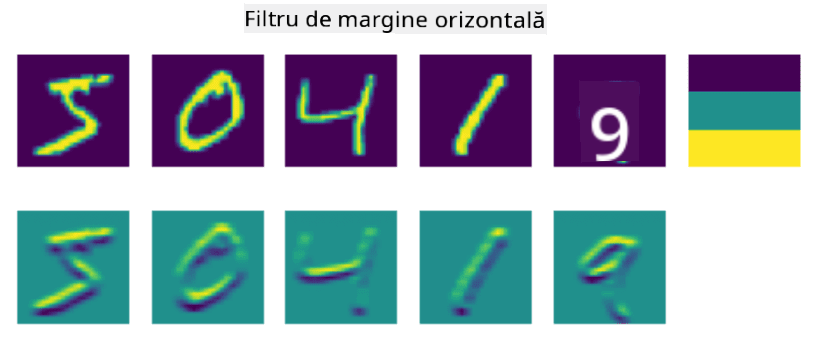
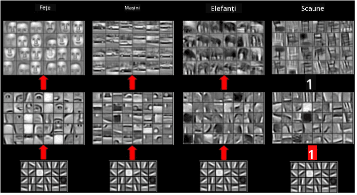

<!--
CO_OP_TRANSLATOR_METADATA:
{
  "original_hash": "a560d5b845962cf33dc102266e409568",
  "translation_date": "2025-09-23T14:14:29+00:00",
  "source_file": "lessons/4-ComputerVision/07-ConvNets/README.md",
  "language_code": "ro"
}
-->
# Rețele Neuronale Convoluționale

Am văzut anterior că rețelele neuronale sunt destul de bune la procesarea imaginilor, iar chiar și un perceptron cu un singur strat este capabil să recunoască cifre scrise de mână din setul de date MNIST cu o acuratețe rezonabilă. Totuși, setul de date MNIST este foarte special, iar toate cifrele sunt centrate în interiorul imaginii, ceea ce face sarcina mai simplă.

## [Chestionar înainte de lecție](https://ff-quizzes.netlify.app/en/ai/quiz/13)

În viața reală, ne dorim să putem recunoaște obiecte într-o imagine, indiferent de locația lor exactă în cadrul imaginii. Viziunea computerizată este diferită de clasificarea generică, deoarece atunci când încercăm să găsim un anumit obiect într-o imagine, scanăm imaginea căutând **tipare** specifice și combinațiile acestora. De exemplu, când căutăm o pisică, mai întâi putem căuta linii orizontale, care pot forma mustăți, iar apoi o anumită combinație de mustăți ne poate spune că este de fapt o imagine cu o pisică. Poziția relativă și prezența anumitor tipare sunt importante, nu poziția lor exactă în imagine.

Pentru a extrage tipare, vom folosi noțiunea de **filtre convoluționale**. După cum știți, o imagine este reprezentată printr-o matrice 2D sau un tensor 3D cu adâncime de culoare. Aplicarea unui filtru înseamnă că luăm o matrice relativ mică numită **kernel de filtru**, iar pentru fiecare pixel din imaginea originală calculăm media ponderată cu punctele vecine. Putem privi acest proces ca o fereastră mică care alunecă peste întreaga imagine și calculează media tuturor pixelilor conform greutăților din matricea kernelului de filtru.

 | 
----|----

> Imagine de Dmitry Soshnikov

De exemplu, dacă aplicăm filtre pentru margini verticale și orizontale de 3x3 pe cifrele MNIST, putem obține evidențieri (de exemplu, valori mari) acolo unde există margini verticale și orizontale în imaginea originală. Astfel, aceste două filtre pot fi utilizate pentru a "căuta" margini. În mod similar, putem proiecta diferite filtre pentru a căuta alte tipare de nivel scăzut:

> Imagine a [Leung-Malik Filter Bank](https://www.robots.ox.ac.uk/~vgg/research/texclass/filters.html)

Totuși, deși putem proiecta manual filtrele pentru a extrage anumite tipare, putem de asemenea proiecta rețeaua astfel încât să învețe tiparele automat. Aceasta este una dintre ideile principale din spatele CNN.

## Idei principale din spatele CNN

Modul în care funcționează CNN-urile se bazează pe următoarele idei importante:

* Filtrele convoluționale pot extrage tipare
* Putem proiecta rețeaua astfel încât filtrele să fie antrenate automat
* Putem folosi aceeași abordare pentru a găsi tipare în caracteristici de nivel înalt, nu doar în imaginea originală. Astfel, extragerea caracteristicilor prin CNN funcționează pe o ierarhie de caracteristici, începând de la combinații de pixeli de nivel scăzut, până la combinații de nivel înalt ale părților imaginii.

> Imagine din [un articol de Hislop-Lynch](https://www.semanticscholar.org/paper/Computer-vision-based-pedestrian-trajectory-Hislop-Lynch/26e6f74853fc9bbb7487b06dc2cf095d36c9021d), bazat pe [cercetarea lor](https://dl.acm.org/doi/abs/10.1145/1553374.1553453)

## ✍️ Exerciții: Rețele Neuronale Convoluționale

Să continuăm explorarea modului în care funcționează rețelele neuronale convoluționale și cum putem obține filtre antrenabile, lucrând prin caietele corespunzătoare:

* [Rețele Neuronale Convoluționale - PyTorch](ConvNetsPyTorch.ipynb)
* [Rețele Neuronale Convoluționale - TensorFlow](ConvNetsTF.ipynb)

## Arhitectura Piramidală

Majoritatea CNN-urilor utilizate pentru procesarea imaginilor urmează o așa-numită arhitectură piramidală. Primul strat convoluțional aplicat imaginilor originale are de obicei un număr relativ mic de filtre (8-16), care corespund diferitelor combinații de pixeli, cum ar fi linii orizontale/verticale sau trăsături. La nivelul următor, reducem dimensiunea spațială a rețelei și creștem numărul de filtre, ceea ce corespunde mai multor combinații posibile de caracteristici simple. Cu fiecare strat, pe măsură ce ne apropiem de clasificatorul final, dimensiunile spațiale ale imaginii scad, iar numărul de filtre crește.

Ca exemplu, să analizăm arhitectura VGG-16, o rețea care a obținut o acuratețe de 92.7% în clasificarea top-5 din ImageNet în 2014:

> Imagine de pe [Researchgate](https://www.researchgate.net/figure/Vgg16-model-structure-To-get-the-VGG-NIN-model-we-replace-the-2-nd-4-th-6-th-7-th_fig2_335194493)

## Cele mai cunoscute arhitecturi CNN

[Continuă studiul despre cele mai cunoscute arhitecturi CNN](CNN_Architectures.md)

---

