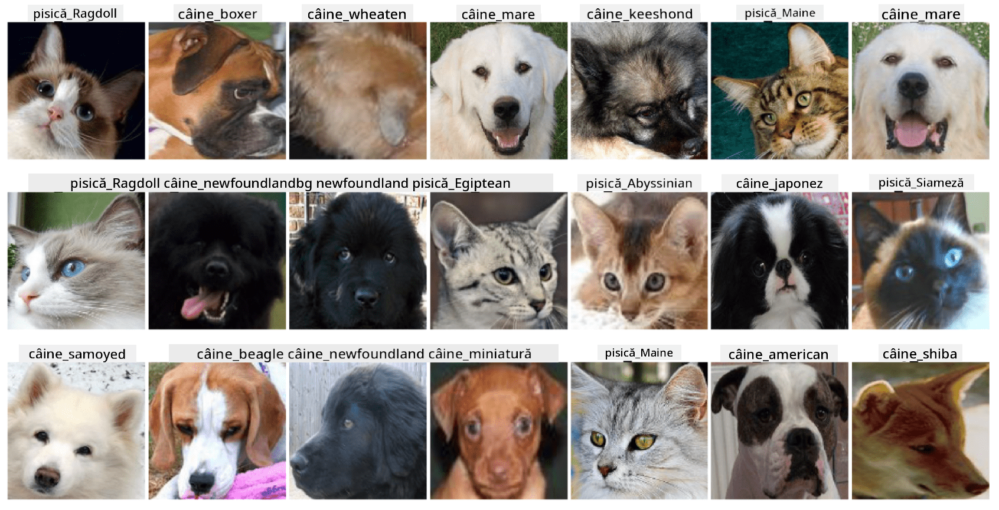

<!--
CO_OP_TRANSLATOR_METADATA:
{
  "original_hash": "f3d2cee9cb3c52160419e560c57a690e",
  "translation_date": "2025-08-25T22:58:20+00:00",
  "source_file": "lessons/4-ComputerVision/07-ConvNets/lab/README.md",
  "language_code": "ro"
}
-->
# Clasificarea Fețelor Animalelor de Companie

Temă de laborator din [AI for Beginners Curriculum](https://github.com/microsoft/ai-for-beginners).

## Sarcina

Imaginează-ți că trebuie să dezvolți o aplicație pentru o grădiniță de animale de companie, pentru a cataloga toate animalele. Una dintre funcționalitățile grozave ale unei astfel de aplicații ar fi identificarea automată a rasei dintr-o fotografie. Acest lucru poate fi realizat cu succes folosind rețele neuronale.

Trebuie să antrenezi o rețea neuronală convoluțională pentru a clasifica diferite rase de pisici și câini utilizând setul de date **Pet Faces**.

## Setul de Date

Vom folosi setul de date **Pet Faces**, derivat din setul de date pentru animale de companie [Oxford-IIIT](https://www.robots.ox.ac.uk/~vgg/data/pets/). Acesta conține 35 de rase diferite de câini și pisici.



Pentru a descărca setul de date, folosește acest fragment de cod:

```python
!wget https://mslearntensorflowlp.blob.core.windows.net/data/petfaces.tar.gz
!tar xfz petfaces.tar.gz
!rm petfaces.tar.gz
```

## Notebook-ul de Start

Începe laboratorul deschizând [PetFaces.ipynb](../../../../../../lessons/4-ComputerVision/07-ConvNets/lab/PetFaces.ipynb)

## Concluzie

Ai rezolvat o problemă relativ complexă de clasificare a imaginilor de la zero! Au fost destul de multe clase, și totuși ai reușit să obții o acuratețe rezonabilă! De asemenea, are sens să măsori acuratețea top-k, deoarece este ușor să confunzi unele clase care nu sunt clar diferite nici măcar pentru oameni.

**Declinare de responsabilitate**:  
Acest document a fost tradus folosind serviciul de traducere AI [Co-op Translator](https://github.com/Azure/co-op-translator). Deși ne străduim să asigurăm acuratețea, vă rugăm să fiți conștienți că traducerile automate pot conține erori sau inexactități. Documentul original în limba sa natală ar trebui considerat sursa autoritară. Pentru informații critice, se recomandă traducerea profesională realizată de un specialist uman. Nu ne asumăm responsabilitatea pentru eventualele neînțelegeri sau interpretări greșite care pot apărea din utilizarea acestei traduceri.