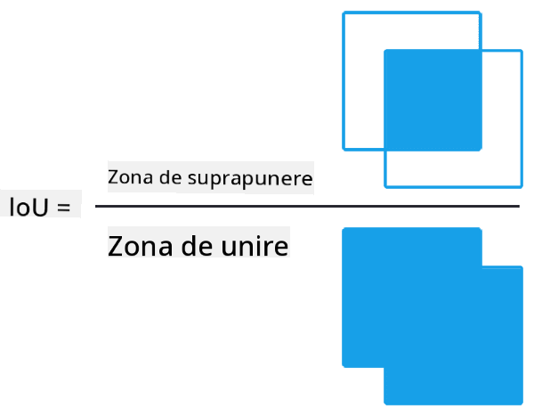
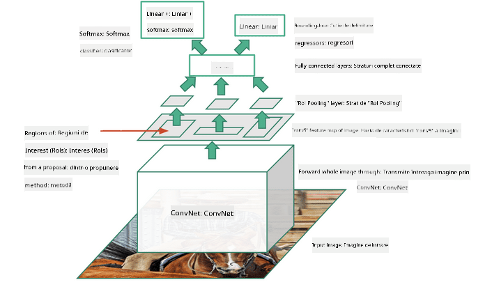
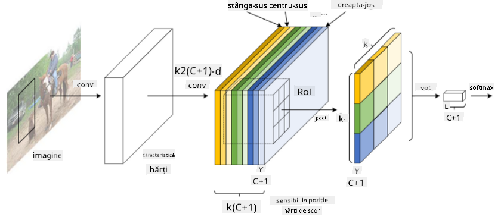

<!--
CO_OP_TRANSLATOR_METADATA:
{
  "original_hash": "d85c8b08f6d1b48fd7f35b99f93c1138",
  "translation_date": "2025-08-25T22:44:51+00:00",
  "source_file": "lessons/4-ComputerVision/11-ObjectDetection/README.md",
  "language_code": "ro"
}
-->
# Detectarea Obiectelor

Modelele de clasificare a imaginilor pe care le-am abordat până acum au luat o imagine și au produs un rezultat categoric, cum ar fi clasa „număr” într-o problemă MNIST. Totuși, în multe cazuri, nu dorim doar să știm că o imagine prezintă obiecte - vrem să putem determina locația lor exactă. Acesta este exact scopul **detectării obiectelor**.

## [Chestionar înainte de lecție](https://ff-quizzes.netlify.app/en/ai/quiz/21)

> Imagine de pe [site-ul YOLO v2](https://pjreddie.com/darknet/yolov2/)

## O Abordare Naivă pentru Detectarea Obiectelor

Presupunând că dorim să găsim o pisică într-o imagine, o abordare foarte naivă pentru detectarea obiectelor ar fi următoarea:

1. Împărțim imaginea în mai multe secțiuni.
2. Aplicăm clasificarea imaginilor pe fiecare secțiune.
3. Secțiunile care generează o activare suficient de mare pot fi considerate ca conținând obiectul în cauză.

> *Imagine din [Notebook-ul de exerciții](../../../../../lessons/4-ComputerVision/11-ObjectDetection/ObjectDetection-TF.ipynb)*

Totuși, această abordare este departe de a fi ideală, deoarece permite algoritmului să localizeze foarte imprecis caseta de delimitare a obiectului. Pentru o localizare mai precisă, trebuie să aplicăm un fel de **regresie** pentru a prezice coordonatele casetelor de delimitare - și pentru aceasta, avem nevoie de seturi de date specifice.

## Regresie pentru Detectarea Obiectelor

[Acest articol de blog](https://towardsdatascience.com/object-detection-with-neural-networks-a4e2c46b4491) oferă o introducere excelentă în detectarea formelor.

## Seturi de Date pentru Detectarea Obiectelor

Este posibil să întâlniți următoarele seturi de date pentru această sarcină:

* [PASCAL VOC](http://host.robots.ox.ac.uk/pascal/VOC/) - 20 clase
* [COCO](http://cocodataset.org/#home) - Obiecte Comune în Context. 80 clase, casete de delimitare și măști de segmentare

## Metrice pentru Detectarea Obiectelor

### Intersecția peste Uniune

În timp ce pentru clasificarea imaginilor este ușor să măsurăm cât de bine funcționează algoritmul, pentru detectarea obiectelor trebuie să măsurăm atât corectitudinea clasei, cât și precizia locației casetei de delimitare inferate. Pentru aceasta din urmă, folosim așa-numita **Intersecția peste Uniune** (IoU), care măsoară cât de bine se suprapun două casete (sau două zone arbitrare).

> *Figura 2 din [acest articol excelent despre IoU](https://pyimagesearch.com/2016/11/07/intersection-over-union-iou-for-object-detection/)*

Ideea este simplă - împărțim aria de intersecție dintre două figuri la aria uniunii lor. Pentru două zone identice, IoU ar fi 1, în timp ce pentru zone complet separate va fi 0. În alte cazuri, va varia de la 0 la 1. De obicei, considerăm doar acele casete de delimitare pentru care IoU depășește o anumită valoare.

### Precizia Medie

Să presupunem că dorim să măsurăm cât de bine este recunoscută o anumită clasă de obiecte $C$. Pentru a o măsura, folosim metrica **Precizia Medie**, care se calculează astfel:

1. Considerăm curba Precizie-Recall care arată acuratețea în funcție de o valoare de prag de detectare (de la 0 la 1).
2. În funcție de prag, vom obține mai multe sau mai puține obiecte detectate în imagine și valori diferite de precizie și recall.
3. Curba va arăta astfel:

> *Imagine din [NeuroWorkshop](http://github.com/shwars/NeuroWorkshop)*

Precizia Medie pentru o clasă dată $C$ este aria de sub această curbă. Mai precis, axa Recall este de obicei împărțită în 10 părți, iar Precizia este mediată pe toate aceste puncte:

$$
AP = {1\over11}\sum_{i=0}^{10}\mbox{Precision}(\mbox{Recall}={i\over10})
$$

### AP și IoU

Vom considera doar acele detectări pentru care IoU depășește o anumită valoare. De exemplu, în setul de date PASCAL VOC, de obicei $\mbox{IoU Threshold} = 0.5$ este presupus, în timp ce în COCO AP este măsurat pentru diferite valori ale $\mbox{IoU Threshold}$.

> *Imagine din [NeuroWorkshop](http://github.com/shwars/NeuroWorkshop)*

### Precizia Medie Generală - mAP

Principala metrică pentru Detectarea Obiectelor se numește **Precizia Medie Generală**, sau **mAP**. Este valoarea Preciziei Medii, mediată pe toate clasele de obiecte și, uneori, și pe $\mbox{IoU Threshold}$. Procesul de calculare a **mAP** este descris în detaliu
[în acest articol de blog](https://medium.com/@timothycarlen/understanding-the-map-evaluation-metric-for-object-detection-a07fe6962cf3)), și de asemenea [aici cu exemple de cod](https://gist.github.com/tarlen5/008809c3decf19313de216b9208f3734).

## Diferite Abordări pentru Detectarea Obiectelor

Există două clase largi de algoritmi de detectare a obiectelor:

* **Rețele de Propunere a Regiunilor** (R-CNN, Fast R-CNN, Faster R-CNN). Ideea principală este de a genera **Regiuni de Interes** (ROI) și de a aplica CNN pe acestea, căutând activarea maximă. Este oarecum similar cu abordarea naivă, cu excepția faptului că ROI-urile sunt generate într-un mod mai inteligent. Unul dintre principalele dezavantaje ale acestor metode este că sunt lente, deoarece necesită multe treceri ale clasificatorului CNN peste imagine.
* Metode **One-pass** (YOLO, SSD, RetinaNet). În aceste arhitecturi, rețeaua este proiectată să prezică atât clasele, cât și ROI-urile într-o singură trecere.

### R-CNN: CNN Bazat pe Regiuni

[R-CNN](http://islab.ulsan.ac.kr/files/announcement/513/rcnn_pami.pdf) folosește [Selective Search](http://www.huppelen.nl/publications/selectiveSearchDraft.pdf) pentru a genera o structură ierarhică de regiuni ROI, care sunt apoi trecute prin extractoare de caracteristici CNN și clasificatori SVM pentru a determina clasa obiectului, și regresie liniară pentru a determina coordonatele *casetei de delimitare*. [Articol Oficial](https://arxiv.org/pdf/1506.01497v1.pdf)

> *Imagine de la van de Sande et al. ICCV’11*

> *Imagini din [acest blog](https://towardsdatascience.com/r-cnn-fast-r-cnn-faster-r-cnn-yolo-object-detection-algorithms-36d53571365e)

### F-RCNN - Fast R-CNN

Această abordare este similară cu R-CNN, dar regiunile sunt definite după ce straturile de convoluție au fost aplicate.

> Imagine din [Articolul Oficial](https://www.cv-foundation.org/openaccess/content_iccv_2015/papers/Girshick_Fast_R-CNN_ICCV_2015_paper.pdf), [arXiv](https://arxiv.org/pdf/1504.08083.pdf), 2015

### Faster R-CNN

Ideea principală a acestei abordări este de a folosi o rețea neuronală pentru a prezice ROI-urile - așa-numita *Rețea de Propunere a Regiunilor*. [Articol](https://arxiv.org/pdf/1506.01497.pdf), 2016

> Imagine din [articolul oficial](https://arxiv.org/pdf/1506.01497.pdf)

### R-FCN: Rețea Complet Convoluțională Bazată pe Regiuni

Acest algoritm este chiar mai rapid decât Faster R-CNN. Ideea principală este următoarea:

1. Extragem caracteristici folosind ResNet-101.
1. Caracteristicile sunt procesate de **Harta de Scor Sensibilă la Poziție**. Fiecare obiect din $C$ clase este împărțit în $k\times k$ regiuni, și antrenăm pentru a prezice părți ale obiectelor.
1. Pentru fiecare parte din regiunile $k\times k$, toate rețelele votează pentru clasele de obiecte, iar clasa de obiect cu votul maxim este selectată.

> Imagine din [articolul oficial](https://arxiv.org/abs/1605.06409)

### YOLO - You Only Look Once

YOLO este un algoritm în timp real, cu o singură trecere. Ideea principală este următoarea:

 * Imaginea este împărțită în $S\times S$ regiuni.
 * Pentru fiecare regiune, **CNN** prezice $n$ obiecte posibile, coordonatele *casetei de delimitare* și *încrederea*=*probabilitatea* * IoU.

 

> Imagine din [articolul oficial](https://arxiv.org/abs/1506.02640)

### Alte Algoritmi

* RetinaNet: [articol oficial](https://arxiv.org/abs/1708.02002)
   - [Implementare PyTorch în Torchvision](https://pytorch.org/vision/stable/_modules/torchvision/models/detection/retinanet.html)
   - [Implementare Keras](https://github.com/fizyr/keras-retinanet)
   - [Detectarea Obiectelor cu RetinaNet](https://keras.io/examples/vision/retinanet/) în exemplele Keras
* SSD (Single Shot Detector): [articol oficial](https://arxiv.org/abs/1512.02325)

## ✍️ Exerciții: Detectarea Obiectelor

Continuă învățarea în următorul notebook:

[ObjectDetection.ipynb](../../../../../lessons/4-ComputerVision/11-ObjectDetection/ObjectDetection.ipynb)

## Concluzie

În această lecție ai explorat rapid toate modurile diferite în care detectarea obiectelor poate fi realizată!

## 🚀 Provocare

Citește aceste articole și notebook-uri despre YOLO și încearcă-le singur:

* [Articol de blog bun](https://www.analyticsvidhya.com/blog/2018/12/practical-guide-object-detection-yolo-framewor-python/) despre YOLO
 * [Site oficial](https://pjreddie.com/darknet/yolo/)
 * Yolo: [Implementare Keras](https://github.com/experiencor/keras-yolo2), [notebook pas cu pas](https://github.com/experiencor/basic-yolo-keras/blob/master/Yolo%20Step-by-Step.ipynb)
 * Yolo v2: [Implementare Keras](https://github.com/experiencor/keras-yolo2), [notebook pas cu pas](https://github.com/experiencor/keras-yolo2/blob/master/Yolo%20Step-by-Step.ipynb)

## [Chestionar după lecție](https://ff-quizzes.netlify.app/en/ai/quiz/22)

## Recapitulare & Studiu Individual

* [Detectarea Obiectelor](https://tjmachinelearning.com/lectures/1718/obj/) de Nikhil Sardana
* [O comparație bună a algoritmilor de detectare a obiectelor](https://lilianweng.github.io/lil-log/2018/12/27/object-detection-part-4.html)
* [Revizuirea algoritmilor de învățare profundă pentru detectarea obiectelor](https://medium.com/comet-app/review-of-deep-learning-algorithms-for-object-detection-c1f3d437b852)
* [Introducere pas cu pas în algoritmii de detectare a obiectelor](https://www.analyticsvidhya.com/blog/2018/10/a-step-by-step-introduction-to-the-basic-object-detection-algorithms-part-1/)
* [Implementarea Faster R-CNN în Python pentru detectarea obiectelor](https://www.analyticsvidhya.com/blog/2018/11/implementation-faster-r-cnn-python-object-detection/)

## [Temă: Detectarea Obiectelor](lab/README.md)

**Declinare de responsabilitate**:  
Acest document a fost tradus folosind serviciul de traducere AI [Co-op Translator](https://github.com/Azure/co-op-translator). Deși ne străduim să asigurăm acuratețea, vă rugăm să fiți conștienți că traducerile automate pot conține erori sau inexactități. Documentul original în limba sa natală ar trebui considerat sursa autoritară. Pentru informații critice, se recomandă traducerea profesională realizată de un specialist uman. Nu ne asumăm responsabilitatea pentru eventualele neînțelegeri sau interpretări greșite care pot apărea din utilizarea acestei traduceri.