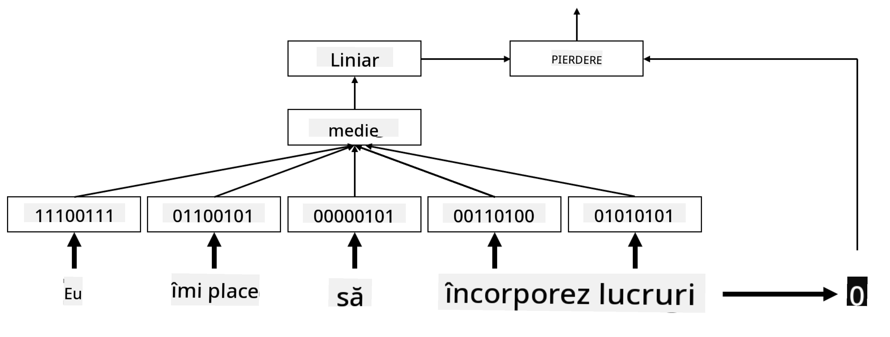
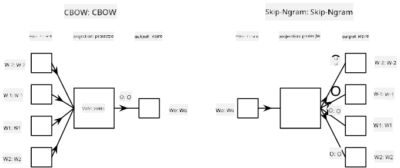

<!--
CO_OP_TRANSLATOR_METADATA:
{
  "original_hash": "e40b47ac3fd48f71304ede1474e66293",
  "translation_date": "2025-08-25T21:39:21+00:00",
  "source_file": "lessons/5-NLP/14-Embeddings/README.md",
  "language_code": "ro"
}
-->
# Încapsulări

## [Chestionar înainte de curs](https://red-field-0a6ddfd03.1.azurestaticapps.net/quiz/114)

Când antrenam clasificatori bazându-ne pe BoW sau TF/IDF, lucram cu vectori de cuvinte de dimensiuni mari, având lungimea `vocab_size`, și transformam explicit vectorii de reprezentare pozițională de dimensiuni mici în reprezentări sparse one-hot. Totuși, această reprezentare one-hot nu este eficientă din punct de vedere al memoriei. În plus, fiecare cuvânt este tratat independent de celelalte, adică vectorii one-hot codificați nu exprimă nicio similaritate semantică între cuvinte.

Ideea de **încapsulare** este de a reprezenta cuvintele prin vectori densi de dimensiuni mai mici, care reflectă într-un fel semnificația semantică a unui cuvânt. Vom discuta mai târziu cum să construim încapsulări semnificative pentru cuvinte, dar pentru moment să ne gândim la încapsulări ca la o modalitate de a reduce dimensiunea unui vector de cuvinte.

Astfel, stratul de încapsulare ar lua un cuvânt ca intrare și ar produce un vector de ieșire de dimensiunea specificată `embedding_size`. Într-un sens, este foarte similar cu un strat `Linear`, dar în loc să ia un vector one-hot codificat, va putea lua un număr de cuvânt ca intrare, permițându-ne să evităm crearea de vectori one-hot codificați mari.

Folosind un strat de încapsulare ca prim strat în rețeaua noastră de clasificare, putem trece de la un model bag-of-words la un model **embedding bag**, unde mai întâi convertim fiecare cuvânt din textul nostru în încapsularea corespunzătoare, și apoi calculăm o funcție agregată peste toate aceste încapsulări, cum ar fi `sum`, `average` sau `max`.

> Imagine realizată de autor

## ✍️ Exerciții: Încapsulări

Continuă învățarea în următoarele notebook-uri:
* [Încapsulări cu PyTorch](../../../../../lessons/5-NLP/14-Embeddings/EmbeddingsPyTorch.ipynb)
* [Încapsulări TensorFlow](../../../../../lessons/5-NLP/14-Embeddings/EmbeddingsTF.ipynb)

## Încapsulări Semantice: Word2Vec

Deși stratul de încapsulare a învățat să mapaze cuvintele la o reprezentare vectorială, această reprezentare nu avea neapărat o semnificație semantică profundă. Ar fi ideal să învățăm o reprezentare vectorială astfel încât cuvintele similare sau sinonime să corespundă unor vectori apropiați între ei în termeni de o anumită distanță vectorială (de exemplu, distanța Euclidiană).

Pentru a face acest lucru, trebuie să pre-antrenăm modelul de încapsulare pe o colecție mare de texte într-un mod specific. O modalitate de a antrena încapsulări semantice se numește [Word2Vec](https://en.wikipedia.org/wiki/Word2vec). Se bazează pe două arhitecturi principale utilizate pentru a produce o reprezentare distribuită a cuvintelor:

 - **Bag-of-words continuu** (CBoW) — în această arhitectură, antrenăm modelul să prezică un cuvânt din contextul înconjurător. Dat ngram-ul $(W_{-2},W_{-1},W_0,W_1,W_2)$, scopul modelului este să prezică $W_0$ din $(W_{-2},W_{-1},W_1,W_2)$.
 - **Skip-gram continuu** este opusul lui CBoW. Modelul folosește fereastra de context a cuvintelor înconjurătoare pentru a prezice cuvântul curent.

CBoW este mai rapid, în timp ce skip-gram este mai lent, dar face o treabă mai bună în reprezentarea cuvintelor rare.

> Imagine din [acest articol](https://arxiv.org/pdf/1301.3781.pdf)

Încapsulările pre-antrenate Word2Vec (precum și alte modele similare, cum ar fi GloVe) pot fi utilizate în locul stratului de încapsulare în rețelele neuronale. Totuși, trebuie să gestionăm vocabularul, deoarece vocabularul utilizat pentru pre-antrenarea Word2Vec/GloVe este probabil diferit de vocabularul din corpusul nostru de texte. Consultă notebook-urile de mai sus pentru a vedea cum poate fi rezolvată această problemă.

## Încapsulări Contextuale

O limitare cheie a reprezentărilor tradiționale de încapsulare pre-antrenate, cum ar fi Word2Vec, este problema dezambiguizării sensului cuvintelor. Deși încapsulările pre-antrenate pot captura o parte din semnificația cuvintelor în context, fiecare posibil sens al unui cuvânt este codificat în aceeași încapsulare. Acest lucru poate cauza probleme în modelele ulterioare, deoarece multe cuvinte, cum ar fi cuvântul „play”, au semnificații diferite în funcție de contextul în care sunt utilizate.

De exemplu, cuvântul „play” în cele două propoziții de mai jos are semnificații destul de diferite:

- Am fost la o **piesă** de teatru.
- John vrea să **se joace** cu prietenii săi.

Încapsulările pre-antrenate de mai sus reprezintă ambele sensuri ale cuvântului „play” în aceeași încapsulare. Pentru a depăși această limitare, trebuie să construim încapsulări bazate pe **modelul lingvistic**, care este antrenat pe un corpus mare de texte și *știe* cum pot fi utilizate cuvintele în diferite contexte. Discutarea încapsulărilor contextuale este în afara scopului acestui tutorial, dar vom reveni la ele când vom vorbi despre modelele lingvistice mai târziu în curs.

## Concluzie

În această lecție, ai descoperit cum să construiești și să utilizezi straturi de încapsulare în TensorFlow și PyTorch pentru a reflecta mai bine semnificațiile semantice ale cuvintelor.

## 🚀 Provocare

Word2Vec a fost utilizat pentru unele aplicații interesante, inclusiv generarea de versuri și poezii. Aruncă o privire la [acest articol](https://www.politetype.com/blog/word2vec-color-poems) care explică cum autorul a folosit Word2Vec pentru a genera poezie. Urmărește și [acest videoclip de Dan Shiffmann](https://www.youtube.com/watch?v=LSS_bos_TPI&ab_channel=TheCodingTrain) pentru a descoperi o altă explicație a acestei tehnici. Apoi încearcă să aplici aceste tehnici pe propriul tău corpus de texte, poate obținut de pe Kaggle.

## [Chestionar după curs](https://red-field-0a6ddfd03.1.azurestaticapps.net/quiz/214)

## Recapitulare și Studiu Individual

Citește acest articol despre Word2Vec: [Estimarea Eficientă a Reprezentărilor Cuvintelor în Spațiul Vectorial](https://arxiv.org/pdf/1301.3781.pdf)

## [Temă: Notebook-uri](assignment.md)

**Declinare de responsabilitate**:  
Acest document a fost tradus folosind serviciul de traducere AI [Co-op Translator](https://github.com/Azure/co-op-translator). Deși ne străduim să asigurăm acuratețea, vă rugăm să fiți conștienți că traducerile automate pot conține erori sau inexactități. Documentul original în limba sa natală ar trebui considerat sursa autoritară. Pentru informații critice, se recomandă traducerea profesională realizată de un specialist uman. Nu ne asumăm responsabilitatea pentru eventualele neînțelegeri sau interpretări greșite care pot apărea din utilizarea acestei traduceri.