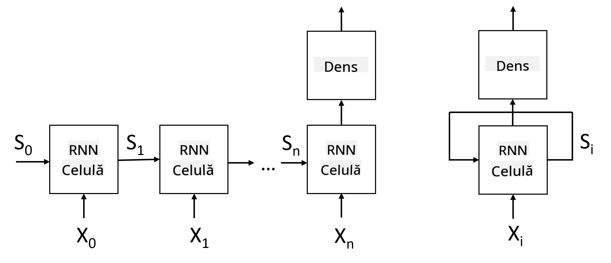
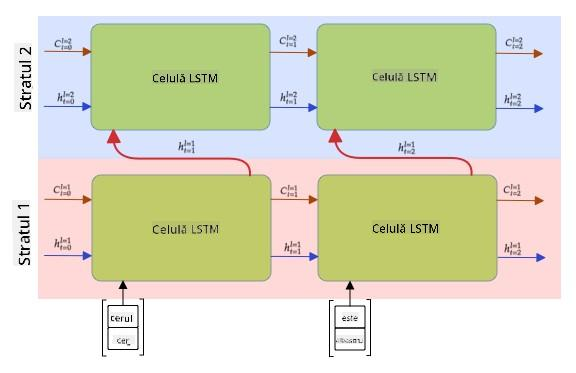

<!--
CO_OP_TRANSLATOR_METADATA:
{
  "original_hash": "e2273cc150380a5e191903cea858f021",
  "translation_date": "2025-09-23T14:23:20+00:00",
  "source_file": "lessons/5-NLP/16-RNN/README.md",
  "language_code": "ro"
}
-->
# Rețele Neuronale Recurente

## [Chestionar înainte de curs](https://ff-quizzes.netlify.app/en/ai/quiz/31)

În secțiunile anterioare, am utilizat reprezentări semantice bogate ale textului și un clasificator liniar simplu deasupra embedding-urilor. Această arhitectură captează sensul agregat al cuvintelor dintr-o propoziție, dar nu ia în considerare **ordinea** cuvintelor, deoarece operația de agregare deasupra embedding-urilor elimină această informație din textul original. Deoarece aceste modele nu pot modela ordinea cuvintelor, ele nu pot rezolva sarcini mai complexe sau ambigue, cum ar fi generarea de text sau răspunsul la întrebări.

Pentru a capta sensul unei secvențe de text, trebuie să utilizăm o altă arhitectură de rețea neuronală, numită **rețea neuronală recurentă**, sau RNN. În RNN, trecem propoziția prin rețea, un simbol la un moment dat, iar rețeaua produce un **stare**, pe care o trecem din nou prin rețea împreună cu următorul simbol.

> Imagine realizată de autor

Având secvența de intrare de tokeni X0,...,Xn, RNN creează o secvență de blocuri de rețea neuronală și antrenează această secvență cap-coadă folosind backpropagation. Fiecare bloc de rețea primește o pereche (Xi,Si) ca intrare și produce Si+1 ca rezultat. Starea finală Sn sau (ieșirea Yn) este introdusă într-un clasificator liniar pentru a produce rezultatul. Toate blocurile de rețea împărtășesc aceleași greutăți și sunt antrenate cap-coadă folosind o singură trecere de backpropagation.

Deoarece vectorii de stare S0,...,Sn sunt trecuți prin rețea, aceasta poate învăța dependențele secvențiale dintre cuvinte. De exemplu, atunci când cuvântul *nu* apare undeva în secvență, rețeaua poate învăța să nege anumite elemente din vectorul de stare, rezultând o negare.

> ✅ Deoarece greutățile tuturor blocurilor RNN din imaginea de mai sus sunt împărtășite, aceeași imagine poate fi reprezentată ca un singur bloc (în dreapta) cu un circuit de feedback recurent, care trece starea de ieșire a rețelei înapoi la intrare.

## Anatomia unei Celule RNN

Să vedem cum este organizată o celulă RNN simplă. Aceasta acceptă starea anterioară Si-1 și simbolul curent Xi ca intrări și trebuie să producă starea de ieșire Si (și, uneori, ne interesează și o altă ieșire Yi, ca în cazul rețelelor generative).

O celulă RNN simplă are două matrice de greutăți în interior: una transformă un simbol de intrare (să o numim W), iar cealaltă transformă o stare de intrare (H). În acest caz, ieșirea rețelei este calculată ca &sigma;(W&times;Xi+H&times;Si-1+b), unde &sigma; este funcția de activare și b este un bias suplimentar.

> Imagine realizată de autor

În multe cazuri, tokenii de intrare sunt trecuți prin stratul de embedding înainte de a intra în RNN pentru a reduce dimensionalitatea. În acest caz, dacă dimensiunea vectorilor de intrare este *emb_size*, iar vectorul de stare este *hid_size* - dimensiunea lui W este *emb_size*&times;*hid_size*, iar dimensiunea lui H este *hid_size*&times;*hid_size*.

## Memorie pe Termen Lung și Scurt (LSTM)

Una dintre principalele probleme ale RNN-urilor clasice este problema numită **gradienti care dispar**. Deoarece RNN-urile sunt antrenate cap-coadă într-o singură trecere de backpropagation, acestea au dificultăți în propagarea erorii către primele straturi ale rețelei și, astfel, rețeaua nu poate învăța relații între tokeni distanți. Una dintre modalitățile de a evita această problemă este introducerea **gestionării explicite a stării** prin utilizarea așa-numitelor **porți**. Există două arhitecturi bine cunoscute de acest tip: **Memorie pe Termen Lung și Scurt** (LSTM) și **Unitatea de Releu Gated** (GRU).

> Sursa imaginii TBD

Rețeaua LSTM este organizată într-un mod similar cu RNN, dar există două stări care sunt transmise de la un strat la altul: starea actuală C și vectorul ascuns H. La fiecare unitate, vectorul ascuns Hi este concatenat cu intrarea Xi, iar acestea controlează ce se întâmplă cu starea C prin intermediul **porților**. Fiecare poartă este o rețea neuronală cu activare sigmoid (ieșire în intervalul [0,1]), care poate fi considerată ca o mască bitwise atunci când este înmulțită cu vectorul de stare. Există următoarele porți (de la stânga la dreapta în imaginea de mai sus):

* **Poarta de uitare** ia un vector ascuns și determină ce componente ale vectorului C trebuie uitate și care trebuie transmise mai departe.
* **Poarta de intrare** preia informații din vectorii de intrare și ascunși și le inserează în stare.
* **Poarta de ieșire** transformă starea printr-un strat liniar cu activare *tanh*, apoi selectează unele dintre componentele sale folosind un vector ascuns Hi pentru a produce o nouă stare Ci+1.

Componentele stării C pot fi considerate ca niște semnale care pot fi activate sau dezactivate. De exemplu, când întâlnim un nume *Alice* în secvență, putem presupune că se referă la un personaj feminin și activăm semnalul în stare că avem un substantiv feminin în propoziție. Când întâlnim ulterior expresia *și Tom*, vom activa semnalul că avem un substantiv la plural. Astfel, prin manipularea stării, putem păstra proprietățile gramaticale ale părților propoziției.

> ✅ O resursă excelentă pentru înțelegerea internelor LSTM este acest articol minunat [Understanding LSTM Networks](https://colah.github.io/posts/2015-08-Understanding-LSTMs/) de Christopher Olah.

## RNN-uri Bidirecționale și Multistrat

Am discutat despre rețelele recurente care operează într-o singură direcție, de la începutul unei secvențe până la sfârșit. Pare natural, deoarece seamănă cu modul în care citim și ascultăm vorbirea. Totuși, deoarece în multe cazuri practice avem acces aleatoriu la secvența de intrare, ar putea avea sens să rulăm calculul recurent în ambele direcții. Astfel de rețele se numesc **RNN-uri bidirecționale**. Când lucrăm cu o rețea bidirecțională, vom avea nevoie de doi vectori de stare ascunsă, câte unul pentru fiecare direcție.

O rețea recurentă, fie unidirecțională, fie bidirecțională, captează anumite modele dintr-o secvență și le poate stoca într-un vector de stare sau le poate transmite ca ieșire. La fel ca în cazul rețelelor convoluționale, putem construi un alt strat recurent deasupra primului pentru a capta modele de nivel superior și a construi din modelele de nivel inferior extrase de primul strat. Acest lucru ne conduce la noțiunea de **RNN multistrat**, care constă din două sau mai multe rețele recurente, unde ieșirea stratului anterior este transmisă stratului următor ca intrare.

*Imagine din [acest articol minunat](https://towardsdatascience.com/from-a-lstm-cell-to-a-multilayer-lstm-network-with-pytorch-2899eb5696f3) de Fernando López*

## ✍️ Exerciții: Embedding-uri

Continuă învățarea în următoarele notebook-uri:

* [RNN-uri cu PyTorch](RNNPyTorch.ipynb)
* [RNN-uri cu TensorFlow](RNNTF.ipynb)

## Concluzie

În această unitate, am văzut că RNN-urile pot fi utilizate pentru clasificarea secvențelor, dar, de fapt, ele pot gestiona multe alte sarcini, cum ar fi generarea de text, traducerea automată și altele. Vom analiza aceste sarcini în unitatea următoare.

## 🚀 Provocare

Citește literatură despre LSTM-uri și ia în considerare aplicațiile lor:

- [Grid Long Short-Term Memory](https://arxiv.org/pdf/1507.01526v1.pdf)
- [Show, Attend and Tell: Neural Image Caption
Generation with Visual Attention](https://arxiv.org/pdf/1502.03044v2.pdf)

## [Chestionar după curs](https://ff-quizzes.netlify.app/en/ai/quiz/32)

## Recapitulare & Studiu Individual

- [Understanding LSTM Networks](https://colah.github.io/posts/2015-08-Understanding-LSTMs/) de Christopher Olah.

## [Temă: Notebook-uri](assignment.md)

---

