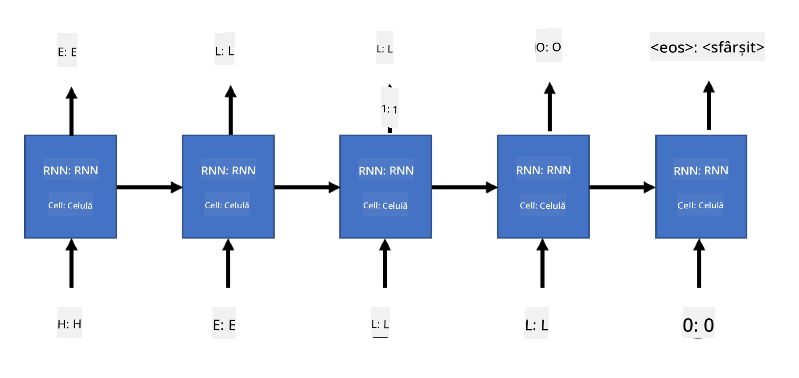

<!--
CO_OP_TRANSLATOR_METADATA:
{
  "original_hash": "51be6057374d01d70e07dd5ec88ebc0d",
  "translation_date": "2025-09-23T14:21:44+00:00",
  "source_file": "lessons/5-NLP/17-GenerativeNetworks/README.md",
  "language_code": "ro"
}
-->
# Rețele generative

## [Chestionar înainte de curs](https://ff-quizzes.netlify.app/en/ai/quiz/33)

Rețelele Neuronale Recurente (RNN) și variantele lor cu celule cu porți, cum ar fi Celulele cu Memorie pe Termen Lung (LSTM) și Unitățile Recurente cu Porți (GRU), oferă un mecanism pentru modelarea limbajului, deoarece pot învăța ordinea cuvintelor și pot oferi predicții pentru următorul cuvânt dintr-o secvență. Acest lucru ne permite să folosim RNN-urile pentru **sarcini generative**, cum ar fi generarea obișnuită de text, traducerea automată și chiar generarea de descrieri pentru imagini.

> ✅ Gândește-te la toate momentele în care ai beneficiat de sarcini generative, cum ar fi completarea textului în timp ce tastezi. Cercetează aplicațiile tale preferate pentru a vedea dacă au utilizat RNN-uri.

În arhitectura RNN discutată în unitatea anterioară, fiecare unitate RNN producea următoarea stare ascunsă ca ieșire. Totuși, putem adăuga și o altă ieșire fiecărei unități recurente, ceea ce ne-ar permite să generăm o **secvență** (egală ca lungime cu secvența originală). Mai mult, putem folosi unități RNN care nu acceptă o intrare la fiecare pas, ci doar iau un vector de stare inițială și apoi produc o secvență de ieșiri.

Acest lucru permite diferite arhitecturi neuronale, așa cum sunt prezentate în imaginea de mai jos:


> Imagine din articolul [Unreasonable Effectiveness of Recurrent Neural Networks](http://karpathy.github.io/2015/05/21/rnn-effectiveness/) de [Andrej Karpathy](http://karpathy.github.io/)

* **One-to-one** este o rețea neuronală tradițională cu o singură intrare și o singură ieșire.
* **One-to-many** este o arhitectură generativă care acceptă o valoare de intrare și generează o secvență de valori de ieșire. De exemplu, dacă dorim să antrenăm o rețea pentru **descrierea imaginilor** care să producă o descriere textuală a unei imagini, putem lua o imagine ca intrare, să o trecem printr-o CNN pentru a obține starea ascunsă, iar apoi să folosim un lanț recurent pentru a genera descrierea cuvânt cu cuvânt.
* **Many-to-one** corespunde arhitecturilor RNN descrise în unitatea anterioară, cum ar fi clasificarea textului.
* **Many-to-many**, sau **secvență-la-secvență**, corespunde sarcinilor precum **traducerea automată**, unde avem un prim RNN care colectează toate informațiile din secvența de intrare în starea ascunsă, iar un alt lanț RNN desfășoară această stare într-o secvență de ieșire.

În această unitate, ne vom concentra pe modele generative simple care ne ajută să generăm text. Pentru simplitate, vom folosi tokenizarea la nivel de caracter.

Vom antrena acest RNN pentru a genera text pas cu pas. La fiecare pas, vom lua o secvență de caractere de lungime `nchars` și vom cere rețelei să genereze următorul caracter de ieșire pentru fiecare caracter de intrare:



Când generăm text (în timpul inferenței), începem cu un **prompt**, care este trecut prin celulele RNN pentru a genera starea intermediară, iar apoi, din această stare, începe generarea. Generăm un caracter pe rând și transmitem starea și caracterul generat unei alte celule RNN pentru a genera următorul, până când generăm suficiente caractere.


> Imagine realizată de autor

## ✍️ Exerciții: Rețele Generative

Continuă învățarea în următoarele notebook-uri:

* [Rețele Generative cu PyTorch](GenerativePyTorch.ipynb)
* [Rețele Generative cu TensorFlow](GenerativeTF.ipynb)

## Generare moale de text și temperatură

Ieșirea fiecărei celule RNN este o distribuție de probabilitate a caracterelor. Dacă alegem întotdeauna caracterul cu cea mai mare probabilitate ca următor caracter în textul generat, textul poate deveni adesea "ciclic", repetând aceleași secvențe de caractere din nou și din nou, ca în acest exemplu:

```
today of the second the company and a second the company ...
```

Totuși, dacă ne uităm la distribuția de probabilitate pentru următorul caracter, este posibil ca diferența dintre câteva dintre cele mai mari probabilități să nu fie mare, de exemplu, un caracter poate avea probabilitatea 0.2, iar altul 0.19 etc. De exemplu, când căutăm următorul caracter în secvența '*play*', următorul caracter poate fi la fel de bine un spațiu sau **e** (ca în cuvântul *player*).

Acest lucru ne conduce la concluzia că nu este întotdeauna "corect" să selectăm caracterul cu probabilitatea cea mai mare, deoarece alegerea celui de-al doilea cel mai probabil poate duce totuși la un text semnificativ. Este mai înțelept să **eșantionăm** caracterele din distribuția de probabilitate oferită de ieșirea rețelei. Putem folosi și un parametru, **temperatura**, care va aplatiza distribuția de probabilitate, în cazul în care dorim să adăugăm mai multă aleatorie, sau o va face mai abruptă, dacă dorim să ne concentrăm mai mult pe caracterele cu probabilitate mai mare.

Explorează cum este implementată această generare moale de text în notebook-urile menționate mai sus.

## Concluzie

Deși generarea de text poate fi utilă în sine, beneficiile majore vin din abilitatea de a genera text folosind RNN-uri dintr-un vector de caracteristici inițial. De exemplu, generarea de text este utilizată ca parte a traducerii automate (secvență-la-secvență, în acest caz vectorul de stare de la *encoder* este folosit pentru a genera sau *decoda* mesajul tradus) sau pentru generarea unei descrieri textuale a unei imagini (în acest caz, vectorul de caracteristici ar proveni dintr-un extractor CNN).

## 🚀 Provocare

Urmează câteva lecții pe Microsoft Learn pe acest subiect:

* Generare de text cu [PyTorch](https://docs.microsoft.com/learn/modules/intro-natural-language-processing-pytorch/6-generative-networks/?WT.mc_id=academic-77998-cacaste)/[TensorFlow](https://docs.microsoft.com/learn/modules/intro-natural-language-processing-tensorflow/5-generative-networks/?WT.mc_id=academic-77998-cacaste)

## [Chestionar după curs](https://ff-quizzes.netlify.app/en/ai/quiz/34)

## Recapitulare și Studiu Individual

Iată câteva articole pentru a-ți extinde cunoștințele:

* Diferite abordări pentru generarea de text cu Markov Chain, LSTM și GPT-2: [articol](https://towardsdatascience.com/text-generation-gpt-2-lstm-markov-chain-9ea371820e1e)
* Exemplu de generare de text în [documentația Keras](https://keras.io/examples/generative/lstm_character_level_text_generation/)

## [Temă](lab/README.md)

Am văzut cum să generăm text caracter cu caracter. În laborator, vei explora generarea de text la nivel de cuvânt.

---

