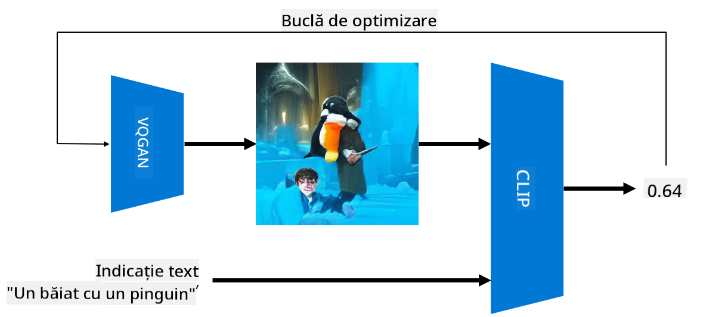

<!--
CO_OP_TRANSLATOR_METADATA:
{
  "original_hash": "9c592c26aca16ca085d268c732284187",
  "translation_date": "2025-08-25T23:37:57+00:00",
  "source_file": "lessons/X-Extras/X1-MultiModal/README.md",
  "language_code": "ro"
}
-->
# Rețele Multi-Modale

După succesul modelelor transformer în rezolvarea sarcinilor NLP, aceleași sau arhitecturi similare au fost aplicate și în sarcinile de viziune computerizată. Există un interes tot mai mare în construirea de modele care să *combine* capabilitățile de viziune și limbaj natural. Unul dintre aceste eforturi a fost realizat de OpenAI și se numește CLIP și DALL.E.

## Contrastive Image Pre-Training (CLIP)

Ideea principală a CLIP este de a putea compara descrieri textuale cu o imagine și de a determina cât de bine corespunde imaginea descrierii.

> *Imagine din [acest articol](https://openai.com/blog/clip/)*

Modelul este antrenat pe imagini obținute de pe Internet și pe descrierile lor. Pentru fiecare lot, luăm N perechi de (imagine, text) și le convertim în reprezentări vectoriale I, ..., I / T, ..., T. Aceste reprezentări sunt apoi potrivite între ele. Funcția de pierdere este definită pentru a maximiza similaritatea cosinusului între vectorii corespunzători unei perechi (de exemplu, I și T) și pentru a minimiza similaritatea cosinusului între toate celelalte perechi. Acesta este motivul pentru care această abordare se numește **contrastivă**.

Biblioteca/modelul CLIP este disponibilă pe [GitHub-ul OpenAI](https://github.com/openai/CLIP). Abordarea este descrisă în [acest articol](https://openai.com/blog/clip/) și în detaliu în [această lucrare](https://arxiv.org/pdf/2103.00020.pdf).

Odată ce acest model este pre-antrenat, putem să-i oferim un lot de imagini și un lot de descrieri textuale, iar rezultatul va fi un tensor cu probabilități. CLIP poate fi utilizat pentru mai multe sarcini:

**Clasificarea Imaginilor**

Să presupunem că trebuie să clasificăm imagini între, să zicem, pisici, câini și oameni. În acest caz, putem oferi modelului o imagine și o serie de descrieri textuale: "*o imagine cu o pisică*", "*o imagine cu un câine*", "*o imagine cu un om*". În vectorul rezultat de 3 probabilități, trebuie doar să selectăm indexul cu cea mai mare valoare.

> *Imagine din [acest articol](https://openai.com/blog/clip/)*

**Căutare de Imagini Bazată pe Text**

Putem face și invers. Dacă avem o colecție de imagini, putem transmite această colecție modelului și o descriere textuală - aceasta ne va oferi imaginea care este cea mai similară cu descrierea dată.

## ✍️ Exemplu: [Utilizarea CLIP pentru Clasificarea Imaginilor și Căutarea de Imagini](../../../../../lessons/X-Extras/X1-MultiModal/Clip.ipynb)

Deschideți notebook-ul [Clip.ipynb](../../../../../lessons/X-Extras/X1-MultiModal/Clip.ipynb) pentru a vedea CLIP în acțiune.

## Generarea de Imagini cu VQGAN+CLIP

CLIP poate fi utilizat și pentru **generarea de imagini** dintr-o descriere textuală. Pentru a face acest lucru, avem nevoie de un **model generator** care să poată genera imagini pe baza unui vector de intrare. Unul dintre aceste modele se numește [VQGAN](https://compvis.github.io/taming-transformers/) (Vector-Quantized GAN).

Ideile principale ale VQGAN care îl diferențiază de GAN-ul obișnuit sunt următoarele:
* Utilizarea arhitecturii transformer autoregresive pentru a genera o secvență de părți vizuale bogate în context care compun imaginea. Aceste părți vizuale sunt învățate de [CNN](../../4-ComputerVision/07-ConvNets/README.md).
* Utilizarea unui discriminator de sub-imagini care detectează dacă părțile imaginii sunt "reale" sau "false" (spre deosebire de abordarea "totul sau nimic" din GAN-ul tradițional).

Aflați mai multe despre VQGAN pe site-ul [Taming Transformers](https://compvis.github.io/taming-transformers/).

Una dintre diferențele importante între VQGAN și GAN-ul tradițional este că cel din urmă poate produce o imagine decentă din orice vector de intrare, în timp ce VQGAN este probabil să producă o imagine incoerentă. Astfel, trebuie să ghidăm procesul de creare a imaginii, iar acest lucru poate fi realizat folosind CLIP.

Pentru a genera o imagine corespunzătoare unei descrieri textuale, începem cu un vector de codificare aleatoriu care este transmis prin VQGAN pentru a produce o imagine. Apoi, CLIP este utilizat pentru a produce o funcție de pierdere care arată cât de bine corespunde imaginea descrierii textuale. Scopul este de a minimiza această pierdere, utilizând backpropagation pentru a ajusta parametrii vectorului de intrare.

O bibliotecă excelentă care implementează VQGAN+CLIP este [Pixray](http://github.com/pixray/pixray).

 |   | 
----|----|----
Imagine generată din descrierea *un portret în acuarelă, prim-plan, al unui tânăr profesor de literatură cu o carte* | Imagine generată din descrierea *un portret în ulei, prim-plan, al unei tinere profesoare de informatică cu un computer* | Imagine generată din descrierea *un portret în ulei, prim-plan, al unui profesor bătrân de matematică în fața unei table negre*

> Imagini din colecția **Artificial Teachers** de [Dmitry Soshnikov](http://soshnikov.com)

## DALL-E
### [DALL-E 1](https://openai.com/research/dall-e)
DALL-E este o versiune a GPT-3 antrenată pentru a genera imagini din descrieri. A fost antrenată cu 12 miliarde de parametri.

Spre deosebire de CLIP, DALL-E primește atât textul, cât și imaginea ca un flux unic de tokeni pentru ambele. Prin urmare, din mai multe descrieri, puteți genera imagini bazate pe text.

### [DALL-E 2](https://openai.com/dall-e-2)
Principala diferență între DALL-E 1 și 2 este că aceasta generează imagini și artă mai realiste.

Exemple de imagini generate cu DALL-E:
 |   | 
----|----|----
Imagine generată din descrierea *un portret în acuarelă, prim-plan, al unui tânăr profesor de literatură cu o carte* | Imagine generată din descrierea *un portret în ulei, prim-plan, al unei tinere profesoare de informatică cu un computer* | Imagine generată din descrierea *un portret în ulei, prim-plan, al unui profesor bătrân de matematică în fața unei table negre*

## Referințe

* Lucrarea VQGAN: [Taming Transformers for High-Resolution Image Synthesis](https://compvis.github.io/taming-transformers/paper/paper.pdf)
* Lucrarea CLIP: [Learning Transferable Visual Models From Natural Language Supervision](https://arxiv.org/pdf/2103.00020.pdf)

**Declinare de responsabilitate**:  
Acest document a fost tradus folosind serviciul de traducere AI [Co-op Translator](https://github.com/Azure/co-op-translator). Deși ne străduim să asigurăm acuratețea, vă rugăm să fiți conștienți că traducerile automate pot conține erori sau inexactități. Documentul original în limba sa natală ar trebui considerat sursa autoritară. Pentru informații critice, se recomandă traducerea profesională realizată de un specialist uman. Nu ne asumăm responsabilitatea pentru eventualele neînțelegeri sau interpretări greșite care pot apărea din utilizarea acestei traduceri.