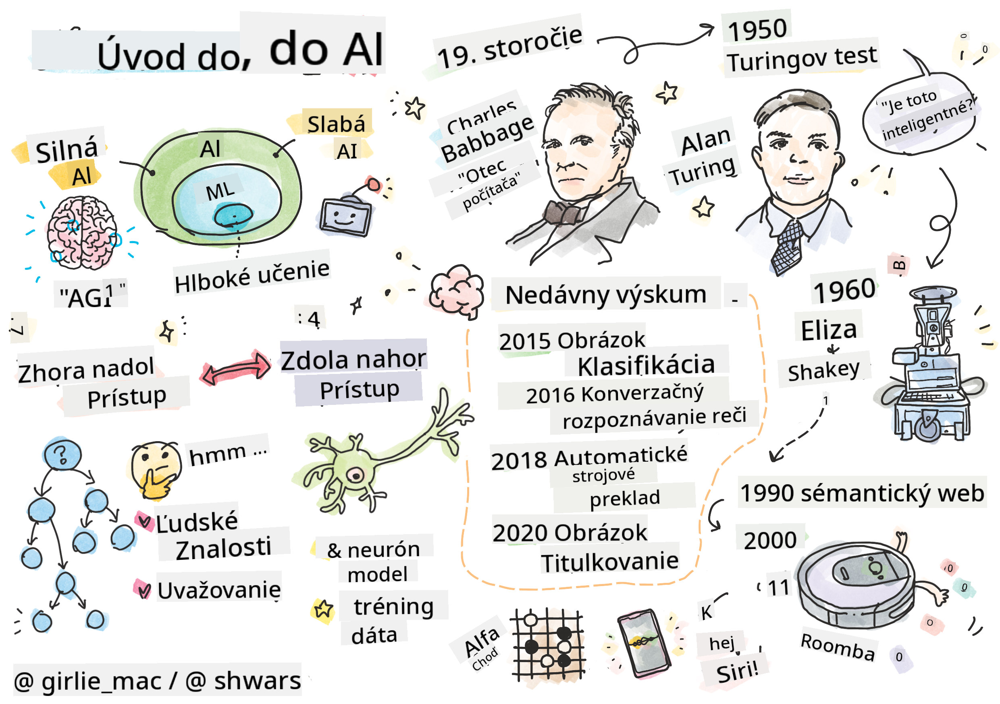
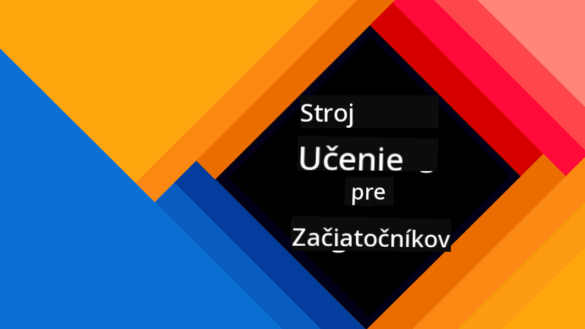

<!--
CO_OP_TRANSLATOR_METADATA:
{
  "original_hash": "0c84b280e654e05ed658023021a6a975",
  "translation_date": "2025-09-23T14:07:35+00:00",
  "source_file": "lessons/1-Intro/README.md",
  "language_code": "sk"
}
-->
# Úvod do AI

> Sketchnote od [Tomomi Imura](https://twitter.com/girlie_mac)

## [Kvíz pred prednáškou](https://ff-quizzes.netlify.app/en/ai/quiz/1)

**Umelá inteligencia** je fascinujúca vedecká disciplína, ktorá skúma, ako môžeme naučiť počítače prejavovať inteligentné správanie, napríklad robiť veci, v ktorých sú ľudia dobrí.

Pôvodne boli počítače vynájdené [Charlesom Babbageom](https://en.wikipedia.org/wiki/Charles_Babbage) na spracovanie čísel podľa presne definovaného postupu – algoritmu. Moderné počítače, hoci sú výrazne pokročilejšie než pôvodný model navrhnutý v 19. storočí, stále fungujú na rovnakom princípe kontrolovaných výpočtov. Preto je možné naprogramovať počítač na vykonanie úlohy, ak poznáme presnú postupnosť krokov potrebných na dosiahnutie cieľa.

> Foto od [Vickie Soshnikova](http://twitter.com/vickievalerie)

> ✅ Určenie veku osoby z jej fotografie je úloha, ktorú nemožno explicitne naprogramovať, pretože nevieme presne, ako v hlave prichádzame k číslu, keď to robíme.

---

Existujú však úlohy, ktoré nevieme explicitne vyriešiť. Zvážte určenie veku osoby z jej fotografie. Nejako sa to naučíme, pretože sme videli veľa príkladov ľudí rôzneho veku, ale nemôžeme presne vysvetliť, ako to robíme, ani to naprogramovať do počítača. Práve takéto úlohy sú predmetom záujmu **umelej inteligencie** (skrátene AI).

✅ Zamyslite sa nad niektorými úlohami, ktoré by ste mohli delegovať na počítač a ktoré by mohli profitovať z AI. Zvážte oblasti ako financie, medicína a umenie – ako tieto oblasti dnes profitujú z AI?

## Slabá AI vs. Silná AI

Slabá AI | Silná AI
---------------------------------------|-------------------------------------
Slabá AI označuje systémy AI, ktoré sú navrhnuté a trénované na konkrétnu úlohu alebo úzky súbor úloh.|Silná AI, alebo Umelá všeobecná inteligencia (AGI), označuje systémy AI s inteligenciou a porozumením na úrovni človeka.
Tieto systémy AI nie sú všeobecne inteligentné; vynikajú v plnení preddefinovanej úlohy, ale nemajú skutočné porozumenie alebo vedomie.|Tieto systémy AI majú schopnosť vykonávať akúkoľvek intelektuálnu úlohu, ktorú dokáže človek, prispôsobiť sa rôznym oblastiam a disponovať formou vedomia alebo sebauvedomenia.
Príklady slabej AI zahŕňajú virtuálnych asistentov ako Siri alebo Alexa, odporúčacie algoritmy používané streamovacími službami a chatboty navrhnuté na konkrétne úlohy zákazníckeho servisu.|Dosiahnutie silnej AI je dlhodobým cieľom výskumu AI a vyžadovalo by vývoj systémov AI, ktoré dokážu uvažovať, učiť sa, rozumieť a prispôsobovať sa širokému spektru úloh a kontextov.
Slabá AI je vysoko špecializovaná a nemá kognitívne schopnosti podobné človeku ani všeobecné schopnosti riešenia problémov mimo svojej úzkej oblasti.|Silná AI je v súčasnosti teoretický koncept a žiadny systém AI nedosiahol túto úroveň všeobecnej inteligencie.

Viac informácií nájdete na **[Umelá všeobecná inteligencia](https://en.wikipedia.org/wiki/Artificial_general_intelligence)** (AGI).

## Definícia inteligencie a Turingov test

Jedným z problémov pri práci s pojmom **[inteligencia](https://en.wikipedia.org/wiki/Intelligence)** je, že neexistuje jasná definícia tohto pojmu. Dá sa argumentovať, že inteligencia súvisí s **abstraktným myslením** alebo so **sebauvedomením**, ale nemôžeme ju presne definovať.

> [Foto](https://unsplash.com/photos/75715CVEJhI) od [Amber Kipp](https://unsplash.com/@sadmax) z Unsplash

Aby sme videli nejednoznačnosť pojmu *inteligencia*, skúste odpovedať na otázku: "Je mačka inteligentná?". Rôzni ľudia majú tendenciu dávať rôzne odpovede na túto otázku, pretože neexistuje univerzálne akceptovaný test na potvrdenie pravdivosti tohto tvrdenia. A ak si myslíte, že existuje – skúste dať mačku na IQ test...

✅ Zamyslite sa na chvíľu nad tým, ako definujete inteligenciu. Je vrana, ktorá dokáže vyriešiť bludisko a dostať sa k jedlu, inteligentná? Je dieťa inteligentné?

---

Keď hovoríme o AGI, potrebujeme nejaký spôsob, ako zistiť, či sme vytvorili skutočne inteligentný systém. [Alan Turing](https://en.wikipedia.org/wiki/Alan_Turing) navrhol spôsob nazývaný **[Turingov test](https://en.wikipedia.org/wiki/Turing_test)**, ktorý zároveň slúži ako definícia inteligencie. Test porovnáva daný systém s niečím inherentne inteligentným – skutočným človekom, a pretože akékoľvek automatické porovnanie môže byť obídené počítačovým programom, používame ľudského vyšetrovateľa. Ak človek nedokáže rozlíšiť medzi skutočnou osobou a počítačovým systémom v textovom dialógu – systém sa považuje za inteligentný.

> Chatbot nazvaný [Eugene Goostman](https://en.wikipedia.org/wiki/Eugene_Goostman), vyvinutý v Petrohrade, sa v roku 2014 priblížil k prekonaniu Turingovho testu použitím šikovného triku s osobnosťou. Hneď na začiatku oznámil, že je 13-ročný ukrajinský chlapec, čo vysvetľovalo nedostatok znalostí a niektoré nezrovnalosti v texte. Bot presvedčil 30 % sudcov, že je človek po 5-minútovom dialógu, čo je metrika, o ktorej Turing veril, že ju stroj dokáže dosiahnuť do roku 2000. Avšak treba pochopiť, že to neznamená, že sme vytvorili inteligentný systém, alebo že počítačový systém oklamal ľudského vyšetrovateľa – systém neoklamal ľudí, ale skôr tvorcovia bota!

✅ Už vás niekedy oklamal chatbot, aby ste si mysleli, že hovoríte s človekom? Ako vás presvedčil?

## Rôzne prístupy k AI

Ak chceme, aby sa počítač správal ako človek, musíme nejako modelovať naše myslenie v počítači. Následne musíme skúsiť pochopiť, čo robí človeka inteligentným.

> Aby sme mohli naprogramovať inteligenciu do stroja, musíme pochopiť, ako fungujú naše vlastné procesy rozhodovania. Ak sa trochu zamyslíte nad sebou, uvedomíte si, že niektoré procesy prebiehajú podvedome – napríklad dokážeme rozlíšiť mačku od psa bez premýšľania – zatiaľ čo iné zahŕňajú uvažovanie.

Existujú dva možné prístupy k tomuto problému:

Prístup zhora nadol (symbolické uvažovanie) | Prístup zdola nahor (neurónové siete)
---------------------------------------|-------------------------------------
Prístup zhora nadol modeluje spôsob, akým človek uvažuje pri riešení problému. Zahŕňa extrakciu **znalostí** od človeka a ich reprezentáciu vo forme čitateľnej pre počítač. Musíme tiež vyvinúť spôsob modelovania **uvažovania** v počítači. | Prístup zdola nahor modeluje štruktúru ľudského mozgu, pozostávajúcu z obrovského množstva jednoduchých jednotiek nazývaných **neuróny**. Každý neurón funguje ako vážený priemer svojich vstupov a môžeme trénovať sieť neurónov na riešenie užitočných problémov poskytovaním **tréningových dát**.

Existujú aj ďalšie možné prístupy k inteligencii:

* **Emergentný**, **synergetický** alebo **multi-agentný prístup** sú založené na skutočnosti, že komplexné inteligentné správanie môže vzniknúť interakciou veľkého množstva jednoduchých agentov. Podľa [evolučnej kybernetiky](https://en.wikipedia.org/wiki/Global_brain#Evolutionary_cybernetics) môže inteligencia *vyplynúť* z jednoduchšieho, reaktívneho správania v procese *metasystémového prechodu*.

* **Evolučný prístup**, alebo **genetický algoritmus** je optimalizačný proces založený na princípoch evolúcie.

Tieto prístupy budeme skúmať neskôr v kurze, ale teraz sa zameriame na dva hlavné smery: zhora nadol a zdola nahor.

### Prístup zhora nadol

Pri **prístupe zhora nadol** sa snažíme modelovať naše uvažovanie. Pretože dokážeme sledovať naše myšlienky pri uvažovaní, môžeme sa pokúsiť formalizovať tento proces a naprogramovať ho do počítača. Toto sa nazýva **symbolické uvažovanie**.

Ľudia majú tendenciu mať vo svojej hlave určité pravidlá, ktoré riadia ich rozhodovacie procesy. Napríklad, keď lekár diagnostikuje pacienta, môže si uvedomiť, že osoba má horúčku, a teda môže ísť o nejaký zápal v tele. Použitím veľkého množstva pravidiel na konkrétny problém môže lekár dospieť k konečnej diagnóze.

Tento prístup sa silne opiera o **reprezentáciu znalostí** a **uvažovanie**. Extrakcia znalostí od ľudského experta môže byť najťažšou časťou, pretože lekár v mnohých prípadoch nemusí presne vedieť, prečo dospieva k určitej diagnóze. Niekedy riešenie jednoducho vyvstane v jeho hlave bez explicitného premýšľania. Niektoré úlohy, ako napríklad určenie veku osoby z fotografie, sa vôbec nedajú zredukovať na manipuláciu so znalosťami.

### Prístup zdola nahor

Alternatívne môžeme skúsiť modelovať najjednoduchšie prvky v našom mozgu – neurón. Môžeme v počítači vytvoriť tzv. **umelú neurónovú sieť** a potom sa ju pokúsiť naučiť riešiť problémy poskytovaním príkladov. Tento proces je podobný tomu, ako sa novorodené dieťa učí o svojom okolí pozorovaním.

✅ Urobte si malý výskum o tom, ako sa deti učia. Aké sú základné prvky mozgu dieťaťa?

> | Čo tak ML?         |      |
> |--------------|-----------|
> | Časť umelej inteligencie, ktorá je založená na tom, že počítač sa učí riešiť problém na základe určitých dát, sa nazýva **strojové učenie**. V tomto kurze sa nebudeme zaoberať klasickým strojovým učením – odkazujeme vás na samostatný [kurz Strojové učenie pre začiatočníkov](http://aka.ms/ml-beginners). |       |

## Stručná história AI

Umelá inteligencia sa ako oblasť začala rozvíjať v polovici dvadsiateho storočia. Spočiatku bol prevládajúcim prístupom symbolické uvažovanie, ktoré viedlo k množstvu dôležitých úspechov, ako napríklad expertné systémy – počítačové programy schopné pôsobiť ako expert v niektorých obmedzených problémových oblastiach. Čoskoro sa však ukázalo, že tento prístup nie je dobre škálovateľný. Extrakcia znalostí od experta, ich reprezentácia v počítači a udržiavanie tejto databázy znalostí presnej sa ukázali ako veľmi zložité a príliš nákladné na to, aby boli praktické v mnohých prípadoch. To viedlo k tzv. [AI zime](https://en.wikipedia.org/wiki/AI_winter) v 70. rokoch.

> Obrázok od [Dmitry Soshnikov](http://soshnikov.com)

Ako čas plynul, výpočtové zdroje sa stali lacnejšími a dostupnejšími, takže prístupy založené na neurónových sieťach začali vykazovať skvelý výkon v súťažení s ľuďmi v mnohých oblastiach, ako je počítačové videnie alebo porozumenie reči. V poslednom desaťročí sa termín umelá inteligencia väčšinou používa ako synonymum pre neurónové siete, pretože väčšina úspechov AI, o ktorých počujeme, je založená na nich.

Môžeme pozorovať, ako sa prístupy menili, napríklad pri vytváraní počítačového programu na hranie šachu:

* Skoré šachové programy boli založené na vyhľadávaní – program sa explicitne snažil odhadnúť možné ťahy súpera na určitý počet nasledujúcich ťahov a vybral optimálny ťah na základe optimálnej pozície, ktorú možno dosiahnuť v niekoľkých ťahoch. To viedlo k vývoju tzv. [alpha-beta prerezávacieho](https://en.wikipedia.org/wiki/Alpha%E2%80%93beta_pruning) vyhľadávacieho algoritmu.
* Vyhľadávacie stratégie fungujú dobre na konci hry, kde je vyhľadávací priestor obmedzený malým počtom možných ťahov. Na začiatku hry je však vyhľadávací priestor obrovský a algoritmus možno zlepšiť učením sa z existujúcich zápasov medzi ľudskými hráčmi. Následné experimenty využívali tzv. [prístup založený na prípadoch](https://en.wikipedia.org/wiki/Case-based_reasoning), kde program hľadal prípady v databáze znalostí veľmi podobné aktuálnej pozícii v hre.
* Moderné programy, ktoré vyhrávajú nad ľudskými hráčmi, sú založené na neurónových sieťach a [posilňovacom učení](https://en.wikipedia.org/wiki/Reinforcement_learning), kde sa programy učia hrať výlučne tým, že dlhý čas hrajú proti sebe a učia sa zo svojich vlastných chýb – podobne ako ľudia, keď sa učia hrať šach. Počítačový program však môže odohrať oveľa viac hier za oveľa kratší čas, a tak sa môže učiť oveľa rýchlejšie.

✅ Urobte si malý výskum o iných hrách, ktoré boli hrané AI.

Podobne môžeme vidieť, ako sa prístup k vytváraniu „hovoriacich programov“ (ktoré by mohli prejsť Turingovým testom) zmenil:

* Skoré programy tohto druhu, ako napríklad [Eliza](https://en.wikipedia.org/wiki/ELIZA), boli založené na veľmi jednoduchých gramatických pravidlách a reformulácii vstupnej vety na otázku.
* Moderní asistenti, ako Cortana, Siri alebo Google Assistant, sú všetci hybridné systémy, ktoré používajú neurónové siete na konverziu reči na text a rozpoznanie nášho zámeru, a potom využívajú nejaké uvažovanie alebo explicitné algoritmy na vykonanie požadovaných akcií.
* V budúcnosti môžeme očakávať kompletný model založený na neurónových sieťach, ktorý bude sám zvládať dialóg. Nedávne GPT a [Turing-NLG](https://turing.microsoft.com/) rodiny neurónových sietí vykazujú veľký úspech v tomto smere.

> Obrázok od Dmitry Soshnikov, [fotografia](https://unsplash.com/photos/r8LmVbUKgns) od [Marina Abrosimova](https://unsplash.com/@abrosimova_marina_foto), Unsplash

## Nedávny výskum v oblasti AI

Obrovský nárast výskumu neurónových sietí začal okolo roku 2010, keď sa začali sprístupňovať veľké verejné dátové súbory. Obrovská zbierka obrázkov nazvaná [ImageNet](https://en.wikipedia.org/wiki/ImageNet), ktorá obsahuje približne 14 miliónov anotovaných obrázkov, dala vzniknúť [ImageNet Large Scale Visual Recognition Challenge](https://image-net.org/challenges/LSVRC/).

> Obrázok od [Dmitry Soshnikov](http://soshnikov.com)

V roku 2012 boli [Konvolučné neurónové siete](../4-ComputerVision/07-ConvNets/README.md) prvýkrát použité na klasifikáciu obrázkov, čo viedlo k výraznému poklesu chybovosti klasifikácie (z takmer 30 % na 16,4 %). V roku 2015 architektúra ResNet od Microsoft Research [dosiahla presnosť na úrovni človeka](https://doi.org/10.1109/ICCV.2015.123).

Odvtedy neurónové siete preukázali veľmi úspešné správanie v mnohých úlohách:

---

Rok | Dosiahnutá úroveň človeka
-----|--------
2015 | [Klasifikácia obrázkov](https://doi.org/10.1109/ICCV.2015.123)
2016 | [Rozpoznávanie reči v konverzácii](https://arxiv.org/abs/1610.05256)
2018 | [Automatický preklad](https://arxiv.org/abs/1803.05567) (z čínštiny do angličtiny)
2020 | [Popisovanie obrázkov](https://arxiv.org/abs/2009.13682)

Za posledné roky sme boli svedkami obrovských úspechov veľkých jazykových modelov, ako sú BERT a GPT-3. Toto sa stalo najmä vďaka tomu, že existuje veľké množstvo všeobecných textových dát, ktoré umožňujú trénovať modely na zachytenie štruktúry a významu textov, predtrénovať ich na všeobecných textových kolekciách a následne špecializovať tieto modely na konkrétnejšie úlohy. Viac sa o [Spracovaní prirodzeného jazyka](../5-NLP/README.md) dozvieme neskôr v tomto kurze.

## 🚀 Výzva

Preskúmajte internet a určte, kde je podľa vás AI najefektívnejšie využívaná. Je to v aplikácii na mapovanie, službe na prevod reči na text alebo vo videohre? Preskúmajte, ako bol systém vytvorený.

## [Kvíz po prednáške](https://ff-quizzes.netlify.app/en/ai/quiz/2)

## Prehľad & Samoštúdium

Preskúmajte históriu AI a ML prečítaním [tejto lekcie](https://github.com/microsoft/ML-For-Beginners/tree/main/1-Introduction/2-history-of-ML). Vyberte si prvok zo sketchnote na začiatku tejto lekcie alebo tejto a preskúmajte ho podrobnejšie, aby ste pochopili kultúrny kontext, ktorý ovplyvnil jeho vývoj.

**Úloha**: [Game Jam](assignment.md)

---

