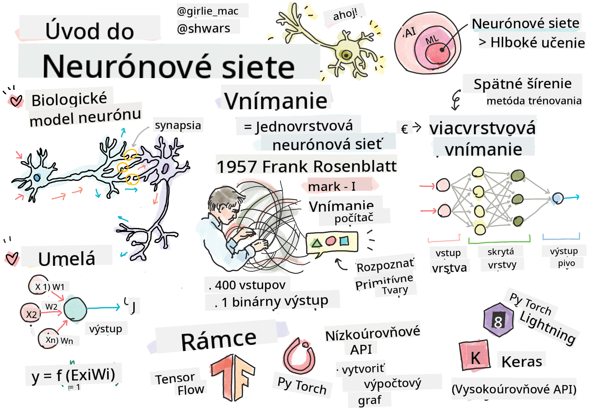
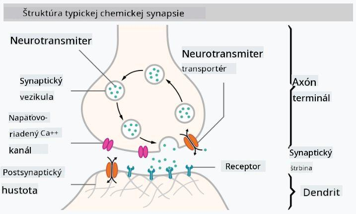

<!--
CO_OP_TRANSLATOR_METADATA:
{
  "original_hash": "5abc5f7978919be90cd313f0c20e8228",
  "translation_date": "2025-09-07T14:36:08+00:00",
  "source_file": "lessons/3-NeuralNetworks/README.md",
  "language_code": "sk"
}
-->
# Úvod do neurónových sietí

Ako sme diskutovali v úvode, jedným zo spôsobov, ako dosiahnuť inteligenciu, je trénovať **počítačový model** alebo **umelý mozog**. Od polovice 20. storočia vedci skúšali rôzne matematické modely, až kým sa v posledných rokoch tento smer neukázal ako mimoriadne úspešný. Takéto matematické modely mozgu sa nazývajú **neurónové siete**.

> Neurónové siete sa niekedy nazývajú *Umelé neurónové siete* (Artificial Neural Networks, ANNs), aby sa zdôraznilo, že hovoríme o modeloch, nie o skutočných sieťach neurónov.

## Strojové učenie

Neurónové siete sú súčasťou širšej disciplíny nazývanej **Strojové učenie**, ktorej cieľom je využívať dáta na trénovanie počítačových modelov schopných riešiť problémy. Strojové učenie tvorí veľkú časť umelej inteligencie, avšak v tomto učebnom pláne sa klasickým strojovým učením nezaoberáme.

> Navštívte náš samostatný učebný plán **[Strojové učenie pre začiatočníkov](http://github.com/microsoft/ml-for-beginners)**, aby ste sa dozvedeli viac o klasickom strojovom učení.

V strojovom učení predpokladáme, že máme nejakú množinu dátových príkladov **X** a zodpovedajúce výstupné hodnoty **Y**. Príklady sú často N-rozmerné vektory, ktoré pozostávajú z **príznakov**, a výstupy sa nazývajú **štítky**.

Budeme sa zaoberať dvoma najbežnejšími problémami strojového učenia:

* **Klasifikácia**, kde je potrebné klasifikovať vstupný objekt do dvoch alebo viacerých tried.
* **Regresia**, kde je potrebné predpovedať číselnú hodnotu pre každý zo vstupných vzoriek.

> Pri reprezentácii vstupov a výstupov ako tenzorov je vstupná množina dát matica veľkosti M×N, kde M je počet vzoriek a N je počet príznakov. Výstupné štítky Y sú vektor veľkosti M.

V tomto učebnom pláne sa budeme sústrediť iba na modely neurónových sietí.

## Model neurónu

Z biológie vieme, že náš mozog pozostáva z neurónových buniek, pričom každá z nich má viacero "vstupov" (axónov) a jeden výstup (dendrit). Axóny a dendrity môžu prenášať elektrické signály a spojenia medzi axónmi a dendritmi môžu vykazovať rôzne stupne vodivosti (riadené neuromediátormi).

 | 
----|----
Skutočný neurón *([Obrázok](https://en.wikipedia.org/wiki/Synapse#/media/File:SynapseSchematic_lines.svg) z Wikipédie)* | Umelý neurón *(Obrázok od autora)*

Najjednoduchší matematický model neurónu teda obsahuje niekoľko vstupov X1, ..., XN a jeden výstup Y, a sériu váh W1, ..., WN. Výstup sa vypočíta ako:

kde f je nejaká nelineárna **aktivačná funkcia**.

> Prvé modely neurónov boli opísané v klasickom článku [A logical calculus of the ideas immanent in nervous activity](https://www.cs.cmu.edu/~./epxing/Class/10715/reading/McCulloch.and.Pitts.pdf) od Warrena McCullocka a Waltera Pittsa v roku 1943. Donald Hebb vo svojej knihe "[The Organization of Behavior: A Neuropsychological Theory](https://books.google.com/books?id=VNetYrB8EBoC)" navrhol spôsob, akým by sa tieto siete mohli trénovať.

## V tejto sekcii

V tejto sekcii sa naučíme:
* [Perceptron](03-Perceptron/README.md), jeden z najstarších modelov neurónových sietí pre dvojtriednu klasifikáciu
* [Viacvrstvové siete](04-OwnFramework/README.md) s priloženým notebookom [ako vytvoriť vlastný framework](04-OwnFramework/OwnFramework.ipynb)
* [Frameworky neurónových sietí](05-Frameworks/README.md), s týmito notebookmi: [PyTorch](05-Frameworks/IntroPyTorch.ipynb) a [Keras/Tensorflow](05-Frameworks/IntroKerasTF.ipynb)
* [Overfitting](../../../../lessons/3-NeuralNetworks/05-Frameworks)

---

**Upozornenie**:  
Tento dokument bol preložený pomocou služby AI prekladu [Co-op Translator](https://github.com/Azure/co-op-translator). Aj keď sa snažíme o presnosť, prosím, berte na vedomie, že automatizované preklady môžu obsahovať chyby alebo nepresnosti. Pôvodný dokument v jeho rodnom jazyku by mal byť považovaný za autoritatívny zdroj. Pre kritické informácie sa odporúča profesionálny ľudský preklad. Nie sme zodpovední za žiadne nedorozumenia alebo nesprávne interpretácie vyplývajúce z použitia tohto prekladu.